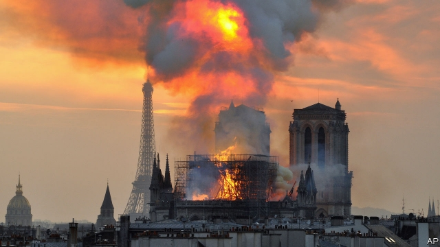

###### Jokowi’s re-election

# Politics this week 

 

> Apr 17th 2019 

Notre Dame, a medieval cathedral immortalised by Victor Hugo, Hollywood and innumerable tourist selfies, caught fire. More than 400 firefighters brought the blaze under control, but the roof is gone, and with it the spire. The interior damage is extensive, but many artefacts and relics, including a supposed part of Jesus’s crown of thorns, were saved. Emmanuel Macron, the French president, visited the site and vowed that the cathedral will be rebuilt. Two French billionaires pledged a total of €300m ($340m) towards that effort. See article. 

The Finns Party, an anti-immigrant outfit, won 17% of the vote in Finland’s election. Other parties do not want to work with it. The winning Social Democrats will try to form a government without it. See article. 

Britain pondered what to do with Julian Assange, a co-founder of WikiLeaks. America wants him extradited for conspiring to help a soldier hack a classified computer network, with the intention of publishing military secrets. Sweden may also want him: a woman who says he raped her has asked prosecutors to reopen the case. He also faces jail in Britain for jumping bail. See article. 

Nigel Farage, one of the prime movers behind Britain’s referendum on leaving the EU in 2016, launched a Brexit Party to fight next month’s European elections. Change UK, a group of Labour and Conservative defectors who are pushing for a second referendum in the hope of cancelling Brexit, received approval from the Electoral Commission to form a party. See article. 

Egypt’s parliament passed constitutional amendments that would allow President Abdel-Fattah al-Sisi to rule until 2030. Mr Sisi, a former general, was re-elected in 2018 with 98% of the vote. Other changes would give the president control over judges and increase the army’s political power. The amendments will now be put to a referendum. 

The African Union threatened to suspend Sudan, following a military coup that deposed Omar al-Bashir, who had ruled for more than three decades. The AU gave the generals who now run the country 15 days to hand power to civilians. See article. 

Seven soldiers were killed in Chad in an attack on an army base by Boko Haram, a jihadist group that has displaced more than 2m people in neighbouring Nigeria. 

Spain arrested Hugo Carvajal, a former head of Venezuela’s military intelligence service, after America asked for his extradition. He had defected and called on the army to stop supporting Venezuela’s dictator, Nicolás Maduro. His arrest on drug-trafficking charges may discourage other bigwigs from abandoning Mr Maduro, thus impeding America’s goal of removing him. 

The natural history museum in New York decided not to provide the venue for a gala honouring Brazil’s president, Jair Bolsonaro. Environmentalists, outraged at his plan to open up Brazil’s rainforest to mining, had objected. 

The United Conservative Party won an election in the oil-producing Canadian province of Alberta. The incoming premier, Jason Kenney, is expected to abolish the province’s tax on carbon emissions and to challenge the federal policy of imposing a carbon price on provinces that do not have their own. 

Nancy Pelosi, the Speaker of America’s House of Representatives, warned the British government that there would be “no chance whatsoever” of a free-trade deal with America if Brexit caused any disruption to the two-decade-old Anglo-Irish peace agreement. The peace deal depends on an open border between Northern Ireland and the Republic of Ireland—something EU membership conveniently supplied. 

Donald Trump blocked a bipartisan resolution in Congress to end American military aid to Saudi Arabia in the Yemen war. It was only the second veto of his presidency. 

Pete Buttigieg officially launched his campaign to be the Democrats’ presidential candidate. Mr Buttigieg has surprised primary watchers by running well against better-known rivals in the party’s crowded field of nominees, quite an achievement for the mayor of South Bend, Indiana. See article. 

The first challenger to Donald Trump emerged for the Republican nomination. The long-shot bid is from William Weld, a moderate and former governor of Massachusetts. Mr Trump raised $30m for his campaign in the first quarter, rivalling the combined amount of the top two Democrats. 

In Afghanistan the Taliban launched a spring offensive against the government, which recently began its own offensive against the jihadists. This came despite the progress in peace talks between America and the Taliban. 

Terry Gou, the boss of Foxconn, which assembles iPhones for Apple, said he would run for president in Taiwan. He is seeking the nomination of the Kuomintang party, which is friendlier to China than the ruling Democratic Progressive Party. Foxconn has many factories in China. 

Both Donald Trump and Kim Jong Un mused publicly about another summit to discuss North Korea’s promise to relinquish nuclear weapons and long-range missiles in exchange for security guarantees and aid. 

Malaysia agreed to resume construction of a high-speed rail line after the Chinese consortium building it cut the price. Malaysia’s new government had cancelled the project last year, saying the country could not afford it. 

Some 300 people gathered at a monument in eastern China to mark the death of Hu Yaobang, a liberal-minded Communist Party chief whose funeral in 1989 triggered the Tiananmen Square protests. 

Only three turtles of the Yangzi giant softshell species are known still to be alive after the death of one in China. The female, aged over 90, died in the city of Suzhou at a zoo which still has a male softshell turtle aged over 100. 

