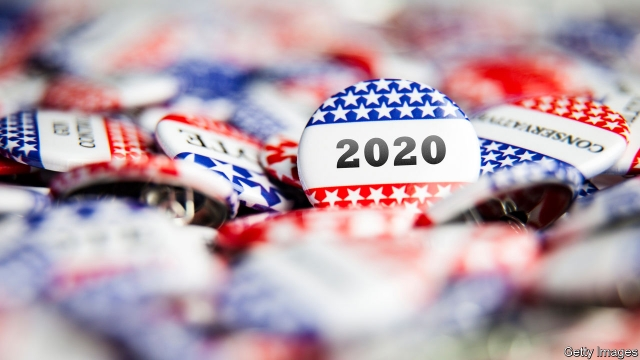
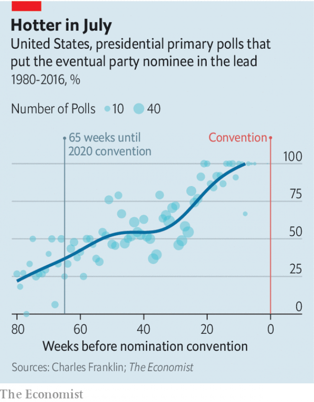

###### Random walking

# At this stage in the Democratic primary polls are unreliable 

##### But they can predict who will be at the front of the pack with some accuracy 

 

> Apr 17th 2019 

THERE ARE still 65 weeks to go until the Democratic Party holds its nominating convention in Milwaukee—about the same amount of time a rhinoceros pregnancy lasts. Is it too early to say anything meaningful about which candidate will win? Yes it is: at this point in the 2016 cycle Donald Trump had not even announced his bid for the presidency. But although the most widely watched information about the race, public polls, will not help you pick a winner until mid-summer, they can convey useful information about the top-three candidates even this early. 

Presidential primaries have changed greatly over the past half-century. It was once relatively easy to identify a winner, as fewer candidates ran and elite endorsements could make or break a campaign with ease. Most candidates did not formally announce they were running unless they already knew they were going to have a good shot at the nomination. The so-called “invisible primary” really was invisible to most Americans. Contests typically had just a handful of candidates and many fewer states used primaries to select a candidate than they do today. The timetable has changed too. William G. Mayer and Andrew E. Busch, two political scientists, calculated that back in 1976 voters had selected only 19% of all delegates by the sixth week of the primary season. By that point in 2020 just shy of 60% will have done so. 

Though the process has sped up, it is still possible to tune in too early. Election-watchers querying when to pay attention to the 2020 race have to solve three puzzles. First, they must pick a point when the main candidates can be identified. Second, they have to determine when voters will start making up their minds about which candidates to support. Third, they must factor in when the public will have information at their disposal to shape those intentions. The best single indicator that offers insight into all three questions is public polling. 

 

According to The Economist’s analysis of polling data spanning Democratic and Republican presidential primaries from 1980 to 2016, polls taken this far away from nomination conventions are more wrong than right. Our statistical model estimates that just 35% of primary polls fielded 65 weeks before a party’s nomination convention put the eventual winner in the lead. There is a caveat, though. Although polls this early do not pick the winner very often, they do often correctly place the candidate in the right tier. In polls taken as far in advance as today is from the 2020 convention, the eventual winner was among the top three contenders 85% of the time. The current field is unusual, though, and might defy this pattern. There are a lot of candidates, half a dozen of them look plausible and there is no overwhelming favourite. 

If not now, when should you start paying attention to the primaries? According to our number-crunching, polls start picking the right winner more than half of the time 52 weeks before the convention, or about in mid-July of this year. By that point, most candidates have announced that they are running, the winners and losers are just a couple of spots from their finishing position and more voters have tuned in. Until then, the day-to-day and week-to-week fluctuations in the race are not as important as headline writers and Washington politicos would have you believe. 

