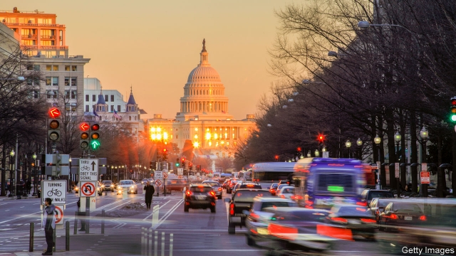

###### The big smoke

# Democrats push for Washington, DC, to become the 51st state 

##### Republicans, unsurprisingly, are less keen 

 

> Apr 17th 2019 

FOUR YEARS ago Alan Amsterdam co-authored a ballot initiative that made it legal to own, use and grow marijuana in America’s capital. As an investor in the dope trade—the aptly-named Mr Amsterdam co-owns Capitol Hemp, a shop that flogs bongs and pipes—he had a strong private motive. The referendum passed, yet it remains illegal to sell weed in Washington. And though marijuana peddlers tend to get around that by overpricing other goods and throwing a pungent-smelling “gift” into the bargain, this requirement remains a serious dampener on Mr Amsterdam’s business. Washington is one of the most-visited places in America, he notes with frustration. “A lot of that is kids going to museums…but think what their parents would like to do in the evening!” 

The fact that Washingtonians are free to smoke marijuana but not buy it is a reflection of their peculiar political circumstance. Because America’s founders did not want a state government to exercise undue influence over the capital, they made the District of Columbia a federal jurisdiction. More than two centuries later its 700,000-odd residents—more Americans than live in Wyoming or Vermont—have no voting representation in Congress, and their city budget must be approved by congressmen. After the ballot initiative was passed a congressional rider was attached to DC’s budget forbidding officials from spending federal or local funds to legalise or regulate the market. 

Such meddling by lawmakers in the city’s affairs is one reason why fresh momentum is gathering behind a movement for DC statehood. In March the House of Representatives passed the “For the People Act”, a long list of measures to expand voting access that includes a statement of support for the statehood effort. In the Senate a similar bill is backed by the many Democrats there who are running for the presidency. On April 15th 20 Democratic attorneys-general from California to Virginia said in a statement, the first of its kind, that they backed the push for DC statehood. 

Democrats’ support for the movement is in part principled. Nearly half of the population is African-American. In 1961 worries about the disenfranchisement of black Americans led to a constitutional amendment allowing District residents to vote in presidential elections; Democrats remain exercised by such concerns. 

It is also self-interested. Since District dwellers won the right to pick presidents they have plumped for Democrats by big margins. In 2016 Hillary Clinton took more than 90% of DC’s vote. Republicans are understandably less anxious for DC to get its own congressmen and senators. Even if statehood did not require a constitutional amendment—which three-quarters of states would have to back—this means DC is unlikely to become America’s 51st state any time soon. 

