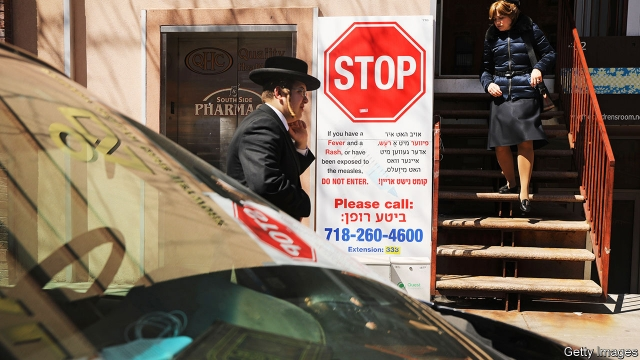
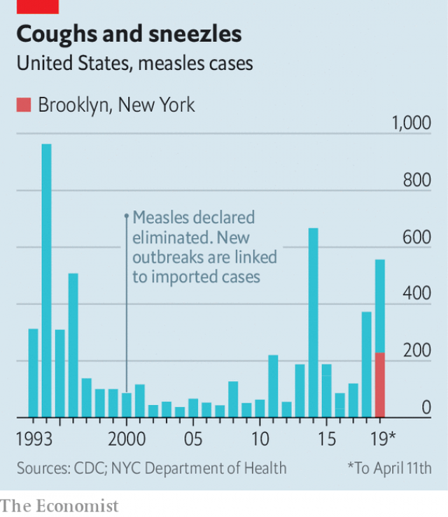

###### The needle and the damage avoided

# New York’s measles outbreak puts vaccination rules on the spot 

##### Many states have a “misinformed-parent exemption” 

 

> Apr 17th 2019 

SIGNS WARNING people to stay away if they have fever and rash are posted at medical practices and pharmacies in parts of Brooklyn, a borough of New York City where health authorities have struggled to stop a measles outbreak that began in October. More than 320 people have contracted the disease so far and new cases show no sign of abating. With outbreaks going on in several other states, measles cases in America this year are on track to reach the highest number since 1994. 

Most cases in Brooklyn have been in an ultra-Orthodox Jewish enclave, where many parents have refused to vaccinate their children. Pockets with vaccination rates lower than the 95% level that stops measles from spreading exist across America. But Brooklyn is densely populated and that has made the disease easier to spread. On a Sunday afternoon, playgrounds in a neighbourhood that has been the centre of the outbreak are so packed that there is hardly any space for children to run around. Large families are the norm among ultra-Orthodox Jews and their social life is largely confined within their community. The outbreak in Brooklyn began with an unvaccinated child who contracted measles on a visit to Israel. 

There is no religious reason why Jews should not get the measles vaccine, says David Niederman, a rabbi in Brooklyn. Like him, most rabbis in the area support vaccination and even urge people to get the jab. But that advice stands against anti-vaccine propaganda from Parents Educating and Advocating for Child Health (PEACH), a group that has aimed its publications at Jewish families. It blanketed parts of Brooklyn with a brochure claiming that vaccines are harmful and unnecessary, attaching letters by rabbis in support of its cause. PEACH also runs a call-line with recorded “lectures”. One is by Andrew Wakefield, author of a discredited study from 1998 that linked vaccines with autism. 

 

On April 9th New York City declared a public health emergency, making vaccination against measles mandatory in the parts of Brooklyn where cases have been concentrated. Residents were given 48 hours to comply or pay a $1,000 fine. The authorities are also cracking down on child-care centres and yeshivas (religious schools) that have flouted a ban on attendance by unvaccinated children that the city issued in December. Nearly 40 cases of measles were traced to unvaccinated children in one such school that defied the ban. On April 15th the health department shut down a day-care centre for 250 children for non-compliance. 

The outbreak in New York has charged an ongoing debate in America: whether to abolish the exemptions to vaccination for schoolchildren. New York and 46 other states currently allow unvaccinated children to attend school if their parents claim that they object to vaccines on religious grounds; a further 17 states have broader “philosophical” exemptions, too. In 2017-18 such non-medical exemptions were used for 2.2% of American schoolchildren, double the rate in 2010-11. 

Paul Offit of the Vaccine Education Centre at the Children’s Hospital of Philadelphia says that the religious exemption to vaccines is, in fact, a “misinformed–parent exemption.” Vaccines were invented long after the main religious texts had been written and no widespread religious doctrine says people cannot be vaccinated, says Dr Offit. Proposals to abolish non-medical exemptions have been introduced in several state legislatures this lawmaking season. But such bills—as well as some that would make it easier to avoid vaccines—are a perennial feature in many states; some never get to a vote. By and large the trend in recent years has been to make non-medical exemptions harder to obtain (by asking parents for more paperwork or to renew the request every year, for example). 

California bucked the trend and abolished non-medical exemptions in 2015 in response to a big measles outbreak. Vaccination rates went up, but so did the rate of medical exemptions. It turned out that some doctors were writing bogus ones—and parents would go to great lengths to find them. One child who came down with measles had received an exemption from all vaccines from a doctor’s practice in a town several hundred miles away. 

There is more that can be done. Most parents who worry about the safety or efficacy of vaccines are “convincible” and will choose to vaccinate their children if doctors answer their questions with patience and compassion, says Dr Offit. A small minority of parents, however, will remain strong believers in conspiracy theories about vaccines no matter what. The imprint of PEACH in Brooklyn suggests that paranoia and superstition can still cast a spell over science. 

