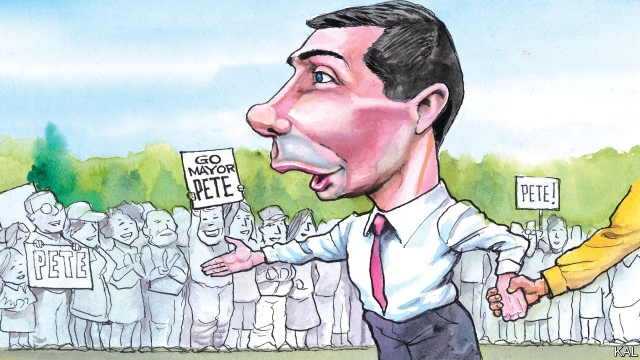

###### Lexington

# Pete Buttigieg fuses liberalism and tradition 

##### This is a natural extension of his marriage 

 

> Apr 17th 2019 

NEWTON’S THIRD law of motion also helps predict America’s presidential succession. After Richard Nixon’s sleaze, voters picked a Georgian Sunday School teacher who promised never ever to lie to them. After eight years of interracial progress and cool intellectualism from Barack Obama, they chose Donald Trump. Whoever succeeds him is liable to be as different from the know-nothing New Yorker as it is possible to imagine. For a growing number of excited Democrats, this points to Pete Buttigieg. 

The 37-year-old mayor of South Bend, Indiana, is the anti-Trump of the moment. A Harvard and Oxford graduate, he is a gifted musician, linguist and scholar. He is also unfailingly genial and, for a politician, almost bashful about his achievements. Given that his main claim to the presidency, which he only recently became old enough to occupy, is his experience running Indiana’s fourth biggest city, he might seem to have little choice. Even so, at a packed rally in Brooklyn this week, the gracious way he referred to his recent rise in the Democratic primary pack was refreshing. 

The diminutive mayor, appearing before a crowd of bearded hipsters in his regulation shirtsleeves and tie, celebrated the fact that his campaign was being taken seriously. He did not spell out that, almost unknown three months ago, he is now polling in third place in Iowa and pulling in as much cash as any rival except Bernie Sanders. After his launch on April 14th he raised a million dollars in four hours. He also made no reference to his accomplishments—though another emerged at the rally. It had previously transpired, after he was approached by a Norwegian television crew, that he speaks fair Norwegian. In Brooklyn he spoke better French. As Notre Dame burned, he assured a French journalist that Americans “partageons la douleur mais nous remercions aussi de ce cadeau à la civilisation” (“we share in the pain but we also thank you for this gift to civilisation.”) On Twitter meanwhile Mr Trump urged the French to get hold of some “flying water tankers!” 

American voters do not much like pointy-headed francophones. Yet in recompense Mr Buttigieg offers a convincing claim to public-spiritedness and decency. He quit a job with McKinsey to seek election in unglamorous South Bend—a city of 100,000 best known for a Studebaker car factory that closed half a century ago—and served as a naval reserve in Afghanistan. He is squeaky clean and prone to moralise, but not in a cloying way. Alongside his youthfulness and relentless futurism—“there is no such thing as an honest politics that revolves around the word ‘again’,” he says—he sets the timeless values of the small-town Midwest: faith, family, community and a love of fried food and dogs. 

Perhaps not since Bill Clinton have the Democrats produced an intellectual so good at playing the regular guy. Moreover, where Mr Clinton’s skill became associated with his intemperance and cynicism, Mr Buttigieg’s underlines the most significant detail of his candidacy: his status as the first openly gay presidential candidate. 

A tacit rebuke to Mr Trump’s illiberalism, this plays a contradictory role in the mayor’s campaign. It is in a sense impressively peripheral. That Mr Buttigieg can plausibly offer himself as the candidate of restoring honest Christian values, as Jimmy Carter did, shows how relaxed Americans have recently become about sexuality. Opinion polls suggest they are readier to vote for a gay candidate than an evangelical Christian one. 

Yet Mr Buttigieg’s openness about his sexuality, ever since he came out in an article in the South Bend Tribune before his re-election in 2015, is at the same time central to his appeal. It has earned him a reputation for candour, integrity and courage, of which his marriage to Chasten, a schoolteacher who is by far the most prominent political spouse in the primary, provides a constant reminder. Chasten Buttigieg, who warmed up the crowd in Brooklyn and greeted his husband to the stage with a kiss on the lips, is by turn a comic sidekick, political surrogate and personification of the mayor’s old-school values. 

This is consistent with Mr Buttigieg’s broader argument that Democrats need to reclaim the traditional values which he espouses from the right. “Freedom does not belong to just one political party,” he said in his launch speech. A liberal scion of the heartland, he has long witnessed Democrats ignore that truth, delight themselves with socioeconomic policy (on which he has hinted at pragmatism, but said little), and lose. Presenting his marriage as an elusive example of liberalism fused with tradition looks like a promising alternative strategy. 

To understand why, recall how gay marriage proved such a felicitous exception to the culture wars. Liberals and conservatives alike felt their values were vindicated by the reform. Mr Buttigieg’s campaign can be viewed as an effort to maximise his political gain from that niche. The unusual way he combines freethinking liberalism with punctilious social conformity—in his manners, religious practice and otherwise—is a sort of extrapolation of it. 

A feud he appears to be trying to engineer with Mike Pence represents another bid to elevate his modest record in South Bend, battling potholes and derelict housing, into the grander fight over values he wants. To the evident surprise of the vice-president, who backed anti-gay measures while governor of Indiana, Mr Buttigieg refers to him as his nemesis. This could be the making of a spicy vice-presidential debate. It also deflects attention from Mr Trump, whose provocations Mr Buttigieg seems keener to ignore. 

He is not alone in that. Beto O’Rourke and Amy Klobuchar are also reluctant to go toe-to-toe with the president. The former is better-known than Mayor Pete, the latter more experienced. It is far from clear that he can emerge from the Democratic pack. Yet the early interest in him is merited. Mr Buttigieg is attuned to the way voters actually think, not how politicians want them to. He also represents great liberal progress. Both things are worth celebrating. 

