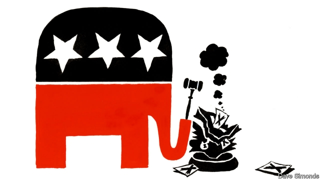

###### Nock, Nock

# Republican state legislatures are overturning ballot initiatives 

##### The conservative suspicion of the demos is alive and well 

 

> Apr 17th 2019 

IN HIS AUTOBIOGRAPHY, “Memoirs of a Superfluous Man”, Alfred Jay Nock had this to say about America’s system of self-government: “I could see how ‘democracy’ might do very well in a society of saints and sages led by an Alfred or an Antoninus Pius. Short of that, I was unable to see how it could come to anything but an ochlocracy of mass-men led by a sagacious knave.” Nock was among the first writers to call himself a libertarian and, via William F. Buckley and the National Review, exercised significant influence on American conservatism. Given that the Republican Party, the closest thing to a vehicle for the promotion of conservative ideas, is in the business of gathering votes, the equivocal feelings of some conservatives about the demos are usually kept quiet. Occasionally, though, they break cover. 

This is what seems to be happening around the country in state legislatures with Republican majorities. Last November voters in several states approved an array of policies in ballot initiatives. These policies included establishing voting rights for ex-prisoners, the expansion of Medicaid (health insurance for the poor) and legalising medical marijuana. State governments were supposed to enact those reforms, but instead the Republican-controlled ones are seeking to roll them back. 

In Utah, 53% voted in November in favour of Proposition 3, a ballot initiative to expand Medicaid eligibility to everyone earning up to 138% of the federal poverty level, which is about $35,000 a year for a family of four. Some families who would have received coverage under this proposal have since had to go without. That is because propositions passed via ballot initiative in Utah are the same as any other laws passed by the legislature. They can be modified, replaced or just good old-fashioned repealed by lawmakers. 

In this case the Utah state government replaced the proposal passed by ballot initiative with a new one that expands coverage for a smaller group: those earning up to 100% of the federal poverty level. According to researchers at the University of Utah’s Kem C. Gardner Policy Institute, the revised bill therefore extends Medicaid to 30,000-60,000 fewer residents than the ballot initiative that was passed by the voters would have done. 

Republican-controlled state legislatures are also restricting Medicaid expansion in other states where voters gave it the go-ahead in November. A widespread method for doing so is to require recipients to work to receive their coverage. In Idaho, state legislators—80% of whom are Republican—passed a law that removes a recipient’s coverage for two months if they do not work, volunteer or study for at least 20 hours per week. In Nebraska, which is moderately left-leaning compared with the others in the bunch, Republican governor Pete Ricketts plans to do the same. A similar rule enacted in Arkansas caused thousands of poor Arkansans to lose their care. 

The most controversial case, though, is in Florida, where 65% of voters passed constitutional Amendment 4 in November. This amendment allows felons, who had been banned from voting in Florida, to register to vote so long as they had completed “all terms of their sentence including parole or probation.” Republican state legislators in Florida’s statehouse have since introduced a bill that would add an additional requirement for so-called “returning citizens” to pay all their fines and legal fees before being allowed to register. 

Supporters of the bill in the state legislature point to the fact that the measure is in line with the language lawyers used when explaining the amendment to Florida’s Supreme Court. But the measure is not what voters voted for. The Florida Rights Restoration Coalition, which led the fight for the amendment, argues that legislation proposed should “neither limit the rights created by Amendment 4 nor infringe upon the will of Florida voters.” The additional prerequisite has been likened by some to a 21st-century “poll tax,” a reference to a scheme used to deny African Americans the right to vote in the early 20th century. One estimate suggests it could disenfranchise as many as 840,000 Floridians—a significant total given that last year’s gubernatorial election came down to a margin of just over 30,000 votes. 

Somewhere along the road toward representative government, Republican lawmakers have decided to Nock popular sovereignty. They may well have a point, but when a majority has already decided in favour of something, it is odd for a party that is in the election-winning business to fight so hard against it. 

