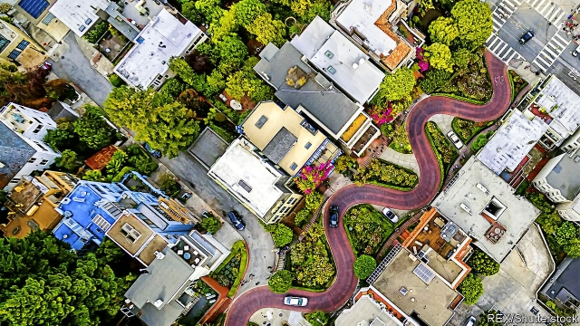

###### Sorry, we’re full

# The Democratic coalition is split over housing costs in cities 

##### Long ignored, the YIMBYs are gaining ground 

 

> Apr 17th 2019 

SAN FRANCISCO liberals are the kind of people who abhor nativism in all its forms and recoil at statements, like those recently made by President Donald Trump, that America “is FULL!”. Yet in their own neighbourhoods, they often act as if the country were packed to the brim. The city council, acting unanimously, recently rejected a 63-unit housing complex because it would cast a shadow on an adjacent park. In nearby Berkeley zoning officers can deny new development that “would unreasonably obstruct sunlight, air or views.” Local residents in a posh part of the city have raised over $100,000 to contest plans for a new homeless shelter, claiming that the new “megashelter” will breed crime and violence (“drug users” and “pets, including those designated as ‘vicious’ will be allowed” they warn). These tactics, along with excessive environmental reviews, have hampered new development in the city. Since 1990 the city has averaged a mere 1,900 new housing units each year. 

San Francisco, where median monthly rent for a one-bedroom flat has reached $3,500 according to Zillow, a real-estate website, is only the most pathological example. West Coast cities, which are under near-total control of the leftiest Democrats around, rank among the least affordable for middle-class Americans and most inhospitable to the poor. Every morning traffic in the Bay Area is clogged by service-sector commuters, some of whom live far off in the state’s Central Valley and must make three-hour long treks in each direction. The smog from the cars settles in the valley, resulting in some of the worst air quality in the country. 

Fixing this is proving fractious. Democrats are increasingly unified on issues of national ideology. Surveys show that a majority now self-identify as liberals. But the politics of land use in thriving cities scrambles this harmony. 

Three jockeying coalitions each cling to the label of liberal. First there is the landed gentry, older residents who bought at the right time and are precious about maintaining their housing value. Then come the leftist activists who favour rent control, massive public-housing spending and who think gentrification is terrible. Last, are the market-oriented urbanists who want cities to fix their housing-supply shortages by building more. 

The rent-control faction appears newly emboldened. In February Oregon passed the first-ever statewide rent-control law. The new legislation will limit rent increases to 7% plus inflation—meaning that it will be largely irrelevant except in cities like Portland. Kate Brown, the governor, said that it would “provide immediate relief to Oregonians struggling to keep up with rising rents and a tight rental market.” That might be true of current renters lucky enough to qualify, but rent controls also work to constrain housing supply, hurting future renters. A study by three Stanford economists of a rent-control law change in 1994 in San Francisco found that affected landlords decreased supply by 15%, increasing rents citywide. Nearly 1m flats in New York City—roughly 30% of the housing stock—are either rent-stabilised or rent-controlled, yet it is hardly cheap. 

In California the degree of rent control that cities can impose is limited by a state law known as Costa-Hawkins. In 2018 activists launched an effort to repeal the rule by referendum. They were defeated (the proposition attracted its highest level of support—53%—in San Francisco county). Unbowed, state legislators have proposed a suite of bills that would increase local rent-control capacities. In Seattle, also thriving due to a tech boom, Kshama Sawant, a socialist city councillor, is pushing an ordinance that would limit rent increases to move in step with inflation. 

Housing prices are high because demand has grown more quickly than supply. Supporters of rent control pay no heed to the opportunities they deny to poor and middle-class people to move to thriving cities. And yet the market-urbanist coalition, which pushes for relaxed zoning rules and more building, had little sway over local politics. Their plans smelled suspiciously neoliberal. Ideas that economists are fond of seldom inspire popular movements. But that has changed with the emergence of the YIMBY movement, a loosely organised bloc of those who say “yes in my backyard” to new development. 

The most ambitious YIMBY proposal comes from Scott Wiener, a former San Francisco city councillor who is now in the state senate. He has written a bill, known as SB 50, that would pre-empt local zoning rules and allow high-density building near transit stations and centres of job growth or high-quality schooling. For many cities in the Bay Area, this would essentially legalise high-density building citywide. 

Among top local Democrats, the reaction has been polarised. The mayors of San Francisco, Oakland and Sacramento are all in favour; the San Francisco city council is overwhelmingly opposed, purportedly to slow gentrification (have they looked around?), as is the mayor of Palo Alto, a neighbouring low-slung town where the median home value is $3.1m. 

SB 50 is a modified version of legislation Mr Wiener submitted last year, only to have it die in committee. The new version contains concessions to activist concerns—like delaying implementation in poor neighbourhoods and adding tenant protections—and looks politically hardier as a result. “Rather than having these two camps, or sub-camps, divided and fighting with each other, they should be unified,” says Mr Wiener. “In the end, the common opponent is the no-growth people who do not want any development in our community. They want to freeze their communities in amber even though their children won’t be able to live where they grew up.” 

In California the success of SB 50 will depend on Gavin Newsom, the new governor, who has shown a desire to fix the state’s deep housing problems. During his campaign Mr Newsom pledged to build 3.5m new housing units by 2025. He has also ordered his administration to sue Huntington Beach, an attractive small town near Los Angeles, for failing to build sufficient affordable housing—a requirement of a largely unenforced state law. The intra-party politics of housing reform remain difficult. SB 50 has cleared one committee hurdle, but has yet to emerge from the state legislature. And for all his efforts elsewhere, Mr Newsom has yet to weigh in on whether he would actually sign it. 

