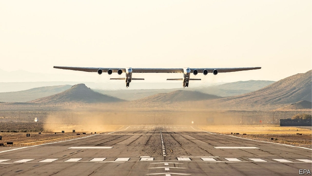

###### Spruce goosed

# The stratolaunch 

 

> Apr 17th 2019 

LOOK BURT RUTAN up on Wikipedia and it will claim he has retired. This aeroplane casts doubt on that statement. Mr Rutan is probably the most original aircraft designer in the world, and Stratolaunch, as the craft is known, is perhaps his pièce de résistance. It made its maiden flight on April 13th from the Mojave Air and Space Port in California. By wingspan (117 metres) it is the largest plane ever to have flown. It was built by Mr Rutan’s company for Stratolaunch Systems, a firm he founded jointly with the late Paul Allen, who, in turn, had co-founded Microsoft. Its purpose is to carry rockets (which will fit between the two fuselages) as close to space as possible before they are launched into orbit, thus saving fuel. When commercial operations will start is not yet clear. 

