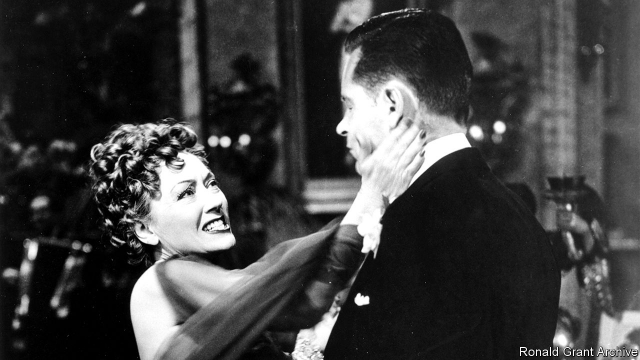

###### Sunset brouhaha

# Why Hollywood’s writers are sacking their representatives 

##### The principal-agent problem strikes again 

 

> Apr 17th 2019 

KRISTA VERNOFF, a television writer and the executive producer of the television drama “Grey’s Anatomy”, called her agent of 20 years on April 12th and told him tearfully that he could no longer represent her. “He has done his job well, guided and supported my career, and made me a lot more money than I would have made without him,” Ms Vernoff wrote in the Hollywood Reporter. Nevertheless Ms Vernoff sacked him, as part of an acrimonious standoff between the Association of Talent Agents, a trade association made up of talent agencies, and the Writers Guild of America (WGA), a union of television and film writers. The guild complains that agencies are prospering at the expense of the screenwriters they are supposed to represent. 

Following several months of heated negotiations, the guild instructed its 13,000 active members to dismiss agents at companies that had not committed to its new code of conduct, which the majority of Hollywood’s biggest agencies have not. Many writers did so dolefully. John August, who wrote the film “Big Fish”, wrote on Twitter: “My agent of 20+ years is a great friend and a fighter for my career. I would give him a kidney tomorrow. But this isn’t about him or any single agent.” Before hanging up with her longtime representative, Ms Vernoff plaintively quoted the “Hamilton” playwright Lin-Manuel Miranda, telling him: “See you on the other side of the war.” 

While the entertainment industry is booming, with companies such as Disney, Fox, Time Warner, Comcast, CBS and Viacom hauling in more than $50bn in operating profits in each of the past three years, the writers guild reports that screenwriters’ median weekly earnings dropped 23% between 2014 and 2016 and that, compared with the late 1990s, per episode fees have declined when adjusted for inflation. While the union has previously directed its ire about pay at production studios, staging a strike in 2007 and nearly striking again in 2017, it is now targeting agencies. 

Agents used to make money from television writers by taking a commission—usually 10%—when their writers were hired to work on a show. But for the past few decades agents have preferred to waive their commissions and instead collect fees from studios in exchange for offering “packages” of television contributors, such as a showrunner, a director and several writers, that studios can hire at once. By forgoing commissions and instead taking pay from the studios they are supposed to be negotiating against, writers feel agents have no incentive to wrangle them the best deals. One television writer says she has heard of agents offering to accept lower salaries for a writer in order to get a show on the air and secure packaging fees. 

The writers also complain that three large talent agencies, William Morris Endeavor Entertainment, Creative Artists Agency and United Talent Agency, have launched affiliated companies that finance shows themselves. They wonder how agents can possibly haggle for high salaries for their clients while at the same time fretting over production costs. According to research conducted by the writers guild, almost 90% of scripted series in the 2016-17 television season were packaged, with William Morris or Creative Artists involved in four-fifths of those packaged series. 

Agency practices are not the only thing hurting writers’ salaries. Streaming services have also played a role. Writers used to derive a significant part of their income from residuals, which are fees that television networks pay writers for replaying their work. Netflix, Amazon Prime and Hulu have upended that model, paying writers far less in such fees. They have also inspired an industry-wide move to television seasons with fewer episodes, meaning that writers are guaranteed work for shorter periods. Even though agency practices are not entirely to blame for dwindling salaries, there is a sense among writers that the time has come for the agents to alter their behaviour. “When Harvey Weinstein came tumbling down,” says Ms Vernoff, with an eye on the story arc, “the idea that Old Hollywood can’t be changed crumbled with him.” 

