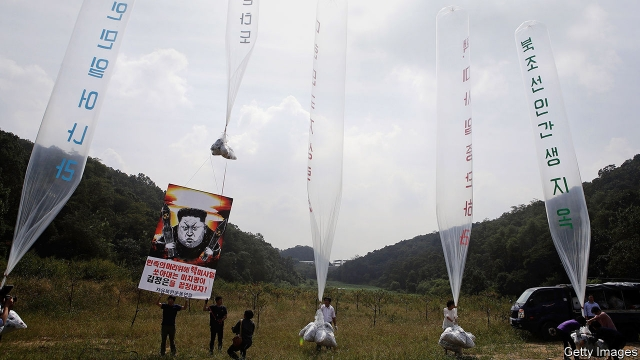

###### Balloons v bullets

# Campaigning against the North Korean regime is a thankless task 

##### Kim Jong Un’s opponents are underfunded and largely unsuccessful 

 

> Apr 27th 2019 

ONE AFTERNOON in February a man knocked on the door of the North Korean embassy in Madrid and asked to speak to the chargé d’affaires. Having been invited in, he opened the door to his nine accomplices. According to the Spanish judge investigating the incident, the group proceeded to beat, tie up and interrogate those inside. When the police came knocking hours later, alerted by neighbours who had heard the screams of a woman who had managed to escape through a window, a man who looked like a North Korean official opened the door and told them that everything was in order. Shortly afterwards, the assailants fled the scene in two cars belonging to the embassy and an Uber, carrying stolen pen drives, computers and hard drives. They escaped to Portugal, and eventually to America, where they allegedly presented their loot to the FBI. 

The raid, which might have been lifted from the pages of a spy thriller, was the first direct assault on a North Korean diplomatic mission in the country’s 70-year existence. It failed in what appeared to be its main aim, to convince the diplomats in the embassy to defect. It is unclear whether it did any damage to the North Korean regime. But the incident has cast a rare spotlight on the activities of the opponents of North Korea’s despot. 

The group which has claimed responsibility for the stunt in Madrid, a relatively new outfit known as Cheollima Civil Defence, after a mythical winged horse, or Free Joseon, for Korea’s last imperial dynasty, professes unusually ambitious plans. On March 1st, the anniversary of a Korean uprising against Japanese colonialism, it declared on its website that it had established a “provisional government,” the “sole legitimate representative of the Korean people of the north”. 

After a Spanish court issued extradition warrants for two of the alleged participants in the raid on the embassy, Cheollima Civil Defence published another statement denying that it had used violence. America subsequently arrested one of the wanted men and raided the apartment of the other. One is a former marine, the other an activist against the North Korean regime for over a decade. Both live in America, and are of Korean descent. 

Cheollima Civil Defence has accused the Spanish and American governments of siding with the North Korean regime, suggesting its members had hoped to remain anonymous and have had to go into hiding since their identities were revealed. They are certainly right to be worried. There is no open dissent against the regime within North Korea, where the reward for engaging in any semblance of political protest is the gulag or the firing squad. Even outside the country, dissidents are not necessarily safe from the North’s assassins. But some remain undeterred. In the South, escapee activists have for years been engaged in a form of information warfare against the North. They launch balloons carrying anti-regime messages, South Korean soap operas and money across the border. They hope to persuade their fellow citizens to resist or flee the country. 

It is a thankless task. The South’s government provides some funding and protection for high-profile dissidents. But it also discourages their activities. Past administrations were concerned about the risk of military escalation along the border (North Korea has on occasion opened fire on balloons). The current one also worries about putting its ongoing rapprochement with the North at risk. Some element of competition with the dissidents may be at work, too. After all, the South Korean government also claims to be the legitimate representative of the North Korean people. A quiet building at the foot of Bukhansan mountain in northern Seoul houses the offices of the South’s governors for the five provinces that make up North Korea. 

The furore in Madrid has given the dissidents a welcome boost. Park Sang-hak, a defector who represents an association of several dozen such groups, is so much in demand that he insists on being interviewed in his car, while his driver takes on Seoul’s traffic at breakneck speed. “Our aim is to overthrow the Kim regime and free the North Korean people,” says Mr Park, who fled North Korea nearly 20 years ago. He claims the groups he represents have up to 800 members between them. On April 14th Mr Park’s group launched 20 balloons carrying 500,000 leaflets across the border from a town north of Seoul. Earlier this month, it staged a protest outside the embassy in Madrid in solidarity with the wanted assailants. 

Mr Park claims to have associates in the North, and some of his fellow activists say they would join armed resistance against the regime if a rebellion were launched from within. But for now, the most effective resistance against the North’s regime may be the existence of the democratic, prosperous country in which he lives. 

-- 

 单词注释:

1.V[vi:]:[计] 溢出, 变量, 向量, 检验, 虚拟, 垂直 [医] 钒(23号元素) 

2.Korean[kә'riәn]:n. 朝鲜人, 朝鲜语 a. 朝鲜人的, 朝鲜语的 

3.regime[rei'ʒi:m]:n. 政权, 当权期间, 政体, 社会制度, 体制, 情态 [医] 制度, 生活制度 

4.thankless['θæŋklis]:a. 不感谢的, 忘恩的, 不知感恩的 

5.kim[]:n. 金姆（人名） 

6.jong[jɔŋ]:n. 小伙子；（旧时的）青年男奴 

7.underfunded[ˌʌndəˈfʌndɪd]:a. 资金不足的 

8.APR[]:[计] 替换通路再试器 

9.Madrid[mә'drid]:n. 马德里 

10.accomplice[ә'kʌmplis]:n. 共犯, 同谋 [医] 协同菌 

11.interrogate[in'terәgeit]:vt. 质问, 讯问, 审问 vi. 质问, 讯问 

12.afterwards['ɑ:ftәwәdz]:adv. 然后, 后来 

13.assailant[ә'seilәnt]:n. 攻击者 [法] 攻击者, 行凶者 

14.uber['ju:bә]:[医] 乳房 

15.Portugal['pɒ:tʃugl]:n. 葡萄牙 

16.allegedly[ә'ledʒidli]:adv. 依其申述 

17.loot[lu:t]:n. 赃物, 洗劫, 抢夺 v. 洗劫, 抢夺 

18.FBI[]:美国联邦调查局 [经] 美国联邦调查局 

19.assault[ә'sɒ:t]:n. 攻击, 袭击 vt. 袭击, 攻击 vi. 发动攻击 

20.diplomatic[.diplә'mætik]:a. 外交的, 老练的 [法] 外交的, 外交上的, 文献上的 

21.diplomat['diplәmæt]:n. 外交官, 有外交手腕的人 [法] 外交家, 外交官, 有权谋的人 

22.unclear[.ʌn'kliә]:a. 不易了解的, 不清楚的, 含混的 

23.spotlight['spɒtlait]:n. 照明灯, 反光灯, 聚光灯 

24.despot['despɒt]:n. 专制君主, 暴君 [法] 暴君, 专制君主 

25.stunt[stʌnt]:n. 特技, 绝技, 花招, 噱头, 手腕, 发育不良 vt. 阻碍成长 vi. 表演特技 

26.outfit['autfit]:n. 用具, 配备, 机构 vt. 配备, 供应 vi. 得到装备 

27.mythical['miθikә l]:a. 神话的, 存在于神话中的, 神话式的, 不真实的, 虚构的, 幻想出来的 

28.joseon[]:[网络] 朝鲜王朝；李氏朝鲜帝国；德藏 

29.imperial[im'piәriәl]:a. 帝王的, 宗主国的, 至尊的, 壮丽的 n. 特等品 

30.profess[prә'fes]:vt. 声称, 以...为业, 伪称, 讲授 vi. 表白, 承认, 当教授 

31.ambitious[æm'biʃәs]:a. 有野心的, 抱负不凡的, 雄心勃勃的 

32.uprise[ʌp'raiz]:n. 升起, 起立, 上山坡, 出现 vi. 上升, 起义, 出现 

33.colonialism[kә'lәunjәlizm]:n. 殖民主义 

34.provisional[prә'viʒәnl]:a. 暂时的, 暂定的, 临时的 [医] 临时的 

35.legitimate[li'dʒitimәt]:a. 合法的, 正当的, 婚生的 vt. 认为正当, 立为嫡嗣, 使合法 

36.extradition[.ekstrә'diʃәn]:n. 引渡逃犯, 亡命者送还本国 [法] 引渡 

37.warrant['wɒ:rәnt]:n. 授权, 正当理由, 根据, 证明, 批准, 凭证, 令状, 委任状 vt. 授权给, 保证, 担保, 批准, 使有正当理由 

38.allege[ә'ledʒ]:vt. 宣称, 主张, 提出, 断言 [法] 断言, 指称, 指证 

39.participant[pɑ:'tisipәnt]:n. 参加者, 参与者 a. 有份的, 参加的, 参与的 

40.subsequently['sʌbsikwәntli]:adv. 后来, 随后 

41.activist['æktivist]:n. 激进主义分子 

42.descent[di'sent]:n. 降落, 家系, 侵袭, 血统 [医] 下降, 世代, 血统 

43.siding['saidiŋ]:n. 侧线, 旁轨, 边宽 

44.anonymous[ә'nɒnimәs]:a. 姓氏不详的, 无名的, 无特色的 [计] 无记录 

45.dissent[di'sent]:n. 异议 vi. 持异议, 不同意 

46.Korea[kә'riә]:n. 朝鲜, 韩国 

47.semblance['semblәns]:n. 外表, 伪装, 假象, 少量 

48.gulag[^u:'lɑ:^]:[俄]古拉格(集中营) 

49.squad[skwɒd]:n. 班, 小队, 小集团 vt. 编成班 

50.dissident['disidәnt]:a. 意见不同的, 持不同政见的 n. 意见不同的人, 持不同政见者 

51.assassin[ә'sæsin]:n. 暗杀者, 刺客 [法] 暗杀者, 行刺者 

52.undeterred[ʌndi'tә:d]:a. 未被吓住的 

53.escapee[i.skei'pi:]:n. 逃亡者, 逃避者 [法] 脱逃者 

54.warfare['wɒ:fєә]:n. 战争, 战斗, 交战, 斗争, 竞争 [法] 战事, 作战, 交战 

55.escalation[.eskә'leiʃәn]:n. 扩大, 增加 [经] 调查, 价格调整 

56.ongoing['ɒngәuiŋ]:a. 前进的, 进行的, 不间断的 n. 前进, 发展 

57.rapprochement[ræ'prɔʃmә:ŋ]:n. 和解, 恢复邦交, 恢复友好关系, 重归于好 

58.Bukhansan[]:[地名] 北汉山 ( 韩 ) 

59.Seoul[sәul]:n. 汉城 

60.furore[fju:'rɔ:ri]:n. 轰动, 勃然大怒, 公众的骚动, 狂热 

61.defector[di'fektә]:n. 背叛者, 叛离者 [法] 变节分子, 背叛者, 开小差者 

62.breakneck['breiknek]:a. 要使颈骨折断似的, 非常危险的 

63.overthrow[.әuvә'θrәu]:n. 推翻, 瓦解, 倾覆 vt. 打倒, 推翻, 倾覆 

64.leaflet['li:flit]:n. 小叶, 传单 [医] 小叶 

65.solidarity[.sɒli'dæriti]:n. 团结, 团结一致, 共同一致 [法] 团结, 共同责任 

