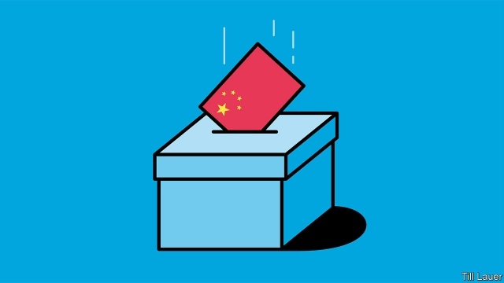

###### Banyan

# Taiwan’s richest man says his run for president is divinely inspired 

##### Others fear the great plan he is advancing is China’s 

 

> Apr 27th 2019 

IF RICH BUSINESSMEN bring both strengths and liabilities to politics, then Terry Gou brings them in spades. He is Taiwan’s richest man, with an estimated fortune of $7bn, so he should have no trouble funding the campaign for president he announced last week. What is more, few people in the world could claim to have created more jobs: starting with a tiny loan from his mother, he built the biggest contract-manufacturing company in the electronics business, Foxconn, which makes iPhones for Apple, among other things. It employs close to 1m people. Given voters’ frustration at the wan performance of the economy under the incumbent, Tsai Ing-wen, it is easy to see how Mr Gou might sell himself as the answer to their prayers. 

But it is impossible to build such a big business without piling up liabilities, in a political sense, at least. Mr Gou has no shortage. For one thing, the jobs he has created are not in Taiwan, for the most part. And nine years ago Foxconn was hit by a spate of suicides among its workers, prompting many to ask whether it should be treating them better. In fact, Foxconn’s model is the opposite of what Taiwan needs, argues Hsiao Bi-khim, an MP for the ruling Democratic Progressive Party or DPP (Mr Gou is seeking the nomination of the biggest opposition party, the Kuomintang or KMT). It has flourished by cold-shouldering Taiwanese workers, and building factories in places with lower wages instead, she points out, especially China. At the heart of Taiwan’s economic problems, she contends, are stagnant incomes—a problem for which Foxconn serves more as a cautionary tale than an inspiration. 

But questions about Foxconn’s qualities as an employer pale next to the worries Mr Gou’s candidacy prompts about conflicts of interest. China considers Taiwan part of its territory, and asserts its right to bring about reunification by force if necessary. How on earth, many Taiwanese ask, could Mr Gou be counted on to stand up to China when so many of Foxconn’s factories are on the mainland, leaving his personal fortune dependent on the goodwill of the Chinese Communist Party? “China has him by the neck,” the anchor of a popular television chat show observed this week. 

Then again, China has the rest of Taiwan by the neck, too. Around 1m Taiwanese, about a tenth of the labour force, work in China. Together with Hong Kong, China hoovers up about 40% of Taiwan’s exports. China rewards emollient Taiwanese governments with economic fillips such as a boom in tourism from the mainland, and punishes standoffish ones by taking them away. The KMT has responded to this system by not formally renouncing the goal of reunification and by seeking to strengthen economic ties. The DPP, in contrast, stresses that Taiwan is an independent country like any other, despite the economic retribution such talk brings. Voters have to choose, in essence, between economic benefits that put the country even more at China’s mercy, or foreign-policy-induced austerity. 

Mr Gou’s candidacy simply presents a more acute version of this dilemma. Shortly after he joined the race, Ms Tsai took a swipe at him on social media for saying, in response to anti-China protests a couple of years ago, “You cannot eat democracy.” Mr Gou lashed out, saying Ms Tsai had taken the quote out of context because she was either “really stupid and really naive” or “really malicious and really wilful”. All he had meant, he insisted, was that democracy should be used to improve people’s lives. 

Mr Gou’s fury at Ms Tsai’s gibe suggests that he knows it would be political suicide to be seen as advocating the trade-off that China is so clearly offering, of greater prosperity at the expense of independence. Bruce Jacobs of Monash University in Australia argues that Taiwan has, in effect, a built-in DPP majority, and that KMT candidates have to find ways to broaden their appeal beyond the party’s base to get elected. 

Mr Gou’s answer to this conundrum seems to be to present himself as a sort of ordinary-Joe-made-good. He took a break from bickering with Ms Tsai this week to push his elderly mother around a park in a wheelchair in front of the TV cameras. And he announced his candidacy at a temple dedicated to Matsu, a goddess widely revered in Taiwan and coastal China. Matsu, he said, had come to him in a dream and told him to run to help “those who are struggling”. It will be hard, however, for Mr Gou to pass himself off as the salt of the earth. “It is not appropriate to politicise Matsu,” an elderly devotee declares tartly. 

-- 

 单词注释:

1.banyan['bænjәn]:n. 印度榕树 [医] 榕树, 孟加拉榕 

2.divinely[di'vainli]:adv. 象神一样地, 凭神的力量, 极度地 

3.APR[]:[计] 替换通路再试器 

4.liability[laiә'biliti]:n. 责任, 债务, 倾向 [经] 责任, 义务, 负债 

5.politic['pɒlitik]:a. 精明的, 明智的, 策略的 

6.terry['teri]:n. 毛圈, 毛圈织物 

7.gou[]:abbr. gourde (Haitian currency) 古德（海地货币和硬币名） 

8.foxconn[]:n. 富士康（公司名） 

9.iphone[]:n. 苹果手机 

10.frustration[frʌs'treiʃәn]:n. 挫折, 顿挫 [医] 挫折 

11.wan[wɒn]:a. 苍白的, 无血色的, 病态的, 暗淡的 v. (使)变苍白 [计] 广域网 

12.incumbent[in'kʌmbәnt]:a. 现任的, 依靠的, 负有义务的 n. 领圣俸者, 在职者 

13.tsai[]:n. 蔡（姓氏） 

14.taiwan['tai'wɑ:n]:n. 台湾 

15.spate[speit]:n. 泛滥, 洪水, 大雨, 大量, 一阵 

16.suicide['sjuisaid]:n. 自杀, 自杀者 v. 自杀 a. 自杀的 

17.hsiao[]:n. 萧（姓氏） 

18.MP[]:国会议员, 下院议员 [计] 宏处理程序, 维护程序, 线性规划, 微程序, 多处理器 

19.DPP[]:[计] 数字并行处理机 [化] 微分脉冲极谱法 

20.nomination[.nɒmi'neiʃәn]:n. 提名, 任命, 提名权 

21.opposition[.ɒpә'ziʃәn]:n. 反对, 敌对, 相反, 在野党 [医] 对生, 对向, 反抗, 反对症 

22.kuomintang['kwәumin'tæŋ]:n. (中国)国民党 

23.kmt[]:abbr. 中国国民党（Kuo Min Tang） 

24.taiwanese[,taiwɑ:'ni:z, -'ni:s]:a. 台湾人的；台湾的 

25.contend[kәn'tend]:vi. 奋斗, 斗争, 竞争 vt. 为...斗争 

26.stagnant['stægnәnt]:a. 不流动的, 停滞的, 不景气的, 萧条的, 污浊的, 迟钝的 [经] 萧条的 

27.cautionary['kɒ:ʃәnәri]:a. 警告的 

28.inspiration[.inspә'reiʃәn]:n. 灵感, 鼓舞人心的人或物, 妙计, 吸气 [医] 吸[气] 

29.candidacy['kændidәsi]:n. 候选人的地位, 候选资格 [法] 候选人的身份, 资格 

30.assert[ә'sә:t]:vt. 主张, 坚称, 断言 [法] 宣称, 断言, 维护 

31.reunification[,ri:ju:nifi'keiʃәn,ri:,ju:-]:n. 使重新统一, 使重新团结 

32.goodwill[^jd'wil]:n. 友好, 好意, 善意, 亲善, (企业享有的)信誉, 声誉 [经] (企业的)商誉, 信誉 

33.hong[hɔŋ]:n. （中国、日本的）行, 商行 

34.kong[kɔŋ]:n. 含锡砾石下的无矿基岩；钢 

35.hoover['hu:vә]:n. 胡佛电动吸尘器 vi. 用真空吸尘器打扫 

36.emollient[i'mɒliәnt]:a. 使柔软的 n. 软化剂, 润肤剂 

37.fillip['filip]:n. 弹指, 刺激 vt. 用指弹, 刺激 

38.standoffish['stændɒfiʃ]:a. 冷淡的 

39.formally['fɒ:mәli]:adv. 正式地, 形式上 

40.renounce[ri'nauns]:vt. 拒绝, 放弃, 否认, 垫牌 vi. 垫牌, 声明放弃权利 n. 垫牌 

41.retribution[.retri'bju:ʃәn]:n. 报应, 惩罚, 报酬 [法] 惩罚, 报应, 报答 

42.voter['vәutә]:n. 选民, 投票人 [法] 选民, 选举人, 投票人 

43.essence['esns]:n. 实质, 本质, 香精 [化] 香精 

44.austerity[ɒ'sterәti]:n. 朴素, 苦行, 严格, 严峻 

45.swipe[swaip]:n. 强打, 用力挥击, 尖刻的话, 碰擦, 起重杆 vt. 强打, 用力挥击, 偷 

46.cannot['kænɒt]:aux. 无法, 不能 

47.lash[læʃ]:n. 鞭子, 鞭打, 睫毛, 责骂, 讽刺 vt. 鞭打, 摆动, 扎捆, 冲击, 讽刺, 煽动 vi. 冲洗, 鞭打, 责骂 

48.context['kɒntekst]:n. 上下文, 背景, 来龙去脉 n. 上下文 [计] 上下文 

49.naive[nɑ:'i:v]:a. 天真的, 纯真的, 幼稚的 

50.malicious[mә'liʃәs]:a. 怀恶意的, 恶毒的 

51.wilful['wilful]:a. 任性的, 固执的, 故意的, 存心的 [法] 有意的, 故意的, 任性的 

52.fury['fjuri]:n. 愤怒, 狂暴, 狂怒的人 [医] 狂乱, 狂暴, 狂怒 

53.gibe[dʒaib]:v. 嘲笑 n. 嘲笑 

54.Bruce[bru:s]:n. 布鲁斯 

55.jacob['dʒeikәb]:n. [圣经]雅各（以色列人的祖先）；雅各布（男子名） 

56.monash[]: [人名] 莫纳什; [地名] [哈萨克斯坦] 莫纳什 

57.broaden['brɒ:dn]:vi. 变宽, 扩大 vt. 放宽, 使扩大 

58.conundrum[kә'nʌndrәm]:n. 谜语, 难题 

59.bicker['bikә]:vi. 斗嘴, 潺潺而流, 闪动 n. 口角, 流水声 

60.wheelchair['hwi:l.tʃєә]:n. 轮椅 

61.dedicate['dedikeit]:vt. 献出, 贡献 

62.matsu['mɑ:tsu:]:n. 马祖岛 

63.goddess['gɒdis]:n. 女神, 美女, 受崇拜的女性 

64.rever[]:n. 作梦（歌名） 

65.coastal['kәustәl]:a. 海岸的, 沿海的, 沿岸的 [法] 海岸的, 沿海的 

66.politicise[pɒ'lɪtɪsaɪs]:vt. 使政治化, 使具有政治性; 使对政治有兴趣 

67.devotee[.devә'ti:]:n. 爱好者, 献身者, 虔诚的宗教信徒 

68.tartly['tɑ:tli]:adv. 辛辣地, 刻薄地 

