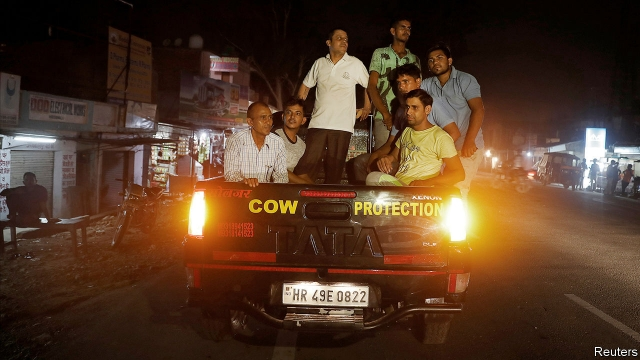

###### Vote terror

# The Indian government’s election pitch centres on hounding minorities 

##### The ruling BJP makes no bones about its dislike of Muslims and their defenders 

 

> Apr 27th 2019 

NARENDRA MODI, India’s prime minister, likes to talk tough on terror. On the campaign trail he tirelessly projects himself as a fear-inspiring avenger. If Pakistan returns a captured fighter pilot, as recently happened following an airstrike India says hit a Pakistan-based terror camp, it is because the neighbouring state is scared of him, he says. Referring to the carnage at Easter in Sri Lanka, he claims that no such attacks have occurred in India during his five years in office. “Under Modi they cannot escape punishment,” boasted the prime minister, who often refers to himself in the third person, at a rally ahead of the third phase this week of India’s seven-stage general election. His opponents, he insinuates, are soft on terror. 

Yet Mr Modi is not against all terrorism, it seems. Shocking many of his own supporters, earlier this month he picked a woman accused of it as his party’s candidate for the parliamentary seat representing the city of Bhopal. Pragya Singh Thakur, who is free on bail, has been charged with helping to orchestrate a bombing that killed six Muslims in 2008. A self-styled holy woman of Hinduism, the faith professed by 80% of Indians, she wears saffron-coloured robes and claims to have been cured of cancer by drinking cow urine. She likes to needle Muslims, as well as those misguided enough to try to protect them. Hemant Karkare, a storied (Hindu) police inspector whose work on the bombing first implicated Hindu extremists, happened to fall victim to a bloody jihadist assault on Mumbai in late 2008. Ms Thakur boasts that she caused his death by putting a hex on him. 

It is not unusual for Indian politicians to stand for office while facing charges for serious crimes, including rape and murder. But terrorism is new. It is also the point, according to Mr Modi: the prime minister told a television interviewer that her candidacy is a symbolic rebuke to those in the opposition Congress party who dare insult Hindus by talking about “saffron terrorism”. India’s murky justice system seems, in effect, to share Mr Modi’s view. Despite copious evidence that Indian Muslims have repeatedly been targeted by radical Hindu groups, the conviction rate for such criminals lags puzzlingly far behind that of alleged Muslim terrorists. 

For Mr Modi’s core Hindu-nationalist constituency, talking tough on terror is polite code for harsh treatment of the relatively poor and scattered 14% of the population who are Muslim. In the effort to rally the Hindu majority other leaders of Mr Modi’s Bharatiya Janata Party (BJP) have been more direct. The party’s powerful chief strategist, Amit Shah, says India is in deadly danger of being overrun by Muslim infiltrators he has described as “termites”. On the campaign trail Yogi Adityanath, the chief minister of the state of Uttar Pradesh, has gleefully proclaimed the election to be a fight between “Ali and Bajrang Bali”, the former being a common Muslim name and the latter an epithet for Hanuman, the Hindu monkey god. 

Taking identity politics to a higher level, Anantkumar Hegde, a minister of state in Mr Modi’s government who is running for re-election from the state of Karnataka, scoffed that if Rahul Gandhi, Congress’s leader, was asking to see evidence that the airstrikes in Pakistan had been as successful as Mr Modi had claimed, then he would like to see evidence of Mr Gandhi’s claimed religion and caste. “What is the proof that he is a Hindu?” he sneered. “How did a person born to a Muslim father and Christian mother become a Gandhi? A Brahmin?” (This is nonsense: although Mr Gandhi’s mother is Italian, neither his father nor any other close relative is Muslim.) 

As Kerala, one of India’s most religiously diverse as well as peaceful states, headed to the polls on April 23rd, blasts of sectarian rhetoric reverberated from the rest of the country. The quiet hillside district of Wayanad, which has large numbers of Muslims and Christians, briefly became a focus of national attention after it was chosen as a second constituency for Mr Gandhi to contest. (The other one, in Uttar Pradesh, does not seem like a sure thing.) Mr Modi mocked Mr Gandhi for seeking “shelter where the majority is in a minority”. To win the support of Kerala’s Hindus, the BJP also seized on a controversy over Sabarimala temple, a hugely popular pilgrimage site, which had barred all women of menstruating age until the Supreme Court threw out the ban earlier this year. The BJP is calling on local Hindus to defy the Supreme Court. 

During Easter week in Kottayam, another district where Hindus fall just short of a majority, ancient Muslim and Christian communities rub along well with their neighbours. Parishioners at St Mary’s church, which is sandwiched between an 800-year-old mosque and a Shiva temple, break their Good Friday fast by sharing rice porridge and mango chutney with neighbours and strangers. Two days before the attacks in Sri Lanka and four before the election, the atmosphere was one of relief. “Different kinds of people always get along with one another in Kerala, it’s how we are,” says a local. “It would be good if the rest of India could do the same.” 

-- 

 单词注释:

1.hound[haund]:n. 猎犬 vt. 带猎犬狩猎, 追捕, 激励, 使追逐 

2.bjp[]: [医][=Bence Jones protein]本周（氏）蛋白，凝溶蛋白 

3.Muslim['mjzlim; (?@) 'mʌzlem]:n. 伊斯兰教, 伊斯兰教教徒 

4.defender[di'fendә]:n. 防卫者, 防护者, 辩护者 [法] 辩护人, 保护人 

5.APR[]:[计] 替换通路再试器 

6.narendra[]:[网络] 纳伦德拉；纳兰德；纳然陀 

7.MODI['mәudai]:[计] 模块化光学数字接口 

8.tirelessly[]:adv. 不知疲倦地；不屈不挠地 

9.avenger[ә'vendʒә]:n. 复仇者 

10.Pakistan[.pɑ:ki'stɑ:n]:n. 巴基斯坦 

11.airstrike['er,straik]:n. 空袭；空中打击 

12.carnage['kɑ:nidʒ]:n. 大屠杀, 残杀 

13.sri[sri]:n. 斯里兰卡（Sri Lanka）；（拉）神圣罗马帝国（Sacrum Romanum Imperium） 

14.lanka[]:n. 兰卡；楞伽 

15.MODI['mәudai]:[计] 模块化光学数字接口 

16.cannot['kænɒt]:aux. 无法, 不能 

17.rally['ræli]:n. 重振旗鼓, 集合, 群众集会, 跌停回升 v. 重整旗鼓, 集合, 恢复精神, 团结, 挖苦, 嘲笑 

18.insinuate[in'sinjueit]:vt. 巴结, 暗示, 使滋长 vi. 旁敲侧击 

19.terrorism['terәrizm]:n. 恐怖主义, 恐怖统治, 恐怖状态 [法] 胁迫, 暴政, 恐怖政治 

20.supporter[sә'pɒ:tә]:n. 支持者, 后盾, 迫随者, 护身织物 [法] 支持者, 赡养者, 抚养者 

21.parliamentary[.pɑ:lә'mentәri]:a. 国会的, 议会的, 议会制度的 

22.bhopal[]:n. 博帕尔（印度城市名） 

23.Singh[siŋ]:n. 辛格（印度总理）；查理·拉杰（电影名） 

24.thakur[]:n. (Thakur)人名；(孟、尼、印、瑞典)塔库尔 

25.bail[beil]:n. 保释, 拎环, 杓, 栅栏 vt. 保释, 舀水 

26.orchestrate['ɒ:kistreit]:v. 编管弦乐曲 

27.Hinduism['hinduizm]:n. 印度教 

28.profess[prә'fes]:vt. 声称, 以...为业, 伪称, 讲授 vi. 表白, 承认, 当教授 

29.urine['juәrin]:n. 小便, 尿 [医] 尿 

30.misguide[mis'gaid]:vt. 误导 

31.hemant[]:[网络] 流血 

32.storied['stɒ:rid]:a. 传说上有名的, 以历史画装饰的, 分层的 

33.Hindu['hindu:]:a. 印度教教徒的 n. 印度教教徒 

34.inspector[in'spektә]:n. 检查员, 巡视员 [化] 检查员 

35.implicate['implikeit]:vt. 涉及, 含意, 暗示, 牵连 n. 包含的东西 

36.extremist[iks'tri:mist]:[经] 偏激份子 

37.bloody['blʌdi]:a. 血腥的, 嗜杀的, 有血的 

38.jihadist[]:n. 伊斯兰圣战士 

39.assault[ә'sɒ:t]:n. 攻击, 袭击 vt. 袭击, 攻击 vi. 发动攻击 

40.mumbai[]:n. 孟买（印度城市） 

41.hex[heks]:n. 十六进制, 巫婆, 妖法 vt. 施魔法于 vi. 施魔法 [计] 十六进制 

42.rape[reip]:n. 抢夺, 掠夺, 强奸, 葡萄渣, 芸苔 vt. 掠夺, 抢夺, 强奸 

43.interviewer['intәvju:ә]:n. 会见者, 面谈者, 进行面试者 

44.candidacy['kændidәsi]:n. 候选人的地位, 候选资格 [法] 候选人的身份, 资格 

45.symbolic[sim'bɒlik]:a. 象征的, 符号的 [电] 符号化 

46.rebuke[ri'bju:k]:n. 指责, 谴责, 非难 vt. 斥责, 指责, 制止 

47.opposition[.ɒpә'ziʃәn]:n. 反对, 敌对, 相反, 在野党 [医] 对生, 对向, 反抗, 反对症 

48.Hindu['hindu:]:a. 印度教教徒的 n. 印度教教徒 

49.saffron['sæfrәn]:n. 藏红花, 藏红花柱头, 藏红花色 a. 藏红花色的 

50.murky['mә:ki]:a. 黝暗的, 阴沉的, 朦胧的 

51.copious['kәupiәs]:a. 很多的, 丰富的, 内容丰富的 

52.conviction[kәn'vikʃәn]:n. 定罪, 信服, 坚信 [法] 定罪, 证明有罪, 判罪 

53.puzzlingly['pʌzlɪŋlɪ]:adv. 使迷惑地, 莫明其妙地 

54.allege[ә'ledʒ]:vt. 宣称, 主张, 提出, 断言 [法] 断言, 指称, 指证 

55.Muslim['mjzlim; (?@) 'mʌzlem]:n. 伊斯兰教, 伊斯兰教教徒 

56.terrorist['terәrist]:n. 恐怖分子 [法] 恐怖份子, 恐怖主义 

57.constituency[kәn'stitjuәnsi]:n. 选民, 顾客, 读者 [法] 选区, 全体选民, 选区内的选民 

58.Bharatiya[]:[网络] 巴拉蒂亚 

59.Janata['dʒʌnətɑ:]:n. （印度）人民团体；人民党（印度联合政党） 

60.strategist['strætidʒist]:n. 战略家 

61.amit[]:n. 阿米特（男子名） 

62.shah[ʃɑ:]:n. 沙(伊朗国王的称号) 

63.overrun[.әuvә'rʌn]:n. 蔓延, 风行一时, 超过限度 vt. 蔓延, 蹂躏, 超过, 泛滥 vi. 泛滥, 超载限度 [计] 超限 

64.infiltrator['infiltreitә(r),in'fil-]:n. 渗入者 

65.termite['tә:mait]:n. 白蚁 

66.yogi['jәu^i]:n. 瑜伽派教师, 教瑜伽功者 

67.uttar[]:[网络] 北方；乌塔茹阿；太邦 

68.Pradesh[]:邦 

69.gleefully['ɡli:fəlɪ]:adv. 高兴地 

70.ALI[]:[计] 异步线路接口 

71.bajrang[]:巴杰朗 

72.Bali['bɑ:li]:n. 巴厘岛 

73.epithet['epiθet]:n. 浑名, 绰号, 称号 

74.hanuman['hʌnumɑ:n, 'hɑ:n-]:n. [动]长尾猴(产于南亚), (H-)[印神] 猴神 

75.politic['pɒlitik]:a. 精明的, 明智的, 策略的 

76.Karnataka[kɑ:'nɑ:tәkә]:卡纳塔克邦[印度邦名](旧称迈索尔邦) 

77.scoff[skɒf]:n. 嘲笑, 愚弄, 笑柄, 食品 v. 嘲笑, 嘲弄, 贪吃, 狼吞虎咽地吃 

78.rahul[]:n. 拉胡尔（人名） 

79.Gandhi['gændi:]:n. 甘地 

80.caste[kæst. kɑ:st]:n. 印度的种姓制度, (排他的)社会团体 

81.sneer[sniә]:n. 冷笑, 嘲笑 vi. 嘲笑, 冷笑 vt. 嘲笑着说, 嘲笑得使 

82.kerala['kerәlә]:n. 喀拉拉邦（印度西南部） 

83.religiously[]:adv. 虔诚而经常地, 笃诚地 

84.sectarian[sek'tєәriәn]:a. 宗派的, 党派的, 偏狭的 n. 宗派成员, 闹宗派的人 

85.rhetoric['retәrik]:n. 修辞, 修辞学, 雄辩(术) 

86.reverberate[ri'vә:bәreit]:vi. 回响, 反响, 被反射 vt. 使反响, 使回响, 反射 a. 回响的, 反射的 

87.briefly['brifli]:adv. 简短地, 扼要地, 简明地, 简单地 

88.mock[mɒk]:n. 嘲笑, 戏弄, 模仿 a. 假的, 伪造的, 模拟的 adv. 虚伪地 vt. 嘲弄, 模仿, 使失望, 欺骗, 挫败 vi. 嘲弄 

89.controversy['kɒntrәvә:si]:n. 论争, 辩论, 论战, 争论 [法] 论战, 争论, 争吵 

90.hugely['hju:dʒli]:adv. 巨大地, 非常地 

91.pilgrimage['pilgrimidʒ]:n. 朝圣, 漫游, 人生的一段经历 vi. 朝拜, 朝圣, 漫游 

92.menstruate['menstrueit]:vi. 有月经 [医] 行经 

93.defy[di'fai]:vt. 藐视, 挑衅, 使落空 n. 挑战 

94.Kottayam[]:[地名] 戈德亚姆 ( 印 ) 

95.parishioner[pә'riʃәnә]:n. 教民 

96.ST[]:[计] 段表, 状态, 系统测试, 直端连接器 [化] 磺胺噻唑 

97.mosque[mɒsk]:n. 清真寺 

98.shiva['ʃi:vә]:n. 七日服丧期 

99.mango['mæŋgәu]:n. 芒果 [化] 芒果Mangifera indica 

100.chutney[]:n. 酸辣酱, 一种酸辣调味品 

101.alway['ɔ:lwei]:adv. 永远；总是（等于always） 

