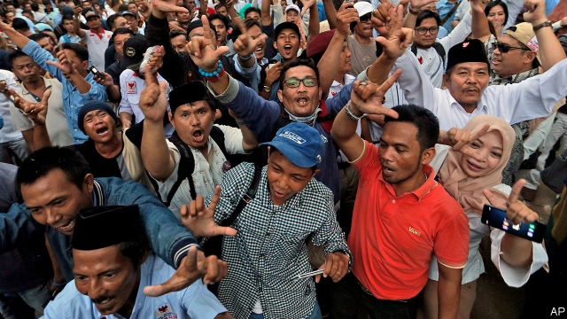

###### Us and them

# The re-election of Indonesia’s president has exposed a widening rift 

##### Indonesian society appears divided along religious lines 

 

> Apr 27th 2019 

DURING THE evening of April 17th, only a few hours after polling stations had closed, Prabowo Subianto, one of the two candidates in Indonesia’s presidential election, declared himself the winner. His rival, Joko Widodo, the incumbent president, who is usually known as Jokowi, was more cautious: he told his supporters to wait patiently for the final count. But as both men surely knew, despite Mr Prabowo’s bluster, Jokowi had the election in the bag. 

Official results will not be announced until May, but early estimates known as “quick counts”, based on samples of actual returns, are usually accurate to within a percentage point or so. Most show that Jokowi was the clear winner, with about 55% of the vote. Mr Prabowo’s claim that he won 62% is implausible, but he insists he will press his case in the constitutional court. 

The same thing happened in the previous presidential race, in 2014, which featured the same candidates. Mr Prabowo claimed to have won, even though the official results showed Jokowi to be the victor, by 53% to 47%. The constitutional court dismissed Mr Prabowo’s objections on that occasion and is likely to do so again. 

Voters also elected a national parliament, as well as provincial, city and district assemblies. For now only estimates of the parliamentary results are available. They show that Jokowi’s party, PDI-P, remains the biggest, but did not make the gains he had hoped. The new legislature will look much like the old one, with Jokowi’s ruling coalition keeping its majority. 

Jokowi seems to have improved his showing marginally by picking Ma’ruf Amin, a Muslim cleric, as his running-mate. Mr Ma’ruf is the former head of Nahdlatul Ulama (NU), a largely moderate Muslim organisation which claims 50m members. Exit polls suggest that more NU members voted for Jokowi than when he was first elected. That presumably explains how he extended his lead in East and Central Java, two populous provinces where NU has lots of members. 

In most provinces, in fact, the winning candidate extended his lead, suggesting that voters are more polarised than they were in 2014. The ten provinces where Jokowi performed best are all ones he won in 2014. Among them, he increased his margin by ten percentage points on average. Likewise, seven of Mr Prabowo’s top ten provinces this time around were ones he also won in 2014. His lead in those places rose by 14 percentage points, on average. 

Worse, in a country with a history of faith-based violence, these divisions appear to fall mainly along religious and ethnic lines. Jokowi gained votes in areas where most people are not Muslim, such as Papua and Bali, and in parts of Java where moderate Islam is practised. By contrast, Mr Prabowo did best in places with more doctrinaire Muslims, such as Aceh and nearby West Sumatra. 

Both sides are to blame for the polarisation, says Aaron Connelly of the International Institute for Strategic Studies, a think-tank. Mr Prabowo has pandered to hardline Islamists who make people of other religions or different strains of Islam feel nervous. But even as Jokowi has made a show of piety, he has banned one hardline Islamist group and allowed prosecutors to bring charges against the leader of another, enabling the Islamists to paint themselves as persecuted. 

Term-limits mean that Jokowi’s second five years in office will be his last. He has promised to continue working on the main themes of his first term by building more infrastructure and rolling out more anti-poverty measures, with a special focus on training and education. Freed from the need to watch the polls, he might try to push through more controversial reforms or even attempt to promote tolerance and pluralism. 

But there are reasons to suspect that the schisms in Indonesian society will deepen. One is that the NU is well placed to demand concessions: its former head is the vice-president; its political arm increased its share of the vote in the legislative election; and the organisation was instrumental in securing votes for Jokowi in Java. As well as extracting more money from the budget for their heartland, NU’s leaders are likely to lobby Jokowi to make life difficult for more conservative Islamic groups, which largely supported Mr Prabowo and which NU sees as a threat. 

Moreover, the opposition has become more willing to take to the streets. In 2016 demonstrations led by hardline Islamist groups helped bring down the governor of Jakarta, an ally of Jokowi, and have been repeated since. Experts reckon that Mr Prabowo can now bring about 1m people to the streets of the capital with relative ease if he wants to object to a new policy. Some suspect he will try to bolster his claim to have won the election in this way. 

The first big demonstrations of this sort prompted Jokowi’s crackdown on extreme Islamists. The spiral of recrimination is not yet over, it seems. 

-- 

 单词注释:

1.rift[rift]:n. 裂口, 空隙 vi. 裂开 vt. 使分开, 使割开 

2.Indonesian[.indәu'ni:ʒәn]:a. 印尼的 n. 印尼人, 印尼语群 

3.APR[]:[计] 替换通路再试器 

4.prabowo[]:[网络] 拉波沃；拉博沃 

5.presidential[.prezi'denʃәl]:a. 总统制的, 总统的, 首长的, 统辖的 [法] 总统的, 议长的, 总经理的 

6.Joko[]:[网络] 佐戈；上甲；彩绘阿祥 

7.widodo[]:[网络] 阿斯 

8.incumbent[in'kʌmbәnt]:a. 现任的, 依靠的, 负有义务的 n. 领圣俸者, 在职者 

9.Jokowi[]:[网络] 佐科威；省长佐科威；雅加达市长 

10.supporter[sә'pɒ:tә]:n. 支持者, 后盾, 迫随者, 护身织物 [法] 支持者, 赡养者, 抚养者 

11.patiently['peiʃәntli]:adv. 耐心地；有毅力地 

12.bluster['blʌstә]:vt. 风狂吹, 咆哮, 汹涌 vi. 咆哮着说出, 恐吓 n. 狂风声, 巨浪声, 夸口, 大话 

13.implausible[im'plɒ:zәbl]:a. 难以置信的, 不象真实的 

14.constitutional[.kɒnsti'tju:ʃәnl]:a. 宪法的, 立宪的, 体质的 [医] 全身的; 体质的 

15.victor['viktә]:n. 胜利者 a. 胜利的 

16.voter['vәutә]:n. 选民, 投票人 [法] 选民, 选举人, 投票人 

17.provincial[prә'vinʃәl]:n. 外地人, 粗野的人 a. 省的, 外地的, 偏狭的 

18.parliamentary[.pɑ:lә'mentәri]:a. 国会的, 议会的, 议会制度的 

19.legislature['ledʒisleitʃә]:n. 立法机关, 议会, 立法院 [法] 立法机构, 立法机关 

20.coalition[.kәuә'liʃәn]:n. 结合体, 结合, 联合 [经] 联合, 联盟 

21.marginally[]:adv. 记在页边, 有旁注, 边缘, 边沿地区, 边际, 限界, 勉强够格, 无关紧要, 少量 

22.amin[]:n. 阿敏（七十年代乌乾达的独裁者） 

23.Muslim['mjzlim; (?@) 'mʌzlem]:n. 伊斯兰教, 伊斯兰教教徒 

24.cleric['klerik]:a. 牧师的, 教士的 

25.ulama['u:lә'mɑ:, ,u:lә'mɑ:]:乌力马(穆斯林的学者或宗教、法律的权威) 

26.nu[nju:]:n. 希腊字母第13字 

27.organisation[,ɔ: ^әnaizeiʃən; - ni'z-]:n. 组织, 团体, 体制, 编制 

28.Java['dʒɑ:vә]:n. 爪哇, 爪哇咖啡 [计] Java 程序设计语言 

29.populous['pɒpjulәs]:a. 人口多的, 人口稠密的 

30.polarise['pәjlәraiz]:vi.vt. (使)极化, (使)偏振, (使)两极分化 

31.ethnic['eθnik]:a. 人种的, 种族的 [医] 人种的 

32.Papua['pæpjuә]:n. 巴布亚岛 

33.Bali['bɑ:li]:n. 巴厘岛 

34.Islam['izlɑ:m]:n. 伊斯兰教 

35.doctrinaire[.dɒktri'nєә]:n. 空论家, 纯理论家, 教条主义者 a. 空谈理论的, 脱离实际的 

36.Muslim['mjzlim; (?@) 'mʌzlem]:n. 伊斯兰教, 伊斯兰教教徒 

37.aceh[]:n. 亚齐省（印度尼西亚最西部的一个省） 

38.sumatra[su'mɑ:trә]:n. 苏门答腊岛（印尼西部的大岛） 

39.polarisation[,pәjlәrai'zeiʃәn; -ri'z-]:n. [物]偏振(现象),极化(作用),两极化,分化 

40.aaron['eәrәn]:n. 亚伦（男子名）；[圣经]亚伦（摩西之兄, 犹太教的第一祭司长） 

41.Connelly[]:康奈利 

42.pander['pændә]:vi. 勾引, 怂恿, 卑劣地迎合 n. 拉皮条者, 怂恿者, 助恶者 

43.hardline[]:n. 强硬路线 [电] 硬线 

44.Islamist[iz'lɑ:mist]:n. 伊斯兰教主义者；回教教徒 

45.piety['paiәti]:n. 虔诚, 孝敬, 虔诚的行为 

46.Islamist[iz'lɑ:mist]:n. 伊斯兰教主义者；回教教徒 

47.prosecutor['prɒsikju:tә]:n. 实行者, 告发者, 公诉人 [法] 原告, 起诉人, 检举人 

48.persecute['pә:sikju:t]:vt. 迫害, 虐待, 困扰, 同...捣乱 [法] 迫害, 虐待, 烦扰 

49.infrastructure['infrәstrʌktʃә]:n. 基础结构, 基础设施 [经] 基础设施 

50.pluralism['pluәrәlizm]:n. 多数状态, 多重性, 多元论, 兼任 [法] 多元论 

51.schism['sizm]:n. 分裂, 分立, 分裂教会罪 [法] 分裂, 分裂宗教罪, 宗派 

52.legislative['ledʒislәtiv]:n. 立法机构 a. 立法的, 有立法权的 

53.instrumental[.instru'mentәl]:a. 仪器的, 器具的, 可作为手段的 [医] 器械的 

54.extract[ik'strækt]:n. 榨出物, 精汁, 摘录, 选段 vt. (费力地)取出, 采掘, 榨取, 摘录, 吸取 [计] 提取 

55.heartland['hɑ:tlænd]:n. 心脏地区, 中心地带 

56.lobby['lɒbi]:n. 大厅, 休息室, 游说议员者 vi. 游说议员, 游说 vt. 游说 

57.Islamic[iz'læmik]:a. 伊斯兰教的, 穆斯林的 

58.opposition[.ɒpә'ziʃәn]:n. 反对, 敌对, 相反, 在野党 [医] 对生, 对向, 反抗, 反对症 

59.demonstration[.demәn'streiʃәn]:n. 示范, 实证 [医] 示教, 实物教授 

60.jakarta[dʒә'kɑ:tә]:n. 雅加达（印尼首都, 等于Djakarta） 

61.ally['ælai. ә'lai]:n. 同盟者, 同盟国, 助手 vt. 使联盟, 使联合, 使有关系 vi. 结盟 

62.reckon['rekәn]:vt. 计算, 总计, 估计, 认为, 猜想 vi. 数, 计算, 估计, 依赖, 料想 

63.bolster['bәulstә]:n. 支持, 长枕 vt. 支持, 支撑 

64.crackdown['krækdaun]:n. 制裁, 镇压, 痛击 

65.spiral['spairәl]:n. 螺旋形之物, 螺线 a. 螺旋形的, 盘旋的 vi. 螺旋形下降, 螺旋形上升, 螺旋形行进 vt. 使螺旋形行进 

66.recrimination[ri.krimi'neiʃәn]:n. 反责, 反唇相讥 [法] 反诉, 反控, 反责 

