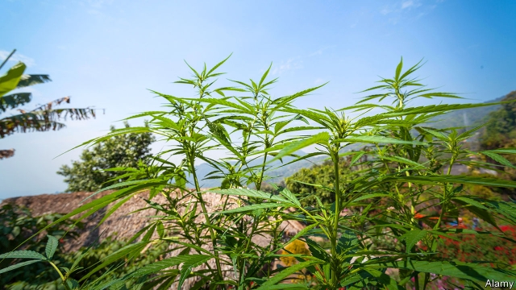

###### The darling buds of Mae Sot

# The sky-high costs of Thailand’s first medical-marijuana farm 

##### The government wants to foster a legal industry, but prices are keener in the illegal one 

 

> Apr 27th 2019 

THAILAND BECAME the first country in South-East Asia to approve the use of medical marijuana last year, and the first facility growing it opened in Pathum Thani province, north of the capital, Bangkok, in February. The Government Pharmaceutical Organisation (GPO), a state enterprise, has burned 100m baht ($3.1m) on the place. The indoor farm covers 100 square metres and its aeroponic system bathes plants in pinkish light for up to 20 hours a day. Advanced scanners and other gadgets prevent thieves from grabbing them. The first batch of 2,500 bottles of sublingual allergy drops—each containing 5ml of the product—should appear in July. 

The plantation is part of an attempt by the military government to create a national industry around medicinal marijuana. Under the new law, only official agencies and their partners can grow it. But the five-star, high-tech facility has caused some amusement and irritation in a country in which weed is available for as little as 10 baht ($0.30) a gram on the streets. (The same quantity would cost $10 in America.) Critics on social media have come out swinging. “Such overkill, all for show. Anyone could outgrow these non-smokers with just $20,000,” wrote one disgruntled Facebook user. 

No doubt the quality of the cosseted official product is higher than what is on offer on the streets; and tight regulations around cultivation have pushed up costs. The authorities have to keep the precious plants closely guarded because recreational use of marijuana remains illegal. Possession of 10kg or less can result in a jail sentence of up to five years. Certain kinds of drug-trafficking can incur the death penalty (though Thailand rarely carries out executions). 

Many Thais take a dim view of illegal narcotics. Those in poorer parts of the country, where communities have been ravaged by meth from Myanmar, fondly remember the anti-drugs campaign of Thaksin Shinawatra, a populist former prime minister. Much like Rodrigo Duterte, president of the Philippines, he encouraged vigilantes to take action against suspected drug dealers. In three months in 2003 more than 2,500 people died in a spate of extra-judicial killings. 

A smaller group of people hopes that the government’s green light for medical marijuana might eventually lead to the legalisation of the drug for recreational use. The Bhumjaithai Party, which did well in elections in March and is likely to be part of any government formed after the results are certified in May, supports further loosening of the law on marijuana. It thinks farmers could make good cash from hash. But advocates for legalisation doubt any such relaxation of the law will occur soon. The military junta, theoretically on the verge of surrendering power, in practice seems determined to retain it. The rebirth of Thai democracy has already gone to pot. 

-- 

 单词注释:

1.mae[mei]:a. （苏格兰）更多（等于more） 

2.sot[sɒt]:n. 醉鬼, 酗酒者 vt. 因酗酒浪费掉 vi. 酗酒 

3.foster['fɒstә]:a. 收养的, 养育的 vt. 养育, 抚育, 培养, 鼓励, 抱(希望) 

4.APR[]:[计] 替换通路再试器 

5.Thailand['tailәnd]:n. 泰国 

6.marijuana[.mæriju'ɑ:nә]:n. 大麻 [医] 大麻 

7.thani[]:[网络] 萨尼；叻察他尼金融 

8.Bangkok['bæŋkɒk]:n. 曼谷 

9.pharmaceutical[,fɑ:mә'sju:tikәl]:a. 药学的, 制药的, 药用的, 药物的, 药剂师的, 药师的 n. 药品, 成药, 药剂 

10.organisation[,ɔ: ^әnaizeiʃən; - ni'z-]:n. 组织, 团体, 体制, 编制 

11.GPO[]:邮政总局, 邮政机构 

12.baht[bɑ:t]:n. 铢(泰国货币单位) 

13.aeroponic[]:n. 气培法 

14.pinkish['piŋkiʃ]:a. 略带桃色的 

15.scanner['skænә]:n. 扫描仪, 扫描盘, 审视者 [计] 扫描器; 词法分析程序; 扫描程序; 扫视程序 

16.gadget['gædʒit]:n. 小配件, 小玩意, 诡计 

17.grab[græb]:n. 抓握, 掠夺, 强占, 东方沿岸帆船 vi. 抓取, 抢去 vt. 攫取, 捕获, 霸占 

18.batch[bætʃ]:n. 一次所烘的面包, 一次所制之量, 一组, 批, 成批, 分批 v. 成批, 分批处理 [计] 一批 

19.sublingual[sʌb'liŋgwәl]:a. 舌下的, 舌下腺的 [医] 舌下的 

20.allergy['ælәdʒi]:n. 变应性, 反感, 厌恶 [化] 变态反应; 变应性 

21.medicinal[me'disinәl]:a. 药用的, 药的, 有益的 [医] 药用的, 医药的, 医治的 

22.irritation[.iri'teiʃәn]:n. 刺激, 烦恼, 刺激物 [医] 刺激[作用], 兴奋 

23.wee[wi:]:a. 很小的, 微小的 n. 一点点 

24.overkill['әuvәkil]:n. 超量毁伤, 过度杀伤威力 vt. 过度地杀伤 

25.outgrow[.aut'grәu]:vt. 过大而不适于, 长得比...高(或大、快), 成长得不再具有... 

26.disgruntle[dis'grʌntl]:vt. 使不高兴 

27.facebook[]:n. 脸谱网 

28.cosset['kɒsit]:n. 供玩赏的小动物, 爱畜 vt. 宠爱, 珍爱, 溺爱 

29.cultivation[.kʌlti'veiʃәn]:n. 教化, 培养, 耕作 [医] 培养[法] 

30.recreational[.rekri'eiʃәnәl]:a. 消遣的, 娱乐的 

31.les[lei]:abbr. 发射脱离系统（Launch Escape System） 

32.incur[in'kә:]:vt. 招致, 蒙受, 遭遇 [经] 招致, 蒙受, 担负 

33.penalty['penәlti]:n. 处罚, 刑罚, 罚款, 罚球, 报应, 不利结果, 妨碍 [经] 罚金(款), 违约金 

34.Thailand['tailәnd]:n. 泰国 

35.execution[.eksi'kju:ʃәn]:n. 实行, 完成, 执行, 死刑 [计] 执行 

36.Thai[tai]:n. 泰国人, 泰语 

37.narcotic[nɑ:'kɒtik]:n. 麻醉药, 镇静剂 a. 麻醉的, 催眠的 

38.ravage['rævidʒ]:n. 破坏, 蹂躏 v. 毁坏, 破坏, 掠夺 

39.meth[meθ]:n. 甲安菲他明（一种兴奋剂） 

40.Myanmar['mjænmɑ:(r)]:缅甸[东南亚国家](即Burma) 

41.fondly['fɒndli]:adv. 溺爱地, 怜爱地, 情柔地 

42.thaksin[]: 塔克辛; 塔辛（人名） 

43.shinawatra[]:[网络] 西那瓦；那越；钦那瓦 

44.Populist['pɔpjulist]:n. 民粹派的成员 

45.Rodrigo[]:n. 罗德里戈（歌曲名称） 

46.duterte[]:[网络] 迪泰特 

47.Philippine['filipi:n]:a. 菲律宾(群岛)的, 菲律宾人的 

48.vigilante[.vidʒi'lænti]:n. 警戒会会员 

49.dealer['di:lә]:n. 经销商, 商人 [经] 交易员, 贩卖商 

50.spate[speit]:n. 泛滥, 洪水, 大雨, 大量, 一阵 

51.killing['kiliŋ]:n. 谋杀, 杀戮 a. 杀害的, 疲惫的, 迷人的 

52.legalisation[ˌli:gəlaɪ'zeɪʃən]:n. 合法化, 法律上认可 

53.certify['sә:tifai]:v. 证明, 保证 

54.hash[hæʃ]:n. 剁碎的食物, 杂乱无章的的一大堆, 杂烩, 复述 vt. 切碎, 搞糟 

55.relaxation[.ri:læk'seiʃәn]:n. 松弛, 放松, 减轻, 缓和, 休息, 休养 [化] 松弛; 驰豫 

56.junta['dʒʌntә]:n. 以武力政变上台的(军)政府, 私党, 阴谋小集团, 政务会 

57.theoretically[.θi:ә'retikli]:adv. 理论上, 理论地 

58.verge[vә:dʒ]:n. 边缘, 边界, 起始点 vi. 处在边缘, 接近, 下沉, 趋向 

59.rebirth[.ri:'bә:θ]:n. 再生, 复活, 新生 

60.Thai[tai]:n. 泰国人, 泰语 

