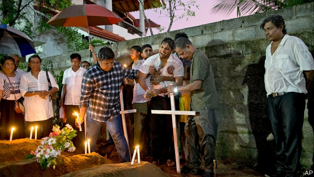

###### Bloody Sunday

# The suicide bombs in Sri Lanka might have been prevented 

##### Government dysfunction may have enabled the massacre of more than 350 people 

 

> Apr 27th 2019 

THE CLOCK on the bell tower at St Anthony’s Shrine in Colombo, the Sri Lankan capital, is stuck at 8:45. It was at that moment on the morning of April 21st, Easter Sunday, that a bearded youth sauntered into the crowded holiday service and detonated a heavy, nail-studded bomb stuffed inside his backpack. Around the same time similar blasts struck two other churches and three luxury hotels across the country. Together the suicide bombs left 359 people dead and hundreds more injured, mostly Sri Lankan Christians but also some 39 foreign tourists. The toll would have been higher except that a seventh bomb, at another posh hotel, failed to explode. 

The perpetrators were jihadists from the Tamil-speaking Muslim minority that accounts for about 10% of Sri Lanka’s 23m people. Tamil Muslims have no history of animosity with the even smaller Christian minority. Instead, the animus seems to have been imported: on April 23rd Islamic State claimed to have instigated the atrocities, apparently in conjunction with a local extremist group. That would make them the deadliest incident of international terrorism since the attacks on America on September 11th, 2001. They are also by far the bloodiest event to shake Sri Lanka since the end of a long civil war ten years ago. That conflict, which pitted Tamil-speaking Hindu separatists against the government, which is dominated by Sinhala-speaking Buddhists, left perhaps 70,000 dead. 

No one expects the bombings to reignite such strife, though fears of revenge attacks against Muslims have prompted heavy security deployments, curfews and the declaration of a state of emergency. The local group the authorities hold responsible for the bombings, National Thowheed Jamaath (NTJ), is a violent splinter of a fundamentalist group that itself represents only a slim fraction of Sri Lanka’s 2m Muslims. Like extremist groups elsewhere in South Asia, NTJ seems to have attracted well-educated and well-heeled adherents. Its leader, Mohamed Zahran, is among at least nine members killed by the blasts or in subsequent police raids. Police have arrested a further 60 or so suspects, which may, in effect, have extinguished NTJ. 

The police, unfortunately, were not as resolute before the attacks. For several years, mainstream Muslims have raised the alarm about the spread of extremist views and jihadist cells. Mr Zahran and his hate-filled group in particular were believed to be in contact with the few dozen Sri Lankan Muslims known to have joined Islamic State. In December last year the arrest of suspected Islamist radicals led police to a coconut plantation where a large cache of detonators and explosives was found. This lead was apparently not pursued, and some of the suspects were released. In early April Indian intelligence agents passed on urgent information gleaned from a Tamil-speaking IS prisoner. This detailed “on a platter” the names of suspects, their leader’s location and possible modes of attack, including suicide- or truck-bombs. The note even named the targets as “some important churches” and, possibly, the Indian High Commission. 

Yet after the attacks the prime minister, Ranil Wickremesinghe, said that he had never been informed of such a warning. Moreover, a government spokesman added, the prime minister had for months not even been invited to meetings of the National Security Council (NSC), which is chaired by the president, Maithripala Sirisena. When the prime minister tried to summon the NSC after the attacks, its members refused to convene because Mr Sirisena was abroad. Mr Sirisena, for his part, swears that he was not informed of any imminent threat, either, although he is in charge of the armed forces, police and intelligence services. Privately, officials blame distracting Buddhist and Hindu holidays in mid-April. Even more privately, some whisper that the attacks may have been allowed to go ahead, so as to embarrass political rivals, though their scale may not have been anticipated. 

Most insiders, however, see a cock-up rather than a conspiracy. According to one official, the intelligence apparatus was indeed on the trail of jihadist groups, including NTJ, until around 2016. This met with a lack of interest “at the top”. NSC meetings, once weekly, took place only every two or three weeks. And there was a marked focus on now-defunct groups from the civil war, rendering the meetings “pointless” in the official’s view. “Our problem was that we never went into post-conflict surveillance mode,” he says. Mr Sirisena may also mistrust Indian advice: he has accused Indian agents of plotting to kill him. 

The dysfunction in government, and outright hostility between the prime minister and president, come as no surprise to Sri Lankans. The two men formed a wobbly team in 2015 with the sole purpose of defeating Mahinda Rajapaksa, the war-winning but authoritarian president, at a snap election. But relations between the blunt-mannered nationalist and the blue-blooded Mr Wickremesinghe soured quickly. Mr Sirisena’s main grouse, ironically, is that he had no idea what his government was doing until he read it in the news. Things came to a head in October when the president abruptly sacked Mr Wickremesinghe and replaced him with Mr Rajapaksa, before dissolving parliament. Mr Wickremesinghe was reinstalled in December after the Supreme Court ruled the dissolution unconstitutional. 

There are now growing calls for a “strong leader” and Mr Rajapaksa is proffering one—his brother, Gotabaya, who was the minister of defence at the end of the war. In an impassioned speech before parliament on April 23rd, the former president said “the people have no use for a government that cannot assure them of the safety of their lives.” With elections looming, Sri Lankans may prefer a leader who is in charge, whatever his faults, over one who merely pretends to be. 

-- 

 单词注释:

1.bloody['blʌdi]:a. 血腥的, 嗜杀的, 有血的 

2.suicide['sjuisaid]:n. 自杀, 自杀者 v. 自杀 a. 自杀的 

3.sri[sri]:n. 斯里兰卡（Sri Lanka）；（拉）神圣罗马帝国（Sacrum Romanum Imperium） 

4.lanka[]:n. 兰卡；楞伽 

5.dysfunction[dis'fʌŋkʃәn]:n. 机能不良, 机能障碍 [医] 机能障碍, 机能不良 

6.massacre['mæsәkә]:n. 大屠杀 vt. 大屠杀, 残杀 

7.APR[]:[计] 替换通路再试器 

8.ST[]:[计] 段表, 状态, 系统测试, 直端连接器 [化] 磺胺噻唑 

9.shrine[ʃrain]:n. 圣地, 神龛, 庙 vt. 将...置于神龛内 

10.Colombo[kә'lʌmbәu]:n. 科伦坡 

11.lankan[]:[网络] 斯里兰卡南部的兰坎市 

12.saunter['sɒ:ntә]:n. 闲逛, 漫步 vi. 闲逛, 漫步 

13.detonate['detәneit]:vt. 引爆, 使爆炸, 使爆裂 vi. 爆炸, 发爆炸声 

14.backpack['bækpæk]:n. 远足用的背包；双肩背包, 背包 

15.toll[tәul]:n. 通行费, 代价, 钟声 vt. 征收, 敲钟, 鸣钟, 勾引, 引诱 vi. 征税, 鸣钟 

16.posh[pɒʃ]:a. 豪华的, 漂亮的, 优雅的, 极好的 interj. 呸 

17.perpetrator[]:n. 作恶者, 犯罪者, 行凶者 [法] 作恶者, 行凶者, 犯罪者 

18.jihadist[]:n. 伊斯兰圣战士 

19.Muslim['mjzlim; (?@) 'mʌzlem]:n. 伊斯兰教, 伊斯兰教教徒 

20.Tamil['tæmil]:n. 泰米尔人, 泰米尔语 

21.Muslim['mjzlim; (?@) 'mʌzlem]:n. 伊斯兰教, 伊斯兰教教徒 

22.animosity[.æni'mɒsiti]:n. 仇恨, 憎恶, 敌意 

23.animus['ænimәs]:n. 基本态度, 敌意, 意向 [医] 男性意象(精神分析用词) 

24.Islamic[iz'læmik]:a. 伊斯兰教的, 穆斯林的 

25.instigate['instigeit]:vt. 教唆, 怂恿, 煽动 [法] 教唆, 煽动, 怂恿 

26.atrocity[ә'trɒsiti]:n. 残暴, 凶恶, 暴行 [法] 暴行, 残酷, 残忍 

27.apparently[ә'pærәntli]:adv. 表面上, 清楚地, 显然地 

28.extremist[iks'tri:mist]:[经] 偏激份子 

29.terrorism['terәrizm]:n. 恐怖主义, 恐怖统治, 恐怖状态 [法] 胁迫, 暴政, 恐怖政治 

30.bloody['blʌdi]:a. 血腥的, 嗜杀的, 有血的 

31.Hindu['hindu:]:a. 印度教教徒的 n. 印度教教徒 

32.separatist['sepәreitist]:n. 分离主义者, 独立派 

33.bombing['bɔmiŋ]:n. 轰炸, 投弹 

34.reignite[,ri:i^'nait]:v. 再点火, 再点燃, 重新激起 

35.strife[straif]:n. 争吵, 竞争, 冲突 

36.deployment[]:[计] 展开 

37.curfew['kә:fju:]:n. 晚钟, 打晚钟时刻, 宵禁 [法] 宵禁, 宵禁令 

38.declaration[.deklә'reiʃәn]:n. 宣告, 说明, 宣布 [计] 说明 

39.NTJ[]:日本国家剧院简称 

40.splinter['splintә]:n. 碎片, 尖片, 分裂出来的小派别, 微小的东西 v. 使分裂, (使)破裂 

41.fundamentalist[.fʌndә'mentәlist]:n. 基要主义者 

42.adherent[әd'hiәrәnt]:n. 信徒, 追随者 a. 附着的, 发生联系的 

43.Mohamed[]:n. (Mohamed)人名；(阿拉伯)穆罕默德； 

44.zahran[]:[网络] 赫兰；札兰；宰赫兰 

45.extinguish[ik'stiŋgwiʃ]:vt. 熄灭, 使消亡, 压制, 使减色 [医] 消灭 

46.resolute['rezәlu:t]:n. 果断的人 a. 坚决的, 刚毅的, 毅然的 

47.mainstream['meinstri:m]:n. 主流 

48.Islamist[iz'lɑ:mist]:n. 伊斯兰教主义者；回教教徒 

49.coconut['kәukәnәt]:n. 椰子 [医] 椰子(实) 

50.cache[kæʃ]:n. 隐藏所, 隐藏的粮食或物资, 贮藏物, 高速缓冲存储器 vt. 隐藏, 窖藏 [计] 高速缓冲存储器, 高速缓冲 

51.detonator['detәneitә]:n. 雷管, 炸药 [化] 雷管 

52.glean[gli:n]:v. 拾落穗, 收集 

53.platter['plætә]:n. 大浅盘, 主菜盘 [计] 底板 

54.Ranil[]:拉尼尔 

55.Wickremesinghe[]:n. 维克勒马辛哈 

56.spokesman['spәuksmәn]:n. 发言人, 代言者 

57.NSC[]:国家安全委员会 

58.Maithripala[]:[网络] 迈特里帕拉 

59.Sirisena[]:n. (Sirisena)人名；(斯里)西里塞纳 

60.summon['sʌmәn]:vt. 召唤, 召集, 号召, 振奋, 唤起, 鼓起 [经] 传唤, 传讯 

61.convene[kәn'vi:n]:vt. 集合, 召集, 召唤 vi. 聚集, 集合 

62.imminent['iminәnt]:a. 即将来临的, 逼近的 

63.privately[]:adv. 秘密地；私下地 

64.distract[dis'trækt]:vt. 转移, 分心, 使发狂 

65.privately[]:adv. 秘密地；私下地 

66.insider['in'saidә]:n. 内部的人, 权威人士, 知道内情的人 [经] 熟悉内情者 

67.conspiracy[kәn'spirәsi]:n. 同谋, 阴谋, 阴谋集团 [法] 阴谋, 通谋, 共谋 

68.pointless['pɒintlis]:a. 不尖的, 钝的, 不得要领的 

69.surveillance[sә:'veilәns]:n. 监视, 监督 [电] 侦测 

70.mistrust[.mis'trʌst]:n. 不信任, 疑惑 v. 不信任, 疑惑 

71.outright['autrait]:a. 率直的, 完全的, 总共的, 直率的 adv. 完全地, 率直地, 立刻地, 一直向前 

72.hostility[hɒs'tiliti]:n. 敌意, 敌对, 反对 

73.lankan[]:[网络] 斯里兰卡南部的兰坎市 

74.wobbly['wɒbli]:a. 摆动的, 不稳定的 

75.mahinda[]:[网络] 摩哂陀；阿育王之子玛兴达；马兴达 

76.rajapaksa[]:[网络] 斯里兰卡总统拉贾帕克萨 

77.authoritarian[ɒ:.θɒri'tєәriәn]:a. 独裁的, 独裁主义的 

78.nationalist['næʃәnәlist]:n. 国家主义者, 民族主义者 

79.quickly['kwikli]:adv. 很快地 

80.grouse[graus]:n. 松鸡, 牢骚 vi. 埋怨 

81.ironically[]:adv. 冷嘲地, 挖苦地, 讽刺地, 令人啼笑皆非地 

82.abruptly[ә'brʌptli]:adv. 突然地, 唐突地 

83.dissolution[.disә'lu:ʃәn]:n. 分解, 溶解, 解散, 结束 [化] 溶解; 溶解作用 

84.unconstitutional['ʌnkɔnsti'tju:ʃәnәl]:a. 违反宪法的, 不符合宪法的 [法] 违反宪法的, 违宪的, 不合宪法规定的 

85.proffer['prɒfә]:vt. 提供, 贡献, 提议 n. 提供, 提议 

86.Gotabaya[]:戈塔巴亚 

87.impassioned[im'pæʃәnd]:a. 充满激情的, 狂热的, 热烈的 

88.cannot['kænɒt]:aux. 无法, 不能 

89.loom[lu:m]:n. 织布机, 若隐若现的景象 vi. 朦胧地出现, 隐约可见, 可怕地出现 

