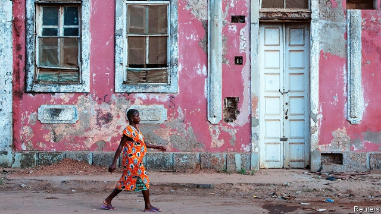

###### Brothers in art

# An evening with the soldier-poets of Guinea-Bissau 

##### In a desperately poor country, the writers’ association is a rare chance to hone and promote their craft 

 

> Apr 27th 2019 

AS DUSK FALLS, Manuel da Costa scans the university garden for an unoccupied plastic chair. He shakes a student’s hand, waves at a politician and winks at a playwright as a meeting of Guinea-Bissau’s only writers’ club begins. 

Since October 2013 an eclectic mix of around 30 writers and literature enthusiasts have gathered every month in Bissau, the country’s capital, to hear new work, debate the latest political crisis, and gossip. “I was shy at first, but then I got used to reading out poetry and expressing my feelings,” says Mr da Costa. For its members, the Guinea-Bissau Writers Association is a rare chance to hone and promote their craft. 

The legacy of Portuguese rule, and the failures of the African Party for the Independence of Guinea and Cape Verde (PAIGC), which has governed almost uninterrupted since independence in 1974, have left Guinea-Bissau desperately poor. Among other deprivations, there is no functioning, state-funded library. Poverty is compounded by crime. In 2008 the country was labelled a narco-state by the UN; diplomats say the crooks have diversified into people- and arms-trafficking. 

Mr da Costa confronts these problems in his writing. In his novel “Mare Branca em Bulinia”, Latin American drug cartels, in league with shadowy figures in the local armed forces, overrun a fictional west African country. It is a story he is well-qualified to tell: as well as being a writer he is a retired lieutenant-colonel. 

He leads a surprisingly large contingent of soldier-poets. “Most of us in the military have seen a lot, and that’s why so many are writers,” Mr da Costa explains. Many Guineans proudly recall that Amilcar Cabral, a murdered guerrilla leader, was a fine poet as well as an independence fighter. Samuel Fernandes, a serving army colonel, borrowed the title of one of Cabral’s most famous poems, “Regresso”, for one of his own. It laments the desire of many young Guineans to leave the country at the earliest opportunity and urges them to return: 

Mr Fernandes says his first verses were odes he sent home to a girlfriend during a Soviet-era stint in Leningrad (now St Petersburg). Today China is the main sponsor of student exchanges for Guineans. 

Along with politics, the divisive issue of language frequently crops up at the writers’ get-togethers. Portuguese is Guinea-Bissau’s sole official language, but around 90% of the population of 2m do not speak, read or write it. The adult literacy rate is below 60%; roughly half of children do not go to school. Those who do are often taught by teachers who barely know Portuguese themselves. The principal lingua franca in a patchwork of ethnic languages is Creole, which is influenced by tribal dialects, Portuguese and (in some places) French. 

Edson Incopte—an up-and-coming poet who spent part of his youth overseas and works for a Portuguese NGO—resists choosing between the two tongues. “When I need to write to Guinean people, and express Guinean things, I write in Creole,” he says, but he publishes in both languages. Odete Semedo, a more established poet, recalls the prejudice she once suffered as a student in Portugal. Creole, she says, is “the language of my heart”. 

Despite serving as the spokeswoman of the PAIGC, Ms Semedo accepts that the hope of “a happier and more equitable society” after independence has not been realised. “The despair of the poets”, she says, “chimes with the despair of the people.” 

-- 

 单词注释:

1.desperately['despәrәtli]:adv. 拼命地；绝望地；极度地 

2.hone[hәun]:n. 磨刀石, 抱怨, 想念 vt. 用磨刀石磨, 磨练 

3.APR[]:[计] 替换通路再试器 

4.manuel['mænjuel]:n. 曼纽尔（男子名）；曼努埃尔二世（拜占庭皇帝约翰五世的次子） 

5.DA[,di:'ei]:美国地方检察官 [计] 数据采集, 数据管理员, 数据分析, 设计自动化 

6.costa['kɒstә]:n. 肋骨, 肋脉, 叶的中脉 [医] 肋 

7.unoccupied[.ʌn'ɒkjupaid]:a. 空着的, 没人占的, 未被占领的 

8.wink[wiŋk]:n. 眨眼, 使眼色, 瞬间 vi. 眨眼, 使眼色, 闪烁 vt. 眨 

9.playwright['pleirait]:n. 剧作家 

10.eclectic[ek'lektik]:n. 折衷主义者 a. 选择的, 折衷的 

11.enthusiast[in'θju:ziæst]:n. 热心家, 狂热者, 爱好者 

12.bissau[bis'ajŋ]:n. 比绍（几内亚比绍共和国的首都） 

13.gossip['gɒsip]:n. 闲聊, 随笔, 流言, 爱讲闲话的人 vi. 说闲话, 闲聊 

14.legacy['legәsi]:n. 祖先传下来之物, 遗赠物 [经] 遗产, 遗赠物 

15.guinea['gini]:n. 几内亚 

16.cape[keip]:n. 岬, 海角, 披肩, 斗蓬 

17.verde[v\\:d]:n. 佛得角（塞内加尔西部） 

18.paigc[]:[网络] 佛德角独立党；佛得角独立非洲人党；维德角非洲独立党 

19.uninterrupted['ʌn.intә'rʌptid]:a. 不间断的, 连续的, 不断的 

20.deprivation[.depri'veiʃәn]:n. 剥夺, 剥夺官职, 免职 [医] 丧失, 剥夺, 缺乏 

21.UN[ʌn]:pron. 家伙, 东西 [经] 联合国 

22.diplomat['diplәmæt]:n. 外交官, 有外交手腕的人 [法] 外交家, 外交官, 有权谋的人 

23.crook[kruk]:n. 钩, 弯曲部分, 坏蛋 vt. 使弯曲, 诈骗 vi. 弯曲 

24.diversify[dai'vә:sifai]:vt. 使多样化, 使变化 

25.confront[kәn'frʌnt]:vt. 使面对, 对抗, 遭遇, 使对质, 比较 [法] 对证, 使对质, 比较 

26.mare[mєә]:n. 母马, 母驴, 月球表面阴暗部 [法] 海 

27.branca[]:n. (Branca)人名；(德、西、意、葡、法)布兰卡 

28.EM[em]:[计] 媒体用毕符 [化] 射气 

29.cartel[kɑ:'tel]:n. 卡特尔, 企业联合, 俘虏交换条约, 决斗挑战书 [经] 同业联合, 联合贩卖, 卡特尔 

30.shadowy['ʃædәui]:a. 有影的, 暗黑的, 朦胧的, 虚幻的 

31.overrun[.әuvә'rʌn]:n. 蔓延, 风行一时, 超过限度 vt. 蔓延, 蹂躏, 超过, 泛滥 vi. 泛滥, 超载限度 [计] 超限 

32.fictional['fikʃәnl]:a. 虚构的, 编造的, 小说式的 [法] 拟制的, 假定的, 虚构的 

33.contingent[kәn'tindʒәnt]:a. 或许发生的, 附随的, 偶然发生的 n. 偶然事件, 分遣队 

34.Guinean['^iniәn]:a. 几内亚的 

35.proudly['praudli]:adv. 傲慢地, 自大地, 得意洋洋地 

36.amilcar[]:n. (Amilcar)人名；(西、罗、葡)阿米尔卡 

37.cabral[]:n. (Cabral)人名；(法、葡、几比)卡布拉尔；(西)卡夫拉尔 盐酸苯吡氨醇 

38.guerrilla[gә'rilә]:n. 游击队 

39.samuel['sæmjuәl]:n. 撒母耳（希伯来先知）；塞缪尔（男子名） 

40.fernande[]:n. 【女名】女子名 [网络] 女人头像；费南代尔；费蓝狄 

41.lament[lә'ment]:n. 悲叹, 悔恨, 恸哭, 挽歌, 悼词 vt. 哀悼 vi. 悔恨, 悲叹 

42.verse[vә:s]:n. 诗, 韵文, 诗句 vt. 用诗表达 vi. 作诗 

43.ode[әud]:n. 颂诗, 赋 

44.girlfriend[]:n. 女朋友 

45.stint[stint]:vt. 节省, 限制, 停止 vi. 节约 n. 吝惜, 节约, 限额 

46.Leningrad['lenin^ræd, -^rɑ:d]:n. 列宁格勒(前苏联西北部港市) 

47.ST[]:[计] 段表, 状态, 系统测试, 直端连接器 [化] 磺胺噻唑 

48.petersburg['pi:tәzbә:^]:n. 彼得斯堡（美国城市）；彼得堡（苏联城市列宁格勒旧称） 

49.politic['pɒlitik]:a. 精明的, 明智的, 策略的 

50.divisive[di'vaisiv]:a. 区分的, 制造分裂的, 造成不和的 

51.literacy['litәrәsi]:n. 读写能力, 识字, 精通文学 

52.lingua['liŋgwә]:n. 舌 [医] 舌 

53.Franca['fra:ŋka:]:n. 弗兰卡（男子名） 

54.patchwork['pætʃwә:k]:n. 拼缝物, 拼凑物 

55.ethnic['eθnik]:a. 人种的, 种族的 [医] 人种的 

56.Creole['kri:әul]:n. 克里奥耳人, 克里奥耳语, 克里奥耳人所讲的法语 a. 克里奥耳人的, 克里奥耳式法语的 

57.tribal[traibl]:a. 部落的, 宗族的 

58.edson[]: [人名] [英格兰人姓氏] 埃德森取自父名或母名，来源于Eade,含义是“伊德之子”(son of Eade); [地名] [加拿大、美国] 埃德森 

59.oversea['әuvә'si:]:adv. 海外, 向国外, 向海外, 国外 a. 外国的, 在国外的, 在海外的, 舶来的 

60.Guinean['^iniәn]:a. 几内亚的 

61.semedo[]:[网络] 塞梅多；曾德昭；谢务禄 

62.Portugal['pɒ:tʃugl]:n. 葡萄牙 

63.spokeswoman['spәuks,wumәn]:n. 女发言人, 女代言人 

64.equitable['ekwitәbl]:a. 公平的, 公正的 [法] 公平的, 公正的, 平衡法的 

65.chime[tʃaim]:n. 钟声, 钟, 和谐 vi. 鸣, 奏出谐和的乐声, 和谐 vt. 敲出和谐的声音, 打钟报时, 重复说 

