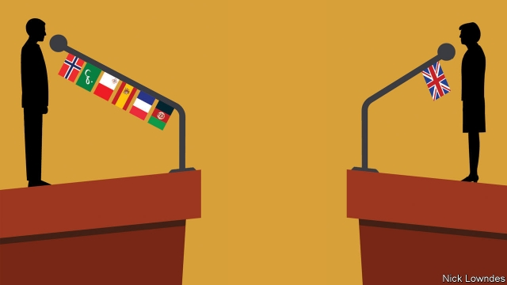

###### Johnson

# Foreign languages ought to be an asset for politicians—not a liability 

##### Even if you distrust foreigners, shouldn’t you want to know what they are saying? 

 

> Apr 27th 2019 

IT SEEMS HARD to imagine, but once a British prime minister could not only aim to put Britain “at the heart of Europe”; he could say so in fluent French to the Assemblée Nationale. Today, even if Theresa May, a successor to the Europhile Tony Blair, could emulate him, the politics of patriotism might require her to hide it. In the nationalistic climate, many people in the Anglophone democracies seem to consider the ability to talk to foreigners in their own languages distasteful, even suspect. 

Foreign-language skill has become yet another cultural-political divider: it is associated with despised liberal elites, like a fondness for sushi or a passport full of stamps. And like the general disgust with those elites, this attitude crosses the left-right divide. Pete Buttigieg, the young mayor of a medium-sized city in Indiana, is enjoying a surprise moment in the sun as a presidential candidate—and nearly every profile of him mentions that he speaks seven foreign languages: French, Spanish, Italian, Maltese (his family’s heritage tongue), Norwegian, Arabic (from which Maltese is descended), and Dari, a language of Afghanistan. 

The way Mr Buttigieg’s skills are regarded betrays a lack of understanding of what learning a language means. Mr Buttigieg is not fluent in all of them, as he admits. He conceded that “I just ran out of Norwegian” after several well-delivered sentences in reply to a Norwegian journalist. He struggled in an answer to an Italian. Asked how many languages he speaks, he said: “It depends on what you mean by ‘speak’.” 

Spoken like a linguist. How his abilities are described often says more about those doing the describing. The left likes to see itself as the brainy wing of politics, in contrast to science-bashing conservatism. Yet that has not stopped some on the left from attacking Mr Buttigieg for his signature aptitude. To Nathan Robinson, writing in Current Affairs, Mr Buttigieg’s polyglottery is of a piece with his time as a consultant at McKinsey; a slick trick, an ability to tell people what they want to hear. Another left-wing outlet, Jacobin, sarcastically headlined its unflattering profile: “Have you heard? Pete Buttigieg is really smart.” 

All the same, languages remain more of a Democratic than a Republican trait. Of this year’s Democratic presidential candidates, Beto O’Rourke speaks good Spanish (Julian Castro’s and John Hickenlooper’s is rather less good); Kristen Gillibrand has some Mandarin, and Kamala Harris conversational French. Barack Obama managed a few phrases in Indonesian on trips to the country where he spent some of his youth. John Kerry, the Democrats’ nominee in 2004, proudly spoke French; his wife Teresa addressed the national convention in a string of languages. 

On the Republican side, it is not so much ability as attitude that differs. Though Mitt Romney speaks good French, he made little of it while running for president in 2012. Marco Rubio and Jeb Bush were unusual in speaking some Spanish on the campaign trail in 2016, but not without controversy. Ted Cruz took a swipe at Mr Rubio, a fellow Cuban-American, over an interview he had given in Spanish. Donald Trump said that Mr Bush should “set the example by speaking English in the United States”. The party is known for pushing English-only laws across the country, as if tolerating another language necessarily entailed insufficient pride in your own. 

Elsewhere in the Anglophone world, Canadian politicians are usually bilingual as a matter of course, and New Zealanders are rediscovering a fondness for Maori. Kevin Rudd, an Australian prime minister, was fluent in Mandarin. But most leaders know they can get by with only English. Not so those in office in other places. Besides learning English, continental European leaders often know a couple of each other’s languages. Multilingualism is a national virtue in multi-ethnic countries such as Singapore and Switzerland. Angela Merkel can speak to Vladimir Putin in Russian, and he can reply in German. 

It is a short-sighted shame to be dismissive of language ability. The link to xenophobia in America and Britain is obvious, but too easy an explanation: after all, such resentment is rising elsewhere, too. Just as importantly, as people the world over learn English, so Anglophones are spending less and less time acquiring foreign languages. That is sad for politicians and everybody else, as even xenophobes should see. Even if they believe that foreigners are the enemy, doesn’t it make sense to know what they are talking about? 

-- 

 单词注释:

1.johnson['dʒɔnsn]:n. 约翰逊（姓氏） 

2.asset['æset]:n. 资产, 有益的东西 

3.liability[laiә'biliti]:n. 责任, 债务, 倾向 [经] 责任, 义务, 负债 

4.distrust[dis'trʌst]:n. 不信任 vt. 不信任 

5.APR[]:[计] 替换通路再试器 

6.nationale[]:[网络] 号公路；国家号；国营公司 

7.theresa[ti'ri:zә]:n. 特丽萨（女子名） 

8.successor[sәk'sesә]:n. 继承者, 接任者 [计] 后继 

9.Europhile[]:亲欧分子 

10.tony['tәuni]:a. 高贵的, 时髦的 

11.blair[bleә(r)]:n. 布莱尔（男子名） 

12.emulate['emjuleit]:vt. 效法, 尽力赶上, 同...竞争 [计] 仿真 

13.politic['pɒlitik]:a. 精明的, 明智的, 策略的 

14.patriotism['peitriәtizm]:n. 爱国心, 爱国精神, 爱国主义 

15.nationalistic[.næʃәnә'listik]:a. 国家主义的 

16.anglophone['æŋ^lәufәun]:n. 母语是英语者 

17.distasteful[dis'teistful]:a. 味道差的, 使人不愉快的, 讨厌的 

18.elite[ei'li:t]:n. 精华, 精锐, 中坚分子 

19.fondness['fɔndnis]:n. 溺爱；爱好 

20.sushi['su:ʃi]:n. 寿司（生鱼片冷饭团） 

21.Pete[pi:t]:n. 皮特（等于Peter, 男子名） 

22.buttigieg[]:布蒂吉格 

23.Indiana[.indi'ænә]:n. 印地安那州 

24.presidential[.prezi'denʃәl]:a. 总统制的, 总统的, 首长的, 统辖的 [法] 总统的, 议长的, 总经理的 

25.profile['prәufail]:n. 侧面, 轮廓, 传略 vt. 描绘...轮廓, 写...的传略 [计] 提问档; 剖面图法; 剖面法 

26.Maltese[.mɒ:l'ti:z]:a. 马尔他的 n. 马尔他人, 马尔他语 

27.heritage['heritidʒ]:n. 遗产, 祖先遗留物, 继承物 [医] 遗传性 

28.Norwegian[nɒ:'wi:dʒәn]:n. 挪威人, 挪威语 a. 挪威的, 挪威人的, 挪威语的 

29.dari['dɑ:ri:]:n. 达里语（现代波斯语的一种） 

30.Afghanistan[æf'gænistæn]:n. 阿富汗 

31.concede[kәn'si:d]:vt. 承认, 退让 vi. 让步 

32.linguist[liŋ'gwist]:n. 语言学家 

33.brainy['breini]:a. 脑筋好的, 聪明的 

34.conservatism[kәn'sә:vәtizәm]:n. 保守, 守旧性, 保守主义, [the]保守党的主张和政策, 保守党 [医] 保守性 

35.aptitude['æptitju:d]:n. 资质, 才能, 自然倾向 [医] 资质, 才能 

36.nathan['neiθәn]:n. 南森（男子名） 

37.robinson['rɔbinsn]:n. 罗宾逊（男子名） 

38.polyglottery[,pɔli'^lɔtәri]:a. 通晓数种语言, 数种语言的 n. 通晓数种语言的人, 用通晓数种语言记载的书 

39.McKinsey[]:n. 麦肯锡（公司） 

40.slick[slik]:a. 光滑的, 熟练的, 聪明的, 华而不实的, 老套的, 陈腐的 adv. 灵活地, 聪明地 vt. 使光滑, 使漂亮 vi. 打扮整洁 n. 光滑平面, 平滑器, 修光工具 

41.jacobin['dʒækәbin]:n. 激进派成员 

42.sarcastically[sɑ:'kæstɪklɪ]:adv. 讽刺地, 挖苦地 

43.unflattering['ʌn'flætәriŋ]:a. 不奉承的, 不恭维的, 指出缺点的, 耿直的, 坦率的, 准确无误的 

44.trait[treit]:n. 特征, 特性, 一笔, 少许 

45.beto[]:n. (Beto)人名；(英)贝托 

46.Julian['dʒu:ljәn]:a. 尤利乌斯恺撒的 

47.john[dʒɔn]:n. 盥洗室, 厕所, 嫖客 

48.les[lei]:abbr. 发射脱离系统（Launch Escape System） 

49.kristen[]:克里斯汀（人名） 

50.gillibrand[]: [人名] 吉利布兰德 

51.mandarin['mændәrin]:n. 中国官话, 国语, 满清官吏, 柑橘 a. (中国式)紧身马褂的 

52.kamala[kә'meilә]:n. [植] 粗糠柴 

53.harris['hæris]:n. 哈里斯（英国苏格兰一地区）；哈里斯（姓氏） 

54.conversational[.kɒnvә'seiʃәnl]:a. 会话的, 对话的, 健谈的 [计] 会话式的; 对话式的 

55.barack[bɑ:'ræk]:n. 巴拉克（男子名） 

56.obama[]:n. 奥巴马(姓) 

57.Indonesian[.indәu'ni:ʒәn]:a. 印尼的 n. 印尼人, 印尼语群 

58.kerry['keri]:n. 黑色的小乳牛（英国产） 

59.nominee[.nɒmi'ni:]:n. 被提名者, 被任命者 [经] 被指定人 

60.proudly['praudli]:adv. 傲慢地, 自大地, 得意洋洋地 

61.teresa[tә'ri:zә]:n. 特里萨（女名） 

62.mitt[mit]:n. 棒球手套, 拳击手套, 连指手套 vt. 铐住, 握手 

63.Romney['rɔmni]:n. 罗姆尼羊(英国种肉用羊,毛粗长,适应沼泽地区) 

64.marco[]:n. 马尔科（人名）；显示地图；展现地图 

65.rubio[]: [地名] [玻利维亚、古巴、美国、墨西哥、委内瑞拉、西班牙] 鲁维奥 

66.jeb[]:n. (Jeb)人名；(英)杰布 

67.controversy['kɒntrәvә:si]:n. 论争, 辩论, 论战, 争论 [法] 论战, 争论, 争吵 

68.ted[ted]:vt. 翻晒 

69.cruz[]:n. （西）克鲁兹（男子名） 

70.swipe[swaip]:n. 强打, 用力挥击, 尖刻的话, 碰擦, 起重杆 vt. 强打, 用力挥击, 偷 

71.entail[in'teil]:vt. 使成为必需, 需要, 使承担, 遗传给 n. 限定继承 

72.bilingual[bai'liŋgwәl]:a. 双语的 

73.zealander[]:n. 西兰岛（丹麦最大的岛） (Zealand的变形) 

74.rediscover[.ri:dis'kʌvә]:vt. 重新发现 

75.Maori['mauri]:n. 毛利人, 毛利语 a. 毛利人的, 毛利语的 

76.kevin['kenin]:n. 凯文（男子名） 

77.rudd[rʌd]:n. 红眼鱼 

78.continental[.kɒnti'nentl]:a. 大陆的, 洲的 n. 欧洲大陆人 

79.multilingualism[mʌltɪ'lɪŋɡwəlɪzəm]: 多语制; 多语现象 

80.Singapore[.siŋgә'pɒ:]:n. 新加坡 

81.angela['ændʒilә]:n. 安吉拉（女子名） 

82.merkel[]: [人名] 默克尔; [地名] [美国] 默克尔 

83.Vladimir[vlɑ'dimɪr]:n. 弗拉基米尔（古罗斯弗拉基米尔-苏兹达里公国的古都） 

84.putin['putin]:n. 普京（人名） 

85.dismissive[dis'misiv]:a. 轻视的 

86.xenophobia[,zenә'fәubiә]:n. 无端畏惧和憎恨外国人/陌生人, 对外国人的畏惧和憎恨 [医] 生客恐怖 

87.resentment[ri'zentmәnt]:n. 怨恨, 愤恨 

88.importantly[]:adv. 重要地；大量地；有名望地；自命不凡地 

89.anglophone['æŋ^lәufәun]:n. 母语是英语者 

90.xenophobes[]:[网络] 异种鸟 

