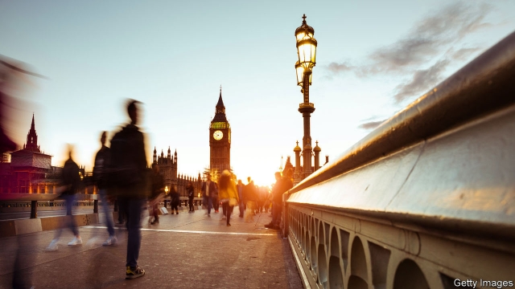

###### Up from the depths

# Love—and strife—in the time of Brexit 

##### Linda Grant’s new novel is an ode to London, and a lament 

 

> Apr 27th 2019 

A Stranger City. By Linda Grant.Virago; 336 pages; £16.99. 

AT THE END of the 19th century much of Europe was transfixed by the body of a woman that was pulled from the river in Paris. L’Inconnue de la Seine became a symbol of inscrutable beauty. Linda Grant’s shimmering new novel opens with an echo of that episode, as a female corpse retrieved from the Thames is buried in east London in 2016. But only Pete, a policeman preoccupied by the case, and Alan, a documentary film-maker, pay their respects. 

“A Stranger City” is not a mystery; its real quarry is not a missing person. In place of a linear plot it follows the London lives of Pete, Alan and Chrissie—an Irish nurse who crossed paths with the dead woman just before her supposed suicide—and others in their orbits. Recovering from cancer, Pete’s wife resolves to escape the teeming city he loves. Alan marries a woman from a Jewish Persian family for whom “life was a perpetual game of snakes and ladders”. People covet and renovate properties, as Londoners do. For Chrissie, life is “a load of obligations to other people and trying to find the good times in them apart from all the boring shite”. Yet when her patients die, she realises as dawn breaks that “they’d missed it for ever now and you were still here with everything in front of you”. 

Collectively these characters run a gauntlet of 21st-century urban horror: terrorism, racist violence, social-media vitriol. A viral video generates an alternative, online version of Chrissie, even as, in the physical world, the drowned woman remains unclaimed. Brexit-era xenophobia crescendoes. From a recognisable post-referendum present (“Aren’t you going home now?” a classmate asks the daughter of Alan’s German neighbours), the references modulate to an imagined sequel of mass deportations and prison ships in the Thames estuary. The meticulous detail of Ms Grant’s observations lends credibility to her dystopian leaps. 

Amid these dramas, the unknown woman comes to seem symbolic, like her French counterpart. As Alan says, “She looked like anyone…a kind of blurred person.” She stands for the anonymity of modern cities and the effacement of identities by the internet—or for a society losing its sense of itself. She is everywoman; it seems almost that she was never truly there. 

Until it turns out that she was a real person after all. Almost in spite of itself, meanwhile, Ms Grant’s book is as much a love letter to London as a lament, an ode to pink skin after sunny days and lost gloves waving from railings. London is indestructible, those German neighbours think: “too absorbed in its own individual business, too intent on getting to work and going shopping and having dates and affairs”. “It was impossible”, Alan reflects, “to tell London’s story; it was too large, too ancient…too contradictory”. Perhaps, but Ms Grant has made a pretty good fist of it. 

-- 

 单词注释:

1.Brexit[]:[网络] 英国退出欧盟 

2.linda[]:n. 琳达（女子名） 

3.ode[әud]:n. 颂诗, 赋 

4.lament[lә'ment]:n. 悲叹, 悔恨, 恸哭, 挽歌, 悼词 vt. 哀悼 vi. 悔恨, 悲叹 

5.APR[]:[计] 替换通路再试器 

6.transfix[træns'fiks]:vt. 刺穿, 使呆住, 使固定 [医] 贯穿, 刺通 

7.de[di:]:[化] 非对映体过量 [医] 铥(69号元素铥的别名,1916年Eder离得的假想元素) 

8.La[lɔ:, lɑ:]:[医] 镧(57号元素) 

9.seine[sein]:n. 曳网, 拖地大网 vt. 用曳网围捕 vi. 用曳网捕鱼 

10.inscrutable[in'skru:tәbl]:a. 难以了解的, 不能预测的 [法] 不可理解的, 不可思议的, 不可测知的 

11.shimmer['ʃimә]:n. 微光, 闪光 vi. 闪烁 vt. 使闪烁 

12.corpse[kɒ:ps]:n. 尸体 [医] 尸体 

13.Thame[]:泰姆（人名） 泰姆市（地名） 

14.Pete[pi:t]:n. 皮特（等于Peter, 男子名） 

15.preoccupy[pri:'ɒkjupai]:vt. 抢先占领, 使全神贯注 

16.alan['ælәn]:n. 艾伦（男子名） 

17.documentary[.dɒkju'mentәri]:n. 记录片 a. 文件的 

18.quarry['kwɒri]:n. 采石场, 方形石, 猎物, 被追求物, 来源 vt. 挖出, 努力挖掘 vi. 费力地找 

19.linear['liniә]:a. 线的, 直线的, 线状的 [计] 线性 

20.teem[ti:m]:vi. 充满, 充足, 倾注 vt. 倒出 

21.Persian['pә:ʃәn]:n. 波斯人, 波斯语 

22.perpetual[pә'petʃuәl]:a. 永久的, 不断的, 无期限的, 没完没了的, 四季开花的 [经] 永远的, 终身的, 持续的 

23.covet['kʌvit]:v. 妄想, 垂涎 

24.renovate['renәuveit]:vt. 更新, 革新, 刷新, 修复, 使恢复活力 

25.Londoner['lʌndәnә]:n. 伦敦人 

26.Chrissie['krisi]:n. <主澳俚>=Christmas  n. <俚>菊花 

27.shite['ʃait]:n. [戏谑语, 委婉语]屎；粪便 

28.collectively[]:adv. 集合, 聚合性, 共同, 集体主义, 集团, 集体 

29.gauntlet['gɒ:ntlit]:n. 铁手套, 长手套, 夹击 [医] 手套形绷带 

30.terrorism['terәrizm]:n. 恐怖主义, 恐怖统治, 恐怖状态 [法] 胁迫, 暴政, 恐怖政治 

31.racist['reisist]:n. 种族主义者 [法] 种族主义的, 种族歧视 

32.vitriol['vitriәl]:n. 硫酸盐, 矾油, 矾, 语言尖刻 vt. 用硫酸处理 

33.viral['vairәl]:a. 病毒的, 病毒引起的 [医] 病毒的 

34.online[]:[计] 联机 

35.unclaimed[.ʌn'kleimd]:a. 无人认领的, 未经要求的, 无人领取的 [经] 没有人来领取的 

36.xenophobia[,zenә'fәubiә]:n. 无端畏惧和憎恨外国人/陌生人, 对外国人的畏惧和憎恨 [医] 生客恐怖 

37.recognisable[]:a. 可辨认的；可认识的；可承认的（=recognizable） 

38.modulate['mɒdjuleit]:vt. 调整, 使转调, 控制 vi. 转调, 调制 

39.sequel['si:kwәl]:n. 继续, 续集, 后果 [计] 结构的英语查询语言 

40.deportation[.di:pɒ:'teiʃәn]:n. 驱逐出境, 放逐 [法] 递解出境, 放逐, 驱逐 

41.estuary['estjuәri]:n. 河口, 港湾 

42.meticulous[mә'tikjulәs]:a. 一丝不苟的, 精确的, 过细的 

43.credibility[.kredi'biliti]:n. 可信用, 确实性, 可靠 [法] 证据能力, 可信程度, 确实性 

44.dystopian[dis'tәjpiәn]:a. 反面乌托邦的,反面假想国的  n. 反面乌托邦的鼓吹者(或描写者) 

45.amid[ә'mid]:prep. 在其间, 在其中 [经] 在...中 

46.symbolic[sim'bɒlik]:a. 象征的, 符号的 [电] 符号化 

47.counterpart['kauntәpɑ:t]:n. 副本, 复本, 配对物, 相应物 [经] 副本, 正副二份中之一 

48.blur[blә:]:vt. 使模糊, 弄脏 vi. 弄脏, 模糊 

49.anonymity[.ænә'nimiti]:n. 匿名, 姓氏不明 [计] 匿名信件 

50.effacement[ɪ'feɪsmənt]:n. 抹消, 抹杀 

51.Everywoman['evri,wjmәn]:n. 曲型女人,普通女人 

52.railing['reiliŋ]:n. 扶手, 栏杆, 抱怨 [电] 高重回率的雷达脉冲排挤 

53.indestructible[.indi'strʌktәbl]:a. 不能破坏的, 不可毁灭的 

54.intent[in'tent]:n. 意图, 含义, 故意 a. 专心的, 决心的, 热心的 

