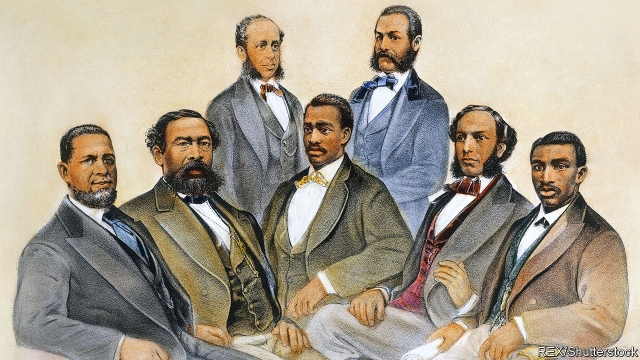

###### A kind of freedom

# The tragic history of civil rights after Reconstruction 

##### In his new book, Henry Louis Gates junior explores the rollback of rights—and the fight back 

 

> Apr 27th 2019 

Stony the Road: Reconstruction, White Supremacy and the Rise of Jim Crow. By Henry Louis Gates junior.Penguin Press; 320 pages; $30 and £25. 

“IN WHAT NEW skin will the old snake come forth?” The abolitionist and former slave Frederick Douglass posed this question in 1865, a month after America’s civil war ended. Slavery was dead. Hopes soared—and were soon dashed. As another great African-American intellectual, W.E.B. Du Bois, put it: “The slave went free; stood a brief moment in the sun; then moved back again toward slavery.” 

The post-war history of civil rights in America was dismal. Reconstruction—in which the North tried to rebuild and reform the South—lasted only a dozen years. It included some triumphs; for example, roughly 2,000 black politicians entered government in the late 19th century. But when Ulysses S. Grant, a racially progressive president, left office in 1877, the North tired of browbeating the South. White supremacy returned in force during a period shockingly known (by some) as “Redemption”. The discrimination and segregation of Jim Crow took hold; black people were oppressed and denied the right to vote. 

“Stony the Road”, the new book by Henry Louis Gates junior, a professor at Harvard, is a concise, powerful account of African-Americans’ efforts to resist the rollback of their rights. It describes the onslaught of degradations they faced and their leaders’ valiant, if flawed, bid to reverse bigoted perceptions, highlighting the role of literature and the arts. It is an important addition to America’s evolving view of its own history. 

The cultural and scientific assault on African-Americans was relentless. They were seen by many whites as subhuman, consigned to inferiority by pseudo-science. Theirs was a “childlike” race (though according to the propaganda, black men were also prone to savagely raping white women). In white literature, blacks were nostalgic for slavery and its supposed protections. A story of 1893 featured a character known as “little Mammy” who “grieved, as she crept down the street, that she had never mounted the auctioneer’s block.” 

Such representations were everywhere, serving the political goal of keeping black Americans out of power—for who would trust a beast or a child to make laws? Mr Gates includes dozens of searing images: cartoons showing black men eyeing white women, “Sambo art” lampooning blacks as imbeciles, and grotesque postcards distributed to celebrate lynchings. 

Well-to-do black people fought back. But so ingrained were the dehumanising stereotypes, all those Mammies and Uncle Toms, that the only solution seemed to be separating themselves from the impoverished masses. Enter the “New Negro”, a term adopted by the black elite of the late 19th century. Whereas the “Old Negro” was “degraded” or “degenerate”, Mr Gates summarises, the New Negro was sober, classy and sophisticated. The rebranding culminated in the Harlem Renaissance (originally known as the New Negro Renaissance), which showcased the talents of the starriest African-Americans. 

From today’s perspective, the glitch is obvious. As Mr Gates writes: “You might say that its own formulation embedded its own critique.” The existence of the New Negro implied the inadequacy of the old. In its own way the strategy adhered to white standards, as some African-Americans observed at the time. In the end, as Mr Gates notes, some of the richest elements of African-American culture—jazz, blues and spirituals—arose from the grassroots, rather than descending from the elite. 

The New Negro was ultimately a “vain attempt to confect positive images of noble black people powerful enough to brace against the maelstrom of excruciating images that the white supremacist imagination had spawned”. But the enterprise still mattered. This was the era in which anti-lynching campaigns began and the NAACP was formed. Eventually, says Mr Gates, such acts of resistance grew into the civil-rights movement of the 1960s, when real and lasting change occurred—a century after Reconstruction. 

Even so, as he laments, the awful imagery of the Redemption period still “drifts like a toxic oil slick” through contemporary culture. Far as America has travelled, the road remains stony. 

-- 

 单词注释:

1.tragic['trædʒik]:a. 悲惨的, 悲剧的 

2.reconstruction[.ri:kәn'strʌkʃәn]:n. 改造, 再建 [医] 改建, 改造, 翻造 

3.henry['henri]:n. 亨利 [医] 亨[利](电感应单位) 

4.louis['lu(:)i, 'lu(:)is]:n. 路易斯（男子名） 

5.rollback['rәulbæk]:n. 回降, 卷回, 推回去 [电] 滚返 

6.APR[]:[计] 替换通路再试器 

7.supremacy[sju'premәsi]:n. 至高无上, 霸权地位, 优势, 至上 [法] 至高权力, 无上权力, 霸权 

8.jim[dʒim]:n. 吉姆（人名） 

9.abolitionist[.æbәu'liʃәnist]:n. 废除主义者, 废奴主义者 

10.frederick[]:n. 弗雷德里克（男子名） 

11.douglas['dʌ^lәs]:n. 道格拉斯（男子名）；道格拉斯（英国马恩岛首府） 

12.bois[bwɑ:]:n. 木香, 本香 

13.dismal['dizmәl]:a. 阴沉的, 凄凉的, 令人忧郁的 n. 低落的情绪, 沼泽 

14.ulysses[ju(:)'lisi:z]:n. 尤里西斯（希腊神话中男子名, 也是爱尔兰意识流文学作家詹姆斯·乔伊斯小说名） 

15.S[es]:[计] 标量, 服务员, 符号, 堆栈, 状态, 存储器, 开关, 同步, 系统 [医] 硫[黄](16号元素); 半; 骶骨的; 标记, 用法签; 光滑; 左的; 上转 

16.racially['reiʃәli]:adv. 按人种, 人种上 

17.browbeat['brajbi:t]:vt. 对...吹胡子瞪眼睛, 吓唬 

18.supremacy[sju'premәsi]:n. 至高无上, 霸权地位, 优势, 至上 [法] 至高权力, 无上权力, 霸权 

19.shockingly[]:adv. 令人震惊地, 极糟地, 极度地, 极厉害地 

20.redemption[ri'dempʃәn]:n. 赎回, 赎身, 偿还, 拯救 [经] 偿还, 买回, 赎回 

21.segregation[.segri'geiʃәn]:n. 隔离, 偏析, 被隔离的部分, 种族隔离 [化] 分离; 分凝; 离析; 偏析; 分聚 

22.Harvard['hɑ:vәd]:n. 哈佛大学 

23.concise[kәn'sais]:a. 简洁的, 简明的 

24.onslaught['ɒnslɒ:t]:n. 突击, 猛击, 猛攻 

25.degradation[.degrә'deiʃәn]:n. 降格, 堕落, 退化 [计] 降级 

26.valiant['væljәnt]:a. 英勇的 n. 勇敢的人 

27.flaw[flɒ:]:n. 缺点, 裂纹, 瑕疵, 一阵狂风 [化] 划痕; 裂缝; 裂纹 

28.bigoted['bigәtid]:a. 盲从的, 固执己见的, 执迷的, 顽固的 

29.perception[pә'sepʃәn]:n. 知觉, 感觉, 领悟力, 获取 [医] 知觉 

30.cultural['kʌltʃәrәl]:a. 文化的, 教养的, 修养的 [医] 培养的 

31.assault[ә'sɒ:t]:n. 攻击, 袭击 vt. 袭击, 攻击 vi. 发动攻击 

32.relentless[ri'lentlis]:a. 无情的, 冷酷的, 残酷的 

33.subhuman[.sʌb'hju:mәn]:a. 近似人类的, 类人的 

34.consign[kәn'sain]:vt. 交付, 储蓄, 委托, 寄存 [经] 托卖, 寄存, 寄销 

35.inferiority[in.fiәri'ɒriti]:n. 自卑, 次等 [医] 下位, 下级, 次级, 劣等 

36.childlike['tʃaillaik]:a. 孩子似的, 天真烂漫的 

37.propaganda[.prɒpә'gændә]:n. 宣传, 宣传活动 [医] 宣传 

38.prone[prәun]:a. 俯伏的, 面向下的, 有...倾向的 [医] 旋前的, 伏的, 俯的 

39.savagely[]:adv. 野蛮地；残忍地 

40.rape[reip]:n. 抢夺, 掠夺, 强奸, 葡萄渣, 芸苔 vt. 掠夺, 抢夺, 强奸 

41.nostalgic[nɒs'tældʒik]:a. 乡愁的, 怀旧的 [医] 怀乡病的 

42.mammy['mæmi]:n. 妈妈, 保姆 

43.representation[.reprizen'teiʃәn]:n. 表示法, 表现, 陈述, 代表 [计] 表示法指定 

44.searing['siәriŋ]:a. 灼热的 

45.sambo['sæmbәu]:[拉丁美洲]黑人与印第安人或欧洲人的混血儿 

46.lampoon[læm'pu:n]:n. 讽刺文 vt. 讽刺 

47.imbecile['imbisi:l]:a. 低能的, 愚钝的, 虚弱的 n. 低能者, 痴呆, 蠢人 

48.grotesque[grәu'tesk]:n. 奇异风格, 怪异图案 a. 奇怪的, 可笑的 

49.lynching['lintʃiŋ]:n. 处私刑杀害 [法] 私刑, 私刑处死 

50.ingrain[in'grein]:vt. 给原纱染色, 使根深蒂固 a. 原纱染色的, 根深蒂固的 n. 原纱染色, 固有品质 

51.dehumanise[di:'hjʊmənaɪz]:vt. 使失去人性, 使非人化 

52.stereotype['stiәriәtaip]:n. 铅版, 陈规, 老套 vt. 使用铅版, 把...印制成盲文, 套用老套, 使一成不变 

53.mammy['mæmi]:n. 妈妈, 保姆 

54.tom[tɒm]:n. 雄性动物, 雄猫 

55.impoverish[im'pɒvәriʃ]:vt. 使贫穷, 耗尽...的力气 

56.elite[ei'li:t]:n. 精华, 精锐, 中坚分子 

57.degrade[di'greid]:v. (使)降级, (使)退化 

58.degenerate[di'dʒenәreit]:a. 堕落的 vi. 退化, 堕落 vt. 使变质, 使退化 

59.summarise['sʌmәraiz]:vt. 概括, 总结, 摘要, 概述 

60.classy['klɑ:si]:a. 上等的, 优等的, 漂亮的 

61.sophisticate[sә'fistikeit]:n. 久经世故的人, 精于...之道的人 vt. 篡改, 曲解, 使变得世故, 掺合, 弄复杂 vi. 诡辩 

62.rebranding[ˌri:'brændɪŋ]:n. 重新包装；重塑形象 

63.culminate['kʌlmineit]:vi. 到绝顶, 达于极点, 达到高潮 vt. 使到绝顶, 使达到高潮 

64.Harlem['hɑ:lәm]:n. 哈莱姆(纽约一地区) 

65.renaissance[ri'neisәns]:n. 复活, 复兴, 文艺复兴 a. 文艺复兴的 

66.originally[ә'ridʒәnli]:adv. 本来, 原来, 最初, 就起源而论, 独创地 

67.showcase['ʃәukeis]:n. 陈列橱 [经] 商品陈列所, 货物陈列架 

68.starry['stɑ:ri]:a. 星光照耀的, 多星的, 星形的, 明亮的 

69.glitch[^litʃ]:[计] 假信号 

70.formulation[.fɒ:mju'leiʃәn]:n. 系统陈述, 公式化, 配制 [化] 表述; 数学表述; 数式化; 数学表述 

71.embed[im'bed]:vt. 使插入, 使嵌入, 使深留脑中 [计] 嵌入 

72.critique[kri'ti:k]:n. 评论文章, 评论 

73.inadequacy[in'ædikwәsi]:n. 不适当, 不足之处, 不充分 [医] 机能不全, 闭锁不全, 关闭不全 

74.grassroot[]:n. 草根 

75.confect[kәn'fekt]:n. 蜜饯, 糖果 vt. 调制, 混合 

76.brace[breis]:n. 支柱, 曲柄, 支撑, 一对 vt. 紧缚, 支撑, 激励 vi. 打起精神 [计] 花括号 

77.maelstrom['meilstrәm]:n. 大漩涡, 极度混乱 

78.excruciate[iks'kru:ʃieit]:vt. 施酷刑, 拷问, 使苦恼, 折磨 

79.supremacist[sә'premәsist, sju-]:n. 至上主义者 

80.spawn[spɒ:n]:n. (鱼)卵, 产物 vt. 产卵, 酿成, 大量生产 vi. 产卵, 大量生产 

81.NAACP[,en dʌbəl ,ei si: 'pi:]:abbr. 全国有色人种协进会（National Association for the Advancement of Colored People） 

82.lament[lә'ment]:n. 悲叹, 悔恨, 恸哭, 挽歌, 悼词 vt. 哀悼 vi. 悔恨, 悲叹 

83.imagery['imidʒәri]:n. 肖像, 比喻, 雕刻 [化] 成像 

84.toxic['tɒksik]:a. 有毒的, 中毒的 [医] 中毒的, 毒物的 

85.slick[slik]:a. 光滑的, 熟练的, 聪明的, 华而不实的, 老套的, 陈腐的 adv. 灵活地, 聪明地 vt. 使光滑, 使漂亮 vi. 打扮整洁 n. 光滑平面, 平滑器, 修光工具 

