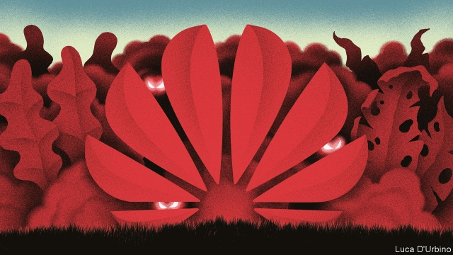
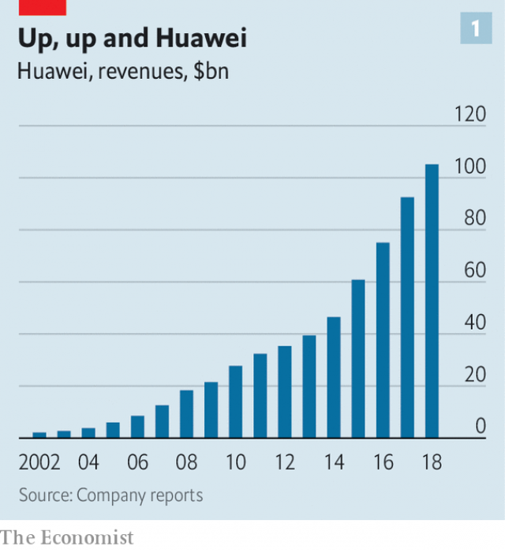
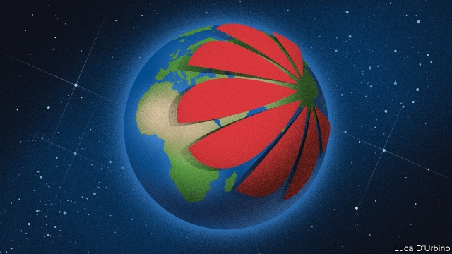
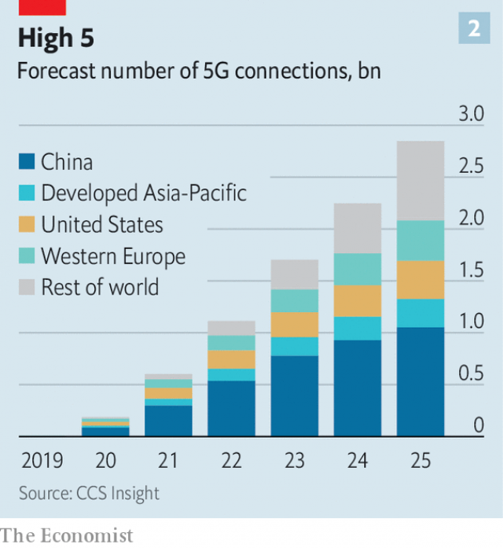

###### Communication breakdown

# Huawei is at the centre of political controversy 

##### The West’s treatment varies between wariness to outright hostility 

 

> Apr 27th 2019 

IT IS HARD to think of a better reflection of the rise of China than the rise of Huawei. Like China, the firm, which was founded in 1987, began at the bottom of the value chain, reselling telephone-switching gear imported from Hong Kong. Also like China, it was not content to stay there. These days its products—from smartphones to solar panels—are sleek, high-tech and competitive with anything its rivals can produce. As a result its revenues have soared, hitting $105bn in 2018 (see chart 1). Huawei, and its mother country, have become technological pacesetters in their own right. The firm employs 80,000 people in research and development alone. China filed 53,345 patents in 2018, a hair behind America’s 56,142. Of China’s, around one in ten came from Huawei alone. 

Huawei’s ascent, like that of China, has caused a good deal of worry elsewhere in the world. Three decades on, the firm is still in the telecoms-equipment business. Along with Nokia, a Finnish firm, and Ericsson, a Swedish one, Huawei has become one of the world’s biggest suppliers of the high-tech kit used to build mobile-phone networks around the world. Of the three, Huawei has been the most active in setting the technical standards for “fifth-generation” (5G) networks. These promise big increases in speed and capacity that will improve some existing technologies, such as connected cars, and make possible new ones, including the sensor networks that will supposedly enable “smart cities”. Huawei and China therefore sit at the heart of technologies which governments worldwide have come to regard as a critical piece of future national infrastructure. 

That is the context in which to see a decision by Britain, leaked to the press on April 24th, to grant Huawei a limited role in building its 5G networks. It was taken in the teeth of a determined American campaign to persuade its allies to freeze the company out. Mike Pence, America’s vice-president, and other officials have warned publicly that Huawei’s gear could contain “back doors”—malicious code designed to let Chinese spies snoop on communications, or even bring down networks altogether. 

 

Mike Pompeo, America’s secretary of state, has threatened to withhold intelligence co-operation from anyone who uses the firm’s gear in “critical” networks. Australia, like Britain one of America’s allies in the “Five Eyes” electronic-spying pact, has banned the firm explicitly. New Zealand, another member, has rebuffed a request from a local firm to use Huawei’s kit. Japan—which is not in the club, but is closely allied to America—has tightened its rules. 

America’s stance may seem sensible given China’s history of electronic espionage. The country is a prodigious hacker. It has purloined everything from the plans for the F-35, an advanced fighter jet, to a database of millions of American civil servants. It has been accused of hacking India’s Ministry of Defence. Britain and America say it has conducted a “vast” and “unrelenting” campaign targeting dozens of Western companies and government agencies. Last year CrowdStrike, a cyber-security firm, put China ahead of Russia as the most prolific sponsor of cyber-attacks against the West. 

Yet Britain has long argued that such threats can be managed without banning Huawei outright. Its most recent decision reaffirms that stance. But it is not the only refusenik. Germany, another of America’s close allies, has resisted an outright ban. India is thought to be open to letting the firm in, albeit with limitations. In February Nick Read, the boss of Vodafone, one of the world’s biggest telecoms firms, challenged the Americans to provide concrete evidence of foul play. He warned that shutting out Huawei would be “very, very expensive” and could delay the deployment of 5G networks by years. Kester Mann of CCS Insight, a consulting firm, says that the company’s gear is up to a year ahead of the products manufactured by its rivals, as well as being cheaper. 

Britain’s stance matters more than the middling size of its telecoms market suggests. The country’s signals-intelligence agency, GCHQ, is the biggest in the Five Eyes after America’s National Security Agency (NSA), with which it works hand-in-glove. And few countries know more about how Huawei operates. Britain was one of the firm’s first beachheads in the West. In 2005 Huawei was chosen by BT, a formerly state-owned telecoms company, to be part of a £10bn ($18bn) contract to modernise Britain’s phone network. Even then, security types regarded Huawei with suspicion. But civil servants did not tell ministers about the firm’s involvement until after the contract had been signed. 

In an act later described by MPs as trying to “shut the stable door after the horse has bolted”, Britain set up a lab, paid for by Huawei but run by the British, which would go over its kit and software with a fine-tooth comb, looking for anything untoward. The Huawei Cyber Security Evaluation Centre (HCSEC) has been running since 2010. That lab, say British spooks, has provided unparalleled insight into both Huawei’s products and its corporate culture. It has proved useful for Huawei, too, enabling it to point out that its equipment has survived repeated and intrusive checks by a country with one of the most capable electronic-intelligence agencies in the West. 

Huawei has flatly and repeatedly denied that it inserts back doors. Vincent Pang, a senior manager, said in December that the firm has strong incentives not to spy on its customers. If a back door were ever discovered, he said, “it would destroy our markets.” And in eight years of looking, Britain’s spies say they have never found one. That does not placate critics, who argue that, even if there are no back doors now, there might be in future, perhaps provided through the regular patches or updates that will be required for the huge amounts of code that a 5G network relies on. Huawei’s commercial self-interest is irrelevant, they say, pointing to a Chinese law that compels private firms to assist the intelligence services when asked. 

Back doors may be bad for business, but they are not unknown. Leaks from Edward Snowden, a former worker at the NSA, seemed to confirm suspicions that it had tried to put a back door into a cryptographic standard proposed in 2006, which could have given America’s spies the ability to read communications that made use of it. Juniper, an American maker of network routers, announced in 2015 that it had found “unauthorised code” in its products that could have led to communications being monitored. Suspicion once again fell on the NSA. 

Huawei has used such stories to resist American pressure. In February Guo Ping, one of the firm’s three rotating chairmen, accused America of attacking it because the spread of its technology was hampering America’s spying. Mr Ping did not mention China’s efforts at electronic snooping. In 2018, for instance, newspaper reports alleged that China had been siphoning off sensitive data from computer networks at the African Union’s headquarters in Addis Ababa. The building had been paid for by China and built by a Chinese firm. (China’s foreign ministry denied the reports.) 

But there is more to worry about than back doors and here Britain’s findings have been less reassuring. In the HCSEC’s most recent report, published in March, it suggests that the code in Huawei’s products is a buggy, spaghettified mess. That may not sound sinister. But bugs can be as useful to hackers as any back door. “Why bother going to all the trouble of putting in a back door when you can just look for [accidental] vulnerabilities like everyone else?” asks Jon Crowcroft, a computer scientist at the University of Cambridge. 

Russia’s prowess in cyber-attacks demonstrates the point. It has no big hardware firms to lean on to provide back doors. That has not stopped its hackers from attacking Ukraine’s power grids or stealing emails from American politicians. In February Ciaran Martin, head of the National Cyber Security Centre (NCSC), an arm of GCHQ, said that his agency had dealt with about 1,200 “significant cyber-security incidents” since it was set up in 2016. State-sponsored back doors had been a factor in none of them. 

Bugs infest every piece of complex software but seem more common in Huawei’s gear than in competitors’ products. Evidence of Huawei’s lax attitude is everywhere, with thousands of snippets of unsafe code. One piece of kit, says the HCSEC, used in mobile-phone base stations, contained 70 copies of four different versions of OpenSSL, a widely used set of cryptographic protocols designed to secure data travelling over networks. Researchers frequently find security flaws in OpenSSL, meaning that sticking to the newest versions is vital. Huawei’s kit, it seems, is at risk from hackers of all kinds, not just Chinese state-sponsored ones. Insiders blame this sloppiness at least partly on the same commercial agility that has made Huawei so popular among its customers for its speedy introduction of new products. 

Huawei has promised to do better. In November, in response to criticism from the HCSEC, it announced a $2bn overhaul of its software-development practices. David Wang, an executive at Huawei, reiterated that pledge after the latest round of brickbats, but said it would take three to five years. The HCSEC takes a less rosy view, saying that “no material progress” had been made in fixing such issues since they were last raised a year ago. Worse, it says it has not seen anything to give it confidence that Huawei could meet the necessary standards, especially since similar promises made in 2012 appear to have led nowhere. 

That alone might be enough to persuade countries that Huawei’s products are best left on the shelf. But there is one final complicating factor, says Rahim Tafazolli, who runs the 5G Innovation Centre at the University of Surrey. Gear from Huawei’s rivals has bugs, too, even if they are less common. Last year, for instance, faulty software in equipment made by Ericsson caused a day-long interruption in phone networks belonging to O2, a British operator, and SoftBank, a Japanese one. Among the best ways of limiting the damage that bugs—or hackers—can cause, says Mr Tafazolli, is to build resilient networks. And a way to do that is to use equipment from rival suppliers, so that a problem in one manufacturer’s devices does not bring down the entire network. But given the concentration in the market, any network keen on diversity will find it hard to avoid Huawei’s products. 

 

British cyber-security officials say it is possible to finesse all these worries. One measure is to exclude Huawei from government networks. Another is to use it for less sensitive equipment at the edge of networks, such as transmission equipment, but not the more sensitive data-processing “core”. That is harder to do with 5G networks, in which more data-crunching happens closer to the network’s periphery, to boost speed. But monitoring of network activity can help flag anything suspicious, as can healthy scepticism about Huawei’s reassurances. Ian Levy, the NCSC’s technical director, has said it operates on the assumption that China does indeed attempt cyber-attacks against Britain and that its government can compel any Chinese firm, including Huawei, to do whatever it wants. 

Britain’s experiences, and its willingness to make its conclusions public, are likely to influence other nations’ decisions about how to handle Huawei, particularly in the absence of anything similarly concrete from the Americans. But Huawei faces other pressures, too. In December Meng Wanzhou, the firm’s chief financial officer and daughter of its founder, Ren Zhengfei, was arrested in Canada at the behest of the Americans. She faces extradition on charges that she—and Huawei—conspired to dodge American sanctions on Iran. The firm is also accused of trying to steal trade secrets from T-Mobile, an American subsidiary of Deutsche Telekom. 

The theft charges are small beer. They centre on a robot called “Tappy”, designed to test smartphone screens. The sanctions-busting case, though, could have serious repercussions. ZTE, another Chinese technology firm, was convicted on similar charges in 2017. When it became clear in 2018 that ZTE was trying to dodge its punishments, officials banned American firms from doing business with it. The effects were catastrophic. ZTE relies on technology from American firms such as Qualcomm, a chipmaker, and Google, which develops Android, a smartphone operating system. ZTE was forced to stop production and its shares were suspended. Bankruptcy was averted only when Donald Trump, America’s president, agreed to lift the ban as a “favour” to Xi Jinping, his Chinese counterpart. American lawmakers have called for similarly tough sanctions should Huawei be found guilty. 

Cyber-security, sanctions-busting and Tappy are, in turn, only parts of an argument that is fundamentally about the relationship between technology and geopolitics, says Janice Stein at the University of Toronto. America, the incumbent superpower, is under no illusions about the relationship between technology and power, of both the hard and soft sort. Neither is China, which aspires to the same status. Huawei is widely seen as a Chinese national champion. It is an important part of “Made in China 2025”, a programme designed to boost China’s abilities in many different fields of technology. 

 

Seeing the arguments through a geopolitical lens throws up interesting questions, says James Lewis at the Centre for Strategic & International Studies, in Washington, DC. One is the effect of sloppy coding, which cuts both ways. If installing Huawei’s buggy gear is a security risk for the West, then it is a security risk for China, too, which is forecast to lead the world in 5G deployments (see chart 2). The West, after all, has hackers of its own, as do China’s neighbours, such as India and Russia. “I would guess that the dozen or so countries with strong sigint [electronic espionage] capabilities jump for joy when they hear someone else is installing Huawei’s stuff,” says Mr Lewis. 

He also thinks Western countries, as a counterbalance to Huawei and other Chinese tech firms, should consider whether domestic firms that provide digital infrastructure should be designated as strategically important, as arms-makers and steel firms often are. America has already blocked deals on grounds of national security, some tenuous. A planned $117bn takeover of Qualcomm, for instance, was blocked because the buyer, Broadcom, despite a heavy presence in America, was domiciled in Singapore. (It has since moved back to Delaware.) 

These discussions will become more urgent as the world grows increasingly computerised, says Ms Stein. The electronics that power connected cars are assembled in China, as are those that sit inside smart medical devices and energy meters, and in the financial networks over which the world’s banks transact. Lawmakers are already beginning to make the connections. American politicians have started agitating about whether Huawei’s solar panels pose a risk to the country’s electricity grid. 

Weighing all these arguments is difficult even for cyber-security experts, says Mr Crowcroft. One reason is that the modern mix of superpower rivalry, globalisation and high-tech societies is unprecedented. In the cold war, trade across the Iron Curtain was minimal. These days America and China square off atop planet-spanning supply chains that blur the distinction between “Western” and “Chinese” companies. Chinese firms rely on Western technology in their products; Western ones rely on Chinese parts and factories to assemble them. Even the risks are hard to evaluate. Nobody is quite sure just how much cyber-havoc could be caused by a determined nation state, says Mr Crowcroft, largely because there has yet to be a full-scale war between high-tech powers. 

While this debate rages in the West, Huawei goes from strength to strength. The firm says it has signed 40 different 5G contracts, more than any of its rivals. It already has a big presence in Africa, Asia and South America. Huawei will see Britain’s approval, however qualified and half-hearted, as another feather in its cap. For all its flaws, the firm—and, therefore, China—will end up building a great deal of the infrastructure on which the world will increasingly depend. 

-- 

 单词注释:

1.breakdown['breikdaun]:n. 崩溃, 故障 [化] 事故; 击穿 

2.huawei[]: 华为 

3.controversy['kɒntrәvә:si]:n. 论争, 辩论, 论战, 争论 [法] 论战, 争论, 争吵 

4.wariness['wєәrinis]:n. 谨慎, 注意, 小心 

5.outright['autrait]:a. 率直的, 完全的, 总共的, 直率的 adv. 完全地, 率直地, 立刻地, 一直向前 

6.hostility[hɒs'tiliti]:n. 敌意, 敌对, 反对 

7.APR[]:[计] 替换通路再试器 

8.resell[ri:'sel]:vt. 再卖, 转售 [经] 转卖, 再卖 

9.hong[hɔŋ]:n. （中国、日本的）行, 商行 

10.kong[kɔŋ]:n. 含锡砾石下的无矿基岩；钢 

11.smartphones[]: 智能手机（smartphone的复数） 

12.sleek[sli:k]:a. 光滑的, 油嘴滑舌的, 线条明快的, 圆滑的, 时髦的 vt. 使光滑, 掩盖 vi. 打扮漂亮, 滑动 

13.soar[sɒ:]:n. 高扬, 翱翔 vi. 往上飞舞, 高耸, 翱翔 

14.technological[.teknә'lɒdʒikl]:a. 技术的 [经] 工艺的, 技术的 

15.pacesetter[]:n. 定速度者, 榜样, 标兵, 模范 

16.ascent[ә'sent]:n. 上升, 提高, 攀登, 上坡路 

17.nokia[]:n. 诺基亚（财富500强公司之一） 

18.Finnish['finiʃ]:n. 芬兰语 a. 芬兰的, 芬兰人的, 芬兰语的 

19.ericsson[]:n. 爱立信公司 

20.Swedish['swi:diʃ]:n. 瑞典人, 瑞典语 a. 瑞典的, 瑞典人的, 瑞典语的 

21.supplier[sә'plaiә]:n. 供应者, 供给国, 供应商 [化] 承制厂; 供应厂商 

22.kit[kit]:n. 装备, 工具箱, 成套工具 [计] 成套部件; 成套零件 

23.sensor['sensә]:n. 传感器 [计] 检测器 

24.supposedly[sә'pәuzidli]:adv. 想象上, 看上去像, 被认为是, 恐怕, 按照推测 

25.infrastructure['infrәstrʌktʃә]:n. 基础结构, 基础设施 [经] 基础设施 

26.context['kɒntekst]:n. 上下文, 背景, 来龙去脉 n. 上下文 [计] 上下文 

27.ally['ælai. ә'lai]:n. 同盟者, 同盟国, 助手 vt. 使联盟, 使联合, 使有关系 vi. 结盟 

28.mike[maik]:vi. 偷懒, 游手好闲 n. 休息, 游手好闲, 扩音器, 话筒 

29.snoop[snu:p]:vi. 调查, 窥探 n. 窥视行为, 爱管闲事的人, 私家侦探 

30.pompeo[]:n. (Pompeo)人名；(意)蓬佩奥 

31.withhold[wið'hәuld]:vt. 使停止, 扣留, 保留, 拒给 vi. 克制, 忍住 

32.pact[pækt]:n. 契约, 协定, 条约 [化] 合同 

33.explicitly[]:adv. 明确地；明白地 

34.zealand['zi:lәnd]:n. 西兰岛（丹麦最大的岛） 

35.rebuff[ri'bʌf]:n. 断然拒绝, 严厉拒绝, 漠不关心 vt. 严厉拒绝 

36.tighten['taitn]:vt. 勒紧, 使变紧 vi. 变紧, 绷紧 

37.stance[stæns]:n. 准备击球姿势, 站立的姿势, 位置, 姿态 [经] 地位, 形势 

38.espionage[.espiә'nɑ:ʒ]:n. 间谍活动 [法] 间谍活动, 刺探, 间谍 

39.prodigious[prәu'didʒәs]:a. 庞大的, 惊人的, 异常的 

40.hacker['hækә]:[计] 计算机窃贼, 计算机新技术挑战者, 黑客 

41.purloin[pә:'lɒin]:v. 偷窃, 盗取 

42.hack[hæk]:n. 劈, 砍, 砍痕, 出租车, 干咳, 晒架, 鹤嘴锄 vt. 劈, 砍, 出租, 用旧 vi. 劈, 砍, 干咳, 驾驶出租车 a. 出租的 

43.unrelenting[.ʌnri'lentiŋ]:a. 不怜悯的, 无情的, 冷酷的 

44.prolific[prәu'lifik]:a. 有生殖力的, 多产的, 丰富的 [医] 多育的, 多产的, 繁殖的 

45.reaffirm[.ri:ә'fә:m]:vt. 重申, 再确认 

46.refusenik[rɪˈfju:znɪk]:n. 被拒绝移民者 

47.albeit[ɔ:l'bi:it]:conj. 尽管, 虽然 

48.nick[nik]:n. 刻痕, 缺口, 划痕 vt. 刻痕于, 弄缺, 擦伤 vi. 狙击 

49.vodafone[]:n. 沃达丰（英国电信企业） 

50.telecom['telәkɔm]:telecommunication 电信 

51.foul[faul]:a. 污秽的, 邪恶的, 恶臭的, 肮脏的, 恶劣的, 淤塞的 vt. 弄脏, 妨害, 污蔑, 犯规, 淤塞 vi. 腐烂, 犯规, 缠结 adv. 违反规则地, 不正当地 n. 犯规, 缠绕 

52.deployment[]:[计] 展开 

53.kester[]:凯斯特（人名） 

54.mann[mæn]:n. 曼（姓氏）；曼恩法案（美国国会1910年6月通过的一项法案, 禁止州与州之间贩运妇女） 

55.CC[]:复写本 [计] 中央计算机, 中央控制台, 通道命令, 通信中心, 条件码, 循环检验, 抄送 

56.middling['midliŋ]:a. 中等的, 普通的, 平凡的 adv. 中等 

57.GCHQ[]:abbr. Government Communications Headquarters 国家通信总局( 

58.nsa[]:abbr. 美国国家安全局（National Security Agency）；美国国家标准协会（National Standards Association） 

59.beachhead['bi:tʃhed]:n. 滩头堡 

60.bt[]:abbr. 英国电信（British Telecom） 

61.formerly['fɒ:mәli]:adv. 从前, 以前 

62.modernise['mɔdәnaiz]:vt.vi. (使)现代化, (使)适应现代需要 vi. 用现代方法 

63.involvement[in'vɔlvmәnt]:n. 卷入, 牵连, 包含, 困窘 [经] 财政困难, 经济上的困窘 

64.MP[]:国会议员, 下院议员 [计] 宏处理程序, 维护程序, 线性规划, 微程序, 多处理器 

65.untoward[ʌn'tәuәd]:a. 事与愿违的, 麻烦的, 困难的, 不幸的 

66.cyber['saibә]:a. 网络的, 计算机的 

67.evaluation[i.vælju'eiʃәn]:n. 评估, 估价, 求值 [计] 鉴定; 评价; 求值 

68.spook[spu:k]:n. 幽灵, 鬼 vt. 惊吓, 鬼怪般地出没 vi. 惊吓而逃窜, 受惊 

69.unparalleled[.ʌn'pærәleld]:a. 无比的, 无双的, 空前的 

70.corporate['kɒ:pәrit]:a. 社团的, 合伙的, 公司的 [经] 团体的, 法人的, 社团的 

71.intrusive[in'tru:siv]:a. 打扰的, 插入的 [法] 闯入的, 侵入的, 干涉的 

72.flatly['flætli]:adv. 枯燥无味地, 完全地, 直截了当地, 毅然地, 断然地 

73.Vincent['vinsәnt]:n. 文森特（男名） 

74.pang[pæŋ]:n. 剧痛, 悲痛, 苦闷 vt. 使剧痛, 折磨 

75.incentive[in'sentiv]:n. 动机 a. 激励的 

76.placate[plә'keit]:vt. 抚慰, 平息, 使和解, 怀柔 

77.update[ʌp'deit]:vt. 更新, 使现代化 n. 更新 [计] 更新 

78.irrelevant[i'relәvәnt]:a. 不恰当的, 无关系的, 不相干的 [法] 无关的, 不相干的, 离题的 

79.edward['edwәd]:n. 爱德华（男子名） 

80.Snowden['snәudn]:斯诺登(姓氏) 

81.cryptographic[kriptә'græfik]:a. 关于暗号的, 用密码写的 

82.juniper['dʒu:nipә]:n. 杜松属 [医] 杜松[实] 

83.maker['meikә]:n. 制造者, 上帝 [经] 制造者, 出票人 

84.router['ru:tә(r), 'raj-]:[计] 路由器 

85.unauthorised[ʌn'ɔ:θəraizd]:a. 无权的（等于unauthorized） 

86.guo[]:abbr. 仅供政府使用（Government Use Only） 

87.ping[piŋ]:n. 砰(子弹击中时的声音), 报时的最后一声, 声脉冲 vi. 砰(铛)地发声 [计] internet网络包测程序, 连通性检测命令 

88.hamper['hæpә]:n. 食篮, 阻碍物, 食盒 vt. 阻碍, 使困累, 妨碍, 牵制 

89.allege[ә'ledʒ]:vt. 宣称, 主张, 提出, 断言 [法] 断言, 指称, 指证 

90.siphon['saifәn]:n. 虹吸管 vt. 用虹吸管吸出, 抽取 vi. 通过虹吸管 

91.datum['deitәm]:n. 论据, 材料, 资料, 已知数 [医] 材料, 资料, 论据 

92.headquarter[,hed'kwɔ:tә]:vt. 将...的总部设在 

93.addis['ædis]:n. 艾缔思（姓氏） 

94.Ababa[]:n. (Ababa)人名；(塞)阿巴巴 

95.les[lei]:abbr. 发射脱离系统（Launch Escape System） 

96.reassure[.ri:ә'ʃuә]:vt. 使...安心, 向...再保证 [法] 重新保证, 再保险, 使清除疑虑 

97.buggy['bʌgi]:a. 多虫的 n. 双轮单座轻马车, 四轮单座马车 

98.spaghettified[]:[网络] 意粉 

99.sinister['sinistә]:a. 不吉利的, 凶恶的, 左边的 [医] 左的 

100.bug[bʌg]:n. 错误, 虫, 病菌, 缺陷, 窃听器, 癖好, 防盗报警器, 双座小汽车, 要人 vt. 装防盗报警器, 装窃听器, 激怒 vi. 捉虫, 暴突 [计] 缺点, 错误 

101.bother['bɒðә]:vt. 烦扰, 迷惑 vi. 烦恼, 操心 n. 麻烦, 纠纷, 讨厌的人 

102.vulnerability[.vʌlnәrә'biliti]:n. 易受伤, 易受责难, 易受伤部位 [医] 易损性 

103.jon[dʒɔn]:n. 乔恩（男子名） 

104.Cambridge['keimbridʒ]:n. 剑桥 

105.prowess['prauis]:n. 英勇, 勇敢, 超凡技术 

106.grid[grid]:n. 格子, 栅格 [计] 网格 

107.Ciaran[]:n. (Ciaran)人名；(英、西)夏兰 

108.Martin['mɑ:tin]:n. 马丁, 圣马丁鸟 

109.NCSC[]:[计] 美国国家计算机安全中心 

110.infest[in'fest]:vt. 骚扰, 寄生于, 大批出没 [医] 传染, 感染 

111.lax[læks]:a. 松的, 不严格的, 腹泻的, 松弛的 n. 腹泻, 松元音 

112.snippet['snipit]:n. 小片, 片断, 摘录 

113.OpenSSL[]:为网络通信提供安全及数据完整性的一种安全协议 

114.protocol['prәutәkɒl]:n. 草案, 礼仪, 协议 v. 拟定 [计] 协议, 协议列表实用程序 

115.flaw[flɒ:]:n. 缺点, 裂纹, 瑕疵, 一阵狂风 [化] 划痕; 裂缝; 裂纹 

116.insider['in'saidә]:n. 内部的人, 权威人士, 知道内情的人 [经] 熟悉内情者 

117.sloppiness[]:n. 凌乱；马虎 

118.agility[ә'dʒiliti]:n. 敏捷, 灵活, 机敏 

119.speedy['spi:di]:a. 快的, 迅速的 [经] 快的, 迅速的 

120.overhaul[.әuvә'hɒ:l]:vt. 分解检查, 翻修, 精细检查, 彻底革新 n. 分解检查, 精细检查, 大检修 

121.david['deivid]:n. 大卫；戴维（男子名） 

122.wang[]:n. 王（姓氏）；王安电脑公司 

123.reiterate[ri:'itәreit]:vt. 反复地说, 重申, 反复地做 [法] 重述, 重申, 反覆地做 

124.pledge[pledʒ]:n. 诺言, 保证, 誓言, 抵押, 信物, 保人, 祝愿 vt. 许诺, 保证, 使发誓, 抵押, 典当, 举杯祝...健康 

125.brickbat['brikbæt]:n. 碎砖, 砖片, 侮辱 

126.rosy['rәuzi]:a. 蔷薇色的, 玫瑰红色的 

127.rahim[]:n. 拉希姆（姓；男子名） 

128.innovation[.inәu'veiʃәn]:n. 改革, 创新 [法] 创新, 改革, 刷新 

129.surrey['sʌri]:n. 四轮双座轻便游览马车 

130.softbank['sɒftbæŋk]: 日本最大的软件销售商 

131.resilient[ri'ziliәnt]:a. 弹回的, 有弹力的 [医] 回弹的, 回能的 

132.diversity[dai'vә:siti]:n. 差异, 多样性 [化] 多样性 

133.finesse[fi'nes]:n. 策略, 手段, (桥牌中的)飞牌 v. 用计谋处理, 出小牌 

134.periphery[pә'rifәri]:n. 外围, 边缘地区, 圆周 [医] 外周, 周围 

135.scepticism['skeptisizm]:n. 怀疑论, 怀疑主义 [医] 多疑癖 

136.reassurance[.ri:ә'ʃurәns]:n. 安心, 放心, 再保证 

137.ian[iәn]:n. 伊恩（男子名） 

138.levy['levi]:n. 税款, 所征的人数, 征收 vi. 征税, 课税 vt. 征收, 强求, 召集 

139.meng[]:abbr. 工程硕士（Master of Engineering） 

140.Wanzhou[]:万州 

141.founder['faundә]:n. 创立者, 建立者 vt. 使沉没, 使摔倒, 弄跛, 浸水, 破坏 vi. 沉没, 摔到, 变跛, 倒塌, 失败 

142.REN[]:[计] DOS内部命令:更改文件名 [医] 肾 

143.Zhengfei[]:[网络] 钟晓东 

144.behest[bi'hest]:n. 命令 

145.extradition[.ekstrә'diʃәn]:n. 引渡逃犯, 亡命者送还本国 [法] 引渡 

146.dodge[dɒdʒ]:v. 避开, 躲避 n. 诡计, 躲藏 

147.sanction['sæŋkʃәn]:n. 核准, 制裁, 处罚, 约束力 vt. 制定制裁规则, 认可, 核准, 同意 

148.Iran[i'rɑ:n]:n. 伊朗 

149.subsidiary[sәb'sidiәri]:n. 子公司, 附件, 辅助者 a. 辅助的, 次要的, 津贴的 

150.deutsche[]:n. 德意志联邦共和国马克 

151.telekom[]:[网络] 电讯；电信公司；德国电信车队 

152.tappy[]:[网络] 宇琪 

153.smartphone[]:n. 智能手机 

154.repercussion[.ri:pә'kʌʃәn]:n. 弹回, 反响, 反射 [医] 消退[法], 消肿[法], 浮动诊胎法 

155.zte[]:abbr. 中兴通讯（公司名） 

156.convict[kәn'vikt]:n. 囚犯, 罪犯 vt. 宣告有罪, 使知罪 

157.catastrophic[.kætә'strɒfik]:a. 悲惨的, 灾难的 

158.qualcomm['kualkɔm]:n. 高通（美国公司）; 高通公司 

159.chipmaker[t'ʃɪpmeɪkə]:n. 芯片制造商 

160.google[]:谷歌；搜索引擎技术；谷歌公司 

161.android['ændrɒid]:n. 机器人 [医] 男性样的 [计] Google 公司设计的开源移动端操作系统 

162.bankruptcy['bæŋkrәptsi]:n. 破产者 [经] 破产, 倒闭 

163.avert[ә'vә:t]:vt. 转开, 避免, 防止 

164.counterpart['kauntәpɑ:t]:n. 副本, 复本, 配对物, 相应物 [经] 副本, 正副二份中之一 

165.lawmaker[lɒ:'meikә]:n. 立法者 

166.fundamentally[fʌndә'mentәli]:adv. 基础, 首要, 主要, 十分重要, 基本, 根本, 原始, 基频, 基音, 基谐波 

167.geopolitic[,dʒi:әjpә'litik]:a. 地理政治学的 

168.janice[]:n. 贾尼斯（女子名, 等于Janis） 

169.stein[stain]:n. 啤酒杯 

170.toronto[tә'rɔntәu]:n. 多伦多（加拿大城市） 

171.incumbent[in'kʌmbәnt]:a. 现任的, 依靠的, 负有义务的 n. 领圣俸者, 在职者 

172.superpower[.sju:pә'pauә]:n. 超级强权, 超级大国 [经] 超级大国 

173.aspire[ә'spaiә]:vi. 渴望, 立志于 

174.statu[]:[网络] 状态查看；雕像；特级雪花白 

175.geopolitical[,dʒi(:)әupә'litikәl]:[计] 地理的 

176.len[]:n. 伦恩（男子名） 

177.jame[]: 灰岩井 

178.lewis['lu:is]:n. 吊楔 

179.Washington['wɒʃiŋtn]:n. 华盛顿 

180.DC[]:直流电 [计] 数据单元, 数据中心, 数据代码, 数据通信, 数据控制, 数字控制, 直流 

181.sloppy['slɒpi]:a. 泥泞的, 潮湿的, 粗心的 

182.sigint['si^int]:n. 信号情报,通信情报(指对无线电信号监听、 截获和破译获得的情报) 

183.capability[.keipә'biliti]:n. 能力, 性能, 约束力 [化] 能力 

184.counterbalance['kauntә.bælәns]:vt. 使平均, 使平衡, 使弥补 n. 平衡量, 平衡力, 势均力敌 

185.tech[tek]:n. 技术学院或学校 

186.designate['dezigneit]:vt. 指定, 指明, 称呼 a. 已选出而未上任的 

187.strategically[strә'ti:dʒikәli]:adv. 在战略上, 颇策略地 

188.tenuous['tenjuәs]:a. 稀薄的, 微细的, 纤细的, 脆弱的 [医] 细薄的, 纤细的 

189.takeover[]:n. 接管, 接收 [经] 接收 

190.buyer['baiә]:n. 买主, 买方 [经] 买主, 买方, 买手 

191.broadcom[]:n. 博通公司（美国公司） 

192.domicile['dɒmisail]:n. 住所, 住宅 v. (使)定居 

193.Singapore[.siŋgә'pɒ:]:n. 新加坡 

194.Delaware['delәweә]:n. 特拉华(美国州名) 

195.computerise[kәm'pju:tәraiz]:vt. （英）用计算机处理；给…装备计算机（等于computerize） 

196.meter['mi:tә]:n. 米, 公尺, 仪表, 计量器 vt. 以仪表计量 

197.transact[træn'sækt]:vt. 办理, 处理 vi. 作交易, 谈判 

198.agitate['ædʒiteit]:vt. 使摇动, 搅动, 使激动, 使不安 vi. 鼓动, 煽动 

199.rivalry['raivlri]:n. 竞争, 对抗 [医] 拮抗 

200.globalisation[,gləubəlai'zeiʃən]:n. 全球化, =globalization 

201.unprecedented[.ʌn'presidentid]:a. 空前的 [经] 空前的, 无前例的 

202.minimal['miniml]:a. 最小的, 极微的, 最小限度的 [医] 最小的, 最低的 

203.atop[ә'tɒp]:adv. 在顶上 prep. 在...的顶上 

204.blur[blә:]:vt. 使模糊, 弄脏 vi. 弄脏, 模糊 

