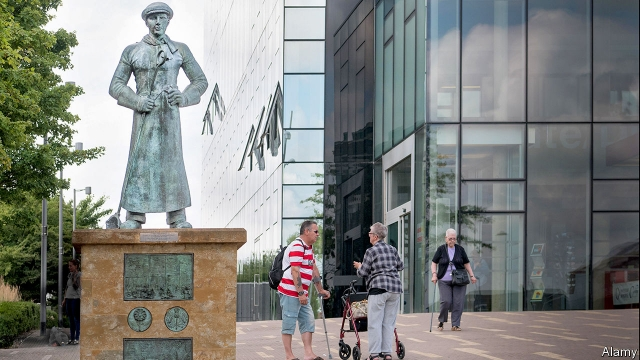
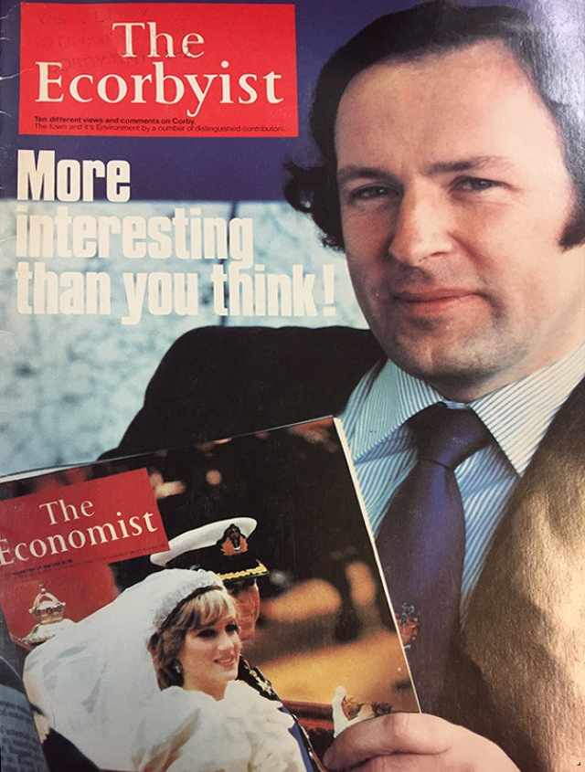

###### Look on in ore

# How Corby became England’s fastest-growing town 

##### Commuters and immigrants have swelled the population by a third 

 

> Apr 27th 2019 

CORBY’S STEELWORKS once gave the Northamptonshire town a ready supply of jobs as well as a generous dusting of soot. Like thousands of Scotsmen, Billy Dalziel’s grandfather moved from Glasgow to find work in the plant. His elder brother was one of more than 100 apprentices taken on each year. But the good times ended, most of the works shut and 10,000 workers lost their jobs in 1980. By the time Mr Dalziel went away to university, Corby was a byword for decline. “That’s the unemployment town,” he was told. 

Yet Corby is now booming again. Its population has risen by 30% since 2001, to a little under 70,000, and is predicted to grow by just shy of a third in the next two decades. Only the London borough of Tower Hamlets is likely to outpace it. Workmen are back at the site of the former ironworks, digging up the infill that buried the town’s industrial past to lay the foundations for 5,000 new homes. A statue of a steelworker stands outside the Corby Cube, a shiny new block of council facilities and offices, in a nod to the town’s heritage. 

The transformation is partly a result of good fortune. The steelworks left plenty of brownfield land that could be snapped up by developers, outside the wide circles of “green belt” that restrict development around nearby cities. Its location also helps. It is 70 miles (113km) north of London, but a train line that opened in 2009 put it within just over an hour of the capital. Commuters soon moved in, attracted by house prices 60% lower than the London average. One of the newcomers, Mohammad Khan, had never heard of Corby before his wife came across its cheap homes online. They swapped a two-bedroom home on the fringes of London for four bedrooms and a garden. They are both freelancers who can work remotely. “Nowadays you can be anywhere,” he says. Soon after moving in, he helped to raise funds for the town’s first mosque. 

Its location has also attracted logistics and food-processing companies, which are keen for sites close to the centre of England. Eddie Stobart, a haulage firm, leased a new depot in 2018. These new jobs, and work building new homes, have brought in eastern Europeans. Immigrants account for a little less than half of the population growth, according to an analysis by the Institute for Public Policy Research (IPPR), a think-tank. In 2016 18% of Corby’s population was foreign-born, four percentage points higher than the British average. 

Local politicians have made the most of these advantages. The borough council is “markedly more interventionist” than its peers, reckons Nigel Hugill of Urban & Civic, a developer which owns a 965-acre site in the town. When Corby was designated an “enterprise zone” in the 1980s, the council distributed copies of The Ecorbyist, a spoof of this newspaper highlighting rate exemptions for firms that moved in. One firm lured to Corby, RS Components, is now the borough’s biggest employer. 

 

A second wave of planned development began in 2003, when the council and Catalyst Corby, a public-private regeneration company, unveiled a plan to double the town’s population by 2030. An advertising campaign encouraged the capital’s residents to move to “North Londonshire”. 

The council raised money to redevelop the town centre by selling off land for houses and applying for government and European Union development grants. It opened a new library, theatre and Olympic-sized swimming pool, which in turn encouraged the private sector to build a shopping centre and cinema nearby. Tom Beattie, the council leader, says he has been “pragmatic and practical” with builders, for example by allowing them to reduce the proportion of a development earmarked for affordable housing if it would not otherwise be built. 

There are signs that some in Corby are unhappy with the pace of change. Nearly two-thirds voted to leave the EU in 2016, which Mr Beattie in part attributes to concerns about immigration. The IPPR study found that the council needed to do a better job of convincing locals of the benefits of migration. If the government fulfils its promise to end freedom of movement, it could interrupt the town’s supply of relatively cheap labour. Corby already knows how fragile booms can be. 

-- 

 单词注释:

1.Corby[]:科比 

2.commuter[kә'mju:tә]:n. 乘公共车辆上下班者, 月季票乘客 [经] 非(当地)居民 

3.APR[]:[计] 替换通路再试器 

4.steelwork[]:n. 钢铁工程, 钢结构, 钢制品 [化] 钢结构 

5.Northamptonshire[nɔ:'θæmptәnʃiә]:北安普敦郡[英国英格兰郡名] 

6.soot[sut]:n. 煤烟, 炭黑色 vt. 熏以煤烟 

7.scotsman['skɔtsmәn]:n. 苏格兰人 

8.billy['bili]:n. 警棍, 伙伴 

9.glasgow['^lɑ:s^әu]:n. 格拉斯哥（英国城市名） 

10.apprentice[ә'prentis]:n. 学徒, 生手 vt. 使做学徒 

11.Dalziel[]:n. (Dalziel)人名；(英)达尔齐尔 

12.byword['baiwә:d]:n. 谚语, 俗话, 笑柄 

13.borough['bә:rәu]:n. 自治的市镇, 区 

14.hamlet['hæmlit]:n. 小村, 部落 

15.outpace[.aut'peis]:vt. 超过...速度, 赶过 

16.ironwork['aiәnwә:k]:n. 铁制品 

17.infill['infil]:v. 填实(空隙等) 

18.steelworker['sti:lwә:kә]:n. 炼钢工人 

19.shiny['ʃaini]:a. 有光泽的, 发光的, 辉煌的, 磨光的, 磨损的 

20.heritage['heritidʒ]:n. 遗产, 祖先遗留物, 继承物 [医] 遗传性 

21.brownfield[ˈbraʊnfi:ld]:a. 棕色地带 

22.developer[di'velәpә]:n. 开发者 [计] 显影器 

23.newcomer[nju:'kʌmә]:n. 新来者 

24.MOHAMMAD[]:n. 穆罕默德（穆斯林真主）；（阿拉伯）穆罕默德（男子名） 

25.khan[kɑ:n]:n. 可汗, 商队宿店 

26.online[]:[计] 联机 

27.fringe[frindʒ]:n. 边缘, 端, 流苏, 穗, 初步 vt. 加穗于, 加饰边于 a. 边缘的, 附加的 

28.freelancer[]:n. 自由记者；自由作家 

29.remotely[]:adv. 极小地, 极细微地 

30.mosque[mɒsk]:n. 清真寺 

31.logistic[lәu'dʒistik]:a. 逻辑的, 后勤学的 

32.eddie['edi]:n. 埃迪（男子名） 

33.stobart[]: [人名] [英格兰人姓氏] 斯托巴特 Stobbart的变体 

34.haulage['hɒ:lidʒ]:n. 拖曳, 运费, 牵引量 [经] 公路运输, 拖运费 

35.lease[li:s]:n. 租约, 租期, 租 vt. 出租, 租出, 租得 

36.depot['depәu]:n. 停车场, 车站, 贮藏所, 仓库 [医] 仓库, 贮存, 积存 

37.les[lei]:abbr. 发射脱离系统（Launch Escape System） 

38.IPPR[]:[网络] 公共政策研究所(Institute for Public Policy Research)；英国公共政策研究所；图像处理和模式识别(Image Processing and Pattern Recognition) 

39.markedly['mɑ:kidli]:adv. 显著地, 醒目地, 明显地 

40.interventionist[.intә'venʃәnist]:n. 干涉主义者 a. 干涉主义的 

41.peer[piә]:n. 同等的人, 匹敌, 贵族 vi. 凝视, 窥视, 费力地看, 隐现 vt. 与...同等, 封为贵族 

42.reckon['rekәn]:vt. 计算, 总计, 估计, 认为, 猜想 vi. 数, 计算, 估计, 依赖, 料想 

43.nigel['naidʒәl]:n. 奈杰尔（男子名） 

44.hugill[]: [人名] 赫吉尔 

45.civic['sivik]:a. 市的, 市民的, 公民的 [法] 公民的, 市民的, 公民资格的 

46.designate['dezigneit]:vt. 指定, 指明, 称呼 a. 已选出而未上任的 

47.spoof[spu:f]:n. 幽默的讽刺诗文, 愚弄, 戏弄 v. 对...作幽默讽刺, 戏弄, 哄骗 a. 哄骗认的 

48.exemption[ig'zempʃәn]:n. 解除, 免除, 免税 [化] 免检 

49.lure[luә]:n. 饵, 诱惑 vt. 引诱, 诱惑 

50.R[ɑ:(r)]:[计] 半径, 比例, 读, 接收, 寄存器, 复位, 电阻, 程式 

51.catalyst['kætәlist]:n. 触媒, 接触剂, 催化剂, 刺激因素, 促进因素 [计] 催化剂 

52.regeneration[ri.dʒenә'reiʃәn]:n. 再生, 重建 [化] 再生作用 

53.unveil[.ʌn'veil]:vt. 揭开, 揭幕, 除去...的面纱 vi. 显露, 除去面纱 

54.advertising['ædvәtaiziŋ]:n. 广告业, 广告 a. 广告的 [计] 发广告 

55.Londonshire[]:[网络] 伦敦郡 

56.redevelop[,ri:di'velәp]:v. 恢复(促进)经济发展, 重点恢复 

57.sector['sektә]:n. 扇形, 部门, 部分, 函数尺, 象限仪, 段, 区段 vt. 把...分成扇形 [计] 扇面; 扇区; 段; 区段 

58.tom[tɒm]:n. 雄性动物, 雄猫 

59.Beattie[]:n. (Beattie)人名；(英)贝蒂；(意)贝亚蒂耶 

60.pragmatic[præ^'mætik]:a. 忙碌的, 爱管闲事的, 自负的, 固执己见的, 实际的, 务实的, 国事的, 国务的 [法] 闲断的, 固执己见的, 实用主义的 

61.builder['bildә]:n. 建立者 [机] 组份 

62.earmark['iәmɑ:k]:n. 耳上记号, 特征, 记号, 标记 vt. 在耳朵上做记号, 标记, 指定...作特定用途 

63.affordable[]:[计] 普及型 

64.EU[]:[化] 富集铀; 浓缩铀 [医] 铕(63号元素) 

65.migration[mai'greiʃәn]:n. 移民, 移往, 移动 [计] 迁移 

