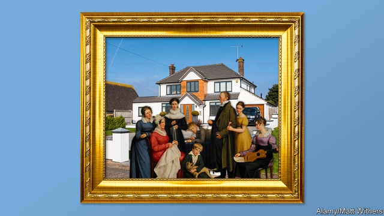
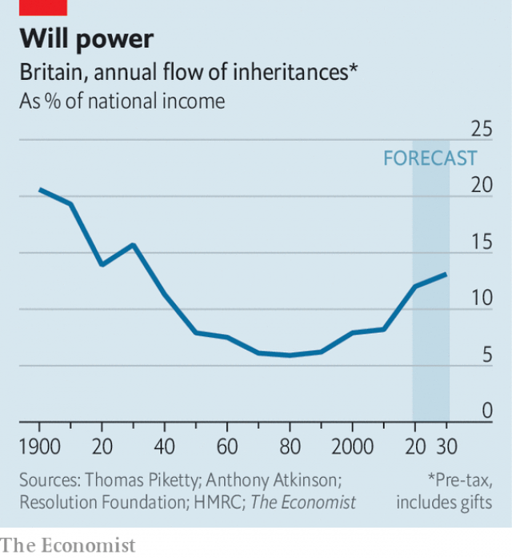

###### Return to Downton Abbey

# Inherited wealth is making a comeback. What does it mean for Britain? 

##### The inheritance boom has profound consequences for society 

 

> Apr 27th 2019 

IT IS ONE of the great themes of English literature of the 19th and early 20th centuries. Novels from Jane Austen’s “Sense and Sensibility” to Charles Dickens’s “Bleak House” and E.M. Forster’s “Howards End” revolve around the question of inheritance. Rich relatives finance Bertie Wooster’s jolly japes. Writers’ preoccupation with inheritance reflected the fact that, back then, transfers of wealth from one generation to the next were enormously significant. Now evidence is emerging which suggests that Britain is entering another golden age of inheritance. 

Two main factors determine inheritance flows from one generation to the next: the amount of wealth in an economy; and the rate at which the owners of that wealth die. The plutocrats of the 19th century amassed fortunes in the form of financial investments, mines and factories. The destruction and inflation of the first and second world wars put paid to many of them. Between 1910 and 1950 the value of capital in the British economy fell from nearly 700% of national income to 250%. Britons had less to pass on to their descendants, and so the significance of inheritance fell. 

Lately, however, wealth as a share of output has risen. Baby-boomers, the bumper generation born between the mid-1940s and mid-1960s, possess much of this wealth, and are starting to die off. The upshot is that inheritances are making a comeback (see chart). In the past 20 years the total value of estates has more than doubled in real terms. These days, for every £100 that they earn in wages, Britons receive £17 in gifts and bequests. Inheritance has not played as big a role in the economy since the 1930s—and if anything the boom may be even bigger than our chart makes it look, since the effective tax rate on bequests is low by historical standards. 

 

Economists disagree on why wealth has risen as a share of national income. Disciples of Thomas Piketty, a French economist (and Austen fan), claim that capitalism tends to follow an almost natural law whereby, in normal times, capital growth outpaces GDP growth. Mr Piketty’s work shows that wealth is becoming more economically significant across many advanced economies. 

In the British case, however, a particularly important role may be played by the unusual housing market. From the 1970s, rules on mortgage lending were liberalised, which has allowed people to bid up prices. Tighter planning policy, including the growth of protected “green belt” land from the 1940s onwards, has made it hard for the country to build the homes it needs. In the past four decades real house prices have increased by more than in almost any other rich country, according to our house-price index. The rising value of housing forms a big share of the total increase in Britain’s capital stock. 

Whatever the cause, inheritance is once again making its mark on the national consciousness. “Capital”, a novel by John Lanchester which was published in 2012, includes a character who inherits a house in London (“The equation was too plain and too depressing. In the debit column, she had lost her mother; in the credit column, she now had a gigantic pile of cash”). Alan Hollinghurst’s “The Line of Beauty” explores themes of inheritance and privilege. “Downton Abbey”, a recent television drama series about the aristocratic Crawley family, in which questions of inheritance loom large, was a runaway hit; a film adaptation is due in September. 

Lawyers have also noticed Britain’s inheritance boom. The High Court considered around 150 inheritance disputes in 2017, three times more than it examined a decade earlier. Many will be hoping for repeats of Jarndyce v Jarndyce, a fictional case concerning a large inheritance in “Bleak House” which is abandoned after “the whole estate is found to have been absorbed in costs.” 

But Britain’s inheritance boom may have more profound consequences. It is fuelling a sense of unfairness. Politicos have puzzled over why apparently well-off people are drawn to the Labour Party, which promises a radical redistribution of wealth for the benefit of “the many, not the few” if it comes to power. Among upper-middle- and middle-class folk (as defined by occupation), Labour’s share of the vote at the general election in 2017 was just ten percentage points lower than the Tories’, compared with 37 points in 1992. 

Inheritance, which usually is not counted in official surveys of household income, may hold part of the answer. By one estimate, one in 20 British people receives an inheritance worth more than ten years of their net earnings. Surveys suggest that grandparents help to pay the fees of 15-20% of private-school pupils. Research by Legal & General, a financial-services firm, suggests that the “Bank of Mum and Dad” lends some £7bn ($9.1bn) a year for house purchases, making it a top-ten mortgage provider. 

As the amount of inherited wealth sloshing around the economy increases, those with high salaries but without a family fortune feel ever less like members of the elite. A recent paper from the Resolution Foundation, a think-tank, suggests that 30-year-olds whose parents are not homeowners are 60% less likely than others their age to own a home themselves. To put it in Labour’s terms, those whose income from employment means they might be classified as members of the lucky “few” increasingly feel as if they belong to the excluded “many”. 

The inheritance boom is set to continue, not least because baby-boomer deaths are on course to rise until the mid-2030s. What’s more, Britons in line for big inheritances are likely to partner up with similarly fortunate folk. Those people are also disproportionately likely to be well educated. Over time Britain could see the emergence of a turbocharged elite—brainy, in well-paid jobs, and with plenty of capital behind them—that is even more enduring than the landed gentry of old. 

-- 

 单词注释:

1.Downton[]:唐顿 

2.abbey['æbi]:n. 大修道院 

3.comeback['kʌmbæk]:n. 复原, 复辟, 复位, 尖刻的对答, 抱怨的原因 [计] 复原的 

4.inheritance[in'heritәns]:n. 遗传, 遗产 [医] 遗传 

5.profound[prә'faund]:a. 极深的, 深厚的, 深刻的, 渊博的 

6.APR[]:[计] 替换通路再试器 

7.jane[dʒein]:n. 简（女子名） 

8.sensibility[.sensi'biliti]:n. 感性, 感觉, 情感 [医] 感觉性, 感受性; 感觉, 感觉能力 

9.charle[]:n. 查理（男子名）；查理（姓氏） 

10.bleak[bli:k]:a. 萧瑟的, 荒凉的, 阴冷的 

11.EM[em]:[计] 媒体用毕符 [化] 射气 

12.howard['hauәd]:n. 霍华德（男子名） 

13.revolve[ri'vɒlv]:v. (使)旋转, 反复考虑, 循环出现 

14.bertie[]:n. 伯蒂（女子名） 

15.jape[dʒeip]:n. 戏言, 笑料, 嘲弄 vi. 开玩笑 vt. 嘲弄 

16.preoccupation[pri:.ɒkju'peiʃәn]:n. 抢先占据, 先人之见, 入神 [医] 成见, 注意散漫, 心不在焉 

17.enormously[i'nɒ:mәsli]:adv. 非常地, 巨大地 

18.plutocrat['plu:tәkræt]:n. 富豪, 财阀 

19.amass[ә'mæs]:vt. 积聚, 堆积 

20.inflation[in'fleiʃәn]:n. 胀大, 夸张, 通货膨胀 [化] 充气吹胀; 膨胀 

21.Briton['britәn]:n. 大不列颠人, 英国人 

22.les[lei]:abbr. 发射脱离系统（Launch Escape System） 

23.descendant[di'sendәnt]:n. 后裔, 子孙 a. 传下的, 下降的 

24.bumper['bʌmpә]:n. 缓冲器, 满杯 a. 大胜利的 

25.upshot['ʌpʃɒt]:n. 结果, 结局, (论证的)要点 

26.bequest[bi'kwest]:n. 遗赠物, 遗产, 遗赠 [经] 遗产 

27.inheritance[in'heritәns]:n. 遗传, 遗产 [医] 遗传 

28.economist[i:'kɒnәmist]:n. 经济学者, 经济家 [经] 经济学家 

29.disciple[di'saipl]:n. 弟子, 门徒 

30.thoma[]:n. (Thoma)人名；(阿尔巴、阿拉伯)索玛；(英、德、罗、匈、捷、塞、瑞典)托马 

31.Piketty[]:皮凯蒂 

32.Austen['ɔ:stin]:n. 奥斯丁（男子名） 

33.capitalism['kæpitәlizәm]:n. 资本主义 [经] 资本主义 

34.whereby[(h)weә'bai]:adv. 靠什么, 如何, 为何, 靠那个, 因此, 由此 [法] 因此, 由是 

35.outpace[.aut'peis]:vt. 超过...速度, 赶过 

36.economically[i:kә'nɔmikәli]:adv. 节约地, 不浪费地, 节省地, 节俭地, 在经济上, 在经济学上 

37.mortgage['mɒ:gidʒ]:n. 抵押, 约束性义务, 抵押借款 vt. 抵押, 以...作担保, 把...许给 

38.liberalise['lɪbərəlaɪz]:vt. 使自由化 

39.onward['ɒnwәd]:a. 向前的, 前进的 adv. 向前, 前进, 在先 

40.john[dʒɔn]:n. 盥洗室, 厕所, 嫖客 

41.Lanchester[]:n. (Lanchester)人名；(英)兰彻斯特 

42.depressing[di'presiŋ]:a. 抑压的, 沉闷的, 阴沉的 

43.debit['debit]:n. 借方, 借 vt. 记入借方 

44.gigantic[dʒai'gæntik]:a. 巨人般的, 巨大的 

45.alan['ælәn]:n. 艾伦（男子名） 

46.sery[]:n. (Sery)人名；(俄)谢雷；(科特)塞里 

47.aristocratic[æristә'krætik]:a. 贵族的, 主张贵族统绐的, 有贵族气派的 

48.Crawley[]:n. (Crawley)人名；(英)克劳利 

49.loom[lu:m]:n. 织布机, 若隐若现的景象 vi. 朦胧地出现, 隐约可见, 可怕地出现 

50.runaway['rʌnә.wei]:n. 逃跑, 逃走的人, 逃亡, 压倒性的优胜 a. 逃亡的, 逃走的 

51.jarndyce[]:[网络] 詹狄士；恩迪斯 

52.V[vi:]:[计] 溢出, 变量, 向量, 检验, 虚拟, 垂直 [医] 钒(23号元素) 

53.fictional['fikʃәnl]:a. 虚构的, 编造的, 小说式的 [法] 拟制的, 假定的, 虚构的 

54.unfairness[]:[法] 不公平, 不公正, 不正当 

55.politico[pә'litikәu]:n. 政客 

56.apparently[ә'pærәntli]:adv. 表面上, 清楚地, 显然地 

57.redistribution['ri:distri'bju:ʃәn]:n. 重新分配, 再分发 [计] 重新分配 

58.earning['ә:niŋ]:n. 收入（earn的现在分词） 

59.mum[mʌm]:n. 菊花, 沉默 a. 沉默的 vi. 演哑剧 interj. 别说话 

60.provider[prә'vaidә]:n. 供应者, 供养人, 伙食承办人 [计] 提供器 

61.slosh[slɒʃ]:n. 泥泞, 溅泼声 v. 走泥泞路, 液体晃动, 溅, 泼 

62.elite[ei'li:t]:n. 精华, 精锐, 中坚分子 

63.homeowner['hәum.әunә]:n. 私房屋主；自己拥有住房者 

64.disproportionately[]:adv. 不匀称, 不相称 

65.emergence[i'mә:dʒәns]:n. 出现, 浮现, 发生 

66.turbocharge['t\\:bәjtʃɑ:dʒ]:vt.用涡轮给(发动机)增压 

67.gentry['dʒentri]:n. 贵族们 

