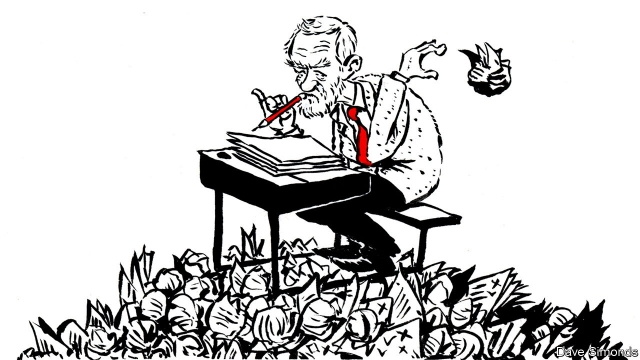

###### Teachers, tested

# Should British 11-year-olds be sitting exams? 

##### Labour wants to scrap standardised tests. But it may struggle to find an adequate replacement 

 

> Apr 27th 2019 

NEXT MONTH 11-year-olds will sit a series of short tests in maths and English—a fact that causes much unhappiness among England’s teachers. At the National Education Union’s recent conference, Jeremy Corbyn, Labour’s leader, announced to hearty applause that he would scrap these tests, which are known as SATs, and that he would review other primary-school assessments. At the conference of the NASUWT, another teachers’ union, an official made headlines when he revealed that lots of schools were calling pupils in to prep for the tests over Easter, sometimes with rewards of fun activities or fast food. 

The attention serves as a reminder of the strength of feeling generated by testing young children. Unlike GCSEs (taken at 16) and A-levels (at 18), SATs hold little sway over a pupil’s future. At most, they will help determine which academic stream the child enters in their first year at secondary school. Their chief purpose is to measure teachers and schools. If children are making good progress in their sums but not their reading, a school can devote more resources to English lessons. If one part of the country is making good progress, the government can study its success. 

Teachers nevertheless complain that they are under too much pressure to squeeze high marks out of their pupils. League tables are based on the percentage of children reaching certain standards, the schools inspectorate uses their results to inform its judgments and some teachers are on performance-related pay. Not all respond well. One head teacher in Leeds dragged a high-performing pupil from their sick bed to take a test, setting a sick bucket beside them. 

Another worry is that the emphasis on results has led to a narrowing of the curriculum as schools focus on maths and English, the only subjects tested. Two-thirds of primary schools spend less than two hours a week teaching science, which was dropped from the tests in 2009. A fifth spend less than 60 minutes on it. Amanda Spielman, head of Ofsted, the schools inspectorate, has warned that some schools are “mistaking ‘badges and stickers’ for learning and substance”. The result is “intensive, even obsessive, test preparation.” 

Both problems arise from the way in which schools respond to the tests, rather than from the tests themselves. Transmitting pressure to pupils “can be a symptom of bad teaching”, says Natalie Perera of the Education Policy Institute, a think-tank. Plenty of schools sail through the exams. One remedy to the problem of narrow curriculums might be to dictate the time spent on each subject, as is the case in Finland. Instead, the government is planning tweaks that will ease the pressure on schools. Plans under consultation would mean that poor exam results no longer triggered intervention, which can lead to management changes. Ofsted, meanwhile, is placing more emphasis in its inspections on ensuring that a “broad and balanced” curriculum is taught, as the law requires. 

Although tempting to teachers (and some parents), Labour’s promise to abolish SATs raises a question: what would replace them? A popular answer among teachers is to rely on their own assessments. Yet this would be no better than children marking their own homework. What’s more, there is evidence that teachers are biased by pupils’ ethnicity. Mr Corbyn has promised that his alternative system will encourage creativity. It is a quality he will need himself if he is to find a way to keep tabs on how much pupils are learning without using tests. 

-- 

 单词注释:

1.scrap[skræp]:n. 碎片, 残余物, 些微, 片断, 铁屑, 吵架 vt. 扔弃, 敲碎, 拆毁 vi. 互相殴打 a. 零碎拼凑成的, 废弃的 

2.standardise[]:vt. 使与标准比较, 用标准校验, 使符合标准, 使统一, 使标准化 

3.replacement[ri'pleismәnt]:n. 归还, 更换, 代替者 [医] 复位, 置换 

4.APR[]:[计] 替换通路再试器 

5.sery[]:n. (Sery)人名；(俄)谢雷；(科特)塞里 

6.unhappiness[]:n. 苦恼；忧愁 

7.jeremy['dʒerimi]:n. 杰里米（男子名） 

8.Corbyn[]:科尔宾（人名） 

9.hearty['hɑ:ti]:a. 诚恳的, 健壮的, 热烈的, 丰盛的 

10.sat[sæt]:n. 饱和度 sit的过去式和过去分词 [计] 饱和度 

11.NASUWT[]:[网络] 女教师工会；教师工会联盟；女教师工会联盟(National Association of Schoolmasters Union of Women Teachers) 

12.prep[prep]:n. (英)(非正式)准备功课, 预备学校, 预料 a. (美)(非正式)预备的, 准备的 vi. 进预备学校, 进行预备训练, 自修, 自我训练 vt. 预备, 给病人作手术前的准备, 准备 

13.reminder[ri'maindә]:n. 提醒的人, 暗示 [经] 催单 

14.gcse[ˌdʒi: si: es ˈi:]:abbr. 普通中等教育证书(General Certificate of Secondary Education) 

15.inspectorate[in'spektәrit]:[法] 检查员, 检查员的管辖区域, 视察团 

16.judgment['dʒʌdʒmәnt]:n. 裁判, 宣告, 判决书 [医] 判断 

17.LEED[]:[化] 低能电子衍射 

18.les[lei]:abbr. 发射脱离系统（Launch Escape System） 

19.amanda[ә'mændә]:n. 阿曼达（女子名） 

20.spielman[]:[网络] 斯皮尔曼 

21.ofsted[]: 教育标准局（英国负责评鉴学校标准的政府部门） 

22.obsessive[әb'sesiv,ɔb-]:a. 着迷的 

23.natalie['nætәli]:n. 纳塔利（女子名） 

24.Perera[]:n. (Perera)人名；(英、西、意、葡、塞)佩雷拉 

25.Finland['finlәnd]:n. 芬兰 

26.tweak[twi:k]:n. 拧, 扭, 焦急 vt. 扭, 开足马力 

27.consultation[.kɒnsәl'teiʃәn]:n. 请教, 咨询, 磋商会 [医] 会诊 

28.trigger['trigә]:n. 触发器, 扳机 vt. 触发, 发射, 引起 vi. 松开扳柄 [计] 切换开关 

29.intervention[.intә'venʃәn]:n. 插入, 介入, 调停 [经] 干预 

30.bias['baiәs]:n. 偏见, 斜纹 a. 偏斜的 adv. 偏斜 vt. 使有偏见 [计] 偏流; 偏压; 偏磁; 偏离 

31.ethnicity[eθ'nisәti]:n. 种族划分 

32.creativity[.kri:ei'tiviti]:n. 创造力, 创造性 

33.tab[tæb]:n. 制表(键), 搭襻, 标号, 调整片, (易拉罐)拉环, 帐单, 标签, 制表符 [计] 标签, 制表符, TAB键 

