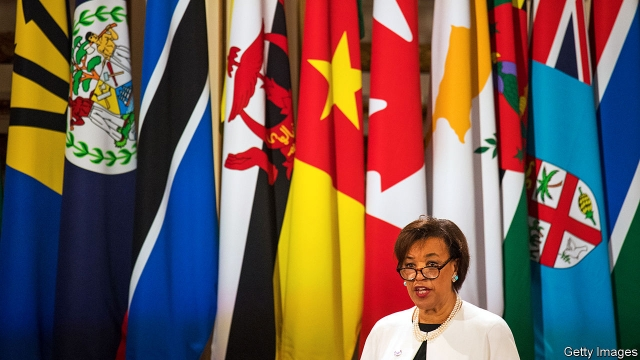

###### Don’t let the sun go down

# The Commonwealth turns 70 

##### Under its punchy boss, the post-imperial club is battling to make a global mark 

 

> Apr 27th 2019 

THE TWO women at the top of the Commonwealth are determined to keep it buzzing. One is its titular head, Queen Elizabeth II, who adores the post-imperial cosiness of the club’s 53 members meeting in a grand conclave every two years—and who in turn is revered by many of the Commonwealth’s leaders and people. The other is Patricia, Baroness Scotland, a Dominica-born former attorney-general of Britain, who as secretary-general for the past three years has had the thankless task of trying to revive an outfit that, apart from the occasional sporting and heads-of-country jamboree, is widely reckoned to be pretty pointless. 

On April 26th it will celebrate its 70th birthday as a modern club of equals, five days after the queen’s 93rd. Will it ever again wield real influence in the world, as it did, for instance, when nudging South Africa and Zimbabwe towards democracy near the end of the last century? 

Brexiteers have long puffed up the Commonwealth as a potential alternative to the European Union, but few Commonwealth leaders think that is remotely plausible. “It was never meant to be a substitute for Europe but an addition,” says Lady Scotland. “It was never an either/or.” Moreover, she stresses, the Commonwealth has no British prefix, despite the queen’s role, which her heir, Prince Charles, will inherit. Britain, at best, is primus inter pares. 

Indeed, one of the club’s selling points is that each member, even the Pacific island of Tuvalu (population: 11,000), is supposed to have an equally loud voice at its biennial heads-of-government meetings. In particular, the Commonwealth gives a rare global voice to the 31 of its members who are deemed “small states” (defined as having fewer than 1.5m people or “having the characteristics of a small state” which thus includes a few more, such as Jamaica, Namibia and Papua New Guinea). Hence it pays special attention to climate change, since half of its members are islands, many of them vulnerable to rising sea-levels and cyclones. Lady Scotland hails the club’s Blue Charter, which boosts co-operation on ocean issues. 

One big snag is that the Commonwealth has been in dire need of cash. Seven years ago its budget, two-thirds of which was spent on a technical co-operation fund and a youth forum, was around £60m ($78m). When Lady Scotland arrived in 2016 it had shrunk to £42m; the cost of running its secretariat has been hard to meet. Canada, infuriated by the Commonwealth’s failure to speak up for human rights in Sri Lanka in 2013, cut much of its funding. Australia is less keen than it was. Britain, despite Brexit, has been loth to pick up the slack, though it is by far the biggest provider. Senior staff have been sacked, jobs cut and merged, many feathers ruffled. Lady Scotland has, in her words, been “vilified” for shaking up the scenery too roughly. 

Another snag is that too many of the Commonwealth’s beefier members do not take it seriously as a political force in the world. India, in particular, which enthusiasts for the club hoped would lead it in global forums, has been notably disengaged, though there are flickering signs that its prime minister, Narendra Modi, may see the point of India taking an interest, even the lead. Some say it may contemplate taking those small states under its wing, especially in the Pacific, perhaps for fear that China will gobble them up commercially and even strategically if it does not. 

Whatever its lack in oomph as a global heavyweight, the Commonwealth, which encompasses a third of the world’s people, a quarter of the UN’s membership, a fifth of the world’s land mass and a third of its waters under national jurisdiction, is a valuable network. Most of its members speak the same language and follow similar legal systems. This helps members to trade at a discount, even without free-trade agreements. Yet India, whose economy is the club’s biggest after Britain’s, seems in no hurry to strike a special trade deal with the old country post-Brexit. Along with other Asian members and many African ones, it looks more to China for business. 

So the Commonwealth still faces an uphill struggle to recover its momentum. Ireland, which Commonwealth buffs in Britain have often wanted to induct into the club in order to help soften centuries of enmity towards its former ruler, recently chose instead to join the International Organisation of La Francophonie, albeit as an observer. That, say watchers in Whitehall, was a slap in the face of both Britain and the Commonwealth. 

By contrast, France makes no bones about being top dog in the Francophonie, as the outfit is generally known. Not to worry, says Lady Scotland. A number of non-Anglophones (Rwanda and Mozambique, for instance) have joined her club; French-speaking Togo has applied to do so. Gabon and Angola have put out feelers. 

In any event, even the small states may prefer to play big beasts off against each other rather than be locked into one club or another. Last year the long-serving foreign minister of Rwanda, which joined the Commonwealth in 2009, became the secretary-general of the Francophonie. In the age of globalisation the sensible aim is to belong to as many clubs as you can. That is scant comfort to Brexiteers wanting to re-embrace the Commonwealth. 

-- 

 单词注释:

1.commonwealth['kɔmәnwelθ]:n. 共和国；联邦；国民整体 

2.punchy[]:a. 有力的, 生气勃勃的 

3.APR[]:[计] 替换通路再试器 

4.buz['bʌz]:abbr. buzzer 蜂音器, 蜂鸣器 

5.titular['titjulә]:a. 享有所有权的, 名誉上的, 有名无实的, 有头衔的 n. 只有称号的人 

6.elizabeth[i'lizәbәθ]:n. 伊丽莎白（女子名） 

7.ii[]:abbr. 微光（Image Intensification） 

8.cosiness['kəʊzɪnəs]:n. 舒适, 安逸 

9.conclave['kɒnkleiv]:n. 秘密会议, 教皇选举会议, 红衣主教团 

10.rever[]:n. 作梦（歌名） 

11.patricia[pә'triʃә]:n. 帕特丽夏（女子名） 

12.baroness['bærәnis]:n. 男爵夫人, 女性男爵 

13.thankless['θæŋklis]:a. 不感谢的, 忘恩的, 不知感恩的 

14.revive[ri'vaiv]:vt. 使苏醒, 使复兴, 使振奋, 回想起, 重播 vi. 苏醒, 复活, 复兴, 恢复精神 

15.outfit['autfit]:n. 用具, 配备, 机构 vt. 配备, 供应 vi. 得到装备 

16.jamboree['dʒæmbә'ri:]:n. 大喝大闹, 大集会, (童子军)欢乐的聚会 

17.reckon['rekәn]:vt. 计算, 总计, 估计, 认为, 猜想 vi. 数, 计算, 估计, 依赖, 料想 

18.pointless['pɒintlis]:a. 不尖的, 钝的, 不得要领的 

19.wield[wi:ld]:vt. 挥舞, 运用 

20.nudge[nʌdʒ]:n. 用肘轻推, 推动, 讨厌家伙 

21.Zimbabwe[zim'bɑ:bwei]:n. 津巴布韦 

22.Brexiteers[]:支持英国退欧的人（Brexiteer的复数） 

23.remotely[]:adv. 极小地, 极细微地 

24.plausible['plɒ:zibl]:a. 貌似真实的, 貌似合理的, 说得煞有其事的 [法] 花言巧语的, 似乎有理的 

25.prefix['pri:fiks]:前缀, 称谓 [计] 地区号码, 前缀 

26.charle[]:n. 查理（男子名）；查理（姓氏） 

27.primus['praimәs]:n. 普里默斯炉(一种便携式汽化煤油炉) a. 第一的 

28.inter[in'tә:]:vt. 埋葬 prep. 在中间 

29.pare[pєә]:vt. 剥, 削, 消减 

30.Tuvalu['tu:vәlu]:图瓦卢[西太平洋岛国](旧称埃利斯群岛) 

31.equally['i:kwәli]:adv. 相等地, 同样地, 平等地 

32.biennial[bai'eniәl]:n. 两年生植物, 两年一次的事 a. 两年生的, 两年一次的 

33.deem[di:m]:v. 认为, 相信 

34.Jamaica[dʒә'meikә]:n. 牙买加 

35.Namibia[nә'mi:biә]:n. 纳米比亚 

36.Papua['pæpjuә]:n. 巴布亚岛 

37.guinea['gini]:n. 几内亚 

38.vulnerable['vʌlnәrәbl]:a. 易受伤害的, 有弱点的, 易受影响的, 脆弱的, 成局的 [医] 易损的 

39.cyclone['saiklәun]:n. 龙卷风, 暴风 [化] 旋流(分离,除尘)器 

40.hail[heil]:n. 冰雹, 致敬, 欢呼, 招呼 vt. 向...欢呼, 致敬, 招呼, 使象下雹样落下 vi. 招呼, 下雹 interj. 万岁, 欢迎 

41.charter['tʃɑ:tә]:n. 特许状, 执照, 宪章 vt. 特许, 发给特许执照 

42.snag[snæg]:n. (尖利的)突出物, (衣服等的)戳破处, 断牙, 意外障碍 vt. 造成阻碍, 抓住机会, 抢到, 清除障碍物 

43.dire[daiә]:a. 可怕的, 悲惨的, 阴沉的, 极端的 

44.forum['fɒ:rәm]:n. 论坛, 公开讨论的广场, 法庭, 讨论会 [法] 讨论会, 专题讨论, 公共论坛 

45.secretariat[.sekrә'tєәriәt]:n. 书记处, 秘书之职, 秘书处 

46.infuriate[in'fjuәrieit]:a. 狂怒的 vt. 激怒 

47.sri[sri]:n. 斯里兰卡（Sri Lanka）；（拉）神圣罗马帝国（Sacrum Romanum Imperium） 

48.lanka[]:n. 兰卡；楞伽 

49.les[lei]:abbr. 发射脱离系统（Launch Escape System） 

50.Brexit[]:[网络] 英国退出欧盟 

51.loth[lәuθ]:a. 不愿意的, 厌恶的 

52.slack[slæk]:n. 松弛, 松懈, 淡季, 闲散, 家常裤 a. 松弛的, 不流畅的, 疏忽的, 无力的, 呆滞的, 软弱的, 漏水的 adv. 马虎地, 缓慢地 vt. 放松, 使缓慢 vi. 松懈, 减弱, 松弛 

53.provider[prә'vaidә]:n. 供应者, 供养人, 伙食承办人 [计] 提供器 

54.merge[mә:dʒ]:vt. 使合并, 使消失, 吞没 vi. 合并, 渐渐消失 [计] 合并 

55.ruffle['rʌfl]:n. 皱褶, 波纹, 生气, 混乱 vt. 弄皱, 触怒, 洗(牌), 连续轻擂(鼓) vi. 起皱, 发脾气, 连续轻擂 

56.vilify['vilifai]:vt. 诽谤, 贬低 [法] 诋毁, 中伤, 诽谤 

57.beefy['bi:fi]:a. (牛)多肉的, 象牛肉的, 粗壮的, 结实的 

58.enthusiast[in'θju:ziæst]:n. 热心家, 狂热者, 爱好者 

59.notably['nәjtbәli]:adv. 显著地, 著名地, 尤其, 特别 

60.disengage[.disin'geidʒ]:vt. 使脱离, 使松开, 使摆脱约束(或义务等) vi. 脱离, 解脱 

61.flicker['flikә]:n. 闪烁, 闪光, 颤动 vi. 闪动, 闪烁, 摇动, 扑动翅膀 vt. 使摇曳, 使闪烁 

62.narendra[]:[网络] 纳伦德拉；纳兰德；纳然陀 

63.MODI['mәudai]:[计] 模块化光学数字接口 

64.contemplate['kɒntempleit]:vt. 注视, 沉思, 盘算 vi. 冥思苦想 

65.gobble['gɒbl]:n. 火鸡叫声 vt. 狼吞虎咽 vi. 贪食, 咯咯叫 

66.commercially[]:adv. 商业上；通商上 

67.strategically[strә'ti:dʒikәli]:adv. 在战略上, 颇策略地 

68.oomph[umf]:n. 性感, 热情, 精力, 吸引力 

69.heavyweight['heviweit]:n. 重量级拳击运动员, (非正式)有影响的要人 a. 最重量级的 

70.encompass[in'kʌmpәs]:vt. 围绕, 完成, 包括, 包含, 环绕, 包围 

71.membership['membәʃip]:n. 会员的资格, 全体会员, 会员数目 [法] 会员资格, 成员资格, 会籍 

72.jurisdiction[.dʒuәris'dikʃәn]:n. 司法权, 审判权, 管辖权 [经] 法律管辖权, 审判权 

73.uphill['ʌp'hil]:a. 上坡的, 向上的 adv. 往上坡, 向上地 

74.momentum[mәu'mentәm]:n. 动力, 动量 [化] 动量 

75.buff[bʌf]:n. 暗黄色, 暗黄色皮革, 人的皮肤 vt. 擦亮, 使柔软 a. 暗黄色的 

76.induct[in'dʌkt]:vt. 引导, 使入门, 引入, 使就职 

77.soften['sɒftn]:v. (使)变柔软, (使)变柔和 

78.enmity['enmәti]:n. 敌意, 憎恨 

79.organisation[,ɔ: ^әnaizeiʃən; - ni'z-]:n. 组织, 团体, 体制, 编制 

80.La[lɔ:, lɑ:]:[医] 镧(57号元素) 

81.francophonie[]:n. 〈集合词〉法语国家；说法语社会；法语国家[社会]文化 [网络] 法语共同体；法语区 

82.albeit[ɔ:l'bi:it]:conj. 尽管, 虽然 

83.watcher['wɒtʃә]:n. 看守人, 守望者, 哨兵 

84.Whitehall['waithɔ:l]:n. 白厅, 英国政府 

85.slap[slæp]:n. 掴, 掌击, 侮辱, 拍击声 v. 拍击, 惩罚 adv. 正面地, 直接地, 突然地 

86.rwanda[rj'ændә]:n. 卢旺达（东非国家）；卢旺达语 

87.Mozambique[.mәuzәm'bi:k]:n. 莫桑比克 

88.togo['tәu^әu]:n. 多哥（西非国家） 

89.gabon[^a'b]:n. 加蓬（非洲中西部国家） 

90.Angola[æŋ'^әulә]:[经] 安哥拉 

91.feeler['fi:lә]:n. 触角, 试探者, 试探手段 

92.globalisation[,gləubəlai'zeiʃən]:n. 全球化, =globalization 

93.scant[skænt]:a. 不充分的, 不足的 vt. 减少, 吝啬, 限制, 藐视, 忽略 

