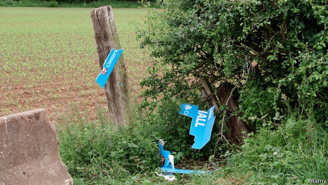
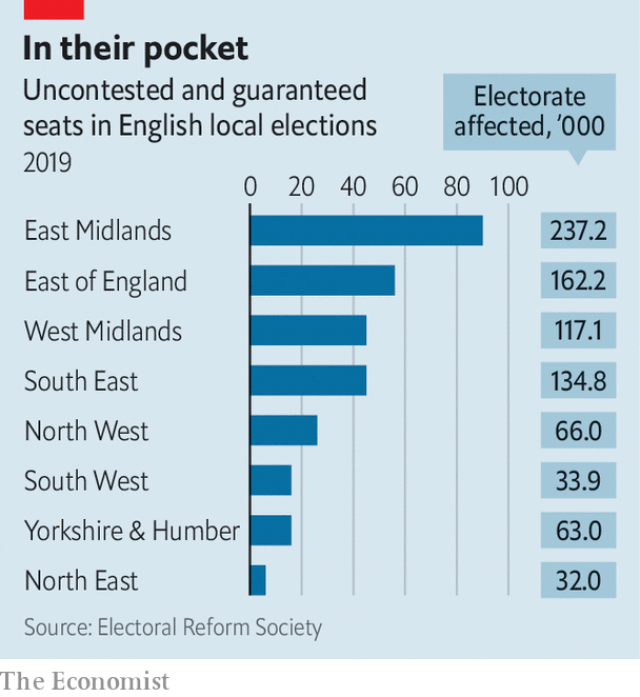

###### Rotten boroughs

# Three hundred English councillors will be elected unopposed 

##### Local elections are due on May 2nd, but some seats have already been awarded 

 

> Apr 27th 2019 

WITHOUT A BALLOT paper being marked, residents from Doddington and Wimblington, two villages in north Cambridgeshire, have already elected a pair of councillors. While candidates across England prepare for local elections on May 2nd, the two Conservatives faced no opposition for the seats and so were granted them without contest a month ago. They were by no means alone: 12 of the 39 seats in Fenland, the district council, were doled out this way due to a paucity of wannabe councillors. 

Fenland is only the most egregious example of local democracy without the demos. Across England, 148 councillors—137 of them Tories—have already been elected without a fight, according to the Electoral Reform Society, which campaigns for fairer votes in Britain. Another 152 seats will be guaranteed to a particular party because there are too few candidates in a single ward (if, for example, five candidates from two parties battle for three seats). 

The problem is finding enough candidates. In these local elections, 8,374 seats on 248 councils in England are up for grabs. Rounding up that many people willing to spend their evenings hearing complaints about bins, dog poo and broken playgrounds is hard. Still, the Conservatives are fielding candidates in 96% of seats—even in councils such as Knowsley, on the outskirts of Liverpool, where they are sure to get walloped. Labour, meanwhile, can only muster candidates in three-quarters of contests, despite its half-a-million members. The Liberal Democrats, who have a well-organised activist base, have fielded candidates for just over half the vacancies. 

In those seats that are actually contested, the Conservatives are likely to have a bad night. The party is expected to lose between 500 and 1,000 of the 4,628 seats it holds, though it hopes to make some inroads in places such as Mansfield, a Leave-voting Midlands town which elected a Tory MP for the first time in 2017. Labour hopes to solidify recent gains in places including Trafford, a wealthy suburb of Manchester that voted Remain in the referendum and was the Tories’ flagship northern council until 2018, when the party lost control. But both parties are unloved, points out Robert Hayward, a Conservative peer and pollster. Tory weakness may not translate directly into Labour gains. 

Instead, it is the Liberal Democrats who are the most optimistic. Councils that contain large numbers of Conservative Remain-voters are often overlooked by politicos, notes Mark Pack, a Lib Dem activist. Such voters are abundant in cities such as Chelmsford, which voted only narrowly to leave the EU in 2016. Although the Lib Dems face new competition on the national stage from Change UK, a new centrist party formed by disaffected Conservative and Labour MPs, they have a clear run in the local elections, where the new party is not fielding any candidates. 

 

Normally, local elections are a battle of expectations-management. Before the contest, party fixers loudly play down their chances, only to declare the result a triumph afterwards. This time, some in the Conservatives will do the opposite, decrying their results as a lousy showing in order to pile more pressure on Theresa May, their unpopular but immovable leader. 

Luckily for Mrs May’s critics, the Tories have the most to lose. They hold just over half the seats up for grabs, following a strong performance in 2015, at the same time as David Cameron’s surprise general-election victory. By contrast, this year’s election will take place with a backdrop of blundered Brexit negotiations and a brewing Conservative civil war. The prime minister can console herself with one fact: whatever happens on May 2nd, a corner of Cambridgeshire is already blue. 

-- 

 单词注释:

1.borough['bә:rәu]:n. 自治的市镇, 区 

2.councillor['kaunsilә]:n. 地方议会成员, 议会委员, 顾问, 评议员, 参赞 [法] 议员, 评议员, 顾问 

3.unopposed['ʌnә'pәuzd]:[法] 无反对的, 无对手的 

4.APR[]:[计] 替换通路再试器 

5.ballot['bælәt]:n. 投票, 投票用纸, 抽签 vi. 投票, 抽签 vt. 投票选出, 拉选票 

6.Doddington[]:[地名] 多丁顿 ( 英 ) 

7.Wimblington[]:[地名] 温布灵顿 ( 英 ) 

8.Cambridgeshire['keimbridʒʃә]:n. 剑桥郡 

9.opposition[.ɒpә'ziʃәn]:n. 反对, 敌对, 相反, 在野党 [医] 对生, 对向, 反抗, 反对症 

10.fenland['fenlænd]:n. 沼泽地 

11.dole[dәul]:n. 救济品, 失业救济金 vt. 发放救济 

12.paucity['pɒ:sәti]:n. 少数, 少量, 缺乏 

13.wannabe[ˈwɒnəbi]:n. 赶超崇拜者, 赶超崇拜者的人 

14.egregious[i'gri:dʒiәs]:a. 异乎寻常的, 过分的, 惊人的 

15.Demo['demәu]:n. 演示, 样本唱片 [计] 演示 

16.electoral[i'lektәrәl]:a. 选举人的, 选举的, (有关)选举的 [法] 选举的, 选举人的, 由选举人组成的 

17.grab[græb]:n. 抓握, 掠夺, 强占, 东方沿岸帆船 vi. 抓取, 抢去 vt. 攫取, 捕获, 霸占 

18.bin[bin]:n. (贮存谷物等的)容器, 箱子 [计] 二进制, 商业信息网 

19.POO[]:邮政汇票 

20.Knowsley[]:诺斯利 

21.Liverpool['livәpu:l]:n. 利物浦 

22.muster['mʌstә]:n. 召集, 集合, 检阅, 清单, 花名册, 样品 vt. 召集, 集合, 应召 vi. 集合, 集中 

23.democrat['demәkræt]:n. 民主人士, 民主主义者, 民主党党员 [经] 民主党 

24.activist['æktivist]:n. 激进主义分子 

25.vacancy['veikәnsi]:n. 空, 空白, 空缺, 空虚, 空闲 [化] 空位 

26.inroad['inrәud]:n. 侵入, 得手, 侵害 [法] 袭击, 侵犯, 损害 

27.mansfield['mænsfi:ld]:n. 曼斯菲尔德（姓氏） 

28.midland['midlәnd]:n. 中部地方, 内地 

29.Tory['tɒ:ri]:n. 托利党党员, 保守党员, 亲英分子 a. 保守分子的 

30.MP[]:国会议员, 下院议员 [计] 宏处理程序, 维护程序, 线性规划, 微程序, 多处理器 

31.solidify[sә'lidifai]:v. (使)凝固, (使)团结, 巩固 

32.Trafford[]:n. 特拉福德（姓氏）；特拉福德（英格兰的一个都市自治市） 

33.Manchester['mæntʃestә]:n. 曼彻斯特 

34.referendum[.refә'rendәm]:n. （就重大政治或社会问题进行的）全民公决，全民投票 

35.flagship['flægʃip]:n. 旗舰 

36.unloved[ʌn'lʌvd]:a. 不为人所爱的 

37.Robert['rɔbәt]:[法] 警察 

38.hayward['heiwәd]:n. 看管市镇的家畜围篱管理员 

39.peer[piә]:n. 同等的人, 匹敌, 贵族 vi. 凝视, 窥视, 费力地看, 隐现 vt. 与...同等, 封为贵族 

40.pollster['pәulstә]:n. 民意调查人, 民意测验经办人 

41.politico[pә'litikәu]:n. 政客 

42.lib[lib]:a. [口]解放的（等于liberal）；解放论者的 

43.DEM[dem]:[计] 解调器 

44.voter['vәutә]:n. 选民, 投票人 [法] 选民, 选举人, 投票人 

45.Chelmsford['tʃelmsfəd]:n. 切姆斯福德（英国英格兰东南部一座城市） 

46.narrowly['nærәuli]:adv. 狭窄地, 严密地, 仔细地, 几乎不, 勉强地, 仅仅 

47.EU[]:[化] 富集铀; 浓缩铀 [医] 铕(63号元素) 

48.DEM[dem]:[计] 解调器 

49.UK[ju: 'kei]:n. 联合王国 

50.centrist['sentrist]:n. 中间党派的成员, 温和主义者 [法] 中间派议员, 中立派议员 

51.disaffect[.disә'fekt]:vt. 使疏远, 使不忠, 使不满意 

52.MP[]:国会议员, 下院议员 [计] 宏处理程序, 维护程序, 线性规划, 微程序, 多处理器 

53.fixer['fiksә]:n. 定色剂, 定影剂, 毒贩子 [化] 定影剂; 定香剂; 固色剂; 固着剂; 固定剂 

54.afterwards['ɑ:ftәwәdz]:adv. 然后, 后来 

55.decry[di'krai]:vt. 反对, 责难, 诽谤, 诋毁 

56.lousy['lauzi]:a. 污秽的, 恶心的, 生虱的 

57.theresa[ti'ri:zә]:n. 特丽萨（女子名） 

58.unpopular['ʌn'pɔpjulә]:a. 不得人心的, 不受欢迎的, 不流行的 

59.immovable[i'mu:vәbl]:a. 固定的, 不动的, 不改变的 [经] 固定的, 不可移动的 

60.luckily['lʌkili]:adv. 幸运地, 幸亏, 侥幸 

61.Mr['mistә(r)]:先生 [计] 存储器回收程序, 多重请求 

62.Tory['tɒ:ri]:n. 托利党党员, 保守党员, 亲英分子 a. 保守分子的 

63.david['deivid]:n. 大卫；戴维（男子名） 

64.backdrop['bækdrɒp]:n. 背景幕, 背景 

65.blunder['blʌndә]:n. 大错, 大失策 vi. 失策, 跌跌撞撞地走, 犯错 vt. 做错 

66.Brexit[]:[网络] 英国退出欧盟 

67.negotiation[ni.gәuʃi'eiʃәn]:n. 谈判, 磋商, 交涉 [经] 谈判, 协商 

68.brew[bru:]:n. 酿造酒, 酝酿 v. 酿造, 酝酿 

69.console[kәn'sәul]:vt. 安慰, 藉慰 n. 控制台 [计] 控制台 

