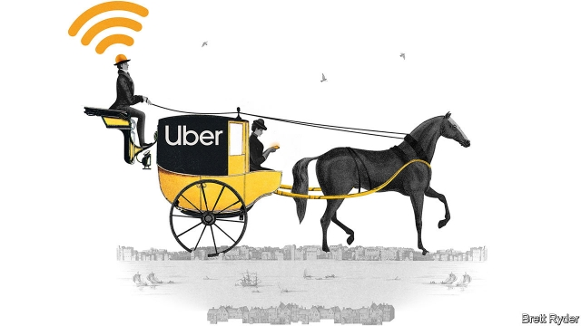

###### Schumpeter

# Can Uber ever make money? 

##### A ride back through history offers sobering lessons 

 

> Apr 27th 2019 

LONDON CABBIES enjoy a good moan. But few can match the satirical indignation of a former ferry operator, John Taylor, who used to carry passengers on the Thames. As well as being a “waterman”, Taylor was a poet, writing in the 1620s just when horse-drawn Hackney carriages were making their debut on the streets of the capital. In “An Arrant Thief”, published in 1622, he described the carnage from “upstart Hell-cart-coaches” robbing his brethren of their fares. “Against the ground, we stand and knock our heels/Whilst all our profit runs away on wheels.” 

Four centuries later, profits across the global taxi industry are again running away—but this time into thin air. Until recently, the fortunes of regulated cab companies drew the most attention. Uber and Lyft in America, Didi in China and other ride-hailing firms elsewhere have used sackloads of venture capital to drive down fares and flood the streets of big cities with cars, clobbering the earnings of licensed rivals. But now their own losses are in the spotlight. In a filing released in the run-up to its initial public offering, Uber says it has lost $7.9bn since 2009. Lyft, which listed last month, lost $2.9bn in seven years. Uber is seeking a valuation of up to $100bn but as yet it is unclear if it can make money. To understand why, it helps to look at the history of the taxi industry. When regulated, it is a cushy business. When not, it is cut-throat. 

Start with Uber’s most oft-touted attributes. Its name has become synonymous with ride-hailing thanks to rapid expansion that its advocates put down to “first-mover advantage” and network effects, or the belief that it will become more valuable as more people use it. The company claims to have more than 65% of the ride-hailing market in the United States and Canada, Europe, Australia and New Zealand, and Latin America. But it sees itself as more than just a taxi company, with car ownership and public transport in its sights. The proposed valuation implies a huge market which Uber would need to all but monopolise. 

Look through history, though, and taxi monopolies look anything but impregnable. That is because the ride-hailing business, which will remain Uber’s bread and butter for the foreseeable future, is local, not global. And, as long as competition is unregulated, entering local markets is relatively easy. Len Sherman of Columbia Business School draws a parallel between Uber’s business and that of unregulated taxis in New York in the 1930s, when Ford’s Model T emerged as a new, low-cost cab. During the Depression many jobless workers took to taxi-driving for a living, undercutting each other viciously. The streets were saturated with vehicles but the earnings of drivers and taxi companies evaporated. Customers benefited, but no one else did. Uber and Lyft are reprising that episode as they fight city by city for drivers and customers. 

Uber’s name recognition may help. Historically, taxi firms have benefited from strong brands. London’s black taxis, or New York’s yellow ones, for instance, attract users despite high fares and relative scarcity. They are hallmarks of their cities. In an ideal world for Uber, brand awareness would mean customers went straight to its app rather than that of a rival, convincing more drivers to work for it because they can access a bigger market. This would produce the vaunted network effect for drivers and riders. 

The trouble is, as competition increases, ride-hailing becomes a commodity business. Customers care little whether they ride with Uber or Lyft, as long as it gets them from A to B. That means neither firm can easily increase profits by raising fares, but may instead have to offer discounts. Likewise, the ride-hailing firms do not own their cars: their drivers do, and so have no reason to be loyal. That forces the firms to pile on incentives to stop drivers from deserting, kicking profits even further down the road. 

Throughout taxi history, the answer to such a race to the bottom has been regulation. In 1635 the number of Hackney carriages in London was restricted to reduce congestion (Taylor must have breathed a sigh of relief). In 1937 the Haas Act introduced the medallion system in New York, putting strict curbs on the number of medallions and driving up their value. Recently the city’s regulators have moved to control ride-hailing, capping the number of vehicles and introducing a minimum wage for drivers. That could become a trend. 

So much for the past. What about the future? Uber’s foray into Uber Eats, its food-delivery service, may be an even tougher business proposition than ride-hailing; it has to give restaurateurs a cut of each sale, as well as drivers. Its core measure of revenue at Uber Eats fell in the second half of 2018 compared with the first half. That was not encouraging. The firm is expanding into broader mobility services, such as scooters and electric bikes, and is building a platform that includes public transport, so customers can travel more seamlessly across a city. But again, competition will be intense: city governments will be loth to link access to their public-transport systems to a single platform, for safety, data-privacy and other reasons. 

Uber’s long-term goal is autonomous vehicles (AVs), which would reduce its need to share revenues with human drivers. On April 18th Toyota and other investors put $1bn into Uber’s AV division. On April 22nd Tesla unveiled plans to roll out robotaxis next year. That promise is subject to huge regulatory uncertainty, plus an Elon Musk bravado discount. But many other companies are keen to enter the fray. Expect fisticuffs. 

Uber will surely have a place in the future of transport. It may be able to increase rider and driver loyalty by replacing fares with monthly subscriptions. It may settle for dominating some cities, leaving others to rivals, provided that does not violate antitrust rules. History suggests that profits will be hard to come by. But at least its name should live on, just as Taylor’s hated Hackney “Hell-carts” do in London’s black cabs, 400 years later. 

-- 

 单词注释:

1.Schumpeter[]:n. 熊彼特（美籍奥匈帝国经济学家, 当代资产阶级经济学代表人物之一） 

2.uber['ju:bә]:[医] 乳房 

3.APR[]:[计] 替换通路再试器 

4.cabby['kæbi]:n. 出租车司机, 出租马车的车夫 

5.satirical[sә'tirik(ә)l]:a. 讽刺的, 讥讽的, 好挖苦的, 写讽刺作品的 

6.indignation[.indig'neiʃәn]:n. 愤怒, 愤慨, 义愤 

7.john[dʒɔn]:n. 盥洗室, 厕所, 嫖客 

8.taylor['teilә]:n. 泰勒 

9.Thame[]:泰姆（人名） 泰姆市（地名） 

10.waterman['wɔ:tәmәn]:n. 船工, 船家, 船夫, 划手 

11.hackney['hækni]:n. 乘用马, 出租马车 vt. 出租, 役使, 过于频繁使用 a. 出租的, 陈腐的 

12.debut['deibju:]:n. 初次登台, 开张 v. 初次登台 

13.arrant['ærәnt]:a. 声名狼藉的, 极恶的, 完全的 

14.carnage['kɑ:nidʒ]:n. 大屠杀, 残杀 

15.upstart['ʌpstɑ:t]:n. 新贵, 暴发户, 自命不凡者 a. 暴富的 

16.lyft[]:[网络] 散落 

17.Didi[]:n. 迪迪（足球运动员名） 

18.sackload['sæklәjd]:n. 一大袋,一大包 

19.clobber['klɒbә]:n. 衣服, (鞋匠用来掩饰皮革缝的)软膏 vt. 痛打, 击倒, 拉垮 

20.earning['ә:niŋ]:n. 收入（earn的现在分词） 

21.spotlight['spɒtlait]:n. 照明灯, 反光灯, 聚光灯 

22.valuation[.vælju'eiʃәn]:n. 评价, 估价, 价值判断 [经] 估价, 计价, 评价 

23.unclear[.ʌn'kliә]:a. 不易了解的, 不清楚的, 含混的 

24.cushy['kuʃi]:a. 舒适的, 安逸的 

25.synonymous[si'nɒnimәs]:a. 同义词的, 同义的 

26.zealand['zi:lәnd]:n. 西兰岛（丹麦最大的岛） 

27.monopolise[mә'nɔpәlaiz]:vt. 垄断, 独占, 专营, 专利 

28.monopoly[mә'nɒpәli]:n. 垄断, 专卖权, 独占事业 [经] 垄断, 专利品, 垄断(权)独占 

29.impregnable[im'pregnәbl]:a. 无法攻取的, 坚强不屈的, 驳不倒的 

30.foreseeable['fɒ:'si:әbl]:a. 可预知的, 能预测的 [法] 可预见的, 可预料的 

31.unregulated[]:a. 未经调节的；未校准的 

32.len[]:n. 伦恩（男子名） 

33.sherman['ʃә:mәn]:n. 谢尔曼（男子名） 

34.Columbia[kә'lʌmbiә]:n. 哥伦比亚 

35.york[jɔ:k]:n. 约克郡；约克王朝 

36.'nt[]:abbr. 【化】同“niton” [网络] 新台币；神经降压素(Neurotensin)；中和试验(neutralization test) 

37.jobless['dʒɔblis]:a. 失职的, 无职业的 [经] 失业的 

38.undercut['ʌndәkʌt]:n. 底切, 牛腰部下侧嫩肉, 下口, 下旋削球 vt. 廉价出售, 底切, 雕出, 下旋削球 vi. 切除底部 

39.viciously[]:adv. 邪恶地；敌意地 

40.saturate['sætʃәreit]:vt. 使渗透, 浸透, 使充满, 使饱和 a. 浸透的, 饱和度高的, 深颜色的 n. 饱和化合物, 饱和脂肪酸 

41.reprise[ri'praiz]:n. 年金, 重演, 重复 vt. 重演, 重奏 

42.historically[his'tɔrikәli]:adv. 历史上地；从历史观点上说 

43.scarcity['skɑ:siti]:n. 缺乏, 不足, 缺少 [经] 缺乏, 不足 

44.hallmark['hɑ:lmɑ:k]:n. 纯度检验证明, 品质证明 vt. 加盖纯度检验证明 

45.awareness[ә'weәnis]:n. 意识, 认识 [计] 识别, 议定, 明白 

46.APP[]:[计] 应用, 应用程序; 相联并行处理器 

47.vaunt[vɒ:nt]:v. 自夸 n. 自吹自擂 

48.commodity[kә'mɒditi]:n. 农产品, 商品, 有用的物品 [经] 商品, 货物, 日用品 

49.B[bi:]:[计] 基地址, 数据库, 基极, 二进制, 块, 字组, 布尔, 总线, 占线, 字节 [医] 硼(5号元素) 

50.incentive[in'sentiv]:n. 动机 a. 激励的 

51.congestion[kәn'dʒestʃәn]:n. 拥挤, 充血 [计] 拥挤, 拥塞 

52.HAA[]:abbr. 重型防空武器（Heavy Anti-Aircraft） 

53.medallion[mi'dæljәn]:n. 大奖章, 圆形浮雕, 圆形装饰 

54.curb[kә:b]:n. 抑制, 勒马绳, 边石 vt. 抑制, 束缚, 勒住 

55.regulator['regjuleitә]:n. 调整者, 校准者, 校准器, 调整器, 标准钟 [化] 调节剂; 调节器 

56.foray['fɒrei]:vi. 侵略, 劫掠, 袭击 n. 侵掠, 侵略, 攻击 

57.proposition[.prɒpә'ziʃәn]:n. 建议, 命题, 主张 vt. 向...提议, 向...提出猥亵的要求 

58.restaurateur[restәrә'tә(r)]:n. 餐馆老板 

59.mobility[mәu'biliti]:n. 可动性, 流动性, 机动性 [化] 迁移率 

60.scooter['sku:tә]:n. 小型摩托车, 踏板车 [机] 机车 

61.seamlessly['si:mlisli]:adv. 无空隙地; 无停顿地 

62.loth[lәuθ]:a. 不愿意的, 厌恶的 

63.AV[]:[计] 数组/向量, 属性值, 有效, 平均值 

64.toyota[]:n. 日本丰田汽车（公司名） 

65.investor[in'vestә]:n. 投资者 [经] 投资者 

66.AV[]:[计] 数组/向量, 属性值, 有效, 平均值 

67.Tesla['teslә]:[电] 特斯拉 

68.unveil[.ʌn'veil]:vt. 揭开, 揭幕, 除去...的面纱 vi. 显露, 除去面纱 

69.regulatory['regjulәtәri]:a. 受控制的, 统制的, 调整的 [经] 规则的 

70.uncertainty[.ʌn'sә:tnti]:n. 不确定, 不可靠, 不确定的事物 [化] 不确定度 

71.elon[i'lɔn]:n. 埃伦（可溶性显影剂粉末） 

72.musk[mʌsk]:n. 麝香, 麝香的气味 [化] 麝香 

73.bravado[brә'vɑ:dәu]:n. 虚张声势 

74.fray[frei]:n. 磨损, 打架, 争论 vt. 使磨损 vi. 被磨损 

75.fisticuff['fistikʌf]:n. 拳的一击 

76.subscription[sәb'skripʃәn]:n. 捐献, 订金, 订阅, 签署, 同意 [化] 订购 

77.antitrust[.ænti'trʌst]:a. 反托拉斯的 [法] 反托拉斯的 

