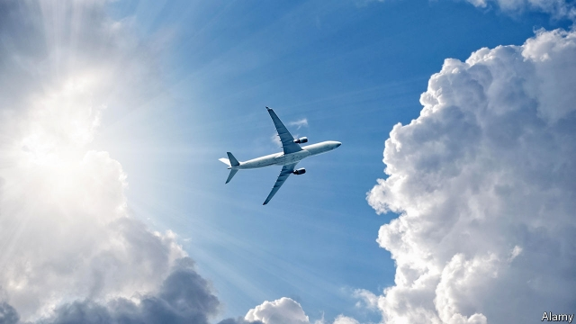
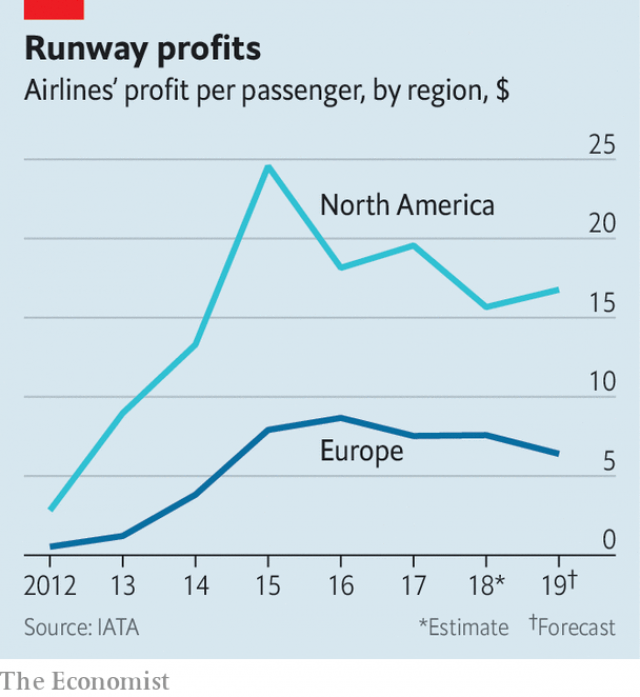

###### Going American

# Europe’s airline industry is consolidating 

##### That is good news for shareholders, less so for flyers 

 

> Apr 27th 2019 

AMERICA MAY be the land of free-market competition. But look up at the sky and Europe looks freer. The European Union is home to 135 scheduled airlines; America has 59. The five biggest carriers in America control around 70% of the market; the EU’s top five barely hold half. Concentration has resulted in poorer service: three American operators can be found on the list of the world’s 50 best carriers, as rated by Skytrax, an aviation website, compared with 13 European ones. As predictably, it has benefited shareholders, who earn three times as much for every frazzled passenger as those in Europe (see chart). Signs of American-style consolidation will therefore please Europe’s capitalists as much as they worry competition authorities—and flyers. 

European skies have grown less crowded of late. The number of airlines in Europe has fallen from a peak of 180 in 2003. Since the start of 2018 at least 14 have collapsed. In March WOW, an Icelandic low-cost carrier, entered bankruptcy. The previous month Flybmi and Germania went bust, following VLM of Belgium, Primera Air, based in Latvia, Cobalt Air of Cyprus, Germany’s Azur Air, Lithuania’s Small Planet Airlines and a Swiss carrier, SkyWork. Flybe, Europe’s largest regional airline, is barely hanging on. 

Meanwhile, mature carriers these fledglings were meant to disrupt are flying high. The past two financial years have seen record profits at Europe’s three biggest airline groups: Lufthansa, Ryanair and IAG, owner of British Airways and Iberia. 

 

Michael O’Leary, the chief executive of Ryanair, Europe’s largest low-cost carrier, thinks that the industry is moving “inexorably” towards five airline groups—Lufthansa, IAG, Air France-KLM, Ryanair and easyJet—controlling 80% of the continent’s air traffic, more like America, within five years. He predicts that more mid-sized carriers will be swallowed by them over the next five years: Norwegian and TAP Air Portugal could be bought by IAG; Lufthansa is eyeing Hungary’s Wizz Air; Alitalia, Italy’s perpetually failing flag carrier, could merge with its stronger joint-venture partner, Air France-KLM. Analysts broadly concur with Mr O’Leary’s conclusions. 

The dominance of Europe’s established carriers is not down to state backing. Of the top six only Air France-KLM has governments (of France and the Netherlands) as shareholders. Rather, their success reflects the importance of scale, explains Kenny Jacobs, Ryanair’s chief marketing officer. Heft was not always an advantage in the past. When fuel prices rose before the recession of 2007-09, legacy airlines with older, thirstier planes cut capacity while upstarts with more fuel-efficient aircraft expanded. Now the former are growing faster than the market overall, using greater heft to cut costs. The biggest airlines are better able to hedge against higher fuel costs, get lower prices from suppliers such as catering firms and aircraft-makers, and borrow cheaply to buy or lease new fuel-efficient planes. Smaller carriers cannot keep up. 

Regional airlines and operators of charter flights have suffered most. The former, which specialise in flying short hops between provincial airports using smaller aircraft, have been knocked by the rapid expansion of low-cost carriers, with larger planes and lower costs per passenger, into their most profitable routes. Many charter operators, too small to compete with the likes of Ryanair, are leaving the airline business altogether. In February Thomas Cook, a British travel agent, put its carrier up for sale (see article). 

Aviation regulators at the European Commission, the EU’s executive arm, argue that Europe’s airline business is structurally more competitive than America’s. More cities have secondary airports to rival fortress hubs dominated by one airline. Railways compete against airlines on shorter routes. The commission’s transport chief, Henrik Hololei, is nonetheless ready to step in to stop Europe’s five biggest airline groups from becoming more dominant. Britain’s competition authority, meanwhile, wants to reform slot allocation at London’s busy Heathrow Airport to make it harder for IAG to grow its market share beyond today’s 55%. All this would keep Europe’s airspace from turning too American. But market forces favour consolidation. Resisting it looks like a flight of fancy. 

-- 

 单词注释:

1.consolidate[kәn'sɒlideit]:vt. 巩固, 使联合, 统一 vi. 巩固 [计] 合并计算 

2.shareholder['ʃєә.hәuldә]:n. 股东 [法] 股东, 股票持有人 

3.les[lei]:abbr. 发射脱离系统（Launch Escape System） 

4.flyer['flaiә]:n. 飞鸟, 飞行物, 飞行员, 快车, 传单, 飞跳 [经] 投机买卖, 孤注一掷, (广告)传单 

5.APR[]:[计] 替换通路再试器 

6.Skytrax[]:[网络] 斯卡特瑞克；航空学会；航空星级 

7.predictably[]:adv. 可预言地 

8.frazzle['fræzl]:v. (使)磨损, (使)磨破, (使)破烂 n. 磨破, 破烂, 疲惫, 磨损的边缘 

9.consolidation[kәn.sɒli'deiʃәn]:n. 巩固, 团结, 合并, 加强 [医] 实变 

10.capitalist['kæpitәlist]:n. 资本家, 资本主义者 a. 资本主义的 

11.wow[wau]:interj. (非正式)哇 n. 巨大的成功, 轰动一时的成功, 十分有趣的事物 [计] WIn32上的Windows 

12.Icelandic[.ais'lændik]:a. 冰岛的, 冰岛人的, 冰岛语的 n. 冰岛语 

13.bankruptcy['bæŋkrәptsi]:n. 破产者 [经] 破产, 倒闭 

14.germania[dʒә:'mæniә]:n. 氧化锗；马海毛里子缎；日耳曼尼亚（古代欧洲的一处地名） 

15.bust[bʌst]:n. 半身像, 胸部, 失败, 殴打 vt. 使爆裂, 使破产 vi. 爆裂, 破产 [计] 操作错 

16.VLM[]:虚拟可装载模块 

17.primera[]:[网络] 芙莉美娜；普瑞玛；派美雅 

18.Latvia['lætviә]:n. 拉脱维亚 

19.cobalt['kәubɒ:lt]:n. 钴, 钴类颜料 [化] 钴Co 

20.Cyprus['saiprәs]:n. 塞浦路斯 [经] 赛浦路斯 

21.azur[]:n. （法）蓝色 

22.Flybe[]:[网络] 英国；航空；航空公司福赖弼 

23.regional['ri:dʒәnәl]:a. 地方的, 地域性的 [医] 区的, 部位的 

24.fledgling['fledʒliŋ]:n. 羽毛初长的雏鸟, 刚会飞的幼鸟, 无经验的人 

25.disrupt[dis'rʌpt]:a. 分裂的, 中断的 vt. 使分裂, 使瓦解 

26.Lufthansa['ljft,hænsә]:n. (联邦德国)汉莎航空公司 

27.Ryanair[]:n. 瑞安航空公司（欧洲最大的廉价航空公司, 总部位于爱尔兰） 

28.IAG[]:abbr. International Administrative Data Processing Geodesy 国际管理数据处理组 

29.airway['єәwei]:n. 空中航线, 风道 [医] 导气管 

30.iberia[ai'biәriә]:n. 伊比利亚；伊伯利亚半岛 

31.michael['maikl]:n. 迈克尔（男子名） 

32.inexorably[]:adv. 冷酷地；无情地 

33.Norwegian[nɒ:'wi:dʒәn]:n. 挪威人, 挪威语 a. 挪威的, 挪威人的, 挪威语的 

34.Portugal['pɒ:tʃugl]:n. 葡萄牙 

35.wizz[]:[网络] 天才巫师；先天巫师；天赋巫师 

36.Alitalia[]:n. 意大利航空公司 

37.perpetually[]:adv. 永恒地, 持久地 

38.merge[mә:dʒ]:vt. 使合并, 使消失, 吞没 vi. 合并, 渐渐消失 [计] 合并 

39.analyst['ænәlist]:n. 分析者, 精神分析学家 [化] 分析员; 化验员 

40.broadly['brɒ:dli]:adv. 宽广地, 明白地, 无礼貌地 

41.concur[kәn'kә:]:vi. 同意, 一致, 同时发生 [法] 同时发生, 并发, 同意 

42.dominance['dɔminәns]:n. 优势, 显性, 统治, 控制, 支配 [计] 控制, 扰势 

43.Netherlands['neðәlәndz]:n. 荷兰 

44.kenny['keni]:n. 肯尼（姓氏） 

45.jacob['dʒeikәb]:n. [圣经]雅各（以色列人的祖先）；雅各布（男子名） 

46.marketing['mɑ:kitiŋ]:n. 行销, 买卖 [经] 推销, 在市场买卖, 销售 

47.heft[heft]:n. 重量, 影响, 重要性 vt. 举起试重量, 举起 vi. 称重量 

48.alway['ɔ:lwei]:adv. 永远；总是（等于always） 

49.recession[ri'seʃәn]:n. 后退, 凹处, 衰退, 归还 [医] 退缩 

50.legacy['legәsi]:n. 祖先传下来之物, 遗赠物 [经] 遗产, 遗赠物 

51.upstart['ʌpstɑ:t]:n. 新贵, 暴发户, 自命不凡者 a. 暴富的 

52.heft[heft]:n. 重量, 影响, 重要性 vt. 举起试重量, 举起 vi. 称重量 

53.supplier[sә'plaiә]:n. 供应者, 供给国, 供应商 [化] 承制厂; 供应厂商 

54.cheaply['tʃipli]:adv. 便宜地 

55.lease[li:s]:n. 租约, 租期, 租 vt. 出租, 租出, 租得 

56.cannot['kænɒt]:aux. 无法, 不能 

57.regional['ri:dʒәnәl]:a. 地方的, 地域性的 [医] 区的, 部位的 

58.charter['tʃɑ:tә]:n. 特许状, 执照, 宪章 vt. 特许, 发给特许执照 

59.specialise['speʃә,laiz]:vt. 特加指明, 列举, 使专门化, 限定...的范围 vt.vi. (使)特化, (使)专化 vi. 成为专家, 专务, 专攻, 专门研究, 逐条详述 

60.hop[hɒp]:n. 单脚跳, 跳跃, 舞会, 飞行 vi. 单脚跳, 跳跃 vt. 跃过, 跳上, 加蛇麻子于, 服麻醉药 [计] 跳跃式传输 

61.provincial[prә'vinʃәl]:n. 外地人, 粗野的人 a. 省的, 外地的, 偏狭的 

62.thoma[]:n. (Thoma)人名；(阿尔巴、阿拉伯)索玛；(英、德、罗、匈、捷、塞、瑞典)托马 

63.regulator['regjuleitә]:n. 调整者, 校准者, 校准器, 调整器, 标准钟 [化] 调节剂; 调节器 

64.structurally[]:[计] 结构地 

65.fortress['fɒ:tris]:n. 城堡, 要塞 vt. 筑要塞, 以要塞防守 

66.hub[hʌb]:n. 毂, 木片, 中心 [计] 插座; 插孔; 集线器, 集中器, 连接器, 中继站 

67.Henrik[]:n. 亨里克, 亨利克（人名） 

68.nonetheless[,nʌnðә'les]:conj. 然而, 尽管, 不过 adv. 不过, 仍然, 尽管如此, 然而 

69.dominant['dɒminәnt]:a. 占优势的, 支配的 [医] 优性的, 显性的 

70.slot[slɒt]:n. 水沟, 细长孔, 硬币投币口, 缝, 狭槽, 狭通道, 位置, 一档(广播节目等) vt. 开槽于, 把...纳入机构 [计] 槽; 存储槽 

71.allocation[.ælәu'keiʃәn]:n. 配置, 分配, 拨给 [经] 分配, 拨款, 分摊 

72.heathrow['hi:θrәj]:n. 希思罗机场（位于英国伦敦） 

