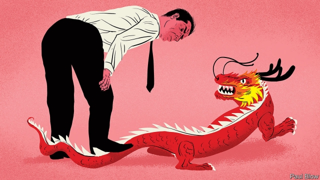

###### Dragons, disrupted

# Foreign suspicion is hemming in China Inc’s global rise 

##### If China wants to see more of its companies succeed abroad, it should cut them slack at home 

 

> Apr 27th 2019 

TEENS EVERYWHERE love lip-synching to TikTok. Parents may be less enamoured of the boppy music-video app, whose popularity has exploded of late. For different reasons, governments appear wary, too. In February TikTok paid a record $5.7m fine in America for illegally collecting data on users under the age of 13. This month an Indian court banned the app on the grounds that it abets sexual predators. Bangladesh and, briefly, Indonesia, have banned it in the past year, alleging it promotes porn. 

TikTok is not the only social-media app to perturb regulators concerned about data privacy, fake news or dangerous content. But there is another reason for the attention: TikTok is Chinese. The angst surrounding its parent company, Bytedance, and China’s other tech titans is a measure of their rising global relevance. Five of the ten most popular apps used by Indians last year were Chinese. Two in five TikTok users live in India, Bytedance’s largest market outside China, ahead of America. Baidu, Alibaba and Tencent—technology behemoths collectively known as the BATs—hold stakes in 150 companies abroad, according to Abacus, a research arm of the South China Morning Post, a newspaper. Alibaba has 56 data centres overseas. Tencent owns 17.5% of Snap, creator of a popular American messaging app, and 7.5% of Spotify, a Swedish music-streaming service. 

No firm has animated worries about China Inc’s overseas forays more than Huawei, its most successful global company. Governments worry that its telecoms gear might enable spying on behalf of the Chinese state (see article). Scrutiny of Huawei is understandable, given the strategic importance of 5G. But “the Huawei effect”, as Samm Sacks of New America, a think-tank in Washington, DC, calls it, is infecting internet and consumer-electronics firms hitherto viewed as innocuous, because their technologies were regarded as less important and their links to the Communist party looser. 

In foreign eyes, both of these mitigating factors appear to be weakening. The BATs in particular have moved beyond their core businesses of internet search, e-commerce and gaming, respectively. They control and crunch flows of data, at home and abroad, and manage cloud-computing services. This allies them to the state-led “Made in China 2025” scheme to dominate advanced technologies such as artificial intelligence. 

Meanwhile, a two-year-old security law compels firms to participate in intelligence-gathering when the party asks them to. Since November the police can enter the offices of any Chinese internet-services provider to copy data deemed relevant to cyber-security. Hard as it is to imagine Chinese companies refusing requests from their authoritarian government even in the absence of formal rules, these developments highlighted the risk. Now, observes Ms Sacks, “if you pair the words ‘China’ and ‘tech’, red flags go up”. 

As a result, more Chinese acquisitions that involve the transfer of sensitive technologies are being scotched. Last summer America’s Congress beefed up the screening regime for foreign investments, making life harder for acquisitive firms from China. On April 1st Beijing Kunlun Tech, a gaming company, said that it was in talks with American government officials over its ownership of Grindr, a popular gay dating app that it acquired last year. The Committee on Foreign Investment in the United States (CFIUS), an American agency that vets foreign deals for national-security risks, has reportedly ordered it to sell. CFIUS fears, it is thought, that personal data submitted by the app’s users, which include messages, location and even HIV status, could be used by the Chinese government to blackmail American officials. 

In a similar case this month PatientsLikeMe, which helps connect people suffering from the same illness, was reported to be looking for a buyer after CFIUS had forced iCarbonX, a Chinese health-data analytics firm backed by Tencent, to sell its majority stake in the American platform. Last year CFIUS blocked the $1.2bn purchase of MoneyGram, a money-transfer firm, by Ant Financial, an Alibaba affiliate, on national-security grounds. Investment by Chinese firms in America fell below $5bn last year, from $46bn in 2016, according to Rhodium Group, a consultancy. 

Authorities are beginning to restrict not just Chinese companies’ investments, but their products. In 2017 American officials warned that those of DJI, a leading drone-maker, were probably sending data on critical infrastructure back to China’s government; the US Army barred DJI drones from its bases. In 2018 American government agencies were banned from using cameras made by Hikvision, the world’s biggest manufacturer of CCTV kit. Some large American funds have quietly sold their stakes in the firm, which also risks sanctions in America for supplying technology that aids repression in parts of China. 

It is not just America picking on its chief geopolitical rival. Defence ministries in Australia and India have prohibited staff from using WeChat, Tencent’s messaging app. The Australian Strategic Policy Institute has urged the app’s 1.5m Australian users to beware of propaganda and censorship. In March India’s ruling Bharatiya Janata Party complained to the election commission that Bytedance’s social-media apps were interfering in elections. It wants to ban a Bytedance news aggregator called Helo. Fearing Chinese propaganda ahead of its own general election in 2020, Taiwan may ban Baidu’s iQIYI, called China’s Netflix, and stop Tencent from launching its own video-streaming service on the island (which China views as a part of its territory). Israel, where Chinese investors accounted for 12% of tech deals in the first nine months of 2018, is thinking of creating a CFIUS-like oversight body. 

As China’s businesses push overseas, its all-powerful president, Xi Jinping, expects more loyalty at home. After the government nixed its popular six-year-old jokes app last year, Bytedance’s founder, Zhang Yiming, apologised publicly. The firm’s news app, Jinri Toutiao, has devoted a channel to party pronouncements. According to Reuters, a widespread app launched in February called “Study the Great Nation”—a little red book for the digital age—was built by Alibaba (which declined to comment). The firm has 200-odd Communist-party branches; 600 party members reportedly join its workforce yearly. A recent revelation by a state newspaper that Jack Ma, its boss, was a party member stunned outsiders, who viewed him as the embodiment of a market-driven China. 

Chinese companies are doing “a lot of persuading” to show they have no political agenda, says William Chou, vice-chairman of the China practice at Deloitte, a consulting and accountancy firm. Alibaba and Tencent have spent lavishly on their foreign holdings, but would relish a bigger global footprint. Barely 10% of Alibaba’s revenues come from outside China. 

In China’s “socialist market economy” it is hard to tell which firms are closer to the party, and so more deserving of suspicion. Assuming they are all an arm of the state, as some foreign politicians urge, carries its own risks. Blacklist too many Chinese firms and you hurt your own. China can retaliate by blocking access to the world’s biggest market. Even if it doesn’t, spurning Chinese advances deprives foreigners of opportunities. PatientsLikeMe hoped the iCarbonX tie-up would grant it access to Chinese machine-learning technology. 

Treating all Chinese companies alike also underestimates the vibrancy of China’s private sector. Ms Sacks reckons that the new cyber-security laws may be a tacit recognition by the party that the BATs have grown powerful—more so, even, than some government ministries. If Mr Xi really wants Chinese firms to succeed abroad, he should cut them some slack at home. 

-- 

 单词注释:

1.disrupt[dis'rʌpt]:a. 分裂的, 中断的 vt. 使分裂, 使瓦解 

2.hem[hem]:n. 边缘, 折边, 哼声 vt. 缝边, 包围, 关闭 vi. 做折边, 发哼声 interj. 哼 

3.slack[slæk]:n. 松弛, 松懈, 淡季, 闲散, 家常裤 a. 松弛的, 不流畅的, 疏忽的, 无力的, 呆滞的, 软弱的, 漏水的 adv. 马虎地, 缓慢地 vt. 放松, 使缓慢 vi. 松懈, 减弱, 松弛 

4.APR[]:[计] 替换通路再试器 

5.teen[ti:n]:n. 愤怒, 悲哀 

6.les[lei]:abbr. 发射脱离系统（Launch Escape System） 

7.enamour[i'næmә]:vt. 迷住, 使迷恋 

8.boppy[]:[网络] 枕头；定型枕；胡真 

9.APP[]:[计] 应用, 应用程序; 相联并行处理器 

10.popularity[.pɒpju'læriti]:n. 名声, 受大众欢迎, 流行 

11.wary['wєәri]:a. 谨慎的, 小心的, 机警的, 周到的, 唯恐的 

12.illegally[]:[法] 非法地, 不合法地, 违法地 

13.datum['deitәm]:n. 论据, 材料, 资料, 已知数 [医] 材料, 资料, 论据 

14.abet[ә'bet]:vt. 教唆, 煽动, 怂恿, 帮助, 支持 

15.predator['predәtә]:n. 食肉动物, 掠夺者 [医] 捕食者 

16.Bangladesh[,bɑ:ŋ^lә'deʃ]:n. 孟加拉国 [经] 孟加拉共和国 

17.briefly['brifli]:adv. 简短地, 扼要地, 简明地, 简单地 

18.Indonesia[.indәu'ni:ʒә]:n. 印尼 

19.allege[ә'ledʒ]:vt. 宣称, 主张, 提出, 断言 [法] 断言, 指称, 指证 

20.porn[pɔ:n]:n. 色情描写, 黄色书刊, 色情画, 色情照片, 色情文学 

21.perturb[pә'tә:b]:vt. 扰乱, 使混乱, 使心绪不宁 

22.regulator['regjuleitә]:n. 调整者, 校准者, 校准器, 调整器, 标准钟 [化] 调节剂; 调节器 

23.privacy['praivәsi]:n. 隐私, 隐居, 秘密 [计] 个人保密权 

24.fake[feik]:n. 假货, 欺骗, 诡计 a. 假的 vt. 假造, 仿造 vi. 伪装 

25.angst[æŋst]:n. 焦虑, 疑惧 [医] 恐怖 

26.tech[tek]:n. 技术学院或学校 

27.Titan['taitn]:n. 提坦, 太阳神, 巨人 

28.relevance['relivәns]:n. 中肯；关联；相关性 

29.baidu[]:n. 百度（全球最大的中文搜索引擎） 

30.alibaba[]:n. 阿里巴巴（公司名） 

31.behemoth[bi'hi:mɔθ]:n. 庞然大物 

32.collectively[]:adv. 集合, 聚合性, 共同, 集体主义, 集团, 集体 

33.abacus['æbәkәs]:n. 算盘 [计] 算盘 

34.oversea['әuvә'si:]:adv. 海外, 向国外, 向海外, 国外 a. 外国的, 在国外的, 在海外的, 舶来的 

35.Tencent[]:[网络] 腾讯；腾讯公司；腾讯控股 

36.Creator[kri:'eitә(r)]:n. 上帝, 创造者, 创作者 

37.spotify[]:[网络] 音乐播放器；音乐服务网站；网络音乐电台网站 

38.Swedish['swi:diʃ]:n. 瑞典人, 瑞典语 a. 瑞典的, 瑞典人的, 瑞典语的 

39.animate['ænimeit]:vt. 使有生气, 赋予生命 a. 有生命的, 有生气的 

40.foray['fɒrei]:vi. 侵略, 劫掠, 袭击 n. 侵掠, 侵略, 攻击 

41.huawei[]: 华为 

42.telecom['telәkɔm]:telecommunication 电信 

43.scrutiny['skru:tini]:n. 细看, 仔细检查, 监视, 选票检查 [经] 复查, 评核, 仔细检查 

44.understandable[.ʌndә'stændәbl]:a. 可以理解的 

45.samm['sæm]:abbr. semi-automatic measuring machine 半自动测量机器 

46.Washington['wɒʃiŋtn]:n. 华盛顿 

47.DC[]:直流电 [计] 数据单元, 数据中心, 数据代码, 数据通信, 数据控制, 数字控制, 直流 

48.hitherto[.hiðә'tu:]:adv. 迄今, 至今 

49.innocuous[i'nɒkjuәs]:a. 无害的, 无伤大雅的 [医] 无害的, 良性的 

50.loos[]:n. 损耗, 洗手间（loo复数形式） 

51.mitigate['mitigeit]:vt. 温和, 缓和, 减轻 [医] 缓和, 减轻 

52.crunch[krʌntʃ]:v. 嘎吱嘎吱的咬嚼, 压碎, 嘎吱嘎吱地踏过 n. 咬碎, 咬碎声 

53.ally['ælai. ә'lai]:n. 同盟者, 同盟国, 助手 vt. 使联盟, 使联合, 使有关系 vi. 结盟 

54.provider[prә'vaidә]:n. 供应者, 供养人, 伙食承办人 [计] 提供器 

55.deem[di:m]:v. 认为, 相信 

56.authoritarian[ɒ:.θɒri'tєәriәn]:a. 独裁的, 独裁主义的 

57.Scotch[skɔtʃ]:n. 苏格兰人, 苏格兰语, 刻痕 a. 苏格兰人的, 苏格兰语的 vt. 刻痕于, 伤害, 镇压, 妨碍 

58.regime[rei'ʒi:m]:n. 政权, 当权期间, 政体, 社会制度, 体制, 情态 [医] 制度, 生活制度 

59.acquisitive[ә'kwizitiv]:a. 渴望获得的, 贪婪的 [法] 取得的, 获得的, 贪得无厌的 

60.Kunlun['ku:n'lu:n]:Mountains昆仑山 

61.tech[tek]:n. 技术学院或学校 

62.Grindr[]:[网络] 基达；格林德 

63.cfius[]:abbr. Committee on Foreign Investment in the United States 外国在美投资委员会 

64.vet[vet]:n. 兽医 vi. 当兽医 vt. 诊断, 检审 

65.reportedly[ri'pɒ:tidli]:adv. 根据传说, 根据传闻, 据报道 

66.hiv[]:abbr. 艾滋病病毒（human immunodeficiency virus） 

67.statu[]:[网络] 状态查看；雕像；特级雪花白 

68.blackmail['blækmeil]:n. 勒索 vt. 勒索 

69.buyer['baiә]:n. 买主, 买方 [经] 买主, 买方, 买手 

70.analytic[.ænә'litik]:a. 分析的, 善于分析的, 解析的 [医] 分析的 

71.moneygram[]:[网络] 速汇金；速汇金业务；速汇金国际有限公司 

72.affiliate[ә'filieit]:vt. 使紧密联系, 使附属, 接纳, 收养 vi. 发生联系, 参加 

73.rhodium['rәudiәm]:n. 铑 [化] 铑Rh 

74.consultancy[]:n. 商量, 协商, 磋商, 会诊, 与...商量, 咨询, 请教, 找(医生)看病, 查阅, 考虑 [经] 咨询业务, 咨询服务 

75.dji[]:abbr. Dow-Jones Index <美>道·琼斯指数 

76.infrastructure['infrәstrʌktʃә]:n. 基础结构, 基础设施 [经] 基础设施 

77.drone[drәun]:n. 雄蜂, 懒惰者, 嗡嗡的声音, 无人驾驶飞机(或船) vi. 嗡嗡作声, 混日子 vt. 低沉地说 

78.CCTV[]:[计] 闭路电视 

79.kit[kit]:n. 装备, 工具箱, 成套工具 [计] 成套部件; 成套零件 

80.quietly['kwaiәtli]:adv. 安静地, 沉着地, 秘密地 

81.sanction['sæŋkʃәn]:n. 核准, 制裁, 处罚, 约束力 vt. 制定制裁规则, 认可, 核准, 同意 

82.repression[ri'preʃәn]:n. 抑制, 压抑, 制止 [医] 压抑, 抑制 

83.geopolitical[,dʒi(:)әupә'litikәl]:[计] 地理的 

84.WeChat[]:[网络] 微信；微讯；腾讯微信 

85.beware[bi'wєә]:v. 小心, 谨防 

86.propaganda[.prɒpә'gændә]:n. 宣传, 宣传活动 [医] 宣传 

87.censorship['sensәʃip]:n. 检查制度 [医] 督察, 监察 

88.Bharatiya[]:[网络] 巴拉蒂亚 

89.Janata['dʒʌnətɑ:]:n. （印度）人民团体；人民党（印度联合政党） 

90.aggregator[ˈægrɪgeɪtə(r)]:n. 聚合器, 整合者; 汇集者, 聚合 

91.helo['heləʊ]:n. 直升机 

92.taiwan['tai'wɑ:n]:n. 台湾 

93.netflix[]:n. 全球十大视频网站中唯一收费站点 

94.Israel['izreil]:n. 以色列, 以色列后裔, 犹太人 

95.investor[in'vestә]:n. 投资者 [经] 投资者 

96.oversight['әuvәsait]:n. 勘漏, 失察, 失败, 照料 [经] 监督权 

97.nix[niks]:n. 无, 皆无, 水中精灵 interj. 停, 不要, 不行 vt. 禁止, 拒绝 

98.founder['faundә]:n. 创立者, 建立者 vt. 使沉没, 使摔倒, 弄跛, 浸水, 破坏 vi. 沉没, 摔到, 变跛, 倒塌, 失败 

99.zhang[]:n. 张, 章（中国姓氏） 

100.Yiming[]:翳明 

101.apologise[ә'pɔlәdʒaiz]:vi. 道歉（等于apologize） 

102.pronouncement[prә'naunsmәnt]:n. 声明, 公告, 宣言, 宣告, 发表, 意见, 决定 [法] 宣判, 宣布, 宣告 

103.Reuter['rɔitә]:n. 路透社, 路透通讯社 

104.revelation[.revi'leiʃәn]:n. 揭露, 泄露, 发觉, 默示, 启示 

105.jack[dʒæk]:n. 插座, 千斤顶, 男人 vt. 抬起, 提醒, 扛举, 增加, 提高, 放弃 a. 雄的 [计] 插座 

106.MA[mɑ:]:n. 妈 [计] 存储器地址, 多路存取 

107.stun[stʌn]:vt. 使昏迷, 使震惊, 打昏 n. 昏迷, 猛击 

108.outsider[' aut'saidә]:n. 外人, 局外人, 非会员, 外行, 门外汉, 比赛中获胜可能性不大的选手 [经] 外船公司 

109.embodiment[im'bɒdimәnt]:n. 具体化, 化身 

110.william['wiljәm]:n. 威廉（男子名）；[常作W-][美俚]钞票, 纸币 

111.chou[dʒәj]:n. 周；甘蓝；心爱的人 

112.Deloitte[]:n. 德勤（四大会计师事务所之一） 

113.accountancy[ә'kauntәnsi]:n. 会计工作, 会计学 [经] 会计工作, 会计学术, 会计职业 

114.lavishly['læviʃli]:adv. 浪费地, 丰富地 

115.holding['hәuldiŋ]:n. 把持, 支持, 保持 [法] 租借地, 占有物, 拥有的财产 

116.relish['reliʃ]:n. 滋味, 风味, 美味, 爱好, 食欲, 调味品 vt. 调味, 喜欢, 玩味 vi. 有味道 

117.footprint['futprint]:n. 足迹 [计] 印迹 

118.blacklist['blæklist]:n. 黑名单 

119.retaliate[ri'tælieit]:vt. 报复, 回敬 vi. 报复, 以牙还牙 

120.spurn[spә:n]:n. 踢开, 拒斥 vt. 踢开, 冷落, 践踏, 唾弃 vi. 藐视, 摒弃 

121.deprive[di'praiv]:vt. 剥夺, 使丧失 [法] 剥夺, 剥夺, 夺去 

122.underestimate[.ʌndәr'estimeit]:n. 低估 vt. 低估, 看轻 

123.vibrancy['vaibrәnsi]:n. 振动, 振响, 活力 

124.sector['sektә]:n. 扇形, 部门, 部分, 函数尺, 象限仪, 段, 区段 vt. 把...分成扇形 [计] 扇面; 扇区; 段; 区段 

125.reckon['rekәn]:vt. 计算, 总计, 估计, 认为, 猜想 vi. 数, 计算, 估计, 依赖, 料想 

126.tacit['tæsit]:a. 沉默寡言的, 不苟言笑的, 缄默的 

