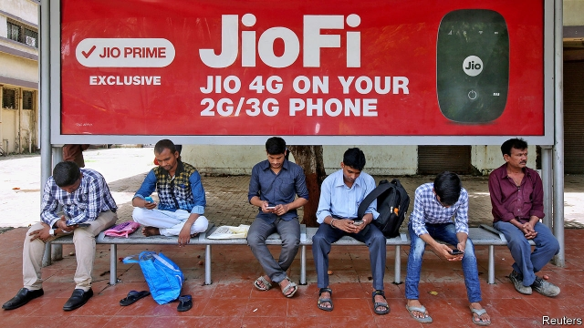

###### Wizard of OS

# KaiOS takes on the Apple-Android mobile duopoly 

##### The three-year-old company will sell 70m smart-ish devices this year, mostly in the developing world 

 

> Apr 27th 2019 

FIREFOX, A WEB browser made by the non-profit Mozilla Foundation, was born as “Phoenix”. It rose from the ashes of Netscape Navigator, slain by Microsoft’s Internet Explorer. In 2012 Mozilla created Firefox OS, to rival Apple’s iOS and Google’s Android mobile operating systems. Unable to compete with the duopoly, Mozilla killed the project. 

Another phoenix has arisen from it. KaiOS, an operating system conjured from the defunct software, powered 30m devices in 2017 and another 50m in 2018. Most were simple flip-phones sold in the West for about $80 apiece, or even simpler ones which Indians and Indonesians can have for as little as $20 or $7, respectively. Smartphones start at about $100. The company behind the software, also called KaiOS and based in Hong Kong, designed it for smart-ish phones—with an old-fashioned number pad and long battery life, plus 4G connectivity, popular apps such as Facebook and modern features like contactless payments, but not snazzy touchscreens. 

Most such devices are found in India. Reliance Jio, a network that has upended the local mobile industry with heavily discounted 4G data plans, sells subsidised, Jio-branded phones that use KaiOS software. A customer at a Jio store in Mumbai’s Bandra district wonders out loud why anyone would pay for a pricier Android smartphone when you can stream cricket and snap selfies on the cheaper JioPhone. KaiOS has signed deals with Orange and MTN, two big networks in Africa. It is eyeing Latin America and the Middle East. 

Google, which invested $22m in Kaios last year, prioritises getting people in emerging markets online, where it can sell their attention to advertisers, over getting them onto Android smartphones. Smart-ish phones help with this. In India they will persist for another decade, reckons Chris Lane of Bernstein, a research firm. But Jio cannot subsidise handsets for ever. Even if KaiOS software powers another 70m devices this year, as the company expects, that would be barely one-twentieth of the 1.5bn Apple and Android phones sold annually. Carving out a niche before ever-cheaper smartphones make its compromises obsolete will not be easy. 

-- 

 单词注释:

1.wizard['wizәd]:n. 男巫, 术士, 奇才 a. 男巫的, 巫术的 [计] 向导 

2.O[әu]:interj. 啊, 唉, 哎呀, 哦 n. 零 [计] 操作, 运算, 输出 

3.duopoly[dju'ɔpәli]:[经] 双头垄断的生产者 

4.APR[]:[计] 替换通路再试器 

5.firefox[]:n. 火狐浏览器 

6.browser['brauzә]:n. 吃嫩叶的动物, 浏览书本的人 [计] 浏览程序 

7.mozilla[]:n. 摩斯拉（浏览器名） 

8.phoenix['fi:niks]:n. 凤凰, 不死鸟, 死而复生的人, 完人, 殊品 

9.netscape[]:n. 美国网景公司 

10.navigator['nævigeitә]:n. 航海家 [法] 领航员, 驾驶员, 航海者 

11.slay[slei]:v. 杀害, 残杀 

12.firefox[]:n. 火狐浏览器 

13.IO['aiәu]:[计] 输入输出 

14.android['ændrɒid]:n. 机器人 [医] 男性样的 [计] Google 公司设计的开源移动端操作系统 

15.phoenix['fi:niks]:n. 凤凰, 不死鸟, 死而复生的人, 完人, 殊品 

16.conjure['kʌndʒә]:vt. 念咒文召唤, 变戏法, 想象 vi. 变戏法, 施魔法 

17.defunct[di'fʌŋkt]:a. 死的, 不能使用的 n. 死者 

18.apiece[ә'pi:s]:adv. 就每个而论, 各 

19.Indonesian[.indәu'ni:ʒәn]:a. 印尼的 n. 印尼人, 印尼语群 

20.smartphones[]: 智能手机（smartphone的复数） 

21.hong[hɔŋ]:n. （中国、日本的）行, 商行 

22.kong[kɔŋ]:n. 含锡砾石下的无矿基岩；钢 

23.connectivity[kәnek'tiviti]:[计] 连通性, 连通度 

24.APP[]:[计] 应用, 应用程序; 相联并行处理器 

25.facebook[]:n. 脸谱网 

26.contactless['kɔntæktlis]:[计] 无接点的, 无接触的 

27.snazzy['snæzi]:a. 华丽的, 华丽而俗气的, 时髦的 

28.touchscreen[tʌtʃɪzk'ri:n]:n. 触摸屏 

29.JIO[]:Joint Information Officer 联合信息官 

30.upend[ʌp'end]:v. 颠倒, 倒放 

31.datum['deitәm]:n. 论据, 材料, 资料, 已知数 [医] 材料, 资料, 论据 

32.subsidise[]:vt. 给...补助金, 津贴, 资助 

33.bandra[]:[网络] 班德拉；印度孟买班德拉；班德拉区 

34.pricy['praisi]:a. 昂贵的, 价格高的 

35.smartphone[]:n. 智能手机 

36.selfies[]:[网络] 自拍照 

37.mtn[]: [医][=malignant trophoblast neoplasm]恶性滋养层瘤 

38.google[]:谷歌；搜索引擎技术；谷歌公司 

39.prioritise[praɪ'ɒrəˌtaɪz]:vt. 给予…优先权; 按优先顺序处理; 出轻重缓急 vi. 把事情按优先顺序排好（等于prioritize） 

40.online[]:[计] 联机 

41.advertiser['ædvәtaizә]:n. 做广告者, 广告客户 [经] 广告商, 广告者 

42.smartphones[]: 智能手机（smartphone的复数） 

43.reckon['rekәn]:vt. 计算, 总计, 估计, 认为, 猜想 vi. 数, 计算, 估计, 依赖, 料想 

44.chris[kris]:n. 克里斯（男子名）；克莉丝（女子名） 

45.Bernstein[bә:n'stein]:[德]琥珀, 伯恩斯坦(姓氏) 

46.cannot['kænɒt]:aux. 无法, 不能 

47.handset['hændset]:n. 电话听筒 

48.annually['ænjuәli]:adv. 一年一次, 每年 [经] 年度的, 每年的 

49.niche[nitʃ]:n. 壁龛 vt. 放入壁龛, 安顿 

50.obsolete['ɒbsәli:t]:a. 荒废的, 成废物的, 陈旧的, 老式的 n. 废词, 废物 

