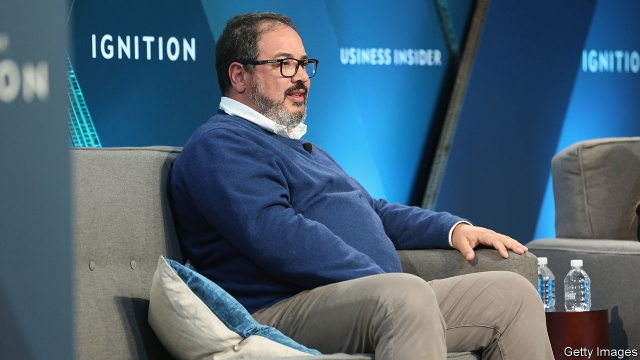
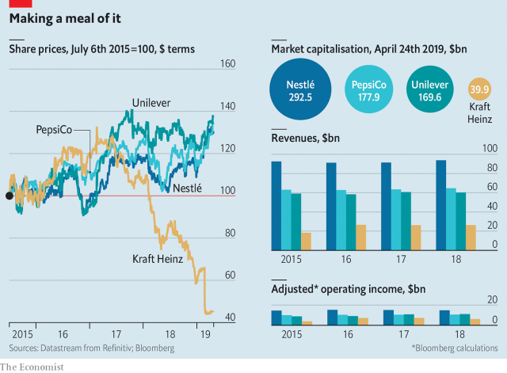

###### A new broom

# Kraft Heinz gets a new boss. Can he save the firm? 

##### Miguel Patricio has a lot of work to do 

 

> Apr 27th 2019 

WHILE WORKING at Coca-Cola, Philip Morris and Johnson & Johnson in the 1990s, Miguel Patricio gained a reputation as a marketing wizard. Shareholders of Kraft Heinz, who appointed him as the food maker’s chief executive on April 22nd, are hoping his magic touch extends to corporate turnarounds. Born of a merger in 2015 between two American icons, Kraft Heinz has struggled to keep up with changes in consumer taste. In February it announced a $15bn impairment, cut its dividend by a third and said that American authorities had launched an inquiry into its procurement practices. Its share price has fallen by 45% in 12 months. 

The new boss replaces Bernardo Hees, a Brazilian who had led Kraft Heinz since the merger. In his previous job as chief marketer at Anheuser-Busch InBev, the world’s biggest brewer, Mr Patricio was credited with increasing the sales of Corona, Budweiser and Stella Artois. The three brands now account for more than one-fifth of AB InBev’s sales. His idea of replacing the Budweiser name with “America” on limited-edition bottles and cans was a hit. 

He is also familiar with Kraft Heinz’s management culture. AB InBev’s biggest shareholder is 3G Capital, the same private-equity firm led by a trio of Brazilians that backs Kraft Heinz. 3G made its name with its quasi-religious devotion to “zero-based budgeting”, a cost-cutting practice whereby managers must justify their expenses anew each year. 

 

Critics claim that 3G’s obsession with slashing costs may have blinded Kraft Heinz to the need to invest in products that appeal to consumers. Sales have been flat since the merger. Operating profits edged up for a few years—until they didn’t (see chart). Even excluding the impairment, margins declined in 2018, while those of rivals such as PepsiCo and Nestlé held up. At Unilever, which Kraft Heinz tried unsuccessfully to buy in 2017, they increased. 

As a marketer rather than a financier like Mr Hees, Mr Patricio may, despite his 3G pedigree, be happier to loosen the purse-strings for investments and research. He may want to buy a rival with a bigger presence in developed markets outside Kraft’s and Heinz’s American home. He insists that he wants to revive illustrious but “dusty” brands, like Kraft Macaroni and Cheese, Philadelphia cream cheese and Planters nuts. Reviving the tarnished image of Kraft Heinz itself is likely to prove considerably trickier. 

-- 

 单词注释:

1.kraft[krɑ:ft]:n. 牛皮纸 

2.heinz[]:n. 海因茨（姓氏）；亨氏食品公司（世界著名的食品供应商, 主要产品包括调味品和餐食两大类） 

3.Miguel[mi'gel]:n. 米格尔（男子名） 

4.Patricio[]:n. (Patricio)人名；(西、葡)帕特里西奥 

5.APR[]:[计] 替换通路再试器 

6.philip['filip]:n. 菲利普（男子名） 

7.morris['mɒ:ris]:n. 莫里斯舞 

8.johnson['dʒɔnsn]:n. 约翰逊（姓氏） 

9.marketing['mɑ:kitiŋ]:n. 行销, 买卖 [经] 推销, 在市场买卖, 销售 

10.wizard['wizәd]:n. 男巫, 术士, 奇才 a. 男巫的, 巫术的 [计] 向导 

11.shareholder['ʃєә.hәuldә]:n. 股东 [法] 股东, 股票持有人 

12.corporate['kɒ:pәrit]:a. 社团的, 合伙的, 公司的 [经] 团体的, 法人的, 社团的 

13.turnaround['tә:nә.raund]:n. 转向, 回车道, 转变 [化] 小修; 预防(性)修理 

14.merger['mә:dʒә]:n. 合并, 归并 [经] 购并 

15.icon['aikɒn]:n. 画像, 肖像, 偶像, 图标, 像标 [计] 像标, 图标 

16.impairment[im'peәmәnt]:n. 削弱, 减少, 损害, 损伤, 危害 [计] 减损 

17.dividend['dividend]:n. 被除数, 股利 [计] 被除数 

18.procurement[prә'kjuәmәnt]:n. 获得 [经] 采购 

19.Bernardo[]:伯纳多（人名） 

20.hee[]:abbr. 家庭娱乐引擎（Home Entertainment Engine）；高情绪表达（High Expressed Emotion）；韩依依（服装品牌） 

21.Brazilian[brә'ziljәn]:n. 巴西人 a. 巴西的, 巴西人的 

22.marketer['mɑ:kitә]:n. 赶集者, 市场商人 [经] 在市场买卖的人, 市场商人 

23.inbev[]:[网络] 英博；英博啤酒集团；英博集团 

24.brewer['bru:ә]:n. (啤酒)制造者, 泡制饮料的器皿 [机] 啤酒工人 

25.corona['kɔrәnә]:n. 冠, 冠状物, 副冠, 根颈, 头顶, 牙冠, 檐板, 日冕, 月华, 日华, 电晕, 光圈 [计] 电晕, 冠 

26.Budweiser[]:n. 百威啤酒 

27.stella[]:[医] 星状绷法; 星 

28.Artois['ɑ:twɑ:]:n. 阿图瓦（法国北部历史地理区和旧省） 

29.ab[æb]:prep. 从, 自 [计] 地址总线 

30.trio['tri:әu]:n. 三重唱 

31.Brazilian[brә'ziljәn]:n. 巴西人 a. 巴西的, 巴西人的 

32.budgeting[]:[计] 预定, 预算 [经] 预算编制 

33.whereby[(h)weә'bai]:adv. 靠什么, 如何, 为何, 靠那个, 因此, 由此 [法] 因此, 由是 

34.anew[ә'nju:]:adv. 重新, 再 

35.obsession[әb'seʃәn]:n. 困扰, 困扰人的情绪 [医] 强迫观念 

36.slash[slæʃ]:v. 猛砍, 乱砍 n. 猛砍, 乱砍, 删减 [计] 斜线 

37.pepsico[]:n. 百事可乐公司（财富500强公司之一） 

38.Unilever[]:n. 联合利华（财富500强公司之一, 总部位于荷兰和英国, 主要经营食品和洗涤用品） 

39.unsuccessfully[]:adv. 无用；失败地 

40.financier[fai'nænsiә]:n. 财政家, 金融家 vi. 从事欺骗性金融活动, 欺骗 

41.pedigree['pedigri:]:n. 血统, 家谱, 名门世系 [法] 家系, 出身, 血统 

42.revive[ri'vaiv]:vt. 使苏醒, 使复兴, 使振奋, 回想起, 重播 vi. 苏醒, 复活, 复兴, 恢复精神 

43.illustrious[i'lʌstriәs]:a. 著名的, 辉煌的, 明亮的 

44.macaroni[.mækә'rәuni]:n. 通心面, 纨绔子弟 

45.Philadelphia[.filә'delfjә]:n. 费城 

46.planter['plæntә]:n. 种植者, 耕作者, 种植机, 花盆 

47.tarnish['tɑ:niʃ]:n. 失泽, 失泽膜, 污点 vt. 使失去光泽, 玷污 vi. 失去光泽, 被玷污 

48.considerably[kәn'sidәrәbli]:adv. 非常地, 很, 颇 

49.tricky['triki]:a. 狡猾的, 机敏的 

