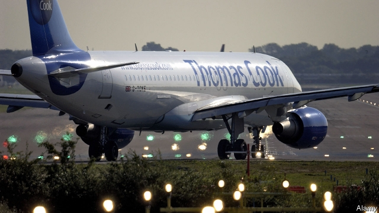

###### Give us a break

# Travel companies Thomas Cook and TUI are under serious stress 

##### The kings of package holidays need to redesign their business for the digital age 

 

> Apr 27th 2019 

THE WORLD’S oldest tour operator is looking for a place in the shade. Since September, when it announced the first of two consecutive profit warnings, Thomas Cook’s share price has fallen by nearly two-thirds. The British company, which sells flights, hotel rooms and tours to 20m holiday-makers, is saddled with £1.4bn ($1.8bn) in debt, three times its market value. IHS Markit, a data provider, estimates that 8% of its stock has been borrowed—typically a signal that short-sellers are circling. 

Easter brought some solace, if only because Thomas Cook’s low valuation has made it an increasingly tempting takeover target. Its shares rose by 18% on April 23rd, after Sky News reported that Fosun, a Chinese conglomerate that is its largest shareholder, and two buy-out firms were interested in parts or the whole of the company. 

Thomas Cook’s woes reflect broader malaise in the industry. On March 29th TUI, its Anglo-German arch-rival and the world’s biggest tourism group, issued a profit warning. Combined, the two companies account for two-thirds of the European package-holiday market. 

Some of the problems are cyclical. Last year’s torrid summer convinced many Europeans to seek sunshine at home. The weak pound has dampened traditionally peripatetic Britons’ enthusiasm for travel. The grounding by authorities around the world of Boeing’s 737 MAX planes after two of them crashed could cost TUI, which owns 15 such aircraft, €300m ($336m). 

But the companies must also grapple with structural changes. From 2015 to 2018 profits barely budged at TUI. Thomas Cook’s fell by 20%. Millennials prefer independent travel to package tours. Low-cost airlines and booking websites have made it easy for people to craft their own holiday, says Vitali Morgovski of Moody’s, a rating agency. Online platforms need no physical stores; Thomas Cook has 566 in Britain. 

To repay its debts Thomas Cook wants to sell its airline business, itself pummelled by competition from low-cost carriers. It has some worthy airport slots but is on the block at the same time as other failing airlines, notes Richard Clarke of Bernstein, a research firm. It wants to bring more retail online and focus on higher-margin premium services. At least TUI has more hotels and a thriving cruise business, which generates a third of its profits. But its prospects hardly look sunny. 

-- 

 单词注释:

1.thoma[]:n. (Thoma)人名；(阿尔巴、阿拉伯)索玛；(英、德、罗、匈、捷、塞、瑞典)托马 

2.tui['tu:i]:n. 蜜雀 

3.redesign[,ri:di'zain]:[化] 重新设计 

4.APR[]:[计] 替换通路再试器 

5.consecutive[kәn'sekjutiv]:a. 连续的, 联贯的 [计] 连续的; 连接的 

6.ih[]:abbr. 测量端（Instrument Head）；间接加热（Indirect Heating）；反时针（Inverted Hour） 

7.Markit[]:un. 拍号 [网络] 麦盖提；马基特经济研究公司；编撰机构 

8.datum['deitәm]:n. 论据, 材料, 资料, 已知数 [医] 材料, 资料, 论据 

9.provider[prә'vaidә]:n. 供应者, 供养人, 伙食承办人 [计] 提供器 

10.solace['sɒlis]:n. 安慰, 安慰之物 vt. 安慰, 抚慰, 给与安慰, 使轻松 

11.valuation[.vælju'eiʃәn]:n. 评价, 估价, 价值判断 [经] 估价, 计价, 评价 

12.takeover[]:n. 接管, 接收 [经] 接收 

13.Fosun[]:[网络] 复星集团；复星国际；复星医药集团 

14.conglomerate[kәn'glɒmәrit]:a. 聚成球形的, 砾岩性的 n. 集成物, 混合体, 砾岩 v. (使)凝聚成团 

15.shareholder['ʃєә.hәuldә]:n. 股东 [法] 股东, 股票持有人 

16.woe[wәu]:n. 悲哀, 悲痛, 苦痛 

17.malaise[mæ'leiz]:n. 不舒服 [医] 不适, 欠爽 

18.cyclical['siklik(e)l]:a. 周期的, 轮转的, 循环的, 轮列的, 轮卷的, 环状的, 环的, 组诗的, 始末的 [计] 循环的 

19.torrid['tɒ:rid]:a. 晒热的, 酷热的, 炎热的 

20.dampen['dæmpәn]:vt. 弄湿, 使沮丧 vi. 变湿, 丧气 

21.traditionally[]:adv. 传统上；传说上；习惯上 

22.peripatetic[.peripә'tetik]:a. 徒步的, 漫游的 n. 走来走去的人, 游历 

23.grounding['graundiŋ]:n. 基础教学, 基础训练 [经] 搁浅 

24.MAX[mæks]:[计] 最大 

25.grapple[græpl]:v. 抓住, 掌握 n. 抓住, 系紧, 掌握, 与...扭打 

26.budge[bʌdʒ]:vi. 微微移动 vt. 推动 n. 羔羊皮 

27.millennials[mɪ'leniəl]:adj. 一千年的；一千年至福的 [网络] 千禧世代；千禧之子；千禧一代 

28.vitali[]:[网络] 维塔利；韦塔利；维大力 

29.online[]:[计] 联机 

30.repay[ri'pei]:v. 偿还, 报答, 报复 

31.pummel['pʌml]:vt. 击, 打, 揍 

32.slot[slɒt]:n. 水沟, 细长孔, 硬币投币口, 缝, 狭槽, 狭通道, 位置, 一档(广播节目等) vt. 开槽于, 把...纳入机构 [计] 槽; 存储槽 

33.richard['ritʃәd]:n. 理查德（男子名） 

34.clarke[]:n. 克拉克（姓氏） 

35.Bernstein[bә:n'stein]:[德]琥珀, 伯恩斯坦(姓氏) 

36.online[]:[计] 联机 

37.premium['pri:miәm]:n. 额外补贴, 奖金, 奖赏, 保险费 [医] 保险费 

38.cruise[kru:z]:n. 巡航, 巡弋, 漫游 v. 巡航, 巡弋, 漫游 

