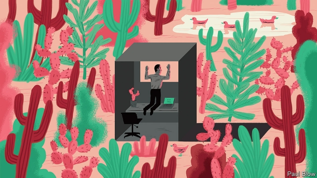

###### Bartleby

# Working in an attractive environment is good for employees 

##### Creative workers need nice surroundings 

 

> Apr 27th 2019 

LOOK OUT of the window of your workplace. Is the vista pleasing? Can you see trees and grassy areas, or barbed wire and rubbish bins? Do you enjoy leaving the building at lunchtime or would you rather stay chained to your desk? 

A review of the academic literature* suggests that indoor work environments (in particular factors like light, noise and temperature) have an impact on employee productivity. WeWork’s business model is based on the idea that attractive offices, with common areas and leisure activities, will appeal to small businesses and freelance workers. If a positive office interior helps, it makes sense that a nice outdoor environment should boost morale too. 

The ancient universities clearly believed in building quiet cloisters where academics would have the freedom to think. Big technology companies in California usually aim for a similar effect—and have the finances (plus the space) available to achieve it. Corporate campuses have also been adopted by their Indian counterparts, like Infosys in Bengaluru or Tata Consultancy Services in Chennai. But these projects tend to be built by giant multinationals who employ lots of workers on a single site, out of town with lots of parking space. 

Those who work in a big city are typically resigned to being stuck in cramped conditions, surrounded by busy roads. But there are exceptions. Chiswick Park in west London is the kind of area that local residents like to frequent on their days off. It has its own waterfall and lake, where ducks have taken up residence, and there are tree-shaded lawns where one can picnic on sunny summer days. The actively minded can head for a recreation area to play basketball or five-a-side football. 

During the week, however, 9,000 people flock into the park’s 12 office buildings. They are home to 73 businesses, including big media companies like Paramount and CBS, Japanese conglomerates such as Sony and Mitsubishi, and Danone, a French food conglomerate. 

The area used to be a London Transport bus depot, which explains the abundance of space. It was first developed 20 years ago by Stuart Lipton (who also built Broadgate, an office complex in London’s financial district) but bits of infrastructure are still being erected. In January a footbridge was installed over a railway junction to provide access to the nearby Chiswick Park underground station. 

Matt Coulson is the chief executive of the site’s management company, Enjoy-Work, which is part-owned by Blackstone, a private-equity group. Mr Coulson, who previously worked for Centreparcs, a holiday camp, talks about “guests” rather than workers or tenants, and says his focus is services. The autumn brings firework displays and when the weather is good, the site holds food fairs, concerts or other events. A zip wire is occasionally hung from the tallest buildings for the pleasure of thrill-seeking workers. 

Anyone who has visited a tech company headquarters will recognise other quirks such as guitars in the lobby or bikes for hire. Bartleby was shown around one newly renovated workspace; with its comfy chairs and pool table, it might have been the lounge of an upmarket hotel. 

The cynical view of such facilities is that they aim to keep employees in the office for as long as possible. If you can eat, go to the gym and even get your dry cleaning done at work, why go home? 

The industrial revolution led to workers being shepherded into factories with rigid rules and repetitive tasks. Later, workers moved to stultifying offices where they sat in regimented rows of desks and waited impatiently for the clocks to hit 5pm. But futurists constantly warn that routine tasks will be automated and humans will focus on more creative endeavours. That suggests the need for different working spaces, which encourage independent thought. 

The danger, as with many aspects of the future economy, is of another class divide. On top of fat pay cheques, luxury offices with top-notch facilities nestled in attractive parks for the fortunate few who code for big tech groups or run profitable multinationals; unfulfilling jobs in “fulfilment centres” and dingy office blocks for the rest. On the bright side, humble drudges will at least still have a reason to head home. 

* An Overview of the Influence of Physical Office Environments towards Employees by N Kamarulzaman, A A Saleh, S Z Hashim, H Hashim and A A Abdul-Ghani, Procedia Engineering, 2011 

-- 

 单词注释:

1.bartleby[]:[网络] 巴特比；巴特白；老板是空气 

2.APR[]:[计] 替换通路再试器 

3.vista['vistә]:n. 远景, 展望, 回想 

4.grassy['græsi]:a. 草绿色的, 象草的, 长满草的 

5.barbed[bɑ:bd]:a. 有倒刺的 

6.lunchtime['lʌntʃtaim]:n. 午餐时间 

7.productivity[.prәudʌk'tiviti]:n. 生产力 [经] 生产率, 生产能力 

8.freelance[]:n. 自由作家, 自由投稿, 自由职业者 a. 自由投稿的 

9.morale[mɒ'rɑ:l]:n. 士气, 道德 

10.cloister['klɒistә]:n. 修道院, 回廊 vt. 使与尘世隔绝 

11.California[.kæli'fɒ:njә]:n. 加利福尼亚 

12.corporate['kɒ:pәrit]:a. 社团的, 合伙的, 公司的 [经] 团体的, 法人的, 社团的 

13.counterpart['kauntәpɑ:t]:n. 副本, 复本, 配对物, 相应物 [经] 副本, 正副二份中之一 

14.infosys[]:[网络] 印孚瑟斯；印孚瑟斯技术；信息系统技术公司 

15.Bengaluru[]:[网络] 班加罗尔；班加罗尔市中心；印度班加罗尔 

16.tata[.tæ'tɑ:. .tɑ:-]:int. [英国口语]再见 

17.consultancy[]:n. 商量, 协商, 磋商, 会诊, 与...商量, 咨询, 请教, 找(医生)看病, 查阅, 考虑 [经] 咨询业务, 咨询服务 

18.chennai[tʃə'nai]:n. 金奈（印度的第四大城市） 

19.multinational[.mʌlti'næʃәnl]:a. 多国的, 跨国公司的 n. 跨国公司 

20.typically['tipikәli]:adv. 代表性地；作为特色地 

21.cramp[kræmp]:n. 痉挛, 腹部绞痛, 铁夹钳 a. 狭窄的, 难认的 vt. 使抽筋, 以铁箍扣紧, 束缚 

22.Chiswick[]:奇斯威克（地名） 

23.actively['æktivli]:adv. 活跃地, 积极地 

24.paramount['pærәmaunt]:n. 首长, 最高当局 a. 最重要的, 最高的, 至上的 

25.cbs[]:abbr. 哥伦比亚广播公司（Columbia Broadcasting System）；共电式振铃设备（Central [Common] Battery Signalling） 

26.conglomerate[kәn'glɒmәrit]:a. 聚成球形的, 砾岩性的 n. 集成物, 混合体, 砾岩 v. (使)凝聚成团 

27.sony[]:n. 索尼（日本电子娱乐公司） 

28.Mitsubishi[mi'tsubiʃi]:[经] 三菱 

29.danone[]:[网络] 达能；达能集团；法国达能 

30.depot['depәu]:n. 停车场, 车站, 贮藏所, 仓库 [医] 仓库, 贮存, 积存 

31.abundance[ә'bʌndәns]:n. 丰富, 充足, 大量 [经] 丰富, 充裕 

32.stuart[stjuәt]:n. 英国斯图亚特王室；斯图尔特（男子名, 等于Stewart） 

33.lipton['liptәn]:n. 李普顿（姓氏）；立顿公司（英国公司名, 出品茶饮料等） 

34.broadgate[]:[网络] 老门；布劳德盖特；特吉脱公司 

35.infrastructure['infrәstrʌktʃә]:n. 基础结构, 基础设施 [经] 基础设施 

36.footbridge['futbridʒ]:n. 人行桥 

37.junction['dʒʌŋkʃәn]:n. 连接, 会合处, 交叉点 [医] 接[合]处, 接点.[接]界 

38.matt[mæt]:a. 表面暗淡的, 无光泽的, 表面粗糙的, 不光滑的 [医] 无光泽 

39.COULSON[]:库尔森 

40.Blackstone[]:n. 百仕通集团（即黑石集团, 全球最大私募基金公司）；布莱克斯通（英国前文化部长）；黑石镇（美国马萨诸塞州的一个镇） 

41.centreparcs[]:[网络] 帕克斯中心；中心公园 

42.tech[tek]:n. 技术学院或学校 

43.headquarter[,hed'kwɔ:tә]:vt. 将...的总部设在 

44.quirk[kwә:k]:n. 古怪举动, 俏皮话, 急转 

45.lobby['lɒbi]:n. 大厅, 休息室, 游说议员者 vi. 游说议员, 游说 vt. 游说 

46.renovate['renәuveit]:vt. 更新, 革新, 刷新, 修复, 使恢复活力 

47.workspace[]:[计] 工作区 

48.comfy['kʌmfi]:a. 舒服的,轻松的 

49.upmarket[ˌʌpˈmɑ:kɪt]:a. 高级的, 高档的, 高端的 

50.cynical['sinikәl]:a. 愤世嫉俗的, 讽刺的, 冷嘲的 

51.repetitive[ri'petitiv]:a. 重复的, 反复性的 

52.stultify['stʌltifai]:vt. 使显得愚笨, 使变无效 

53.regiment['redʒimәnt]:n. （军队）团, 大量（人或物） v. 组编成团，组织，严格管制 

54.impatiently[]:adv. 不耐烦, 忍受不了, 急躁, [表]急欲, 急切 

55.futurist['fju:tʃәrist]:n. 未来派画家, 未来主义者 

56.constantly['kɒnstәntli]:adv. 不变地, 不断地, 时常地 

57.automate['ɔ:tәmeit]:vt.vi. (使)自动化 [计] 自动化 

58.endeavour[in'devә]:n. 努力, 力图, 尽力 vi. 努力, 力图, 尽力 

59.nestle['nesl]:vi. 舒适地坐定, 挨靠, 偎依 vt. 抱, 安置 

60.fulfilment[]:n. 履行, 结束, 完成, 实现, 满意, 称心 [法] 履行, 实现, 完成 

61.dingy['diŋdʒi]:a. 暗淡的, 昏暗的, 邋遢的 

62.drudge[drʌdʒ]:n. 做苦工的人 vi. 辛苦地从事 vt. 强迫做苦工 

63.overview['әuvәvju:]:n. 概述, 概观, 总的看法 [计] 概述 

64.N[en]:[计] 负的, 数, 编号, 纳 [医] 氮(7号元素), 当量的, 规度的(溶液) 

65.Saleh[]:n. 萨利赫（人名） 

66.S[es]:[计] 标量, 服务员, 符号, 堆栈, 状态, 存储器, 开关, 同步, 系统 [医] 硫[黄](16号元素); 半; 骶骨的; 标记, 用法签; 光滑; 左的; 上转 

67.Z[zed; (?@) zi:]:[计] 阻抗, 零, 零标志 [医] 原子序数 

68.hashim[]:[网络] 哈希姆；哈西姆；哈闪 

69.H[eitʃ]:[计] 硬件, 高度, 水平, 主机 [医] 氢(1号元素), 亨[利](电感单位) 

