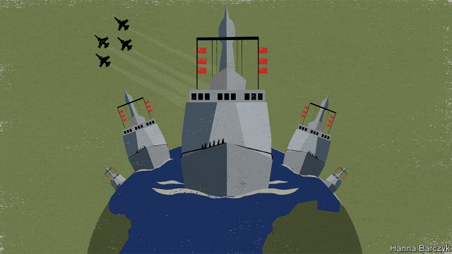

###### Chaguan

# China throws a revealing party for the anniversary of its navy 

##### Its maritime ambitions are becoming more evident 

 

> Apr 25th 2019 

AS MILITARY PAGEANTS go, multinational parades of warships deliver quite a complex message. Over a dozen countries—ranging from friends to overt rivals—sent naval vessels to the eastern Chinese city of Qingdao on April 23rd. There they steamed past a destroyer carrying China’s commander-in-chief, President Xi Jinping, in honour of the 70th anniversary of the founding of the People’s Liberation Army Navy. 

Paint gleaming and brass fittings buffed to a hospital shine, there were frigates from near-allies such as Russia, and destroyers from almost-foes like India. Their mission was friendship and diplomacy. But these were heavily armed peace envoys, warily visiting a China whose emergence as an ocean-going nation is shaking Asia, and may one day change the world. Visitors involved in territorial disputes with China, including Japan and Vietnam, sent ships bristling with weaponry. America sent no ships at all. 

China sent mixed messages, too. As the celebrations began, the visitors were hailed by Mr Xi as a sort of floating United Nations. A peace-loving China yearned to work with foreign navies to secure international sea-lanes and safeguard the ocean’s riches, Mr Xi declared. On state television presenters noted that, as a mainstay of anti-piracy patrols in the Gulf of Aden since 2008, the Chinese navy had escorted more than 6,600 ships, from China and other countries, through bandit-infested waters. 

Then came the bit which many Chinese viewers probably preferred: shots of their newest warships, dwarfing foreign visitors. Along came a Chinese ballistic-missile submarine—nuclear-powered and designed for destroying enemy cities, not arresting Somali pirates. It glided past the destroyer carrying Mr Xi, who boarded wearing a dark Mao suit befitting his other jobs as the Communist Party’s general secretary and chairman of the Central Military Commission. “Comrades, greetings!” barked Mr Xi over a radio. “Chairman, greetings!” came the submariners’ shouted reply. On state television, presenters compared China’s newest destroyer, the 10,000-tonne Type 055, to the most powerful of America’s. Screens filled with archive footage of jets roaring from the deck of the Liaoning, China’s first aircraft-carrier. 

On shore in the handsome, fog-shrouded port city of Qingdao, bilingual posters celebrating the naval anniversary offered variations on Mr Xi’s favourite diplomatic slogans, such as: “The ocean connects us all, a community with a shared future.” Others, in Chinese, hailed the navy’s role as a political force, under the direct control of Mr Xi as the party’s chief. A banner outside Qingdao’s naval museum suggested that Mr Xi’s peace of mind was the ultimate test of naval modernisation. “Obey Chairman Xi’s commands. Answer to Chairman Xi. Let Chairman Xi be reassured,” it read. 

Cui Junkai, a 19-year-old student, had travelled from the city of Chengdu, hundreds of kilometres inland, for the fleet review. The parade-eve found Mr Cui in Qingdao’s naval museum, inspecting a wooden torpedo-boat from the years when China’s navy was merely a “brown-water” one, tasked with launching guerrilla attacks in muddy coastal waters. A mighty navy offers China a double benefit, Mr Cui said. “It not only defends the nation, but demonstrates our power to the outside world.” 

Behind the teenager, rusty patrol boats bobbed at the museum quayside, recalling the decades when China boasted a “green-water navy”, capable of intimidating smaller neighbours but powerless when American battle-groups steamed by. That navy was a defensive force that aimed to ward off seaborne threats, not to project power over far horizons. In 1990 China’s then-president, Jiang Zemin, urged the navy to be “the motherland’s Great Wall at sea”. The next Communist leader, Hu Jintao, signalled a change in 2012 when he called for China to become a “great maritime power”. The navy saw its budgets soar and its fleet quality transformed. China now has the region’s largest navy, with over 300 surface and underwater vessels, the Pentagon reported last year. It will have as many as 78 submarines by 2020, up from 56 in 2018, says the Pentagon. 

Chinese scholars have pored over the theories of Alfred Thayer Mahan, an American navy captain and 19th-century writer on “sea power” as a source of global strength resting on three pillars: commerce, naval firepower and access to far-flung bases. Mahan was a prescient man. In a report from China’s first naval base abroad, which opened in Djibouti last year, Chinese state television included a revealing on-camera prediction from the base’s political commissar: that support for far-flung missions would increasingly depend on such facilities. 

Such talk alarms military chiefs in America and other countries. Their anxiety in turn worries Hu Bo, a leading maritime strategist at Peking University. For as China’s navy rises it has more than one goal, he says. First, to become a blue-water navy capable of providing security worldwide, which may perhaps involve opening a few more bases, for instance around the northern Indian Ocean. China’s other goal is “near-sea control”, Mr Hu says, meaning the capability to contain any threat in the western Pacific and northern Indian oceans—just as America and Russia currently enjoy comparative advantages close to home. That does not mean that China can or will evict all American ships from the South China Sea or other nearby waters, Mr Hu insists. In a generation’s time he can imagine a more restrained America and a more confident China reaching a new balance of power in those near seas, after a period of competition. The dangerous period is the next five or ten years, he says. “China’s capability is growing fast, but the United States is not ready to grant China status matching that power.” 

A balance must be reached, though. After millennia as an agrarian, continental power, China is a maritime nation, bound to the seas by strategic and commercial interests. Few foreigners would recognise the Chinese naval ensign today. That will change. 

-- 

 单词注释:

1.maritime['mæritaim]:a. 海的, 海上的, 海事的, 沿海的, 海员的 [经] 海事的, 海上的, 海员的 

2.APR[]:[计] 替换通路再试器 

3.pageant['pædʒәnt]:n. 盛会, 游行, 虚饰, 露天表演 

4.multinational[.mʌlti'næʃәnl]:a. 多国的, 跨国公司的 n. 跨国公司 

5.warship['wɒ:ʃip]:n. 军舰, 战船 

6.overt['әuvә:t]:a. 明显的, 公然的, 蓄意的 [法] 明显的, 公开的 

7.qingdao['tʃiŋ'daj]:n. 青岛（中国山东省地名） 

8.destroyer[di'strɒiә]:n. 破坏者, 消灭者, 起破坏作用的东西, 驱逐舰 

9.gleam[gli:m]:n. 光束, 微光, 反光 vi. 闪烁, 隐约地闪现 vt. 使发微光, 使闪烁 

10.fitting['fitiŋ]:a. 适宜的 n. 试穿, 试衣, 装配, 装置 

11.buff[bʌf]:n. 暗黄色, 暗黄色皮革, 人的皮肤 vt. 擦亮, 使柔软 a. 暗黄色的 

12.frigate['frigit]:n. 装有大炮的快速帆船, 护卫舰 

13.diplomacy[di'plәumәsi]:n. 外交, 外交手腕, 交际手段 [法] 外交, 外交手腕, 权谋 

14.envoy['envɒi]:n. 外交使节, 特使 [法] 使者, 代表, 使节 

15.warily['wєәrili]:adv. 谨慎地, 留心地, 小心地 

16.emergence[i'mә:dʒәns]:n. 出现, 浮现, 发生 

17.territorial[.teri'tɒ:riәl]:a. 领土的, 土地的, 地方的, 区域性的 n. 本土自卫队队员 

18.Vietnam[.vjet'næm]:n. 越南 

19.weaponry['wepәnri]:n. 武器, 军备, 武器设计研制学 

20.hail[heil]:n. 冰雹, 致敬, 欢呼, 招呼 vt. 向...欢呼, 致敬, 招呼, 使象下雹样落下 vi. 招呼, 下雹 interj. 万岁, 欢迎 

21.yearn[jә:n]:vi. 渴望, 想念, 怀念, 同情 

22.safeguard['seifgɑ:d]:n. 保卫, 保护措施, 防护设施 vt. 保卫, 保护 

23.riche[]:n. 暴发户 

24.presenter[pri'zentә]:n. 节目主持人, 奉献者, 提出者 [法] 告发者, 提出者, 推荐者 

25.mainstay['meinstei]:n. 主桅支索, 支柱, 中流砥柱 

26.patrol[pә'trәul]:n. 巡逻, 巡逻员, 侦察队 v. 巡逻, 巡视 

27.Aden['eidn]:n. 亚丁(也门城市) 

28.escort['eskɒ:t]:n. 护送者, 护卫者, 护航舰 vt. 护卫, 护送 

29.dwarf[dwɒ:f]:n. 矮子, 侏儒 v. (使)变矮小 

30.Somali[sәu'mɑ:li]:n. 索马里人 

31.pirate['paiәrәt]:n. 海盗, 盗印者, 侵犯专利权者 vt. 盗印, 掠夺, 翻印 vi. 做海盗, 从事劫掠 

32.befit[bi'fit]:vt. 适合于, 适宜于 

33.archive['ɑ:kaiv]:vt. 把...存档 n. 档案馆, 档案文件 [计] 挡案库, 存档 

34.footage['futidʒ]:n. 英尺长度, 英板尺, (影片的)连续镜头 

35.Liaoning['ljaj'niŋ]:辽宁(位于中国东北地区南部) 

36.bilingual[bai'liŋgwәl]:a. 双语的 

37.diplomatic[.diplә'mætik]:a. 外交的, 老练的 [法] 外交的, 外交上的, 文献上的 

38.modernisation[,mɔdәnai'zeiʃәn;-ni'z-]:n. <主英>=modernization 

39.reassure[.ri:ә'ʃuә]:vt. 使...安心, 向...再保证 [法] 重新保证, 再保险, 使清除疑虑 

40.cui[]:abbr. 字符用户界面（Character User Interface）；命令用户界面（ 	Command User Interface）；沪铜指数 

41.chengdu['tʃʌŋ'du:]:n. 成都市（中国四川省省会） 

42.guerrilla[gә'rilә]:n. 游击队 

43.coastal['kәustәl]:a. 海岸的, 沿海的, 沿岸的 [法] 海岸的, 沿海的 

44.mighty['maiti]:n. 有势力的人 a. 有势力的, 强大的, 有力的 adv. 很, 极 

45.bob[bɒb]:vt. 剪短, 敲击 vi. 振动, 上下跳动 n. 短发, 悬挂的饰品, 浮子, 摆动, 轻敲, 5便士 

46.quayside['ki:said]:n. 码头区 

47.powerless['pauәlis]:a. 无力的, 无权的, 无效能的 

48.defensive[di'fensiv]:a. 防卫的, 防备用的, 自卫的 n. 守势, 防卫姿势, 防卫物 

49.seaborne['si:bɒ:n]:a. 海上的, 漂流的 [经] 海运的, 由海轮装运的 

50.Jiang[]:江 蒋 姜（中国姓氏） 

51.zemin[]:[网络] 江 

52.hu[]:abbr. 海南航空公司在国际航空运输协会中的二字代码；匈牙利（Hungary）；英国无国界卫生组织（Health Limited） 

53.jintao[]:[网络] 胡锦涛 

54.soar[sɒ:]:n. 高扬, 翱翔 vi. 往上飞舞, 高耸, 翱翔 

55.underwater['ʌndә'wɒ:tә]:a. 在水中的 adv. 在水下 

56.pentagon['pentәgәn]:n. 五角形, 五边形 [经] 五角平台 

57.pore[pɒ:]:n. 毛孔, 小孔, 气孔 vi. 专心阅读, 细想, 钻研, 沉思, 注视 vt. 使注视得 

58.alfred['ælfrid]:n. 阿尔佛雷德（男子名） 

59.thayer[]:n. 金缕梅；泰勒；赛耶（人名） 

60.Mahan[mә'hæn]:马汉(Alfred Thayer, 1840-1914, 美国海军军官、史学家) 

61.firepower['faiәpauә]:n. 火力 

62.prescient['presiәnt]:a. 预知的, 有先见之明的 

63.Djibouti[dʒi'bu:ti]:吉布提[非洲] 

64.prediction[pri'dikʃәn]:n. 预言, 预报 [化] 预测 

65.strategist['strætidʒist]:n. 战略家 

66.Peke[pi:k]:n. <口>狮子狗,哈巴狗(原产于中国的一种玩赏狗) 

67.capability[.keipә'biliti]:n. 能力, 性能, 约束力 [化] 能力 

68.currently['kʌrәntli]:adv. 现在, 当前, 一般, 普通 [计] 当前 

69.evict[i'vikt]:vt. 逐出, 赶出, 驱逐 [法] 逐出, 驱逐, 没收 

70.statu[]:[网络] 状态查看；雕像；特级雪花白 

71.millennia[mi'leniә]:一千年, 千年周年纪念日, 千年庆典, 千年期, (喻)太平盛世, 想象中的黄金时代 

72.agrarian[ә'grєәriәn]:a. 土地的, 耕地的 [法] 土地的, 土地所有制的 

73.continental[.kɒnti'nentl]:a. 大陆的, 洲的 n. 欧洲大陆人 

74.ensign['ensain]:n. 旗, 海军少尉, 徽章 

