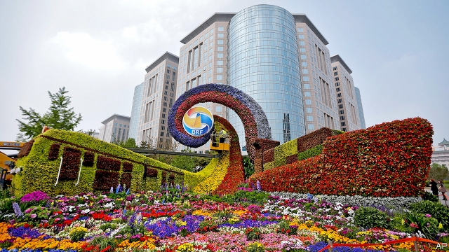
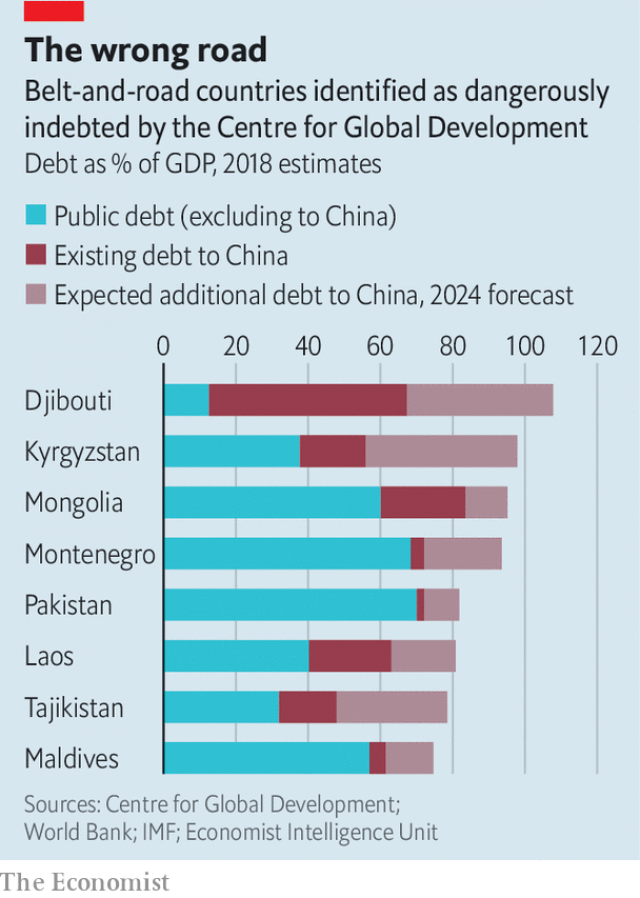

###### A trap of one’s own

# China tries to calm jitters about the “Belt and Road” initiative 

##### Though belt-and-road lending is worrisome, it is not malevolent. The real problem is overreach 

 

> Apr 25th 2019 

CHINESE ENGINEERS are drilling their way through the green hills of Laos, clearing a path for a railway that one day may traverse South-East Asia. Each time they complete a tunnel—at least three times in the past month—they hold a brief ceremony, waving Chinese flags for the cameras. They are celebrating not just their engineering success but also the evidence before them that the Belt and Road Initiative (BRI), China’s global infrastructure-building scheme, is making progress. The full railway is a long way off. Work has barely begun in Thailand, the next link. But the section in Laos should be in use by 2021. 

It will be a test of what many see as a big economic danger of the BRI: that it will saddle poor countries with unmanageable debts. China insists that its tens of billions of dollars in loans and investments are fostering global prosperity—a message that it is sure to repeat to foreign leaders attending the second Belt and Road Forum, which takes place from April 25th to 27th in Beijing (pictured is a floral display marking the event). But worries about the cost of the BRI, a project closely linked with President Xi Jinping’s foreign policy, have become widespread. Malaysia, Pakistan and Sierra Leone are among a growing list of countries that have delayed or scrapped China-led projects. 

There are three main concerns about the BRI’s financial consequences. The most extreme is that the scheme involves what is pithily described as “debt-trap diplomacy”. In this view, China is deliberately overloading weak countries with loans; when they buckle, it seizes their assets and influences their politics. This idea has featured in speeches by some American officials, including the vice-president, Mike Pence, who see BRI as an attempt to undermine America’s global influence. 

Yet the investments funded by Chinese cash are not in China, so China has limited ability to grab assets when governments default. If it pushes too hard it may merely stoke antipathy. Instead, it usually responds by reducing the amount of money that debtors have to repay. Countries with longer records of lending to poor countries often do the same: the Paris Club of creditors was formed in 1956 to devise ways of reducing defaulters’ debt loads. The Centre for Global Development, a think-tank in Washington, has counted more than 80 cases between 2000 and 2017 in which China provided relief to its debtors overseas. 

An oft-cited example of China’s supposedly predatory approach involves Hambantota, a Sri Lankan port which has flopped commercially. In 2017 Sri Lanka handed control of the port to a state-owned Chinese company on a 99-year lease. But Deborah Brautigam of Johns Hopkins University says that of more than 3,000 China-financed projects that she and others have tracked, Hambantota is the only one that is used in support of the debt-trap theory. It is the exception, not the rule. 

What it lacks in malevolence, the BRI may make up in clumsiness. This is the second concern: that China is lending to vulnerable states without sufficient caution. Take a group of 37 poor countries monitored by the IMF. Loans from traditional bilateral lenders, including America and Japan, have declined from 7% of the debtors’ GDP to 2% over the past decade. Loans from China, by contrast, have soared from virtually nothing to 4%. 

It is welcome that China is supporting hard-up nations. But its enthusiasm generates foolhardiness. David Dollar of the Brookings Institution in Washington has found that Chinese development lending appears indifferent to political and economic risks. The Centre for Global Development has identified eight countries drowning in red ink that could be further swamped by BRI projects (see chart). A report in December released by Peking University ranked 94 BRI countries based on measures such as the quality of their financial regulation and their openness to trade. Pakistan came second to last. That is awkward for China: Pakistan may receive as much as $60bn in BRI loans, which would make it the biggest recipient of all. 

 

There is truth to claims that BRI credit can be ruinously expensive. Consider China Eximbank’s lending to Kenya for the Nairobi-Mombasa railway. Local reports say half the $3.6bn loan was priced 3.6 percentage points above a floating market interest-rate. That is high for a poor country. It is just one of many such loans by Eximbank, which said this week that its outstanding BRI-related credit was more than 1trn yuan, or nearly $150bn. 

The BRI’s success will depend on whether Chinese lenders can tighten their procedures for assessing creditworthiness while making their loans more affordable. There are some promising signs. This week’s forum in Beijing is expected to stress the need for BRI debt to be sustainable. In the case of the railway in Laos, caution is already evident. The project involves $6bn of Chinese lending, which is about one-third of the GDP of Laos. So a joint venture has been created. It draws 70% of its capital from China and 30% from Laos. To fund its portion, Laos took a $465m loan from Eximbank. The loan was generous, according to local reports: it matures in 35 years at a 2.3% annual interest rate, well below the commercial price of such debt. Laos has five years before it has to begin making repayments. That is the kind of concession that it might have got from the World Bank. China may offer such generous terms more frequently. Last year it set up an agency to oversee its foreign aid, in part to turn the BRI into a more co-ordinated development programme. 

But this points to another concern that will be harder for China to deal with because it relates to the very nature of the BRI: its sheer ambition. Potential benefits look impressive. A recent study by the World Bank concluded that BRI transportation projects could lift global GDP by 3%. That is larger than the benefits that are usually shown to be generated by free-trade agreements. It could yet bear out China’s notion that Westerners (save Donald Trump) just want to lower tariffs, whereas China is trying to build the roads that let trade happen. 

This, though, is where the risks come in. The World Bank’s rosy analysis assumes that BRI projects are completed and work efficiently. The scale of the effort is a huge challenge, and such projects are a magnet for graft. Vast sums are being spent quickly in badly run places. The railway in Laos ought to make the landlocked country more accessible. But for it to prove effective, much more will be needed: better roads to link it to existing transport, new urban centres around the stations and freer trade with other countries. 

China cannot achieve this alone, but its often overweening approach to the BRI has alienated potential partners. America, India and Japan want little to do with it. One reason is that China is, in effect, asking others not only to sign up to its infrastructure plans but also to endorse Mr Xi’s worldview. It does not help that China reveals so little about its lending and that contracts go mainly to Chinese firms. 

Some analysts in China have started to express unease. Economists at the Chinese Academy of Social Sciences, a think-tank, argued in a paper last year that the government must entice other countries to back BRI projects in order to share the risks. Otherwise, it could be China that finds itself trapped. Conservative estimates are that China will spend $1trn within the next decade on its monumental scheme—about as much as it holds today in American government bonds. Mr Xi would be wise not to let such an outlay turn sour. 

-- 

 单词注释:

1.jitter['dʒitә]:vi. 神经过敏, 战战兢兢 [计] 跳动; 抖动 

2.worrisome['wʌrisәm]:a. 令人烦恼的, 麻烦的, 劳碌命的 

3.malevolent[mә'levәlәnt]:a. 有恶意的, 坏心肠的 

4.overreach[.әuvә'ri:tʃ]:vt. 扩展...以上, 过度伸张, 走过头 vi. 伸得过远, 过分, 过火 

5.APR[]:[计] 替换通路再试器 

6.lao[lau, 'lɑ:әu]:n. 老挝语；老挝人 

7.traverse['trævә:s]:n. 越过, 横贯, 横断物, 屏障, 否认, 反驳 vt. 横过, 穿过, 经过, 详细研究, 反对, 在...来回移动 vi. 横越, 横断, 旋转, 来回移动 a. 横亘的, 横贯的 

8.BRI[]:[计] 基本速率综合业务数字网 

9.Thailand['tailәnd]:n. 泰国 

10.unmanageable[.ʌn'mænidʒәbl]:a. 难管理的, 难处理的, 难操纵的, 处理不了的 [化] 难以加工的; 难以控制的; 难以管理的 

11.tens[]:十位 

12.foster['fɒstә]:a. 收养的, 养育的 vt. 养育, 抚育, 培养, 鼓励, 抱(希望) 

13.forum['fɒ:rәm]:n. 论坛, 公开讨论的广场, 法庭, 讨论会 [法] 讨论会, 专题讨论, 公共论坛 

14.floral['flɒ:rәl]:a. 花似的, 花的, 植物的 

15.Malaysia[mә'leiziә]:n. 马来西亚 [经] 马来西亚 

16.Pakistan[.pɑ:ki'stɑ:n]:n. 巴基斯坦 

17.sierra[si'єәrә]:n. 呈齿状起伏的山脉 

18.Leone[li:'әun]:[经] 里昂 

19.scrap[skræp]:n. 碎片, 残余物, 些微, 片断, 铁屑, 吵架 vt. 扔弃, 敲碎, 拆毁 vi. 互相殴打 a. 零碎拼凑成的, 废弃的 

20.pithily['piθili]:adv. 简洁有力地 

21.diplomacy[di'plәumәsi]:n. 外交, 外交手腕, 交际手段 [法] 外交, 外交手腕, 权谋 

22.overload[.әuvә'lәud]:vt. 超载, 过载, 超过负荷 n. 超载, 负荷过多 

23.buckle['bʌkl]:n. 皮带扣, 扣子 vt. 扣住, 使弯曲 vi. 扣住, 变弯曲, 屈服 

24.asset['æset]:n. 资产, 有益的东西 

25.politic['pɒlitik]:a. 精明的, 明智的, 策略的 

26.mike[maik]:vi. 偷懒, 游手好闲 n. 休息, 游手好闲, 扩音器, 话筒 

27.undermine[.ʌndә'main]:vt. 在...下面挖, 渐渐破坏, 暗地里破坏 [法] 暗中破坏, 以阴谋中伤伤害 

28.grab[græb]:n. 抓握, 掠夺, 强占, 东方沿岸帆船 vi. 抓取, 抢去 vt. 攫取, 捕获, 霸占 

29.default[di'fɒ:lt]:n. 违约, 不履行责任, 缺席, 默认值 v. 疏怠职责, 缺席, 拖欠, 默认 [计] 默认; 默认值; 缺省值 

30.stoke[stәuk]:v. 司炉, (使)大吃 

31.antipathy[æn'tipәθi]:n. 厌恶, 反感 [医] 反感, 厌恶; 相克疗法 

32.debtor['detә]:n. 债务人, 借主, 借方 [法] 负债者, 债务人, 借方 

33.repay[ri'pei]:v. 偿还, 报答, 报复 

34.creditor['kreditә]:n. 债权人 [法] 债权人, 债主, 贷方 

35.Washington['wɒʃiŋtn]:n. 华盛顿 

36.oversea['әuvә'si:]:adv. 海外, 向国外, 向海外, 国外 a. 外国的, 在国外的, 在海外的, 舶来的 

37.supposedly[sә'pәuzidli]:adv. 想象上, 看上去像, 被认为是, 恐怕, 按照推测 

38.predatory['predәtәri]:a. 掠夺成性的, 捕食生物的, 掠夺的 [医] 捕食的 

39.Hambantota[]:[地名] 汉班托特 ( 斯里 ) 

40.sri[sri]:n. 斯里兰卡（Sri Lanka）；（拉）神圣罗马帝国（Sacrum Romanum Imperium） 

41.lankan[]:[网络] 斯里兰卡南部的兰坎市 

42.flop[flɒp]:n. 砰然落下, 拍击声, 失败 vi. 笨重地摔, 猛落 vt. 笨拙地抛下 adv. 噗通 

43.commercially[]:adv. 商业上；通商上 

44.lanka[]:n. 兰卡；楞伽 

45.lease[li:s]:n. 租约, 租期, 租 vt. 出租, 租出, 租得 

46.deborah['debәrә]:n. 黛博拉（女子名） 

47.Brautigam[]:[网络] 布劳蒂加姆；布劳提根 

48.john[dʒɔn]:n. 盥洗室, 厕所, 嫖客 

49.hopkins['hɔpkinz]:n. 霍普金（姓氏） 

50.malevolence[mә'levәlәns]:n. 恶意, 狠毒 [法] 恶意, 恶毒, 敌意 

51.clumsiness['klʌmzinis]:n. 笨拙, 粗陋, 不漂亮 

52.vulnerable['vʌlnәrәbl]:a. 易受伤害的, 有弱点的, 易受影响的, 脆弱的, 成局的 [医] 易损的 

53.IMF[]:国际货币基金组织 [经] 国际货币基金 

54.bilateral[bai'lætәrәl]:a. 有两边的, 双边的, 双方的 [医] 两侧的 

55.lender['lendә]:n. 出借人, 贷方 [经] 出借者, 贷方, 贷款人 

56.soar[sɒ:]:n. 高扬, 翱翔 vi. 往上飞舞, 高耸, 翱翔 

57.foolhardiness['fu:lhɑ:dinis]:n. 愚勇, 蛮勇, 有勇无谋 

58.david['deivid]:n. 大卫；戴维（男子名） 

59.Brooking[]:n. (Brooking)人名；(英、西)布鲁金 忍受（brook的现在分词形式） 容忍 

60.Peke[pi:k]:n. <口>狮子狗,哈巴狗(原产于中国的一种玩赏狗) 

61.openness['әupәnnis]:n. 公开；宽阔；率真 

62.recipient[ri'sipiәnt]:a. 领受的, 容易接受的, 感受性强的 n. 领受者, 容纳者, 容器 

63.ruinously['ru:ɪnəslɪ]:adv. 毁灭地, 败坏地 

64.Kenya['kenjә]:n. 肯尼亚 

65.Eximbank[]:[经] 进出口银行 

66.tighten['taitn]:vt. 勒紧, 使变紧 vi. 变紧, 绷紧 

67.creditworthiness['kredɪtwɜ:ðɪnəs]:n. 商誉 

68.affordable[]:[计] 普及型 

69.forum['fɒ:rәm]:n. 论坛, 公开讨论的广场, 法庭, 讨论会 [法] 讨论会, 专题讨论, 公共论坛 

70.sustainable[sә'steinәbl]:a. 足可支撑的, 养得起的, 可以忍受的 

71.repayment[ri'peimәnt]:n. 付还, 偿还, 报复, 付还的钱 [经] 偿还, 付还 

72.concession[kәn'seʃәn]:n. 特许, 让步, 认可 [经] 核准, 许可, 特殊(权) 

73.oversee[.әuvә'si:]:vt. 向下看, 了望, 监督, 偷看到 [法] 监察, 监督, 俯瞰 

74.sheer[ʃiә]:a. 绝对的, 全然的, 纯粹的, 透明的, 峻峭的 vi. 偏转, 偏航 vt. 使急转向, 使偏航 adv. 完全, 全然, 峻峭 n. 偏航 

75.tariff['tærif]:n. 关税, 关税表, 价格表, 收费表 vt. 课以关税 [计] 价目表 

76.rosy['rәuzi]:a. 蔷薇色的, 玫瑰红色的 

77.efficiently[i'fiʃәntli]:adv. 生效, 能胜任, 有能力, 效率高, 有效 

78.graft[grɑ:ft]:n. 嫁接, 贪污 v. 嫁接, 移植, 贪污 

79.quickly['kwikli]:adv. 很快地 

80.landlock['lændlɔk]:n. 内陆国 

81.cannot['kænɒt]:aux. 无法, 不能 

82.overweening[.әuvә'wi:niŋ]:a. 骄傲的, 自负的, 过于自信的, 过分的 

83.alienate['eiljәneit]:vt. 使疏远, 离间, 转让 [法] 转让, 让与, 疏远 

84.infrastructure['infrәstrʌktʃә]:n. 基础结构, 基础设施 [经] 基础设施 

85.endorse[in'dɒ:s]:vt. 支持, 赞同, 背书于, 签署 [经] 赞成, 背书 

86.worldview['wɜ:ldvju:]:n. 看; 视力; 观点; 目的 

87.analyst['ænәlist]:n. 分析者, 精神分析学家 [化] 分析员; 化验员 

88.unease[.ʌn'i:z]:n. 不安 

89.economist[i:'kɒnәmist]:n. 经济学者, 经济家 [经] 经济学家 

90.entice[in'tais]:vt. 诱骗, 引诱, 怂恿 

91.monumental[.mɒnju'mentәl]:a. 纪念碑的, 做为纪念的, 不朽的 

92.outlay['autlei]:n. 费用, 经费, 支出 vt. 花费 

