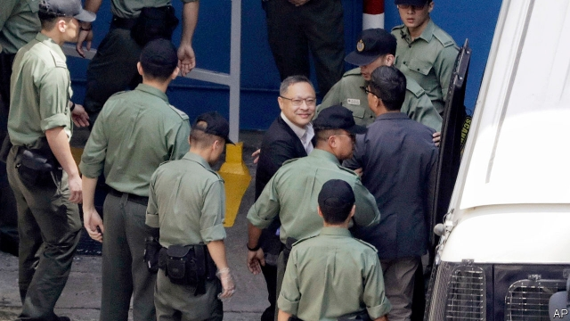

###### Folding the umbrellas

# Four prominent activists in Hong Kong are jailed 

##### Human-rights groups say the message will have a chilling impact on campaigners for democracy 

 

> Apr 27th 2019 

PRO COMMUNIST Party newspapers in Hong Kong call them the “black hands”: the activists who inspired the “Umbrella Movement” of 2014 involving 79 days of sit-ins and demonstrations in busy commercial areas in support of democratic reform. On April 24th a court in Hong Kong sentenced eight of them, including four who were sent to jail. Two academics, Benny Tai (pictured) and Chan Kin-man, received the stiffest punishment: 16 months behind bars. A Baptist minister, Chu Yiu-Ming, was given the same sentence, but his term was suspended. Human-rights groups say the jailings will have a chilling effect on free speech. China would like that. 

  

-- 

 单词注释:

1.activist['æktivist]:n. 激进主义分子 

2.hong[hɔŋ]:n. （中国、日本的）行, 商行 

3.kong[kɔŋ]:n. 含锡砾石下的无矿基岩；钢 

4.campaigner[kæm'peinә]:n. 从军者, 老兵, 竞选者 

5.APR[]:[计] 替换通路再试器 

6.pro[prәu]:adv. 正面地 [计] 可编程远程操作 

7.demonstration[.demәn'streiʃәn]:n. 示范, 实证 [医] 示教, 实物教授 

8.benny['beni]:n. 安非他明(药片) 

9.tai[tai, 'tɑ:i:]:abbr. 泰国国际航空公司（Thai Airways International） 

10.chan[]:n. 通道（槽, 沟） 

11.Baptist['bæptist]:n. 施洗礼者, 浸礼会教友 

12.chu[]:abbr. 摄氏热单位（Centigrade Heat Unit） 

13.jailing[dʒeilɪŋ]:v. 监禁, 拘留( jail的现在分词 ) 

