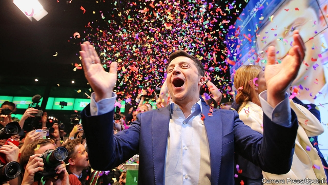
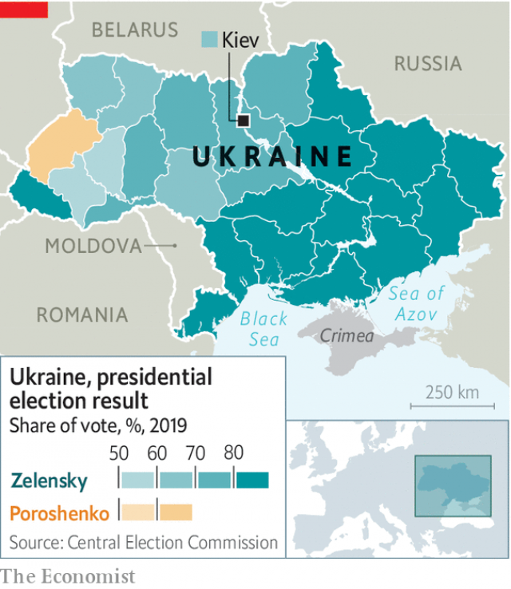

###### Ready for prime time?

# A TV comedian-turned-politician wins a stunning victory in Ukraine 

##### But will Volodymyr Zelensky be able to govern? 

 

> Apr 25th 2019 

JOKES ABOUT Ukraine’s newly elected president, Volodymyr Zelensky, come easily. He is, after all, a comedian. At times his campaign seemed too frivolous to be consequential. While Petro Poroshenko, the incumbent president, staged political rallies, Mr Zelensky could be found filming his popular TV show, “Servant of the People”, in which he plays a schoolteacher who accidentally becomes president. His public announcement that he was fighting the election was enough of an afterthought that he forgot to tell his wife about it. 

Yet Mr Zelensky’s victory in the second-round run-off election on April 21st, with 73% of the vote, is a serious achievement. In four months, he built the biggest majority since Ukraine’s independence in 1991, helped by votersʼ frustration with Mr Poroshenkoʼs chequered leadership and their hopes for a better future. While Mr Poroshenko ran a divisive and nationalistic campaign, Mr Zelensky, a native Russian-speaker of Jewish heritage hailing from Ukraine’s south-east, galvanised support from across the country. Ukrainian politicians have long exploited ethnic and linguistic divides, splitting the country into an “orange” west and a “blue” east. Mr Zelensky, whose name means “green”, carried all but one of 25 regions. 

Although war with Russia is still simmering in the country’s east, the election was free, fair and peaceful. Civil society and independent media held politicians to account. Now, thanks to Mr Poroshenko’s prompt concession, Ukraine’s voters have removed a sitting president through the ballot box—a rarity in the region. Mr Zelensky celebrated the example it could set: “To all the countries of the former Soviet Union: look at us, everything is possible.” 

Mr Zelensky’s improbable path to the presidency began in Krivoi Rog, a midsized industrial city. The son of a university professor and an engineer, he dreamed of studying international relations in Moscow or Kiev, but settled for law at the local university, where he became involved in a popular comedy contest. He spun his success on the show into a production company, became a household name and made a lot of money from producing and appearing in TV programmes and films. 

In the election, being a celebrity outsider was an asset. Oligarchs control Ukraine’s main television channels, but Mr Zelensky’s fame helped bypass this barrier to entry. As a new face on the political stage, he appealed to voters who saw the promise of change after the 2014 revolution hijacked by the old elites, including Mr Poroshenko. At 41, he is too young to have participated in the theft by Ukraine’s political class of Soviet-era economic assets. His informality contrasts with the distance which most leaders in the former Soviet Union maintain between themselves and the voters. His first post-election message was a video posted on Instagram that begins with the grinning president-elect saying, “Heeeeyy everybody!” It has been watched 6m times. 

The presentation is undoubtedly appealing; it is the substance that will be Mr Zelensky’s main challenge. He has promised to maintain a pro-Western stance, to fight corruption and to end the war, but his course remains uncertain. Groups jockeying for influence include old friends from the entertainment world, shrewd advisers linked to powerful outside backers, and Western-oriented reformers. 

 

Which has the upper hand will become clear only once he begins making appointments and proposing laws. Ukraine’s constitution gives the president responsibility for foreign and security policy, including picking the ministers of foreign affairs and defence, the heads of the intelligence service and of the military general staff, and the prosecutor-general. Among the policies that Mr Zelensky’s team is discussing are plans to strip immunity from MPs and judges, to create a body to investigate financial crimes and to offer an amnesty for undeclared assets. Balazs Jarabik of the Carnegie Endowment for International Peace predicts that the new president will “try to build a state less preoccupied by ideology and more focused on offering people efficient services”. 

Ukrainians tend to sour on their leaders quickly. Their most urgent demand, say the polls, is that Mr Zelensky lower utility prices—which lies outside the president’s prerogative and would violate the terms of the IMF loan programme on which Ukraine’s economy depends. Public disappointment with the president is the subject of the second season of Mr Zelenskyʼs show, entitled “From Love to Impeachment”. As one aide says: “We know what can happen: we wrote all of this already.” 

To change the story, Mr Zelensky must overcome several adversaries. First is the Rada (parliament), which will remain hostile at least until elections this autumn. Mr Zelensky could try to force an early election, but since he has not yet built a party, he may prefer to wait. In the meantime, others are massing their forces against him. The current prime minister, Volodymyr Groysman, plans to form his own party. Mr Poroshenko will continue the fight. Pro-Russian parties, which won 16% of the vote in the first round of presidential elections, could unite and challenge Mr Zelensky in the east. 

The second is Russia, with which Ukraine remains in a stand-off. Prospects for resolving it are slim. Vladimir Putin can use his proxies in the Donbas region to test the new commander-in-chief’s mettle, and also has economic levers: even after five years of war, Russia remains Ukraine’s single largest trading partner. On April 24th, Mr Putin announced that Russia will allow Ukrainians living in the breakaway regions to receive Russian passports, a provocative move towards a de facto annexation of Ukrainian territory and a direct challenge to the new president. Both Mr Poroshenko and Mr Zelensky have called for an urgent UN security council meeting. 

Third, and most important, are Ukraine’s oligarchs. There is much speculation about Mr Zelensky’s links to Ihor Kolomoisky, whose TV channel airs his shows. While both men deny ties beyond business, investigative journalists discovered that in recent years Mr Zelensky flew 13 times to Geneva and Tel Aviv, where Mr Kolomoisky has been living in exile since being accused of defrauding his bank, PrivatBank, of some $5bn. The two men also share cars, security guards and a lawyer. Days before the election, when Mr Zelensky seemed likely to win, a court in Kiev did Mr Kolomoisky a big favour by declaring the nationalisation of PrivatBank illegal; after Mr Zelensky’s victory, Mr Kolomoisky announced plans to return to Ukraine. Those moves may not be Mr Zelensky’s doing, but handling them will be his problem. 

That points to the biggest risk of the Zelensky presidency: not that he turns out to be an oligarchic puppet or a Kremlin agent, but that he will not be strong enough to defend the progress that Ukraine has made against his powerful adversaries. The oligarchs will probably aim to weaken the presidency and concentrate power in the more easily controlled parliament. Mr Putin will seek to keep Ukraine from becoming a functioning democracy. Mr Zelensky will have to learn fast, with the cameras rolling and no second takes. 

-- 

 单词注释:

1.stunning['stʌniŋ]:a. 打昏迷的, 弄得人昏头昏脑的, 令人震惊的 

2.ukraine[ju(:)'krein]:n. 乌克兰（原苏联一加盟共和国, 现已独立） 

3.volodymyr[]:[网络] 昊宇 

4.zelensky[]:[网络] 泽伦斯基 

5.APR[]:[计] 替换通路再试器 

6.comedian[kә'mi:djәn]:n. 喜剧演员 

7.frivolous['frivәlәs]:a. 轻佻的, 妄动的, 琐碎的 [法] 轻薄的, 轻浮的, 无意义的 

8.consequential[,kɔnsi'kwenʃәl]:a. 作为结果的, 随之发生的, 推论的, 间接的, 重大的, 自大的, 傲慢的, 自傲的 [法] 结果的, 相应而生的, 接着发生的 

9.petro[]:n. 佩特罗（女子名）；[宗]（希）彼得（男子名, 涵义为石头） 

10.Poroshenko[]:[网络] 波罗申科 

11.incumbent[in'kʌmbәnt]:a. 现任的, 依靠的, 负有义务的 n. 领圣俸者, 在职者 

12.rally['ræli]:n. 重振旗鼓, 集合, 群众集会, 跌停回升 v. 重整旗鼓, 集合, 恢复精神, 团结, 挖苦, 嘲笑 

13.schoolteacher['sku:lti:tʃә]:n. 教师 

14.accidentally[.æksi'dentli]:adv. 偶然地, 意外地 

15.afterthought['ɑ:ftәθɒ:t]:n. 事后的想法 

16.frustration[frʌs'treiʃәn]:n. 挫折, 顿挫 [医] 挫折 

17.chequer['tʃekә]:n. (一粒)棋子, 西洋跳棋, 方格图案, 格子花, 花楸果, 排列成方格式的石头 vt. 把...画/制成方格图案形, 交替变换 

18.divisive[di'vaisiv]:a. 区分的, 制造分裂的, 造成不和的 

19.nationalistic[.næʃәnә'listik]:a. 国家主义的 

20.heritage['heritidʒ]:n. 遗产, 祖先遗留物, 继承物 [医] 遗传性 

21.hail[heil]:n. 冰雹, 致敬, 欢呼, 招呼 vt. 向...欢呼, 致敬, 招呼, 使象下雹样落下 vi. 招呼, 下雹 interj. 万岁, 欢迎 

22.galvanise['^ælvәnaiz]:vt. 通电流于, 给...镀锌, 电镀, 刺激, 使兴奋, 激动, 激励, 惊起 

23.ukrainian[ju(:)'kreinjәn]:a. 乌克兰的；乌克兰人的 

24.ethnic['eθnik]:a. 人种的, 种族的 [医] 人种的 

25.linguistic[liŋ'^wistik]:a. 语言的, 语言学的 [计] 语言的, 语言学的 

26.simmer['simә]:vt. 煨 vi. 炖, 内心充满 n. 即将沸腾的状态, 即将发作 

27.concession[kәn'seʃәn]:n. 特许, 让步, 认可 [经] 核准, 许可, 特殊(权) 

28.voter['vәutә]:n. 选民, 投票人 [法] 选民, 选举人, 投票人 

29.ballot['bælәt]:n. 投票, 投票用纸, 抽签 vi. 投票, 抽签 vt. 投票选出, 拉选票 

30.rarity['rєәrәti]:n. 稀罕, 罕有, 珍奇, 稀薄 

31.improbable[im'prɒbәbl]:a. 不大可能的, 不象发生的, 荒谬可笑的 [法] 未必会的, 不大可能发生的, 未必确实的 

32.presidency['prezidәnsi]:n. 总统职权, 总裁职位 

33.rog[rɔdʒ]:abbr. 货已收到, 凭单（Receipt Of Goods） 

34.midsized['mɪdsaɪzd]:a. 中等大小的；中型的；中号的 

35.kiev['ki:ev]:n. 基辅（乌克兰共和国首都） 

36.celebrity[si'lebrti]:n. 名声, 名人 

37.outsider[' aut'saidә]:n. 外人, 局外人, 非会员, 外行, 门外汉, 比赛中获胜可能性不大的选手 [经] 外船公司 

38.asset['æset]:n. 资产, 有益的东西 

39.oligarch['ɒligɑ:k]:n. 寡头政治执政者 

40.bypass['baipɑ:s]:n. 旁路 vt. 省略, 绕过, 忽视, 回避 

41.hijack['haidʒæk]:vt. 抢劫, 劫持, 敲诈 [法] 挡路抢劫, 抢劫, 绑架 

42.elite[ei'li:t]:n. 精华, 精锐, 中坚分子 

43.informality[.infɒ:'mæliti]:n. 非正式 

44.Instagram[]:一款图片分享应用 

45.grin[grin]:n. 露齿笑 v. 露齿而笑 

46.stance[stæns]:n. 准备击球姿势, 站立的姿势, 位置, 姿态 [经] 地位, 形势 

47.corruption[kә'rʌpʃәn]:n. 腐败, 堕落, 贪污 [计] 论误 

48.jockey['dʒɒki]:n. 赛马骑师, 驾驶员, 操作工 vt. 骗, 瞒, 驾驶, 移动 vi. 当赛马的骑师 

49.shrewd[ʃru:d]:a. 精明的, 锐利的, 剧烈的, 机灵的, 厉害的 

50.adviser[әd'vaizә]:n. 顾问, 劝告者, 指导教师 [法] 顾问, 劝告者 

51.backer['bækә]:n. 援助者, 支持者 [经] 背书人, 支持人 

52.reformer[ri'fɒ:mә]:n. 改革家, 改革运动者 [化] 转化炉; 转化器; 重整器; 重整炉 

53.immunity[i'mju:niti]:n. 免疫, 免疫性, 免除 [化] 免疫性 

54.MP[]:国会议员, 下院议员 [计] 宏处理程序, 维护程序, 线性规划, 微程序, 多处理器 

55.amnesty['æmnisti]:n. 大赦, 赦免 

56.undeclared[.ʌndi'klєәd]:a. 未申报的, 未宣布的 

57.balaz[]:[网络] 八十八颗芭乐籽；八十八颗番石榴籽；巴尔滋 

58.carnegie[kɑ:'ne^i]:n. 卡内基（姓氏） 

59.endowment[in'daumәnt]:n. 捐助, 天赋, 才能 [经] 捐赠, 捐款, 养老金 

60.les[lei]:abbr. 发射脱离系统（Launch Escape System） 

61.preoccupy[pri:'ɒkjupai]:vt. 抢先占领, 使全神贯注 

62.ideology[.aidi'ɒlәdʒi]:n. 思想体系, 意识形态, 观念学, 空论 [医] 观念学, 观念形态 

63.ukrainian[ju(:)'kreinjәn]:a. 乌克兰的；乌克兰人的 

64.quickly['kwikli]:adv. 很快地 

65.prerogative[pri'rɒgәtiv]:n. 特权, 君权, 职权 a. 特权的, 行使特权的 

66.IMF[]:国际货币基金组织 [经] 国际货币基金 

67.impeachment[im'pi:tʃmәnt]:[法] 控告, 检举, 弹劾 

68.aide[eid]:n. 助手, 副官 [计] 数据输入的可说明性 

69.adversary['ædvәsәri]:n. 敌手, 对手 a. 敌手的, 敌对的 

70.rada[]:abbr. （英国）皇家戏剧艺术学院（Royal Academy of Dramatic Art）；随机存取离散地址（Random Access Discrete Address） 

71.presidential[.prezi'denʃәl]:a. 总统制的, 总统的, 首长的, 统辖的 [法] 总统的, 议长的, 总经理的 

72.Vladimir[vlɑ'dimɪr]:n. 弗拉基米尔（古罗斯弗拉基米尔-苏兹达里公国的古都） 

73.putin['putin]:n. 普京（人名） 

74.proxy['prɒksi]:n. 代理, 代理人, 委托书 [经] 代理人, 代表权, 授权书 

75.Donbas[]:n. 顿巴斯（苏联煤矿区） 

76.mettle['metl]:n. 气质, 耐力, 勇气 

77.breakaway[]:n. 脱离, (美)(非正式)一碰就散开/脱落的, 分裂 

78.provocative[prә'vɒkәtiv]:a. 激发感情的, 挑拨的, 刺激的 n. 刺激物, 挑拨物, 兴奋剂 

79.de[di:]:[化] 非对映体过量 [医] 铥(69号元素铥的别名,1916年Eder离得的假想元素) 

80.facto[]:[法] 实际上, 事实上 

81.annexation[ænek'seiʃәn]:n. 合并, 附加, 附加物 [法] 兼并, 侵吞, 附加物 

82.UN[ʌn]:pron. 家伙, 东西 [经] 联合国 

83.speculation[.spekju'leiʃәn]:n. 沉思, 推测, 投机 [经] 投机交易, 买空卖空 

84.ihor[]:[网络] 至尊铭 

85.investigative[in'vestigeitiv]:a. 审查的, 调查的, 好研究的 [法] 调查的, 审查的, 受调查研究的 

86.Geneva[dʒi'ni:vә]:n. 日内瓦, (荷兰)杜松子酒 

87.tel[tel]:abbr. 试验仪器清单（Test Equipment List） 

88.Aviv[ɑ:'viv]:n. 大自然的重生 n. (Aviv)人名；(俄)阿维夫 

89.exile['eksail]:n. 放逐, 流放, 被放逐者 vt. 放逐, 流放, 使背井离乡 

90.defraud[di'frɒ:d]:vt. 欺骗 [经] 骗取, 诈取, 欺骗 

91.PrivatBank[]:[网络] 短信服务是免费的 

92.nationalisation[,næʃәnәlai'zeiʃәn; -li'z-]:n. 国有化, 国营 

93.oligarchic[,ɔli'^ɑ:kik]:[计] 少数的, 寡头的 

94.Kremlin['kremlin]:n. 克里姆林宫 [经] 克里姆林宫 

