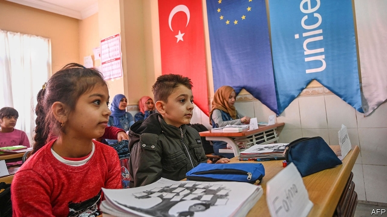

###### A long way from home

# As Turkey’s economy slows, attitudes toward Syrian refugees harden 

##### Most Turks now want them to go back 

 

> Apr 27th 2019 

EARLIER THIS year, shortly after he launched his campaign for mayor in Mersin, a port city on the Mediterranean, Vahap Secer asked his constituents to identify their most pressing concerns in an online poll. About a tenth chose congestion and public transport. About a fifth mentioned unemployment. A whopping 66% answered: “Syrians”. 

Abroad, Turkey has earned praise for its treatment of the 3.6m refugees who have settled here since the start of Syria’s murderous war. But at home, amid deepening economic malaise, frustration with the government’s policy and resentment towards the refugees have been growing. In the recent local elections, in which the opposition defeated the ruling Justice and Development (AK) party in most of the country’s big cities, including Mersin, much of that frustration came to the fore. Opposition politicians regularly played the refugee card. Meral Aksener, the head of the nationalist Iyi party, pledged to send the Syrians packing. One of her colleagues claimed the refugees had to go home for Turkey to start digging itself out of recession. In one northern town, a newly elected mayor from the secular Republican People’s Party (CHP) celebrated his first day in office by cutting off aid to local Syrians. 

Even the AK party and its leader, president Recep Tayyip Erdogan, a hero to most of the refugees, suggested they had worn out their welcome. The party’s losing candidate in the Istanbul mayoral contest, a former prime minister, warned he would have Syrians who posed a threat to security and public order “grabbed by the ears” and deported. (As The Economist went to press, Turkey’s electoral authority was still weighing AK’s request to have the Istanbul election cancelled and repeated.) Mr Erdogan himself has proposed resettling at least some of the refugees in a safe zone he wants set up in northern Syria. All of this is legally possible. Syrians in Turkey do not enjoy formal refugee status, which would protect them from deportation, but “temporary protection”, which does not. 

The politicians seem to be taking their cue from voters. Resentment towards the refugees seems to be one of the few issues that unites public opinion. A study last year found that 86% of all Turks, wanted the government to send the refugees back to Syria. “Erdogan is a real Muslim, and he opened our doors in the name of humanity, which was the right thing to do,” says Ayhan, who runs a jewellery shop in Mersin’s old city centre. “But when you come as a guest, you should start leaving after three or five years.” 

In Mersin, where Syrians make up more than a tenth of the population, locals complain that they undercut wages, drive up rents and avoid paying taxes. (The government has granted temporary work permits to only 70,000 Syrians. The vast majority work off the books.) Turks also say the newcomers have failed to assimilate, a charge often levelled by Europe’s populists against Turkish migrants and their descendants. Mr Secer, the new CHP mayor, says such grievances are bound to grow as the economy slumps and jobs become scarce. Turkey’s unemployment rate recently reached 15%, the highest level in ten years. “Our citizens cannot find jobs, but Syrians work under the table and open unregistered businesses, and this makes people here angry,” says Mr Secer. He, too, complains of cultural differences. “We are a more modern, more contemporary society,” he says. The CHP describes itself as a social democratic party. Occasionally, its language resembles that of the far right. 

In Mersin and elsewhere, the authorities have largely managed to keep a lid on tensions between Turks and Syrians. Intercommunal violence remains rare. However, experts warn that Turkey’s policy towards the refugees is no longer sustainable. Mr Erdogan’s government claims to have spent some $37bn on providing shelter, health care and education for Syria’s displaced since 2011. That sum might be grossly exaggerated, yet there is no denying Turkey has done more for the Syrians than any European country. Now it must take the next step and grant them formal refugee status, including the right to work and to settle, says Metin Corabatir, head of the Research Centre on Asylum and Migration. With a prolonged economic slowdown on the horizon, Turkey will need outside help. The EU already pays Turkey billions of dollars to keep the refugees away from its own shores. In the future, says Mr Corabatir, it will have to invest more in integration and public awareness programmes in Turkey. 

Mr Erdogan’s government has played up the idea that Syrians will eventually and voluntarily return home. Studies suggest that most do not want to. Certainly not Firas Fanari, a former lawyer, who escaped from his native Aleppo five years ago, after Syrian regime forces began bombing his neighbourhood. “When a drunk soldier tried to abduct my daughter at a checkpoint, I decided Syria was finished for me,” he recalls over coffee, cigarettes and biscuits in his apartment in Mersin. His daughter is now a student in Mersin, and hopes to attend an MBA programme in Istanbul. His wife wants to open a pastry shop. His teenage son speaks better Turkish than Arabic. “We are now Turkish,” he says, “only without the right papers.” 

-- 

 单词注释:

1.Syrian['siriәn]:n. 叙利亚人, 叙利亚语 a. 叙利亚语的, 叙利亚人的 

2.refugee[.refju'dʒi:]:n. 难民, 流亡者 [法] 避难者, 流亡者, 难民 

3.Turk[tә:k]:n. 土耳其人, 土耳其马 

4.APR[]:[计] 替换通路再试器 

5.mersin[]:n. 梅尔辛（土耳其一座港口） 

6.constituent[kәn'stitjuәnt]:n. 成分, 选民, 构成物 a. 构成的, 组织的, 选举的 

7.online[]:[计] 联机 

8.congestion[kәn'dʒestʃәn]:n. 拥挤, 充血 [计] 拥挤, 拥塞 

9.whop[hwɒp]:v. 打, 抽出, 打败, 征服 n. 重击, 打击声 

10.Syrian['siriәn]:n. 叙利亚人, 叙利亚语 a. 叙利亚语的, 叙利亚人的 

11.murderous['mә:dәrәs]:a. 凶狠的, 杀人的, 致命的 [法] 谋杀的, 杀人的, 残酷的 

12.amid[ә'mid]:prep. 在其间, 在其中 [经] 在...中 

13.malaise[mæ'leiz]:n. 不舒服 [医] 不适, 欠爽 

14.frustration[frʌs'treiʃәn]:n. 挫折, 顿挫 [医] 挫折 

15.resentment[ri'zentmәnt]:n. 怨恨, 愤恨 

16.opposition[.ɒpә'ziʃәn]:n. 反对, 敌对, 相反, 在野党 [医] 对生, 对向, 反抗, 反对症 

17.AK[]:[计] 确认, 肯定, 收悉 

18.fore[fɒ:]:a. 在前的, 以前的 adv. 在前面, 在船头 prep. 在...前 

19.opposition[.ɒpә'ziʃәn]:n. 反对, 敌对, 相反, 在野党 [医] 对生, 对向, 反抗, 反对症 

20.meral[]:[网络] 梅拉马耶讷省；麦柔儿；美露 

21.nationalist['næʃәnәlist]:n. 国家主义者, 民族主义者 

22.pledge[pledʒ]:n. 诺言, 保证, 誓言, 抵押, 信物, 保人, 祝愿 vt. 许诺, 保证, 使发誓, 抵押, 典当, 举杯祝...健康 

23.recession[ri'seʃәn]:n. 后退, 凹处, 衰退, 归还 [医] 退缩 

24.secular['sekjulә]:n. 修道院外的教士 a. 世俗的, 现世的, 长期的 

25.CHP[]:n. 热电联合 

26.recep[]:n. (Recep)人名；(土)雷杰普 

27.tayyip[]:[网络] 塔伊普 

28.erdogan[]:[网络] 埃尔多安；土耳其总理埃尔多安；艾尔多安 

29.Istanbul[.istæn'bu:l]:n. 伊斯坦布尔 

30.mayoral['mєәrәl]:a. 市长的 

31.grab[græb]:n. 抓握, 掠夺, 强占, 东方沿岸帆船 vi. 抓取, 抢去 vt. 攫取, 捕获, 霸占 

32.deport[di'pɒ:t]:vt. 举止, 驱逐出境 [法] 放逐, 驱逐, 递解 

33.economist[i:'kɒnәmist]:n. 经济学者, 经济家 [经] 经济学家 

34.electoral[i'lektәrәl]:a. 选举人的, 选举的, (有关)选举的 [法] 选举的, 选举人的, 由选举人组成的 

35.resettle[ri:'setl]:v. (使)重新定居 

36.Syria['siriә]:n. 叙利亚 [经] 叙利亚 

37.legally['li:gәli]:adv. 法律上, 合法地 [法] 法律上, 合法地, 法定地 

38.statu[]:[网络] 状态查看；雕像；特级雪花白 

39.deportation[.di:pɒ:'teiʃәn]:n. 驱逐出境, 放逐 [法] 递解出境, 放逐, 驱逐 

40.voter['vәutә]:n. 选民, 投票人 [法] 选民, 选举人, 投票人 

41.resentment[ri'zentmәnt]:n. 怨恨, 愤恨 

42.Muslim['mjzlim; (?@) 'mʌzlem]:n. 伊斯兰教, 伊斯兰教教徒 

43.humanity[hju:'mæniti]:n. 人性, 人类, 博爱 

44.jewellery['dʒu:әlri]:n. 宝石, 贵重饰物, 珠宝, 宝石饰物, 受珍视的人/物, 宝贝, 有价值的人/物 

45.undercut['ʌndәkʌt]:n. 底切, 牛腰部下侧嫩肉, 下口, 下旋削球 vt. 廉价出售, 底切, 雕出, 下旋削球 vi. 切除底部 

46.newcomer[nju:'kʌmә]:n. 新来者 

47.assimilate[ә'simileit]:vt. 使同化, 吸收, 使相拟, 把...比作 vi. 被吸收, 被同化 

48.Populist['pɔpjulist]:n. 民粹派的成员 

49.Turkish['tә:kiʃ]:n. 土耳其语 a. 土耳其的, 土耳其人的, 土耳其语的 

50.migrant['maigrәnt]:n. 候鸟, 移居者 [法] 移居者 

51.descendant[di'sendәnt]:n. 后裔, 子孙 a. 传下的, 下降的 

52.grievance['gri:vәns]:n. 委屈, 冤情, 苦况 [经] 不满(对雇用条件的) 

53.slump[slʌmp]:n. 暴跌, 垂头弯腰的姿态 vi. 猛然掉落, 陷入, 衰落(经济等) 

54.cannot['kænɒt]:aux. 无法, 不能 

55.unregistered[ʌn'redʒistәd]:[法] 未登记的, 未注册的 

56.cultural['kʌltʃәrәl]:a. 文化的, 教养的, 修养的 [医] 培养的 

57.intercommunal[,intә'kɔmjunl]:a. 社区之间的 

58.sustainable[sә'steinәbl]:a. 足可支撑的, 养得起的, 可以忍受的 

59.displace[dis'pleis]:vt. 移置, 替换, 转移 

60.grossly['grәusli]:adv. 非常, 很, 粗 

61.metin[]:n. (Metin)人名；(俄)梅京；(土)梅廷 

62.asylum[ә'sailәm]:n. 庇护, 收容所 [医] 养育院 

63.migration[mai'greiʃәn]:n. 移民, 移往, 移动 [计] 迁移 

64.prolong[prәu'lɒŋ]:vt. 延长, 拖延, 拖长 [化] 冷凝管 

65.slowdown['slәudaun]:n. 降低速度, 减速 

66.EU[]:[化] 富集铀; 浓缩铀 [医] 铕(63号元素) 

67.integration[.inti'greiʃәn]:n. 综合, 与环境协调的行为, 集成 [化] 集成; 整合 

68.awareness[ә'weәnis]:n. 意识, 认识 [计] 识别, 议定, 明白 

69.voluntarily[.vɒlәn'terili]:adv. 自愿地, 以自由意志 

70.firas[]:n. (Firas)人名；(阿拉伯、西)菲拉斯 

71.Fanari[]:[地名] 法纳里 ( 希 ) 

72.Aleppo[ә'lepәu]:[医] 阿勒波(叙利亚的一个城市) 

73.regime[rei'ʒi:m]:n. 政权, 当权期间, 政体, 社会制度, 体制, 情态 [医] 制度, 生活制度 

74.abduct[æb'dʌkt]:vt. 诱拐, 绑架, 使外展 [医] 外展, 展 

75.checkpoint['tʃekpɒint]:n. 检查站 [计] 检查点 

76.mba[]:abbr. 工商管理学硕士（Master of Business Administration）；海洋生物协会（Marine Biological Association）；主要战区（Main Battle Area） 

77.pastry['peistri]:n. 油酥点心, 面粉糕饼 

78.teenage['ti:nidʒ]:a. 十三岁到十九岁的 

