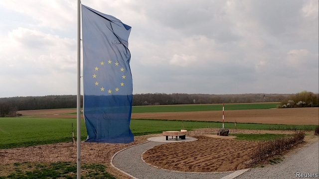
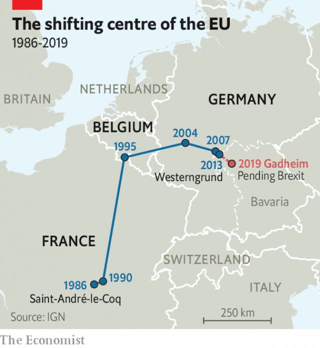

###### Stuck in the middle of the EU

# Brexit kills a small town’s tiny tourism business 

##### The geographical centre of the EU will shift 

 

> Apr 27th 2019 

NOT MUCH happens in Gadheim, a Bavarian hamlet of 89 souls. A handful of part-time farmers cultivate wheat, barley and rapeseed. A hotel trains apprentices in gardening and carpentry. Birds tweet, cars whoosh by. The landscape undulates, mildly. 

But Britain’s impending departure from the European Union has disturbed the rustic peace. Whenever the club’s composition changes, the French National Institute of Geographic and Forest Information (IGN) calculates its new geographical centre. Over the years eastward enlargements have tugged the point from France to Belgium and then southern Germany; since 2013, when Croatia joined, it has sat in Westerngrund, a town in north-west Bavaria. But in April 2017 the IGN judged that Brexit would shift the EU’s centre 70km farther east, to Gadheim. 

A baker from a neighbouring village broke the news to Karin Kessler, a Gadheim farmer upon whose 33 hectares (82 acres) Europe’s centre will now sit. At first she thought it was an April fool. But then her son confirmed the finding, the world’s media descended (although some unaccountably confused the village with Gädheim, 45km away), and the locals began to plan. Gunila Weidner, a lawyer, cut an amusing spoof video promising ample space and low traffic for London bankers obliged to relocate, and urging Scotland not to think of seceding from Britain and rejoining the EU. 

 

After some deliberation, an “EU centre” began to emerge on Ms Kessler’s land. A stone marks the co-ordinates of the centre. Flagpoles await European and local standards. Green shoots poking through the soil promise visitors verdant surroundings. Early April saw delivery of a wooden bench and table, organised when Gadheim expected Britain to leave in March, and a red-and-white “arrow” that protrudes at an angle from the stone, metaphorically fired from Westerngrund to signify the changing of the guard. 

Gadheimers share in Europe’s frustration at Britain’s inability to ratify a deal. Without a date for Brexit they cannot plan the centre’s opening ceremony (Markus Söder, Bavaria’s premier, has promised to attend) nor reap the modest tourist bounty some hope for. Yet as solid pro-Europeans, many feel ambivalent about celebrating the consequence of an event they deeply regret. Ms Kessler suspects Brexit might never happen, and would be delighted to be proven right. Jürgen Götz, the local mayor, hopes for a second referendum, leaving the EU centre a memorial to disaster averted. Ms Weidner agrees. “Gadheim doesn’t need a spot in the history books,” she says. “It needs a well-functioning EU.” 

-- 

 单词注释:

1.EU[]:[化] 富集铀; 浓缩铀 [医] 铕(63号元素) 

2.Brexit[]:[网络] 英国退出欧盟 

3.geographical[dʒiә'græfikl]:a. 地理学的, 地理的 

4.APR[]:[计] 替换通路再试器 

5.Bavarian[bә'vєәriәn]:a. 巴伐利亚的, 巴伐利亚人的 n. 巴伐利亚人, 巴伐利亚方言 

6.hamlet['hæmlit]:n. 小村, 部落 

7.barley['bɑ:li]:n. 大麦 [医] 大麦 

8.rapeseed['reipsi:d]:n. 油菜籽 

9.apprentice[ә'prentis]:n. 学徒, 生手 vt. 使做学徒 

10.carpentry['kɑ:pintri]:n. 木工手艺, 木工业, 木器 

11.tweet[twi:t]:vi. 啁啾 n. 小鸟叫声 

12.whoosh[hwu:ʃ]:n. 飞快移动 v. (使)嗖嗖地飞快移动 

13.landscape['lændskeip]:n. 风景, 山水, 风景画 vi. 从事景观美化 vt. 美化...景观 [计] 横向 

14.undulate['ʌndjuleit]:a. 波动的, 起伏的 vi. 波动, 起伏, 呈波浪形 vt. 使起伏, 使波动 

15.mildly['maildli]:adv. 柔和地, 和善地, 适度地 

16.impend[im'pend]:vi. 迫近, 威胁, 悬挂 

17.rustic['rʌstik]:n. 乡下人, 乡巴佬 a. 乡村的, 纯朴的, 手工粗糙的 

18.geographic[,dʒiә'^ræfik]:a. 地理(学)的, 地区(性)的 

19.ign[]:abbr. 点火（ignition） 

20.eastward['i:stwәd]:n. 朝东方向 a. 向东方的 adv. 向东 

21.enlargement[in'lɑ:dʒmәnt]:n. 扩大, 肿大, 肥大, 增大, 放大的照片, 放大, 扩建部分, 增补物, 扩展 [计] 增补, 扩大, 放大 

22.tug[tʌg]:n. 用力拉, 拖曳, 苦干, 挣扎, 绳索 v. 用力拉 

23.Croatia[krәu'eiʃjә]:n. 克罗地亚 

24.Bavaria[bә'vєәriә]:n. 巴伐利亚州(德国地名) 

25.baker['beikә]:n. 面包师 [医] 烤箱(骨科用) 

26.Karin[]:n. 增血鬼（漫画书）；卡琳（女子名）；加林仙人（动画片） 

27.kessler[]:喀斯乐 

28.hectare['hektɑ:]:n. 公顷 [经] 公顷 

29.unaccountably[ˌʌnəˈkaʊntəbli]:adv. 不能说明地, 不可解释地; 无责任地 

30.Gädheim[]:[地名] 盖德海姆 ( 德 ) 

31.weidner[]: [人名] 韦德纳 

32.amusing[ә'mju:ziŋ]:a. 有趣的, 引人发笑的 

33.spoof[spu:f]:n. 幽默的讽刺诗文, 愚弄, 戏弄 v. 对...作幽默讽刺, 戏弄, 哄骗 a. 哄骗认的 

34.banker['bæŋkә]:n. 银行家, 庄家 [经] 银行业者, 银行家 

35.relocate[ri:'lәukeit]:vt. 重新安置, 再配置, 放在新地方 [计] 再定位; 浮动 

36.secede[si'si:d]:vi. 正式脱离(或退出), 分离 [法] 退出, 脱离 

37.rejoin[ri'dʒɒin]:vt. 使再结合, 再加入, 回答 vi. 重新聚合, 回答, 第二次答辩 

38.deliberation[di.libә'reiʃәn]:n. 熟虑, 熟思, 审议 [法] 慎重考虑, 商讨, 审议 

39.flagpole['flægpәul]:n. 旗竿 

40.verdant['vә:dnt]:a. 翠绿的, 青翠的, 无经验的, 不老练的 

41.protrude[prәu'tru:d]:vi. 伸出, 突出 vt. 使伸出, 使突出 

42.metaphorically[ˌmetə'fɒrɪklɪ]:adv. 比喻地, 隐喻地 

43.signify['signifai]:vt. 象征, 预示 vi. 要紧, 重要 

44.frustration[frʌs'treiʃәn]:n. 挫折, 顿挫 [医] 挫折 

45.inability[.inә'biliti]:n. 无能, 无力 

46.ratify['rætifai]:vt. 批准, 认可 [经] 证实, 肯定, 确认 

47.cannot['kænɒt]:aux. 无法, 不能 

48.MARKUS[]:n. 马库斯（姓氏） 

49.bounty['baunti]:n. 慷慨, 宽大, 礼物 [经] 奖励金, 补贴 

50.ambivalent[æm'bivәlәnt]:a. 矛盾的, 模棱两可的 [医] 矛盾情绪的 

51.referendum[.refә'rendәm]:n. （就重大政治或社会问题进行的）全民公决，全民投票 

52.avert[ә'vә:t]:vt. 转开, 避免, 防止 

