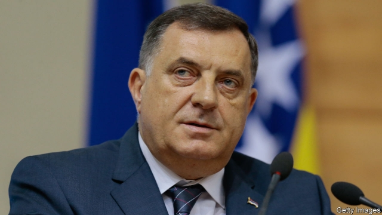
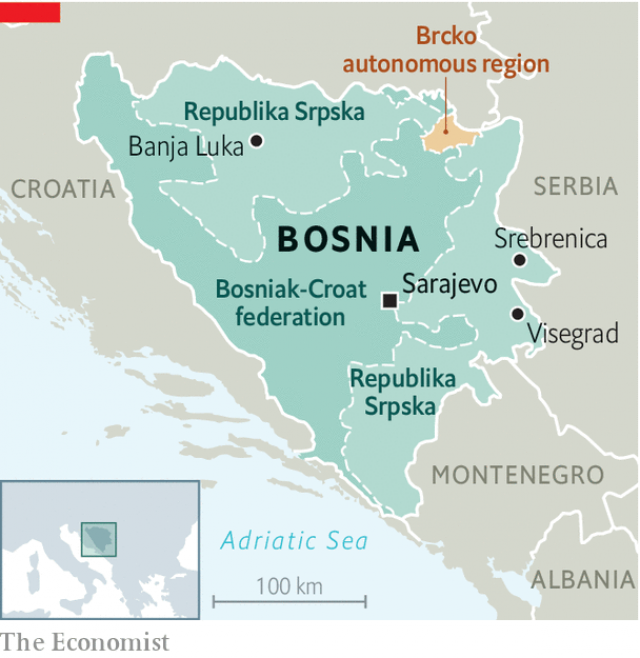

###### Hanging together

# Though Bosnia’s demise has long been predicted, it is surviving 

##### Even its president thinks the country should be abolished 

 

> Apr 27th 2019 

BOSNIA-HERCEGOVINA might have a new government soon. Or maybe it won’t. No one seems to know. The country held elections last October but the winning parties have still not agreed on how to form one. In any case, Bosnia’s central government has little power; the country has three presidents, and their current chairman wishes it did not even exist. Tens of thousands of people emigrate every year, having lost any hope for the future. 

From 1992 to 1995 Bosnia was the Syria of its day. Some 100,000 people died in the three-way war between the country’s communities: its Orthodox Serbs, its Catholic Croats and its Muslims (often referred to as Bosniaks). Unlike in Syria, though, Western powers intervened and eventually ended the shooting. A peace agreement was signed at an American airbase in Dayton, Ohio, and 60,000 peacekeepers were sent to make it stick. But today few believe that the complex deal made to end the war now delivers good governance. And there is no political will to reform the country in a way that could benefit everyone. 

Bosnia’s central government has few powers, but co-operation with NATO is one of them, and disagreements about this are an obstacle to forming a new administration. Most power lies further down. Under the Dayton accords, the country was divided into two statelets. One is the Republika Srpska, populated overwhelmingly by Serbs, which is itself split into two pieces because a region around the town of Brcko was allowed to be autonomous. The other is a Bosniak-Croat federation, consisting of ten cantons. Many Croats want this federation to be divvied up, too, because they argue that the Muslim Bosniaks, who are more numerous, can always outvote them. The war swept away a tolerant and mixed society, yet Bosnians still work, trade and sometimes drink coffee together. They do not tend to live together, though, and mostly vote for nationalist parties which in turn parcel out jobs and patronage. 

 

Milorad Dodik, who has long dominated the Republika Srpska, is the current chairman of the country’s tripartite presidency. In Banja Luka, the capital of the Republika Srpska, you would hardly know you were in Bosnia. Mr Dodik says he usually travels on a passport from Serbia, and that the presidency building in Sarajevo is like a tomb. He visits Russia’s Vladimir Putin as often as he can, wants independence for his statelet and has invested in militarising his police forces. “Bosniaks are dissatisfied because they have not succeeded in establishing control over the whole of Bosnia,” he says. “Croats are dissatisfied because they are outvoted by Bosniaks, and Serbs are dissatisfied because they did not want to be in Bosnia in the first place.” 

In March Bosnia’s security minister alleged that the Croatian intelligence service had tried to force Bosniaks to smuggle arms to certain mosques. He said the plan was that they would then be discovered and the Croatian president’s claim that Bosnia was home to “thousands” of jihadists returned from the Middle East could thus be vindicated. The Croatian government ridicules the story. The SDA, the main Bosniak party, whose leader visits Turkey’s Recep Tayyip Erdogan as often as he can, has mounted a campaign to have the name of Republika Srpska declared illegal. On April 18th the parliament of Republika Srpska voted to establish a new reserve police force, a move which risks sparking an arms race with the federation. 

When they want to, Bosnian politicians can put aside their disagreements and work together effectively. And though Bosnia’s demise has been widely and long predicted, it still functions. Yet the omens are not good. Although its economy grew by 3.1% last year, more and more people are leaving. “For 25 years I lived in hope,” says Ilija, a Croat lorry driver in Sarajevo. “Now I hate myself because of that.” Having secured the necessary permits, he is emigrating to Germany. Before the war about 4m people lived in Bosnia. There are perhaps 3.3m now, and the country has one of the lowest birth rates in the world. If you could measure beauty and bitterness, Bosnia would also be a world beater. 

-- 

 单词注释:

1.demise[di'maiz]:n. 崩, 薨, 死亡 vt. 让渡, 遗赠, 转让 

2.APR[]:[计] 替换通路再试器 

3.tens[]:十位 

4.emigrate['emigreit]:v. (使)移居, (使)移民 

5.bosnia['bɔzniә]:n. 波斯尼亚；波士尼亚 

6.Syria['siriә]:n. 叙利亚 [经] 叙利亚 

7.orthodox['ɒ:θәdɒks]:a. 正统的, 传统的, 惯常的 

8.Serb[sә:b]:n. 塞尔维亚人[语] a. 塞尔维亚的, 塞尔维亚人[语]的 

9.croat['krәuәt]:n. 克罗地亚人；克罗地亚语 

10.Muslim['mjzlim; (?@) 'mʌzlem]:n. 伊斯兰教, 伊斯兰教教徒 

11.bosniaks[]:[网络] 波斯尼亚人；波什尼亚克；波士尼亚穆斯林 

12.intervene[.intә'vi:n]:vi. 插入, 调停, 干涉 [经] 进场干预 

13.airbase[]:n. 空军基地；航空基地 

14.dayton['deitən]:n. 代顿（美国俄亥俄州西南部城市） 

15.Ohio[әu'haiәu]:n. 俄亥俄 

16.peacekeeper['pi:s,ki:pә(r)]:n. (交战国间的)停火执行者(或小组) 

17.governance['gʌvәnәns]:n. 统治, 统辖, 管理 [法] 统治, 管理, 支配 

18.NATO['neitәj]:北大西洋公约组织, 北约组织 [经] 北大西洋公约组织 

19.statelet[ˈsteɪtlət]:n. （尤指刚从大国中独立出来的）小国 

20.republika[]:[网络] 共和报；共和国；共和国报 

21.srpska[]:[网络] 波黑塞族共和国；待翻译 

22.populate['pɔpjuleit]:vt. 使人口聚居在...中, 殖民于, 移民于, 居住于, 定居于 

23.overwhelmingly[.әuvә'hwelmiŋli]:adv. 压倒性地, 不可抵抗地 

24.brcko[]:[网络] 布尔奇科；布尔奇科天气预报；布科 

25.federation[fedә'reiʃәn]:n. 联邦, 联合, 联盟 [法] 联邦, 联盟, 联邦政府 

26.canton[kæn'tɒn]:n. 州, 行政区 vt. 驻扎, 划成行政区 

27.divvy['divi]:v. 分摊 n. 分摊, 分配, 瓜分 

28.Muslim['mjzlim; (?@) 'mʌzlem]:n. 伊斯兰教, 伊斯兰教教徒 

29.alway['ɔ:lwei]:adv. 永远；总是（等于always） 

30.outvote[.aut'vәut]:vt. 得票多于(对方), 以票数胜过 

31.tolerant['tɒlәrәnt]:a. 宽容的, 容忍的, (对冷、热)能耐的 [医] 能耐受的 

32.Bosnian[bɔzni:ən]:n. 波斯尼亚人 a. 波斯尼亚的 

33.nationalist['næʃәnәlist]:n. 国家主义者, 民族主义者 

34.patronage['pætrәnidʒ]:n. 赞助, 恩赐态度, 光顾, 任免权, 保护人的身分 [经] 光顾, 资助, 赞助 

35.milorad[]:[网络] 米尔 

36.dodik[]:多迪克 

37.tripartite[.trai'pɑ:tait]:a. 三重的, 分成三部分的 

38.presidency['prezidәnsi]:n. 总统职权, 总裁职位 

39.Banja[]:n. (Banja)人名；(塞拉)班贾；(塞)巴尼娅 (女名), 巴尼亚 

40.Luka[]:n. (Luka)人名；(法)吕卡；(德、俄、罗、匈、塞、捷、图瓦)卢卡 

41.serbia['sә:bjә]:n. 塞尔维亚（南斯拉夫成员共和国名） 

42.Sarajevo[,særә'jeivәu]:n. 萨拉热窝 

43.Vladimir[vlɑ'dimɪr]:n. 弗拉基米尔（古罗斯弗拉基米尔-苏兹达里公国的古都） 

44.putin['putin]:n. 普京（人名） 

45.militarise['militəraiz]:v. 军事化, 军国化 

46.allege[ә'ledʒ]:vt. 宣称, 主张, 提出, 断言 [法] 断言, 指称, 指证 

47.Croatian[krej'әiʃ(ә)n]:a. 克罗地亚的, 克罗地亚语的, 克罗地亚人的 n. 克罗地亚人, 克罗地亚语 

48.smuggle['smʌgl]:vt. 偷运, 走私, 私运 vi. 走私 

49.mosque[mɒsk]:n. 清真寺 

50.jihadist[]:n. 伊斯兰圣战士 

51.vindicate['vindikeit]:vt. 辩护, 证明...无辜, 维护 [法] 辩护, 辩解, 辩明 

52.ridicule['ridikju:l]:n. 嘲笑, 愚弄, 笑柄 vt. 嘲笑, 嘲弄, 愚弄 

53.SDA[]:[计] 源数据自动化 

54.bosniak[]: [人名] 博斯尼亚克 

55.recep[]:n. (Recep)人名；(土)雷杰普 

56.tayyip[]:[网络] 塔伊普 

57.erdogan[]:[网络] 埃尔多安；土耳其总理埃尔多安；艾尔多安 

58.Bosnian[bɔzni:ən]:n. 波斯尼亚人 a. 波斯尼亚的 

59.effectively[i'fektivli]:adv. 有效地, 有力地, 实际上 

60.omen['әumәn]:n. 预兆, 前兆, 征兆 vt. 预示, 有...的前兆, 显出...的预兆 

61.ilija[]:[网络] 伊利亚 

62.croat['krәuәt]:n. 克罗地亚人；克罗地亚语 

63.bitterness['bitәnis]:n. 苦味, 悲痛, 怨恨 

64.beater['bi:tә]:n. 打的人, 拍打树丛惊起猎物的人, 搅拌器 [化] 打浆机 

