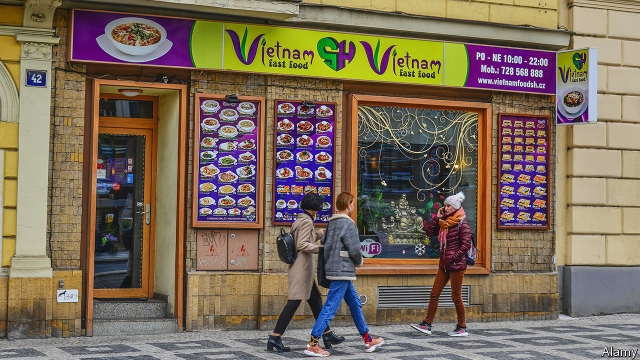

###### Pholand

# Vietnamese migrants are thriving in Poland and Czechia 

##### A notoriously anti-migrant bit of Europe seems to have embraced them 

 

> Apr 27th 2019 

“THE BUSINESS CENTRE”, a sprawling warehouse in Wolka Kosowska outside Warsaw, has a distinctly East Asian feel. The air is filled with zither music and haggling in Vietnamese. Impromptu bouts of tien len, a card game, are set up on cardboard boxes. A sign warns that “burning incense is prohibited”; another that tea dregs are not to clog the wash basin. 

Poland and the Czech Republic, both of which vehemently oppose European efforts to redistribute Syrian refugees, are home to large Asian communities. The first Vietnamese arrived in the 1980s as part of a student exchange between their country and the socialist republics of Eastern Europe. Many settled and brought over relatives. Today there are an estimated 40,000-50,000 of them in Poland, and 60,000-80,000 in the Czech Republic, the highest by proportion in Europe. The Buddhist temples and cultural centres sprouting up suggest that they are here to stay. 

In both countries the Vietnamese have integrated well. The consonant-heavy local languages initially forced them into mute professions such as wholesaling food and textiles. The more industrious flocked to trading centres in Poland and fanned out across the Czech Republic to open grocery stores and even retail chains. Some struck gold: Tao Ngoc Tu, who came as a student, now runs an Asian condiment import company and is one of Poland’s richest people. “I call myself a bat,” says Phan Chau Thanh, who came as a student in the 1990s. “Neither mouse nor bird: still a Vietnamese head, but Polish thoughts.” 

Local acceptance of the Vietnamese contrasts with views on other migrants. Czechs re-elected an anti-immigrant firebrand as president last year, and a survey by the Pew Research Centre, a think-tank, shows that almost half of Poles think there should be less immigration. Many in the Vietnamese diaspora say Czechs and Poles have over time come to see them as a “safe” type of migrant. Anh Tuyet Nguyen, a café-owner in Prague, says she has often heard Czechs contrast the “hardworking” Vietnamese with other migrants who they think “leech off the state”. 

Yet the welcome can sometimes feel brittle. Many Vietnamese, particularly in Poland, recount instances of finger-pointing on public transport and bullying in schools. After the financial crash of 2008, some Vietnamese-Czechs turned to drug dealing, a trend exaggerated by media scaremongers. As both countries have made it harder for people to immigrate to them, the flow of new arrivals from Vietnam is now a trickle, mostly consisting of people reuniting with relatives who are already in Europe. 

Still, second-generation migrants are fitting in well. Most attended local state schools and some are Czech or Polish citizens. Trang Do Thu, a Czech blogger born in Vietnam, says that like many other Vietnamese-Czechs, she learned the local tongue from a Czech nanny while her parents worked long shifts in clothes markets. Her generation’s speaking out against the drug-dealer stereotype was crucial in dispelling it, she says. And pho (noodle soup) is now all the rage in Prague and Warsaw. 

-- 

 单词注释:

1.vietnamese['vjetnә'mi:z]:n. 越南人；越南语 

2.migrant['maigrәnt]:n. 候鸟, 移居者 [法] 移居者 

3.Poland['pәulәnd]:n. 波兰 

4.Czechia[]:[网络] 捷克；捷克共和国；捷克餐厅 

5.notoriously[]:adv. 臭名昭著的, 声名狼藉的 

6.APR[]:[计] 替换通路再试器 

7.sprawl[sprɒ:l]:vi. 伸开手足躺, 爬行, 蔓生, 蔓延 vt. 懒散地伸开, 使蔓生, 使不规则地伸展 n. 伸开手足躺卧姿势 

8.warsaw['wɔ:sɔ:]:n. 华沙（波兰首都） 

9.distinctly[dis'tiŋktli]:adv. 显然地, 明显地, 清楚地 

10.zither['ziθә]:n. 齐特琴 

11.haggle[hægl]:vi. 争论, 杀价 vt. 乱砍, 乱劈 n. 杀价, 讨论, 争论 

12.impromptu[im'prɒmptju:]:n. 即席演出, 即兴曲 a. 即席的 adv. 即席 

13.bout[baut]:n. 一回, 回合, 较量 [医] 发作 

14.tien[]:n. 天津饭；天山 

15.len[]:n. 伦恩（男子名） 

16.cardboard['kɑ:dbɒ:d]:n. 薄纸板 [化] 咭纸; 特等纸板; 卡纸板; 卡片纸板 

17.incense['inseins]:n. 香, 香气, 奉承 vi. 焚香 vt. 用香焚, 使发怒 

18.dreg[dreg]:n. 渣滓, 糟粕, 少量 

19.clog[klɒg]:n. 障碍, 脚坠 v. 障碍, 阻塞 

20.Czech[tʃek]:n. 捷克人, 捷克语 a. 捷克的, 捷克语的, 捷克人的 

21.vehemently['vi:əməntlɪ]:adv. 激烈地; 暴烈地; 强烈地; 热烈地 

22.redistribute[.ri:di'stribjut]:vt. 重新分配, 再分发 [经] 再分配, 重新分配 

23.Syrian['siriәn]:n. 叙利亚人, 叙利亚语 a. 叙利亚语的, 叙利亚人的 

24.refugee[.refju'dʒi:]:n. 难民, 流亡者 [法] 避难者, 流亡者, 难民 

25.cultural['kʌltʃәrәl]:a. 文化的, 教养的, 修养的 [医] 培养的 

26.sprout[spraut]:n. 芽, 萌芽 vt. 使发芽, 摘去芽 vi. 长芽, 抽条 

27.initially[i'niʃәli]:adv. 最初, 开头 

28.wholesale['hәulseil]:n. 批发 a. 批发的, 大规模的 adv. 大规模, 照批发方式 vi. 经营批发业, 批发 vt. 批发 

29.industrious[in'dʌstriәs]:a. 勤勉的, 刻苦的 

30.Tao[tau]:n. (道家学说中的)道 

31.ngoc[]:n. 【女名】女子名 [网络] 玉；阿玉 

32.TU[]:工会, 训练单位 

33.condiment['kɒndimәnt]:n. 辛辣调味品 [化] 调味品 

34.phan[fæn]:[医] 表象, 显象 

35.chau[]:中国姓氏周和邹的音译 

36.thanh[]:n. 【男名】男子名 [网络] 清；越南出生的妻子唐；青 

37.Czech[tʃek]:n. 捷克人, 捷克语 a. 捷克的, 捷克语的, 捷克人的 

38.firebrand['faiәbrænd]:n. 火把, 在燃烧的木柴, 煽动叛乱者 

39.pew[pju:]:n. 教堂长椅, 会众, 座位 vt. 为(教堂)安装座位, 把...围在一起 

40.les[lei]:abbr. 发射脱离系统（Launch Escape System） 

41.Diaspora[dai'æspәrә]:n. 犹太人的离散, 离散的犹太人 

42.anh[]:a. 无水的 

43.tuyet[]:n. 【女名】女子名 [网络] 黎雪；联合国记者协会主席努炎 

44.nguyen[]:n. 阮（越南姓氏） 

45.Prague[prɑ:g]:n. 布拉格 

46.leech[li:tʃ]:n. 水蛭, 吸血鬼, 榨取他人利益的人 vt. 以水蛭吸血 vi. 依附并榨取别人 

47.recount[ri'kaunt]:vt. 详述, 叙述, 重新计算 n. 重新计算 

48.bully['buli]:n. 欺凌弱小者, 土霸 vt. 威胁, 恐吓, 欺负 vi. 欺负 a. 特好的, 第一流的 adv. 十分 

49.scaremonger['skєәmʌŋgә]:n. 散布谣言的人, 危言耸听者 

50.Vietnam[.vjet'næm]:n. 越南 

51.trickle['trikl]:n. 滴, 细流 vi. 滴, 细细地流 vt. 使滴, 使小量流动 [计] 信息透露 

52.reunit[]:[网络] 重逢；使再联合；单元类 

53.trang[]: [地名] [泰国] 董里 

54.thu[]:abbr. 星期四（Thursday） 

55.blogger[]:n. 写博客的人；博客使用者 

56.nanny['næni]:n. 保姆；母山羊 

57.stereotype['stiәriәtaip]:n. 铅版, 陈规, 老套 vt. 使用铅版, 把...印制成盲文, 套用老套, 使一成不变 

58.dispel[dis'pel]:vt. 驱散, 驱逐 

59.pho[]:abbr. 公害局（Public Hazards Office） 

