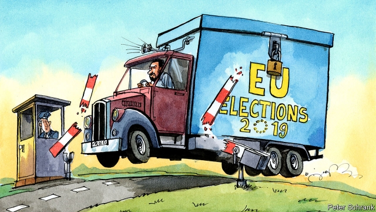

###### Charlemagne

# Why the European Parliament elections will be the most European yet 

##### Nationalists and pro-Europeans alike are gearing up 

 

> Apr 27th 2019 

EVEN BY THE standards of the Zappeion, a neoclassical palace in Athens once used for Olympic fencing matches, it was an extravagant affair. Over footage of space rockets and mountain ranges a voice crooned, in English: “A human being is extraordinary, a perfect machine that can achieve it all.” Drummers beat on four giant drums, soaring music echoed off the columns and the name “WEber” flashed up on a screen, transforming into “The power of WE”. Manfred Weber bounded onto the stage and launched his programme for Europe, which included a European FBI, ending the EU’s accession talks with Turkey and new efforts to find a cure for cancer. 

It all felt rather silly. Mr Weber is the Spitzenkandidat or “lead candidate” of the European People’s Party (EPP), the group of European centre-right parties, for the European Parliament elections that will be held between May 23rd and the 26th. Under a system introduced last time, in 2014, the Spitzenkandidat of the largest group becomes the president of the European Commission, the EU’s executive. That is likely to remain the EPP. But some national leaders dislike this process and want to discontinue it. Mr Weber, a soft-spoken man with no executive experience, is barely known. A poll in his native Germany shows that only 26% of voters even there have heard of him. 

Introduced in 1979, European Parliament elections have always lacked a proper European dimension, serving instead as increasingly low-turnout referendums on national domestic matters. The Spitzenkandidat process was meant to change that, but few took it seriously in 2014. And this time? Journalists may be more familiar with it, a big TV debate is planned for May 15th and Mr Weber plans to campaign in almost every EU state. But even he does not expect a transformative surge of interest: “We are not on the level of American or French presidential elections,” he says. 

Yet something is changing—thanks not to the Spitzenkandidaten but to events. The unprecedented wave of crisis and change over the 2014 to 2019 parliamentary term has emphasised Europe’s interdependence and with it the role of pan-European politics. The migration surge of 2015 was a European drama, not just a Greek or Hungarian or German one. Terror networks have crossed borders and struck cities in various European countries. Brexit, Donald Trump’s presidency and the rise of China threaten Europe as a whole. The crowd scenes have been continental, not national: refugees trudging along motorways, pro- and anti-migration demonstrations, the anti-establishment gilets jaunes protests and, most recently, environmentalist school strikes. 

This does not mean Europeans are satisfied with the EU. But Britain’s humiliating attempt to leave has directed Eurosceptic energies away from quitting—support for membership has risen across the union—and towards changing the EU from within. More generally, outside threats and internal crises have increased the EU’s prominence and salience. They have made the notion of “a Europe that protects” more appealing. And they have brought forth a small but genuinely European cast of characters. Angela Merkel is known continent-wide as a protagonist of the euro and migration crises, Viktor Orban in Hungary as a self-styled defender of a “Christian Europe”, Emmanuel Macron as an anti-populist bastion and Matteo Salvini, Italy’s deputy prime minister and dominant politician, as his sparring partner. Print and broadcast media mostly observe national borders, but social and digital media do not; from his Facebook page Mr Salvini has cheered France’s gilets jaunes and urged French voters to vote against Mr Macron. 

Perhaps surprisingly, this Europeanisation is most advanced among nationalists and populists. Anti-establishment tactics, ideas and messages spread online, in pan-European movements like the gilets jaunes, the anti-Islam PEGIDA and the Identitarians and at multinational party summits. On April 8th Mr Salvini launched a new far-right electoral alliance with German, Danish and Finnish party leaders. On April 19th, Marine Le Pen’s National Rally joined them. They will hold a joint rally in Milan on the final weekend of the campaign in May. 

The centre is slowly catching up. Last month Mr Macron launched a grand plan for Europe with an interview in Italy and an article published in 22 languages—the battle-cry of what he hopes will be a powerful new centrist group in the next parliament. Annegret Kramp-Karrenbauer, the leader of Germany’s Christian Democrats, has campaigned with Mr Weber in Brussels. Mrs Merkel will next month join the trail for her first-ever electoral event outside Germany. That these efforts might increase turnout among moderate voters is questionable, but not unthinkable: the elections of keenly pro-European presidents in France, Austria and Slovakia and the rise of federalist parties like the Greens in Germany and the Netherlands are testament to what Ivan Krastev, Mark Leonard and Susi Dennison of the European Council on Foreign Relations (ECFR), a think-tank, call in a new report a “counter-mobilisation of pro-European voters” in response to rising populism. 

All of which means voters are paying a bit more attention to European debates. A Eurobarometer poll last summer found that 41% knew roughly when the elections would take place, up from 34% at the equivalent point before the previous elections. By September reported interest in the election had hit 51%, a level only reached a month before the vote in 2014. “Voters no longer take the EU for granted,” observe the ECFR authors. 

To be sure, national politics will continue to dominate. But Mr Krastev, Mr Leonard and Ms Dennison are on solid ground when they argue that the coming electoral battles will be a sort of hybrid: “nationally grounded, but affected by debates elsewhere in Europe”. Slow, tentative and perhaps even temporary it may prove, but European politics is becoming more European. 

-- 

 单词注释:

1.Charlemagne['ʃɑ:lә'mein]:查理曼大帝(742-814, 世称 Charles the Great或Charles I, 768-814为法兰克王, 800-814为西罗马帝国皇帝) 

2.nationalist['næʃәnәlist]:n. 国家主义者, 民族主义者 

3.APR[]:[计] 替换通路再试器 

4.neoclassical['ni:әuklæsikәl]:a. 新古典主义的 

5.Athens['æθәns]:n. 雅典(希腊首都) 

6.extravagant[ik'strævgәnt]:a. 奢侈的, 挥霍无度的, 浪费的 

7.footage['futidʒ]:n. 英尺长度, 英板尺, (影片的)连续镜头 

8.croon[kru:n]:v. 低声歌唱, 低唱, 低吟 n. 低唱, 低吟, 轻哼 

9.drummer['drʌmә]:n. 鼓手, 旅行推销员 [经] 跑街, 旅行商人, 旅行销货人 

10.soar[sɒ:]:n. 高扬, 翱翔 vi. 往上飞舞, 高耸, 翱翔 

11.Weber['wi:bә]:[计] 韦伯 [医] 韦伯, 库仑 

12.Manfred['mænfred]:曼弗雷德(男子名) 

13.Weber['wi:bә]:[计] 韦伯 [医] 韦伯, 库仑 

14.FBI[]:美国联邦调查局 [经] 美国联邦调查局 

15.accession[æk'seʃәn]:n. 到达, 即位, 增加, 同意, 发作, 正式接受 vt. 登记入册 

16.epp[]:abbr. epistles 书信; end plate potential 平面势能终端; edepuolenp iven (Finnish—before noon) （芬兰语）中午之前; excess personal property 过多的个人资产 

17.discontinue[.diskәn'tinju:]:vi. 中断, 终止, 停止 vt. 使中止 

18.voter['vәutә]:n. 选民, 投票人 [法] 选民, 选举人, 投票人 

19.alway['ɔ:lwei]:adv. 永远；总是（等于always） 

20.referendum[.refә'rendәm]:n. （就重大政治或社会问题进行的）全民公决，全民投票 

21.EU[]:[化] 富集铀; 浓缩铀 [医] 铕(63号元素) 

22.transformative[træns'fɔ:mәtiv]:a. 有改革能力的, 起改造作用的 

23.surge[sә:dʒ]:n. 巨涌, 汹涌, 澎湃 vi. 汹涌, 澎湃, 颠簸, 猛冲, 突然放松 vt. 使汹涌奔腾, 急放 [计] 电压尖峰 

24.presidential[.prezi'denʃәl]:a. 总统制的, 总统的, 首长的, 统辖的 [法] 总统的, 议长的, 总经理的 

25.unprecedented[.ʌn'presidentid]:a. 空前的 [经] 空前的, 无前例的 

26.parliamentary[.pɑ:lә'mentәri]:a. 国会的, 议会的, 议会制度的 

27.emphasise[]:vt. 强调, 重读, 加强...的语气, 着重 

28.interdependence[.intәdi'pendәns.-dәnsi]:n. 互相依赖 

29.politic['pɒlitik]:a. 精明的, 明智的, 策略的 

30.migration[mai'greiʃәn]:n. 移民, 移往, 移动 [计] 迁移 

31.Hungarian[hʌŋ'gєәriәn]:a. 匈牙利的, 匈牙利人的, 匈牙利语的 n. 匈牙利人, 匈牙利语 

32.Brexit[]:[网络] 英国退出欧盟 

33.presidency['prezidәnsi]:n. 总统职权, 总裁职位 

34.continental[.kɒnti'nentl]:a. 大陆的, 洲的 n. 欧洲大陆人 

35.refugee[.refju'dʒi:]:n. 难民, 流亡者 [法] 避难者, 流亡者, 难民 

36.trudge[trʌdʒ]:n. 沉重的步伐, 长途跋涉 vi. 步履艰难地走, 蹒跚地走 vt. 跋涉 

37.motorway['mәutәwei]:n. 高速公路 

38.demonstration[.demәn'streiʃәn]:n. 示范, 实证 [医] 示教, 实物教授 

39.gilet[dʒi'lei]:n. 背心, 马甲 

40.jaune[]:[网络] 汝拉 

41.environmentalist[in,vaiәrәn'mentlist]:n. 环保人士 

42.humiliate[hju:'milieit]:vt. 使丢脸, 使蒙羞, 屈辱 

43.eurosceptic[ˌjʊərəʊ'skeptɪk]:n. 欧洲统一怀疑论者；反对英国亲近欧盟的人 

44.membership['membәʃip]:n. 会员的资格, 全体会员, 会员数目 [法] 会员资格, 成员资格, 会籍 

45.prominence['prɒminәns]:n. 突起, 突出, 显著, 突出物, 凸出 [医] 隆凸, 凸 

46.salience['seiliәns]:n. 显著, 卓越, 突出, 突起, 特征 

47.genuinely[]:adv. 真诚地；诚实地 

48.angela['ændʒilә]:n. 安吉拉（女子名） 

49.merkel[]: [人名] 默克尔; [地名] [美国] 默克尔 

50.protagonist[prәu'tægәnist]:n. 主人公, 主角, 领导者 

51.euro['juәrәu]:n. 欧元（欧盟的统一货币单位） 

52.Viktor[]:维克托（人名） 

53.orban[]: [人名] 奥尔班 

54.Hungary['hʌŋgәri]:n. 匈牙利 

55.defender[di'fendә]:n. 防卫者, 防护者, 辩护者 [法] 辩护人, 保护人 

56.emmanuel[i'mænjuәl]:n. 以马内利（耶稣基督的别称）；伊曼纽尔（男子名, 等于Immanuel） 

57.macron['mækrәn]:n. 长音符号 

58.bastion['bæstʃәn]:n. 棱堡, 阵地工事 

59.matteo[]:马泰奥（人名） 

60.salvini[]:[网络] 索氏丽体鱼；萨尔维尼 

61.dominant['dɒminәnt]:a. 占优势的, 支配的 [医] 优性的, 显性的 

62.spar[spɑ:]:n. 晶石, 圆材, 拳斗, 争论 vt. 装圆材于 vi. 拳斗, 争论 

63.facebook[]:n. 脸谱网 

64.europeanisation[ ˌjʊərəpi:ənaɪ'zeɪʃn]:n. 欧洲化 

65.Populist['pɔpjulist]:n. 民粹派的成员 

66.tactic['tæktik]:n. 一项战术, 一条策略 a. 战术的, 顺序的, 排列的 

67.online[]:[计] 联机 

68.Pegida[]:[网络] 聚合物 

69.identitarians[]:[网络] 同族人 

70.multinational[.mʌlti'næʃәnl]:a. 多国的, 跨国公司的 n. 跨国公司 

71.electoral[i'lektәrәl]:a. 选举人的, 选举的, (有关)选举的 [法] 选举的, 选举人的, 由选举人组成的 

72.alliance[ә'laiәns]:n. 联盟, 联合 [法] 同盟, 联盟, 联姻 

73.Danish['deiniʃ]:n. 丹麦文 a. 丹麦的, 丹麦人的, 丹麦文的 

74.Finnish['finiʃ]:n. 芬兰语 a. 芬兰的, 芬兰人的, 芬兰语的 

75.LE[]:[计] 小于或等于 

76.rally['ræli]:n. 重振旗鼓, 集合, 群众集会, 跌停回升 v. 重整旗鼓, 集合, 恢复精神, 团结, 挖苦, 嘲笑 

77.rally['ræli]:n. 重振旗鼓, 集合, 群众集会, 跌停回升 v. 重整旗鼓, 集合, 恢复精神, 团结, 挖苦, 嘲笑 

78.Milan[mi'læn]:n. 米兰 

79.centrist['sentrist]:n. 中间党派的成员, 温和主义者 [法] 中间派议员, 中立派议员 

80.democrat['demәkræt]:n. 民主人士, 民主主义者, 民主党党员 [经] 民主党 

81.Brussel[]:n. 布鲁塞尔（比利时首都） 

82.Mr['mistә(r)]:先生 [计] 存储器回收程序, 多重请求 

83.turnout['tә:naut]:n. 聚集的人群, 出席者, 产量 [化] 输出; 产额 

84.questionable['kwestʃәnәbl]:a. 可疑的 [法] 可疑的, 有问题的, 不可靠的 

85.keenly['ki:nli]:adv. 锐利地, 敏捷地, 激烈地 

86.Austria['ɒstriә]:n. 奥地利 

87.Slovakia[slәu'vækiә]:n. 斯洛伐克 

88.federalist[]:n. 联邦制拥护者 [法] 联邦党, 联邦派, 联邦制拥护者 

89.Netherlands['neðәlәndz]:n. 荷兰 

90.testament['testәmәnt]:n. 遗嘱, <<圣约书>> [法] 遗言, 遗嘱, 确实的证明 

91.ivan['aivәn]:n. 伊凡（男子名） 

92.leonard['lenәd]:n. 伦纳德（男子名） 

93.Susi['su:si]:(东印度)丝十锦条纹棉布 

94.Dennison['denisәn]:可移动的高秤 

95.Populism['pɒpjulizm]:n. 平民主义, 民粹主义 

96.eurobarometer[]:[网络] 欧洲晴雨表；欧盟民意调查；欧洲晴雨表组织 

97.nationally['næʃәnәli]:adv. 作为整个民族, 举国一致地, 全国性地 

