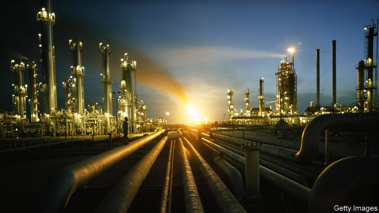
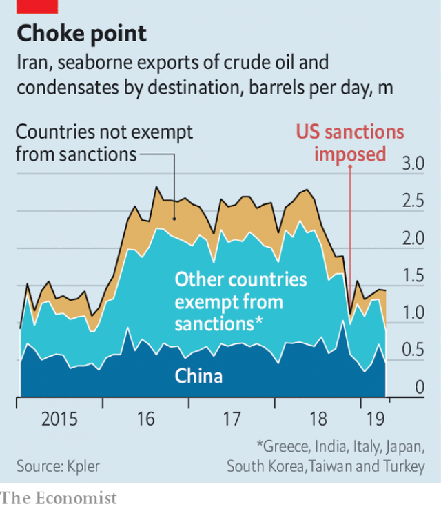

###### Crude tactics

# America wants to challenge rogue petrostates 

##### But it cannot squeeze Iran and Venezuela without risking higher oil prices for its own consumers 

 

> Apr 25th 2019 

AMERICA HAS been a superpower for decades. As a superpower in global energy markets, however, it is barely an adolescent. As recently as 2015 it was illegal to export oil. Within ten years the shale boom has transformed it into the world’s biggest producer of crude. No longer must it tiptoe around regimes whose policies it detests but whose oil it craves. President Donald Trump touts an age of “energy dominance”. He has put its burgeoning energy prowess to the test with sanctions on Iran and Venezuela. But dreams of dominance are running into the realities of energy markets. 

On April 22nd the American administration announced that no further waivers would be granted to countries importing oil from Iran. “We are going to zero,” declared Mike Pompeo, the secretary of state. Waivers to eight countries, granted in November, were due to expire on May 2nd. Even so, investors were shocked that no exceptions were allowed. According to the state department, Saudi Arabia, the United Arab Emirates and America will help meet demand. But Brent crude, the international benchmark, quickly topped $74, the highest level in nearly six months. 

The Trump administration is right to make to make a fuss about America’s oil boom. According to the International Energy Agency, by 2021 the country may be a net exporter of oil. This would be a stunning reversal. Not long ago, notes Amy Myers Jaffe of the Council on Foreign Relations, a think-tank, oil imports were the largest cause of America’s current-account deficit. 

But it is wrong to think it can bring about dramatic change in Iran and Venezuela without risking dramatic spikes in petrol prices. (Those concerned about climate change might welcome expensive oil; Mr Trump is not one of those people.) America’s government does not control its oil industry. Oil firms are backed by investors whose interests do not necessarily align with those of the president. Nor can it control the world’s many buyers and sellers of crude. American production accounts for about 15% of global output, a striking increase from what it was but still a small share of total supply. Complicating matters, investors have struggled to anticipate the Trump administration’s actions. Rather than stabilise oil markets, America has been as likely to do the opposite. 

Mr Trump announced last May that America would impose sanctions on Iran and withdraw from the deal on international oversight of its nuclear capacity signed during Barack Obama’s presidency—the “worst deal ever”, as Mr Trump liked to call it. He urged the Organisation of Petroleum Exporting Countries (OPEC), privately and on Twitter, to boost production to help restrain oil prices. Saudi Arabia duly did so, increasing output by 600,000 barrels a day from June to November, when the sanctions were to take effect. 

At the last minute, however, Mr Trump announced that eight countries would be exempt from the waivers for six months—including China and India, the biggest importers of Iranian oil. Investors and Saudi Arabia were caught off guard. The kingdom requires oil at around $80 a barrel to meet its budgetary needs; in December Brent prices sank to $51. OPEC and its allies scrambled to cut production and shore up prices. In December they said they would decrease output by 1.2m barrels a day. 

The next sanctions came in January, after opponents of Nicolás Maduro’s ruinous regime in Venezuela declared Juan Guaidó, the head of its national assembly, the legitimate leader. America recognised Mr Guaidó and unveiled sanctions to choke off the country’s oil company, Mr Maduro’s main source of cash. “America now appreciates that energy is a source of foreign-policy strength rather than a vulnerability,” says Meghan O’Sullivan, a former adviser to George W. Bush and a professor at Harvard University. 

But using that strength effectively can be difficult. Sanctions on Iran and Venezuela have yet to produce the desired effect. Mr Maduro still clings to power. Iran has met none of Mr Trump’s demands. Its crude exports have fallen by about half since Mr Trump said America would withdraw from the nuclear deal last year, but they remained well above zero in March, at about 1.4m barrels a day, according to Kpler, a data firm. China, in particular, has continued to import Iranian oil (see chart). The announcement that waivers will expire seeks to change that. Countries that continue to import Iranian oil, the state department says, could be cut off from America’s banking system. 

 

This manoeuvre is risky, says Helima Croft of RBC Capital Markets, an investment bank. Iran’s foreign ministry is threatening to retaliate by closing the Strait of Hormuz, a major export channel for the region’s crude. With little left to lose, it may stop allowing international inspectors to monitor its nuclear programme. Oil markets, too, face uncertainty. Prices were already rising, because of plunging output in Venezuela and civil war looming in Libya. The state department has not said how soon America might impose sanctions on countries that continue to import Iranian oil. China may do so—an official from its foreign ministry declared that China “opposes the unilateral sanctions”. That could complicate a bilateral trade dispute that had looked close to resolution. 

The number of rigs drilling in America has risen since the start of the year, as the oil price has climbed. Yet American shale oil is mostly “light”. Refineries in America and elsewhere are thirsty for heavy crude, because Venezuela’s production of the stuff has dropped and demand for distillates made with it is strong. There is a “fundamental mismatch” between the type of crude the world increasingly wants and what America is pumping, says Bernadette Johnson of Drillinginfo, a research firm. 

Much therefore depends on whether Saudi Arabia boosts production, as the Trump administration hopes. After last year’s flip-flops, it is unlikely to move fast. OPEC and its partners have their next formal meeting in late June. Even if Saudi Arabia were to ramp up production quickly and dramatically, analysts debate how long that boost could be sustained. A recent bond prospectus for Saudi Aramco, the kingdom’s oil giant, disclosed that a famous oilfield is ready to sustain production of 3.8m barrels a day, about 25% less than analysts had assumed. 

Neil Beveridge of Bernstein, a research firm, points out that OPEC’s spare capacity could drop dangerously low as Iran’s production falls and Saudi Arabia works to ramp up. That would leave the oil price vulnerable to supply shocks—if fighting in Libya escalates, for instance. America, the energy adolescent, can certainly roil oil markets. But it is unable to control them. 

-- 

 单词注释:

1.tactic['tæktik]:n. 一项战术, 一条策略 a. 战术的, 顺序的, 排列的 

2.rogue[rәug]:n. 恶棍, 流氓, 小淘气 vt. 欺骗 vi. 游手好闲 

3.petrostates[]:[网络] 石膏 

4.cannot['kænɒt]:aux. 无法, 不能 

5.Iran[i'rɑ:n]:n. 伊朗 

6.Venezuela[,vene'zweilә]:n. 委内瑞拉 

7.APR[]:[计] 替换通路再试器 

8.superpower[.sju:pә'pauә]:n. 超级强权, 超级大国 [经] 超级大国 

9.shale[ʃeil]:n. 页岩 

10.producer[prә'dju:sә]:n. 生产者, 制作者, 制作人 [化] 发生器; (炉煤气)发生炉; 制气炉; 生产者 

11.tiptoe['tiptәu]:n. 脚尖 vi. 用脚尖走 adv. 踮着脚 a. 踮着脚走的, 偷偷摸摸的 

12.regime[rei'ʒi:m]:n. 政权, 当权期间, 政体, 社会制度, 体制, 情态 [医] 制度, 生活制度 

13.detest[di'test]:vt. 厌恶, 憎恨 

14.crave[kreiv]:v. 渴望, 热望, 恳求 

15.tout[taut]:vi. 招徕顾客, 兜售物品 vt. 招徕, 刺探...情报 n. 兜售者, 侦查者 

16.dominance['dɔminәns]:n. 优势, 显性, 统治, 控制, 支配 [计] 控制, 扰势 

17.burgeoning[]:[计] 急速增长的 

18.prowess['prauis]:n. 英勇, 勇敢, 超凡技术 

19.sanction['sæŋkʃәn]:n. 核准, 制裁, 处罚, 约束力 vt. 制定制裁规则, 认可, 核准, 同意 

20.waiver['weivә]:n. 放弃, 弃权, 弃权声明书 [经] 弃权, 放弃权利 

21.mike[maik]:vi. 偷懒, 游手好闲 n. 休息, 游手好闲, 扩音器, 话筒 

22.pompeo[]:n. (Pompeo)人名；(意)蓬佩奥 

23.expire[ik'spaiә]:vi. 期满, 呼气, 断气 vt. 呼出 

24.investor[in'vestә]:n. 投资者 [经] 投资者 

25.saudi['sajdi]:a. 沙乌地阿拉伯（人或语）的 

26.Arabia[ә'reibiә]:n. 阿拉伯半岛 

27.emirate[e'miәrit]:n. 埃米尔的地位, 酋长国 

28.Brent[brent]:[经] 布兰特油田 

29.benchmark[]:[计] 基准程序; 基准 

30.quickly['kwikli]:adv. 很快地 

31.fuss[fʌs]:n. 大惊小怪, 小题大作, 忙乱 vi. 无事自扰, 焦急, 焦燥, 忙乱 vt. 使激动, 使烦燥 

32.exporter[ik'spɒ:tә]:n. 出口商, 输出者, 出口公司 [经] 出口商, 输出者 

33.stunning['stʌniŋ]:a. 打昏迷的, 弄得人昏头昏脑的, 令人震惊的 

34.reversal[ri'vә:sl]:n. 翻转, 颠倒, 反转 [医] 逆转, 颠倒 

35.amy['eimi]:n. 艾米（女子名） 

36.myer[]:n. 玛雅（澳大利亚一百货公司名）；迈尔（姓氏） 

37.Jaffe[]:n. 杰斐；杰夫（人名） n. (Jaffe)人名；(西)哈费；(意)亚费；(英、瑞典)贾菲 abbr. 日本妇女表情数据库（Japanese Female Facial Expression） 

38.deficit['defisit]:n. 赤字, 不足额 [医] 短缺 

39.spike[spaik]:n. 长钉, 鞋钉, 钉状物, 尖峰状物, 穗 vt. 以大钉钉牢, 用尖物刺穿, 阻止, 弃置不用 [计] 尖峰信号 

40.align[ә'lain]:vi. 排列, 排成一行, 结盟 vt. 使结盟, 使成一行, 校正 

41.buyer['baiә]:n. 买主, 买方 [经] 买主, 买方, 买手 

42.stabilise['steibilaiz]:vt.vi. (使)稳定, (使)安定, (使)坚固 vt. 装稳定器 

43.oversight['әuvәsait]:n. 勘漏, 失察, 失败, 照料 [经] 监督权 

44.barack[bɑ:'ræk]:n. 巴拉克（男子名） 

45.organisation[,ɔ: ^әnaizeiʃən; - ni'z-]:n. 组织, 团体, 体制, 编制 

46.OPEC['әjpek]:欧佩克(石油输出国家组织) 

47.privately[]:adv. 秘密地；私下地 

48.twitter['twitә]:n. 啁啾, 唧唧喳喳声 vi. 啭, 啁啾, 颤抖 vt. 嘁嘁喳喳地讲, 抖动 

49.duly['dju:li]:adv. 恰当地, 充分地, 适当地, 及时地 

50.exempt[ig'zempt]:n. 免税者, 被免除义务者 a. 免除的 vt. 使免除, 豁免 

51.importer[im'pɒ:tә]:n. 输入者, 进口商 [法] 进口商, 输入者 

52.Iranian[i'reiniәn]:a. 伊朗的, 伊朗语系的 n. 伊朗人, 伊朗语 

53.budgetary['bʌdʒitәri]:a. 预算的 [法] 预算的 

54.ally['ælai. ә'lai]:n. 同盟者, 同盟国, 助手 vt. 使联盟, 使联合, 使有关系 vi. 结盟 

55.scramble['skræmbl]:n. 攀缘, 爬行, 抢夺, 混乱, 紧急起飞 vi. 攀缘, 杂乱蔓延, 争夺, 拼凑, 匆忙 vt. 攀登, 扰乱, 使混杂 

56.ruinous['ruinәs]:a. 破坏性的, 招致毁灭的 

57.juan[hwɑ:n]:n. 胡安（男子名） 

58.legitimate[li'dʒitimәt]:a. 合法的, 正当的, 婚生的 vt. 认为正当, 立为嫡嗣, 使合法 

59.unveil[.ʌn'veil]:vt. 揭开, 揭幕, 除去...的面纱 vi. 显露, 除去面纱 

60.vulnerability[.vʌlnәrә'biliti]:n. 易受伤, 易受责难, 易受伤部位 [医] 易损性 

61.meghan[]:梅根（人名） 

62.adviser[әd'vaizә]:n. 顾问, 劝告者, 指导教师 [法] 顾问, 劝告者 

63.george[dʒɔ:dʒ]:n. 乔治（男子名）；自动操纵装置；英国最高勋爵勋章上的圣乔治诛龙图 

64.W['dʌb(ә)lju:]:[计] 等待, 写, 字 [医] 钨(74号元素) 

65.Harvard['hɑ:vәd]:n. 哈佛大学 

66.effectively[i'fektivli]:adv. 有效地, 有力地, 实际上 

67.maduro[mә'duәrәu]:a. 色深味浓的烟草做的, (雪茄)色深味浓的 

68.cling[kliŋ]:vi. 粘紧, 附着, 紧贴, 坚持 

69.datum['deitәm]:n. 论据, 材料, 资料, 已知数 [医] 材料, 资料, 论据 

70.manoeuvre[mә'nu:vә]:n. 调遣, 演习, 策略 vi. 调动, 演习, 用策略 vt. 调动, 操纵 

71.risky['riski]:a. 危险的 

72.croft[krɒft]:n. 小田地, 小农场 

73.RBC[]:红血球, 红细胞 [医] 红细胞计数 

74.retaliate[ri'tælieit]:vt. 报复, 回敬 vi. 报复, 以牙还牙 

75.Hormuz['hɔ:mәz,hɔ:'mu:z]:霍尔木兹海峡(在伊朗和阿拉伯半岛之间,连接波斯湾[即阿拉伯湾]和阿曼湾) 

76.inspector[in'spektә]:n. 检查员, 巡视员 [化] 检查员 

77.uncertainty[.ʌn'sә:tnti]:n. 不确定, 不可靠, 不确定的事物 [化] 不确定度 

78.loom[lu:m]:n. 织布机, 若隐若现的景象 vi. 朦胧地出现, 隐约可见, 可怕地出现 

79.Libya['libiә]:n. 利比亚 

80.unilateral[.ju:ni'lætәrәl]:a. 单方面的, 单边的, 片面的 [医] 单侧的, 一侧的 

81.bilateral[bai'lætәrәl]:a. 有两边的, 双边的, 双方的 [医] 两侧的 

82.rig[rig]:n. 装备, 帆装 vt. 装配, 装扮, 给船装帆, 垄断, 操纵 

83.refinery[ri'fainәri]:n. 精炼厂 [化] 精炼厂炼糖厂 

84.distillate['distilit, -leit]:n. 馏出物, 精华 [化] 馏出液; 馏出物 

85.mismatch[mis'mætʃ]:n. 错配 vt. 错配, 使...成不相配的婚姻 

86.Bernadette[,bә:nә'det]:n. 伯纳黛特(f.) 

87.johnson['dʒɔnsn]:n. 约翰逊（姓氏） 

88.ramp[ræmp]:n. 斜坡, 坡道, 敲诈 vi. 狂跳乱撞, 乱冲, 敲诈, 蔓延 vt. 使有斜面, 敲诈 

89.dramatically[drә'mætikli]:adv. 戏剧地, 引人注目地, 突然地 

90.analyst['ænәlist]:n. 分析者, 精神分析学家 [化] 分析员; 化验员 

91.prospectus[prәs'pektәs]:n. 创办计划书, (内容)说明书, 内容简介 [经] (募债)说明书 

92.aramco[]:abbr. 沙特阿美石油公司（Arabian-American Oil Company） 

93.les[lei]:abbr. 发射脱离系统（Launch Escape System） 

94.neil[]:n. 尼尔（男子名） 

95.Beveridge['bevәridʒ]:贝弗里奇(姓氏) 

96.Bernstein[bә:n'stein]:[德]琥珀, 伯恩斯坦(姓氏) 

97.dangerously[]:adv. 危险, 不安全 

98.vulnerable['vʌlnәrәbl]:a. 易受伤害的, 有弱点的, 易受影响的, 脆弱的, 成局的 [医] 易损的 

99.escalate['eskәleit]:vi. 逐步扩大, 逐步升高, 逐步增强 vt. 使逐步上升 

100.roil[rɒil]:vt. 搅浑, 使焦急 

