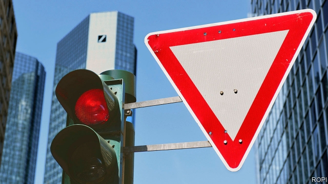

###### The deal’s off

# Deutsche Bank and Commerzbank call off merger talks 

##### Discussions between Germany’s two biggest listed banks end in failure 

 

> Apr 25th 2019 

AFTER SIX weeks of rumour, a progress report was due. Deutsche Bank, Germany’s biggest bank, had promised investors an update on merger discussions with its Frankfurt neighbour, Commerzbank, on April 26th, alongside its first-quarter earnings. The update came, unplanned, a day early. On April 25th the two banks said they had called off the talks, the announcement prompted by a Reuters report that negotiations were about to fail. 

The pair said that a deal would not justify the “additional execution risks, restructuring costs and capital requirements associated with such a large-scale integration”. Outside the two banks and the German government, Commerzbank’s biggest shareholder with a 15% stake, plenty had reached that conclusion even before the banks said in mid-March that talks were under way and embarked on weeks of negotiation. Two troubled lenders looked unlikely to make one strong one. Deutsche eked out only a tiny profit in 2018, its first for four years, while Commerzbank has made paltry returns. Deutsche’s shares have been trading at about 25% of book value, Commerzbank’s at little more. 

Though Commerzbank has done a lot of reconstructive work since taking over Dresdner Bank during the global financial crisis, Deutsche still resembles a building site. It is still attempting to integrate Postbank, a retail business it bought in 2008-10, tried to sell and then decided to keep. It has retreated in investment banking, especially trading, to focus on corporate clients, who it still believes need a strong European alternative to Wall Street firms. Even a combined entity, after deep cuts in costs, would have found it difficult to build profitability in an overcrowded domestic market in which the co-operative and public sectors are also strong competitors. 

So what was the logic of a merger? There was some, if never enough. It would have created Germany’s biggest retail bank by some distance, with about a fifth of deposits in a highly fragmented market. It might have forced a faster digitisation of German retail banking, including branch closures—loudly opposed by trade unions at both banks while the talks were under way. Commerzbank’s deposit base would have brought Deutsche cheaper and more stable funding. It would have tilted Deutsche faster towards serving companies—notably by bringing more business from Germany’s Mittelstand, the backbone of both Commerzbank’s revenues and the national economy. Given Europe’s lack of banks with the clout of America’s giants, domestic consolidation has long been seen as a stepping stone to creating continent-wide players, with economies of scale. 

For the government, one attraction of a merger was that Commerzbank would then be sure not to fall into the hands of one of the foreign suitors with which it has been repeatedly linked. Even in the past few weeks, reports have surfaced of interest from Italy’s UniCredit, which already owns HVB, a large Munich-based lender, and from ING, of the Netherlands, which already has a successful branchless retail bank in Germany. 

With Deutsche ruled out, such rumours are unlikely to go away. Ironically, the failed talks may, through a bid for Commerzbank, hasten a cross-border deal. Deutsche’s situation is as dismal as ever. In a preview of its first-quarter earnings with the announcement that talks had failed, it said it had made only a puny €200m ($227m) or so in net profit, with corporate and investment-banking revenues down on a year earlier. Put away the drawing board, and get back to the building site. 

-- 

 单词注释:

1.deutsche[]:n. 德意志联邦共和国马克 

2.commerzbank[]: 德国商业银行公司总部所在地：德国主要业务：银行 

3.merger['mә:dʒә]:n. 合并, 归并 [经] 购并 

4.APR[]:[计] 替换通路再试器 

5.investor[in'vestә]:n. 投资者 [经] 投资者 

6.update[ʌp'deit]:vt. 更新, 使现代化 n. 更新 [计] 更新 

7.frankfurt['fræŋkfәt]:n. 牛肉香肠, 猪牛肉混合香肠 

8.earning['ә:niŋ]:n. 收入（earn的现在分词） 

9.unplanned['ʌn'plænd]:a. 无计划的, 未经筹划的, 意外的, 在计划外的 

10.Reuter['rɔitә]:n. 路透社, 路透通讯社 

11.negotiation[ni.gәuʃi'eiʃәn]:n. 谈判, 磋商, 交涉 [经] 谈判, 协商 

12.execution[.eksi'kju:ʃәn]:n. 实行, 完成, 执行, 死刑 [计] 执行 

13.restructuring[]:[计] 重构的 

14.integration[.inti'greiʃәn]:n. 综合, 与环境协调的行为, 集成 [化] 集成; 整合 

15.shareholder['ʃєә.hәuldә]:n. 股东 [法] 股东, 股票持有人 

16.embark[im'bɑ:k]:vi. 乘船, 着手, 从事, 上飞机 vt. 使上船, 使上飞机, 使从事 

17.lender['lendә]:n. 出借人, 贷方 [经] 出借者, 贷方, 贷款人 

18.EK[]:柯达公司 

19.paltry['pɒ:ltri]:a. 不足取的, 琐碎的, 可鄙的 

20.reconstructive[.ri:kәn'strʌktiv]:a. 再建的, 改造的 

21.dresdner[]:[网络] 德累斯顿；德利银行；德利 

22.Postbank[]:[网络] 邮政银行；德国邮政银行；信贷银行德国邮政银行 

23.corporate['kɒ:pәrit]:a. 社团的, 合伙的, 公司的 [经] 团体的, 法人的, 社团的 

24.client['klaiәnt]:n. 客户, 顾客, 委托人 [计] 客户, 客户机, 客户机程序 

25.entity['entiti]:n. 实体, 实存物, 存在 [计] 实体 

26.profitability[.prɒfitә'biliti]:n. 收益性, 利益率 [经] 可获利润率 

27.overcrowd[.әuvә'kraud]:vt. 容纳过多的人, 使过度拥挤 

28.sector['sektә]:n. 扇形, 部门, 部分, 函数尺, 象限仪, 段, 区段 vt. 把...分成扇形 [计] 扇面; 扇区; 段; 区段 

29.digitisation[]:[计] 数字化 

30.tilt[tilt]:n. 倾斜, 倾向, 船篷, 车篷 vt. 使倾斜, 使倾侧, 用帆布篷遮盖 vi. 倾斜, 翘起, 冲, 评击 [计] 倾斜 

31.Mittelstand[ˈmɪtlˌstænd]:[网络] 中小型企业；中小企业；德国中小型企业 

32.backbone['bækbәun]:n. 脊椎, 志气, 骨干, 支柱 [计] 主干网, 主干网点 

33.clout[klaut]:n. 敲击, 破布 vt. 打补钉 

34.consolidation[kәn.sɒli'deiʃәn]:n. 巩固, 团结, 合并, 加强 [医] 实变 

35.suitor['sju:tә]:n. 起诉者, 请愿者, 求婚者 [法] 起诉人, 原告, 求婚者 

36.UniCredit[]:[网络] 意大利联合信贷银行；意大利裕信银行 

37.hvb[]: [计]= High Voltage Bias,高压偏压 

38.ing[]:abbr. 惯性导航与制导（Inertial Navigation and Guidance）；强中子发生器（Intense Neutron Generator） 

39.Netherlands['neðәlәndz]:n. 荷兰 

40.branchless[b'rɑ:ntʃles]: 无枝的 

41.ironically[]:adv. 冷嘲地, 挖苦地, 讽刺地, 令人啼笑皆非地 

42.dismal['dizmәl]:a. 阴沉的, 凄凉的, 令人忧郁的 n. 低落的情绪, 沼泽 

43.puny['pju:ni]:a. 微小的, 弱小的, 微不足道的 

