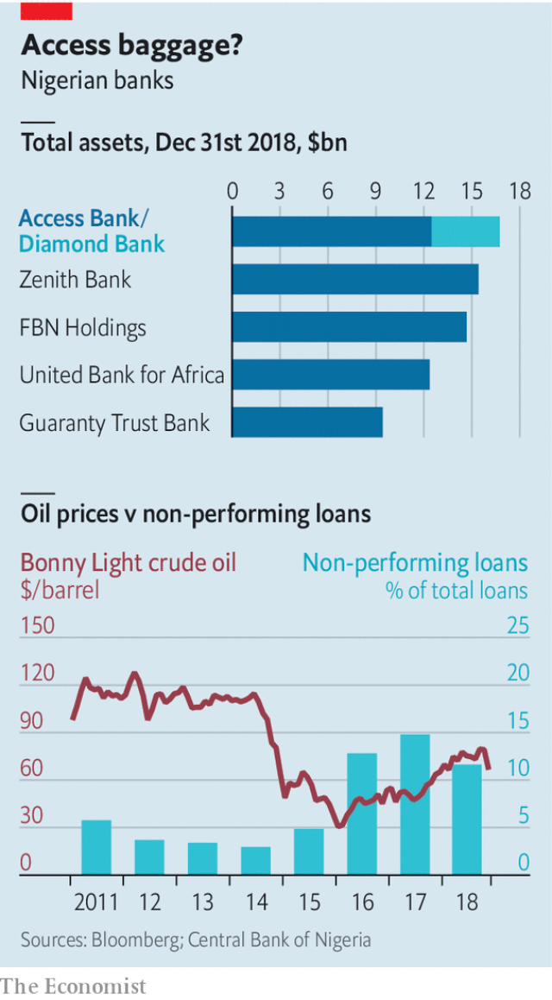

###### The bigger the better

# Large Nigerian banks have weathered a storm 

##### But the smaller ones look shaky 

 

> Apr 27th 2019 

THE COLLAPSE of the oil price that began in 2014 was bad news for Nigerian banks. A quarter of their lending was to oil and gas firms. Many businesses were left reeling after a currency crisis. The economy stuttered, then plunged into recession. Before the oil slump just 3% of loans were not being paid back. By 2017 some 15% had gone sour. 

The oil shock underscored an old truth: in choppy waters, it helps to be a big ship. The country’s large banks made tidy profits and now sit on sufficient capital. But smaller ones look shaky, even as currency problems have eased and the economy has recovered. Last year the central bank revoked the licence of Skye Bank, a struggling midsized lender. 

Diamond, another middling bank, was on the rocks before being taken over by Access, a bigger rival. The combined bank began operations this month, becoming Nigeria’s largest bank by assets (see chart). It now boasts more customers than any other in Africa. 

 

Large banks were able to find ways to make money in the crisis, notes Olamipo Ogunsanya, an analyst at Renaissance Capital. They swapped spare dollars for naira with the central bank, which was trying to rebuild its foreign-exchange reserves. Flush with spare funds, they were in a position to lend naira at attractive rates to the government, which was borrowing heavily to plug the gap left by shrinking oil revenues. Meanwhile credit to the private sector stagnated. 

By contrast smaller banks had fewer branches and weaker brands, which made it harder to attract deposits. Some relied more on borrowing money from pension funds and asset managers, says Wale Okunrinboye of Sigma Pensions, a Nigerian fund. They suffered when those institutional investors were lured away by juicy yields on government securities. 

In that regard, Diamond was unusual. It had plenty of retail deposits and a leading digital app, so it could raise funds cheaply. But it had lent out a lot of that money to oil companies and to Nigeria’s floundering power sector. By late last year some 40% of its loans were in trouble. Its share price had tumbled by 90% since the start of the oil slump. Access, which had fewer customers despite holding three times as many assets, saw an opportunity to pick up a strong franchise on the cheap. 

Access reckons that the merger will bring 150bn naira ($417m) of extra revenue and reduced costs over the next three years, from savings on shared computer systems, procurement and the like. But some think that optimistic. Ronak Gadhia, an analyst at EFG Hermes, a brokerage, calculates that the projected savings represent about 90% of Diamond’s pre-merger costs, excluding some regulatory levies that cannot be reduced. “I don’t think I’ve seen any cost savings which even come close to that level globally,” he says. Thus far the broader impact of the merger on the banking sector has been muted. Access might now be Nigeria’s biggest bank, but it is far from being its most profitable. 

Cost concerns point to an awkward truth: though scale is an advantage, mergers are hard to pull off. A big consolidation in 2005-06 cut the number of Nigerian banks from 89 to 24; banks chased returns on their extra capital by lending to stockmarket speculators, leading four years later to a financial crisis. More recent deals have also disappointed. The large banks have little appetite for further acquisitions. In the long run, there is huge growth potential in a country where 60% of adults still do not have an account. But bankers will have to work to unlock it. 

-- 

 单词注释:

1.Nigerian[nai'dʒiriәn]:n. 尼日利亚人 

2.shaky['ʃeiki]:a. 震动的, 摇晃的, 动摇的 

3.APR[]:[计] 替换通路再试器 

4.stutter['stʌtә]:n. 口吃, 结结巴巴 v. 结结巴巴地说 

5.recession[ri'seʃәn]:n. 后退, 凹处, 衰退, 归还 [医] 退缩 

6.slump[slʌmp]:n. 暴跌, 垂头弯腰的姿态 vi. 猛然掉落, 陷入, 衰落(经济等) 

7.underscore[.ʌndә'skɒ:]:vt. 划线于...下 n. (表强调的)下划线 [计] 底线 

8.choppy['tʃɒpi]:a. 猛地一动一停的, 突变的 [经] 震荡的 

9.revoke[ri'vәuk]:vt. 撤回, 废除 vi. 藏牌 n. 藏牌 [计] 取消权限程序 

10.skye[skai]:n. 匐犬（一种猎狐犬）；斯凯岛（苏格兰西部的岛） 

11.midsized['mɪdsaɪzd]:a. 中等大小的；中型的；中号的 

12.lender['lendә]:n. 出借人, 贷方 [经] 出借者, 贷方, 贷款人 

13.middling['midliŋ]:a. 中等的, 普通的, 平凡的 adv. 中等 

14.asset['æset]:n. 资产, 有益的东西 

15.analyst['ænәlist]:n. 分析者, 精神分析学家 [化] 分析员; 化验员 

16.renaissance[ri'neisәns]:n. 复活, 复兴, 文艺复兴 a. 文艺复兴的 

17.Naira['nairә]:奈拉(尼日利亚货币名) 

18.sector['sektә]:n. 扇形, 部门, 部分, 函数尺, 象限仪, 段, 区段 vt. 把...分成扇形 [计] 扇面; 扇区; 段; 区段 

19.stagnate['stægneit]:v. (使)淤塞, (使)停滞, (使)变萧条 

20.wale[weil]:n. 隆起的伤痕, 鞭痕, 凸条纹, 精华, 选择 vt. 在...上留下鞭痕, 织成棱纹, 挑选, 撑住 vi. 挑选 

21.sigma['si^mә]:[计] 求和 [医] σ(希腊文第十八个字母) 

22.institutional[.insti'tju:ʃәnәl]:a. 制度的, 公共机构的, 学会的 [法] 组织机构的, 制度的, 公共机构的 

23.investor[in'vestә]:n. 投资者 [经] 投资者 

24.lure[luә]:n. 饵, 诱惑 vt. 引诱, 诱惑 

25.APP[]:[计] 应用, 应用程序; 相联并行处理器 

26.cheaply['tʃipli]:adv. 便宜地 

27.flounder['flaundә]:vi. 挣扎, 折腾；错乱地做事或说话 

28.franchise['fræntʃaiz]:n. 公民权, 特权, 特许经营权, 免赔额 vt. 给以特权, 给以...公民权 

29.reckon['rekәn]:vt. 计算, 总计, 估计, 认为, 猜想 vi. 数, 计算, 估计, 依赖, 料想 

30.merger['mә:dʒә]:n. 合并, 归并 [经] 购并 

31.procurement[prә'kjuәmәnt]:n. 获得 [经] 采购 

32.EFG[]:限边馈膜生长 

33.hermes['h\\:mi:z]:abbr. 重放射性同位素电磁分离器（heavy element and radioactive material electromagneticseparator） 

34.brokerage['brәukәridʒ]:n. 经纪人, 回扣, 佣金, 中间人业务 [经] 经纪业, 佣金, 手续费 

35.regulatory['regjulәtәri]:a. 受控制的, 统制的, 调整的 [经] 规则的 

36.levy['levi]:n. 税款, 所征的人数, 征收 vi. 征税, 课税 vt. 征收, 强求, 召集 

37.cannot['kænɒt]:aux. 无法, 不能 

38.globally[]:[计] 全局地 

39.consolidation[kәn.sɒli'deiʃәn]:n. 巩固, 团结, 合并, 加强 [医] 实变 

40.stockmarket[s'tɒkmɑ:kɪt]: 证券市场; 证券交易所; 证券行情 

41.speculator['spekjuleitә]:n. 投机者, 投机商人, 思索者 [经] 投机买卖者, 投机商 

42.banker['bæŋkә]:n. 银行家, 庄家 [经] 银行业者, 银行家 

43.unlock[.ʌn'lɒk]:vt. 开...的锁, 开启, 表露, 放出 vi. 被开启, 揭开, 解放 [计] 解出锁定 

