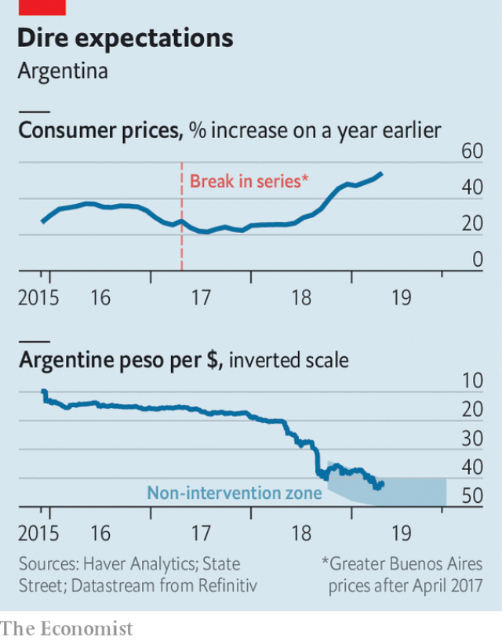

###### The price of desperation

# Mauricio Macri emulates his rival, Cristina Fernández de Kirchner 

##### A populist is a liberal mugged by inflation 

 

> Apr 27th 2019 

“I JUST WANT an end to the price madness,” says Sonia Valverde, a mother of three, at a supermarket in Buenos Aires. She points to a government sticker advertising new price controls, which have frozen the price of 64 products, including sachets of milk. The only difficulty is that no sachets remain on the shelf. 

Ending Argentina’s price madness was Mauricio Macri’s guiding mission when he won the presidency in 2015. He lifted currency controls imposed by his populist predecessor, Cristina Fernández de Kirchner, and began to cut energy subsidies. He gave the central bank a target for inflation and let the statisticians measure it honestly. And he loosened price controls Ms Fernández had imposed on hundreds of items, including soap and chicken. 

But Argentina’s maddening prices refuse to be tamed. When inflation fell less quickly than hoped, the government relaxed the central bank’s inflation target in late 2017, undermining its credibility. As American Treasury yields rose months later, the peso dropped and inflation soared. Argentina embraced the IMF and abandoned its inflation target in favour of the more direct goal of constraining the money supply. But even after the central bank promised to freeze the quantity of money until the end of this year, the peso wobbled and annual inflation soared, to almost 55% in March (see chart). 

 

Mr Macri’s popularity is headed in the other direction. An opinion poll last week suggested he would lose October’s election to Ms Fernández, despite corruption charges against her. To defeat her, Mr Macri has chosen to emulate her, demanding that shops refrain from raising “essential prices” for six months. In a meeting with supermarket bosses, he insisted that he would win by 52% to 48%—the kind of thin margin that makes retailers nervous. 

“Such agreements over prices will never solve the real problem: never have, never will,” says Miguel Acevedo, the head of the country’s leading employers association. In Buenos Aires, the freeze and other controls affect only about 3% of the consumption basket, according to JPMorgan Chase, a bank. Many of these prices jumped in the few days between the announcement and imposition of the freeze. And if any products are withdrawn from the shelves, they drop out of the inflation figures anyway. 

But the controls may still have an indirect impact, through psychology and politics. Argentina’s macroeconomic policies are now consistent with lower inflation: the fiscal deficit is narrowing, interest rates are painfully high and the IMF has boosted the central bank’s foreign-exchange reserves. But inflation has its own momentum: it is high, because it was high, and is expected to remain so. The hope is that freezing some high-profile prices might help curb those expectations, at least until the election. Whereas Ms Fernández’s controls tried, unsuccessfully, to suppress the inflationary effects of loose policies, Mr Macri’s are trying to reinforce the disinflationary impact of tight ones. 

That inflationary psychology also depends on the exchange rate, which Argentines watch with grim fascination. Under the country’s agreement with the IMF, the central bank can step in to defend the peso if it weakens beyond a “non-intervention zone”. This has moved slowly over time, so as to allow the peso to cheapen gradually, thus keeping exports competitive despite rising peso prices. But for the rest of the year, the central bank will strive to stop the currency weakening beyond 51.5 pesos to the dollar, whatever the damage to exports. 

If the peso holds, inflation should start to fall. And if that happens, Mr Macri could yet win re-election. According to Eduardo D’Alessio, a pollster, 71% of voters approve of the anti-inflation package, which also provides credit for the poor and elderly, as well as cancelling planned increases in electricity and transport prices. But if Mr Macri’s election chances look too bleak, Argentines might resume their flight into dollars, weakening the peso, worsening inflation and thereby guaranteeing his defeat. In this way, Argentina could succumb to a self-fulfilling fear of Ms Fernández. In politics, as in economics, expectations can precipitate the dangers they foresee. 

-- 

 单词注释:

1.desperation[.despә'reiʃәn]:n. 绝望 

2.Mauricio[]:n. 毛利西奥（男子名） 

3.macri[]: [人名] 麦克里 

4.emulate['emjuleit]:vt. 效法, 尽力赶上, 同...竞争 [计] 仿真 

5.Cristina[]:n. 克里斯蒂娜（电视剧中的人物） 

6.de[di:]:[化] 非对映体过量 [医] 铥(69号元素铥的别名,1916年Eder离得的假想元素) 

7.kirchner[]:柯克纳（人名） 

8.Populist['pɔpjulist]:n. 民粹派的成员 

9.inflation[in'fleiʃәn]:n. 胀大, 夸张, 通货膨胀 [化] 充气吹胀; 膨胀 

10.APR[]:[计] 替换通路再试器 

11.madness['mædnis]:n. 疯狂, 愚蠢的行为 [医] 狂, 疯狂 

12.sonia[]:n. 索尼亚（女子名） 

13.valverde[]: [地名] [西班牙] 巴尔韦德 

14.Buenos[]:n. (Buenos)人名；(西)布埃诺斯 

15.aire[]:n. 亚耳河（英国约克郡西部河流） 

16.sticker['stikә]:n. 屠夫, 尖刀, 刺, 芒, 尖物, 携带尖刀者, 张贴物, 滞销品, (非正式)难题 [经] 呆滞商品 

17.advertising['ædvәtaiziŋ]:n. 广告业, 广告 a. 广告的 [计] 发广告 

18.sachet[sæ'ʃei]:n. 小袋, 香料袋 [医] 香囊, 小药囊 

19.presidency['prezidәnsi]:n. 总统职权, 总裁职位 

20.predecessor[.predi'sesә]:n. 前任, 先辈, 前身 [医] 初牙, 前辈, 祖先 

21.statistician[.stæti'stiʃәn]:n. 统计员, 统计学家 [经] 统计家 

22.honestly['ɒnistli]:adv. 真诚地, 公正地 

23.madden['mædn]:vt. 使发狂, 激怒 vi. 发狂, 发怒 

24.les[lei]:abbr. 发射脱离系统（Launch Escape System） 

25.quickly['kwikli]:adv. 很快地 

26.undermine[.ʌndә'main]:vt. 在...下面挖, 渐渐破坏, 暗地里破坏 [法] 暗中破坏, 以阴谋中伤伤害 

27.credibility[.kredi'biliti]:n. 可信用, 确实性, 可靠 [法] 证据能力, 可信程度, 确实性 

28.treasury['treʒәri]:n. 国库, 宝库, 财政部, 国库券 [经] 库存, 国库, 金库 

29.peso['peisәu]:n. 比索 [经] 比索 

30.soar[sɒ:]:n. 高扬, 翱翔 vi. 往上飞舞, 高耸, 翱翔 

31.Argentina[.ɑ:dʒәn'ti:nә]:n. 阿根廷 

32.IMF[]:国际货币基金组织 [经] 国际货币基金 

33.constrain[kәn'strein]:vt. 强迫, 限制, 关押 

34.wobble['wɒbl]:n. 摆动, 摇晃, 不稳定, 抖动 vi. 摇晃, 摇摆, 游移不定 vt. 使摇摆, 使颤动 

35.popularity[.pɒpju'læriti]:n. 名声, 受大众欢迎, 流行 

36.corruption[kә'rʌpʃәn]:n. 腐败, 堕落, 贪污 [计] 论误 

37.refrain[ri'frein]:n. 重复的话, 叠句, 副歌 vi. 节制, 避免, 克制 

38.retailer['ri:teilә]:n. 零售商人, 传播的人 [经] 零售商 

39.Miguel[mi'gel]:n. 米格尔（男子名） 

40.acevedo[]:阿塞韦多 阿塞韦多 

41.jpmorgan[]:[网络] 摩根大通；摩根大通银行；摩根大通公司 

42.imposition[.impә'ziʃәn]:n. 征收, 课税, 强加, 欺骗 [经] 征税, 税, 税款 

43.politic['pɒlitik]:a. 精明的, 明智的, 策略的 

44.macroeconomic[-mik]:n. 整体经济 

45.fiscal['fiskәl]:a. 财政的, 国库的 [经] 财政上的, 会计的, 国库的 

46.deficit['defisit]:n. 赤字, 不足额 [医] 短缺 

47.painfully['peinfuli]:adv. 痛苦地, 苦恼地, 费力地 

48.curb[kә:b]:n. 抑制, 勒马绳, 边石 vt. 抑制, 束缚, 勒住 

49.unsuccessfully[]:adv. 无用；失败地 

50.suppress[sә'pres]:vt. 镇压, 使止住, 禁止, 抑制, 查禁 [法] 镇压, 平定, 禁止出版 

51.inflationary[in'fleiʃәnәri]:a. 通货膨胀的, 通货膨胀倾向的 

52.disinflationary[]:反通货膨胀 

53.argentine['ɑ:dʒәntain]:n. 银, 银白色金属, 银白色鱼鳞, 阿根廷人 a. 银的, 银色的, 阿根廷的 

54.grim[grim]:a. 冷酷的, 坚强的, 残忍的, 可怕的, 讨厌的 

55.fascination[.fæsi'neiʃәn]:n. 令人着迷的事物, 入迷, 魅力 

56.cheapen['tʃi:pәn]:v. 减价, 跌价 

57.strive[straiv]:vi. 努力, 奋斗, 斗争 

58.Eduardo[]:n. 爱德华多（姓氏） 

59.pollster['pәulstә]:n. 民意调查人, 民意测验经办人 

60.voter['vәutә]:n. 选民, 投票人 [法] 选民, 选举人, 投票人 

61.bleak[bli:k]:a. 萧瑟的, 荒凉的, 阴冷的 

62.worsen['wә:sn]:vt. 使更坏, 使恶化 vi. 变得更坏, 恶化 

63.succumb[sә'kʌm]:vi. 屈从, 屈服, 死 

64.precipitate[pri'sipiteit]:n. 沉淀物, 凝结物, 结果 vt. 猛抛, 使陷入, 促成, 使沉淀 vi. 猛地落下 a. 突然的, 猛地落下的, 轻率的 

