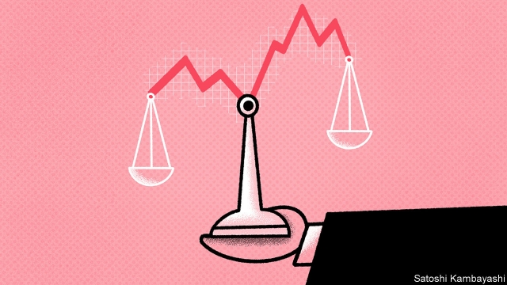

###### Picking up $20 bills

# Should judges assume that markets are efficient? 

##### Sometimes they are asked to rule on share prices after takeovers 

 

> Apr 27th 2019 

ECONOMISTS HAVE long argued about the workings of financial markets. Some, like Eugene Fama, argue that markets adjust swiftly to include all available information, an idea supported by the difficulty of predicting short-term stockmarket moves. Others, like Robert Shiller, posit that psychology has a big effect on market prices, pointing out that share prices fluctuate far more than fundamental variables such as dividends. The pair were jointly awarded the Nobel prize in economics in 2013 (along with Lars Peter Hansen). 

The question is puzzling judges (or “chancellors”) in Delaware, where more than half of America’s public companies are listed. Last year the chancery court of Delaware decided that some shareholders of Aruba Networks, a company that Hewlett Packard (HP) acquired in 2015, should be awarded just $17.13 per share—the price before the deal was announced. HP paid $24.67. The judgment deferred entirely to the market, above all other evidence of what Aruba might be worth—including what HP was willing to pay. It was overturned by Delaware’s supreme court on April 16th. 

Usually, if investors differ from the market in their opinion of a company’s value, they can buy or sell its shares. The exception is during a takeover. If most shareholders vote to sell at a given price, the rest must sell at that price, too. A process known as merger appraisal allows those who opposed the deal to argue before a judge that they have been short-changed. If the judge agrees, the company will have to pay the holdouts more for their shares. 

Merger appraisal had become appealing to arbitrageurs, who would buy shares of takeover targets, vote against any deal and sue for appraisal. If their bid succeeded, they could get a large payout. If it failed, the acquiring company would still have to pay them the deal price. It would also have to pay them interest for holding the cash they would have received for their shares for the duration of legal proceedings—at a remarkably juicy 5 percentage points above the federal discount rate, currently 3%. 

Legislators in Delaware first sought to stop investors flocking into this no-lose proposition by enabling companies to avoid accruing interest by making early payments to holdouts. Then, in 2017, the state’s supreme court introduced an element of risk by ruling that investors would no longer automatically get the deal price if their argument failed. 

It is this ruling that has ignited the debate about how much weight judges should place on market values. The state supreme court decided to award more than the market price of $17.13, but less than the deal price of $24.67. It came to its price, of $19.10, by subtracting from the deal price an estimate of the value of synergies. (This has always been excluded from calculations of fair value in merger appraisals, since shareholders are deemed to have opted out of being compensated for synergies by voting against the deal). 

Followers of Mr Fama will no doubt wish that the Delaware supreme court had followed the chancery court’s decision to defer entirely to market pricing. Those who hold that markets often err may fret that both courts’ rulings have made it riskier for a shareholder to point this imperfection out. But the changes are certainly likely to result in one efficiency: fewer lawyers will be involved. 

-- 

 单词注释:

1.takeover[]:n. 接管, 接收 [经] 接收 

2.APR[]:[计] 替换通路再试器 

3.economist[i:'kɒnәmist]:n. 经济学者, 经济家 [经] 经济学家 

4.working['wә:kiŋ]:n. 工作, 运转, 劳动 a. 工作的, 劳动的, 经营的, 抽搐的, 运转的 

5.eugene[ju:'ʒein, 'ju:dʒi:n]:n. 尤金（男子名） 

6.fama[]: [医][=fellow of the american medical association]美国医学会会员 

7.swiftly['swiftli]:adv. 很快地, 即刻 

8.stockmarket[s'tɒkmɑ:kɪt]: 证券市场; 证券交易所; 证券行情 

9.Robert['rɔbәt]:[法] 警察 

10.shiller[]:[网络] 希勒；经济学家；非理性繁荣 

11.posit['pɒzit]:vt. 假设, 安置, 布置 

12.fluctuate['flʌktʃueit]:vi. 变动, 起伏, 动摇 vt. 使波动, 使动摇 

13.dividend['dividend]:n. 被除数, 股利 [计] 被除数 

14.jointly['dʒɒintli]:adv. 共同地, 连带地 

15.Nobel['nәubel]:n. 诺贝尔 

16.lar[lɑ:]:n. 家庭守护神 

17.peter['pi:tә]:vi. 逐渐消失, 逐渐减少 

18.hansen['hænsәn]:n. 汉森（姓氏） 

19.chancellor['tʃɑ:nsәlә]:n. 大臣, 总理, 首相, 大使馆/领事馆的一等秘书, 司法官, 大学校长 

20.Delaware['delәweә]:n. 特拉华(美国州名) 

21.chancery['tʃænsәri]:n. 大法官法庭 

22.shareholder['ʃєә.hәuldә]:n. 股东 [法] 股东, 股票持有人 

23.aruba[ә'ru:bә]:n. 阿鲁巴岛（加勒比海） 

24.Hewlett[]:n. 休利特（姓氏） 

25.packard[]:n. 帕卡德（姓氏） 

26.HP[]:n. 马力, 分期付款购买法 [计] 惠普公司 

27.judgment['dʒʌdʒmәnt]:n. 裁判, 宣告, 判决书 [医] 判断 

28.defer[di'fә:]:vi. 推迟, 延期, 听从 vt. 使推迟, 使延期 

29.entirely[in'taiәli]:adv. 完全, 全然, 一概 

30.overturn[.әuvә'tә:n]:n. 倾覆, 破灭, 革命 vt. 推翻, 颠倒 vi. 翻倒 

31.investor[in'vestә]:n. 投资者 [经] 投资者 

32.merger['mә:dʒә]:n. 合并, 归并 [经] 购并 

33.appraisal[ә'preizәl]:n. 评价, 估价 [经] 评价, 评估 

34.holdout['hәuldaut]:n. 抵抗, 坚持, 支持 

35.merger['mә:dʒә]:n. 合并, 归并 [经] 购并 

36.arbitrageur['ɑ:bitræ'ʒ\\:(r)]:n. 从事于套利(套汇)之人 

37.sue[su:]:vt. 控告, 起诉, 请求 vi. 提出诉讼, 提出请求 

38.payout['pei'aut]:n. 支出, 付出款项 [经] 付出款项, 花费, 支出 

39.remarkably[ri'mɑ:kәbli]:adv. 显著地, 引人注目地, 非常地 

40.currently['kʌrәntli]:adv. 现在, 当前, 一般, 普通 [计] 当前 

41.legislator['ledʒisleitә]:n. 立法者, 立法官, 立法委员 [法] 立法者, 立法机关成员, 立法委员 

42.proposition[.prɒpә'ziʃәn]:n. 建议, 命题, 主张 vt. 向...提议, 向...提出猥亵的要求 

43.accrue[ә'kru:]:vi. 自然增加, 产生 [经] 应计, 产生, 出现 

44.ignite[ig'nait]:vt. 点燃, 使灼热, 使兴奋 

45.les[lei]:abbr. 发射脱离系统（Launch Escape System） 

46.synergy['sinәdʒi]:n. 协同作用 [医] 协同, 协作, 增效, 协作(指药物) 

47.alway['ɔ:lwei]:adv. 永远；总是（等于always） 

48.deem[di:m]:v. 认为, 相信 

49.opt[ɒpt]:vi. 选择 

50.follower['fɒlәuә]:n. 从者, 属下, 追补者 [电] 随动机 

51.err[ә:]:vi. 犯错, 做错, 犯罪 [法] 弄错, 犯错误, 陈述 

52.fret[fret]:n. 烦躁, 磨损, 焦急, 网状饰物 vi. 烦恼, 不满, 磨损 vt. 使烦恼, 腐蚀, 使磨损, 使起波纹 

53.ruling['ru:liŋ]:n. 判决, 裁定, 统治 a. 统治的, 支配的, 普遍的 

54.risky['riski]:a. 危险的 

55.imperfection[.impә'fekʃәn]:n. 不完美, 缺点 [化] 缺陷; 疵点; 毛病 

