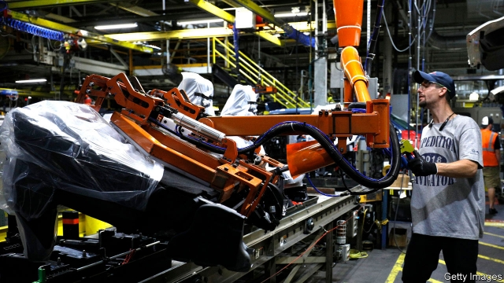

###### Trade deals

# The official impact assessment of NAFTA’s replacement is out 

##### The devil is in its details 

 

> Apr 27th 2019 

“USMCA WILL boost economic growth and create jobs.” This was the triumphant headline from the White House’s media machine summarising an official assessment of the impact of America’s new trade deal with Mexico and Canada. According to the United States International Trade Commission (USITC), an independent government agency, the deal will increase American GDP by 0.35% and employment by 0.12%. 

Since the North American Free Trade Agreement (NAFTA), which the USMCA replaced, had already slashed most tariffs between the three countries, it would be unfair to expect the impact to be large. But two aspects of the analysis offer fairer grounds for scepticism. One concerns trade in cars; the other the way the assessment accounts for policy stability in the future. 

New rules of origin for cars were intended to push up wages and bring more production to North America. For a car to move from Mexico to America tariff-free, a much higher share of its parts must now be sourced in the region than had been required under NAFTA. Car manufacturers could have opted to ignore the deal, pay the 2.5% tariff for non-USMCA imports and source parts wherever made business sense. Instead, most seem to be reworking supply chains to meet the new requirements. The USITC predicted that employment in America in car parts would increase by nearly 30,000 workers, or around 6% of the existing total. 

But this victory of governmental micromanagement comes with costs. As a separate report published on April 22nd highlighted, the benefits of trade restrictions are small compared with their price tag. That report described the impact of tariffs on imported washing machines, which it estimated had cost American consumers around $820,000 for each new job. Similarly, the USITC predicted that cars would become pricier, and that Americans would buy fewer of them. And although it predicted higher employment, output and wages in manufacturing and mining, those gains come at the expense of other parts of America’s economy. 

That could have led the USITC to conclude that NAFTA’s replacement would have a negative effect overall. But the USITC added an extra step to its analysis. Such studies usually include the effects of new policies, such as cuts to tariffs or changes to local-content rules. The USITC, however, also took account of the administration’s promise to hold policy steady in the future, which should make businesses more confident about cross-border trade and investment. Its estimates of those benefits were enough to swing its overall assessment of the USMCA to positive. (The office of the United States Trade Representative, which leads trade negotiations, has produced its own, rival report, which comes to a sunnier conclusion on the basis of car companies’ promises of investment and employment.) 

The methodology used by the USITC has strong academic foundations. But the impact assessment is also an indictment of the uncertainty of the past few years. If commitments to stick to the status quo are all that make NAFTA’s replacement worthwhile, what harm was done by the Trump administration’s threats to tear it up in the first place? 

-- 

 单词注释:

1.replacement[ri'pleismәnt]:n. 归还, 更换, 代替者 [医] 复位, 置换 

2.APR[]:[计] 替换通路再试器 

3.triumphant[trai'ʌmfәnt]:a. 得胜的, 得意洋洋的 

4.summarise['sʌmәraiz]:vt. 概括, 总结, 摘要, 概述 

5.usitc[]:abbr. United States International Trade Commission 美国国际贸易委员会 

6.NAFTA['næftə]:abbr. 北美自由贸易协定（North American Free Trade Agreement） 

7.slash[slæʃ]:v. 猛砍, 乱砍 n. 猛砍, 乱砍, 删减 [计] 斜线 

8.tariff['tærif]:n. 关税, 关税表, 价格表, 收费表 vt. 课以关税 [计] 价目表 

9.scepticism['skeptisizm]:n. 怀疑论, 怀疑主义 [医] 多疑癖 

10.opt[ɒpt]:vi. 选择 

11.rework[ri:'wә:k]:vt. 重做, 修订, 修改 [经] 再加工, 再制, 返工 

12.governmental[.gʌvәn'mentl]:a. 政治的, 统治上的, 政府的 [法] 政府的, 统治的, 政治上的 

13.micromanagement[maikrəu'mænidʒmənt]: 微观管理 

14.pricy['praisi]:a. 昂贵的, 价格高的 

15.manufacturing[.mænju'fæktʃәriŋ]:n. 制造业 a. 制造业的 

16.negotiation[ni.gәuʃi'eiʃәn]:n. 谈判, 磋商, 交涉 [经] 谈判, 协商 

17.methodology[.meθә'dɒlәdʒi]:n. 方法学, 方法论 [化] 操作法; 工艺 

18.indictment[in'daitmәnt]:n. 起诉, 控告, 起诉状 [经] 起诉书 

19.uncertainty[.ʌn'sә:tnti]:n. 不确定, 不可靠, 不确定的事物 [化] 不确定度 

20.statu[]:[网络] 状态查看；雕像；特级雪花白 

21.quo[]:vt. [古]说 

