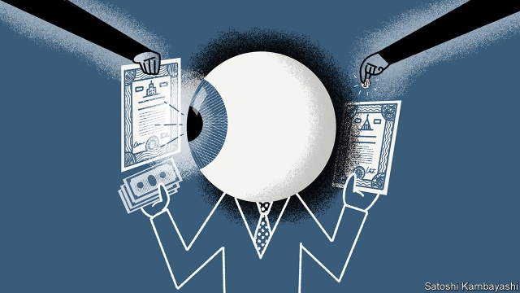

###### Buttonwood

# Why investors are careful buyers but careless sellers 

##### Only the very best think as hard about exiting positions as entering them 

 

> Apr 27th 2019 

JACK SCHWAGER was once a moderately successful trader who wondered why he was not an immoderately successful trader. Perhaps if he knew the secrets of trading superstars, such as Paul Tudor Jones or Jim Rogers, he might improve. So he asked them for those secrets. “Market Wizards”, his book of interviews with hedge-fund traders, was published in 1989. A second volume soon followed. 

Both books have since been pored over by a generation of hedge-fund wannabes. They are full of great stories and tips covering a range of investing styles. Yet there are common elements. It is striking, for instance, how little emphasis the wizards put on getting into a position—finding the right trade at the right entry price—compared with when to get out of it. That makes sense. Deciding what and when to sell surely matters at least as much as, and perhaps more than, deciding what to buy. 

The wizardly injunction to cut your losses and let your winners ride has hardened into hedge-fund doctrine. Even so, it is not widely practised in mainstream investing. Fund managers pay lots of attention to buying decisions. But they are remarkably careless in deciding what to sell. 

That is the central finding of “Selling Fast and Buying Slow”, published late last year by a trio of academics—Klakow Akepanidtaworn of the University of Chicago’s Booth School of Business, Alex Imas of Carnegie Mellon University and Lawrence Schmidt of the Massachusetts Institute of Technology—together with Rick Di Mascio of Inalytics, a data firm. They examined the daily turnover of hundreds of portfolios over several years, tracking more than 2m stock purchases and almost as many sales. Buying decisions, they found, were good: the addition of a stock generally improved a portfolio. But selling decisions were bad—so bad that a fund manager would have been much better off choosing a stock to sell at random. 

The disparity between sales and purchases is explained by the attention given to each. Fund managers are careful buyers. Purchases come at the end of a long period of serious thought and research. But they do not give stock sales anything like the same attention. That is especially true when they are stressed because their portfolio has recently done badly. Instead of deliberating, they use a mental shortcut. Stocks that have done either really well or really badly, and so stick in the mind, are far more likely to be sold. The more inclined fund managers are to sell in this way, the worse they perform. 

They do not realise that careless selling is harmful, it seems. “Selling is simply a cash-raising exercise for the next buying idea,” one told the paper’s authors. “Buying is an investment decision; selling is something else,” said another. Fund managers sell the stocks that come most readily to mind. Yet they are able to sell wisely, if they pay attention. Sales made when they are focused on information about a stock, for example around the time of an earnings report, are almost as smart as buying decisions, the authors say. 

The message is clear. If fund managers took more care over selling, they would be more successful. But the world is not arranged in such a way as to make them take that care. They will be asked often for their best buying ideas, but rarely about stocks they own that are ripe for selling. This lopsided approach to decision-making is not confined to fund management. Businesses often spend an age deciding whom to hire but put off thinking about whom to let go until there is a pressing financial need, by which point the decision is likely to be rushed. 

Why do fund managers take their losses on bad stocks too late and their profits on good stocks too early? A body of empirical research, surveyed by Brad Barber and Terrance Odean of the University of California, finds that individual investors show a strong preference for selling winners over losers. They may be impatient to experience the burst of pride that comes from selling a winner. And they hold on to losers for too long in the hope of avoiding feelings of regret. 

The type of superstar trader profiled in “Market Wizards” is as likely to sell a currency, commodity or stock short as to buy it. For them, selling is as natural as buying, and requires just as much attention. For his part, Mr Schwager recalls in the book how he lost a lot of money trading soyabeans. He failed to get out of his position when the market moved against him. The decision to buy the beans might not have been a great one. But it was his selling decision that he truly regretted. 

-- 

 单词注释:

1.buttonwood['bʌtnwʊd]: 美洲悬铃木 

2.investor[in'vestә]:n. 投资者 [经] 投资者 

3.buyer['baiә]:n. 买主, 买方 [经] 买主, 买方, 买手 

4.APR[]:[计] 替换通路再试器 

5.jack[dʒæk]:n. 插座, 千斤顶, 男人 vt. 抬起, 提醒, 扛举, 增加, 提高, 放弃 a. 雄的 [计] 插座 

6.schwager[]:[网络] 施瓦格；施瓦格尔；施韦格尔 

7.moderately['mɒdәrәtli]:adv. 适当地, 适度地, 中庸地 

8.trader['treidә]:n. 商人, 商船 [经] 交易者, 商船 

9.immoderately[ɪ'mɒdərətlɪ]:adv. 无节制地, 过度地 a. 无节制的, 过度的 

10.superstar['sju:pәstɑ:]:n. 超级明星 

11.paul[pɔ:l]:n. 保罗（男子名） 

12.Tudor['tju:dә]:n. 英国都铎王朝 a. 都铎王朝的, 都铎式建筑式样的 

13.jones[dʒәunz]:n. 琼斯（姓氏） 

14.jim[dʒim]:n. 吉姆（人名） 

15.rogers['rɔdʒәz, 'rәudʒәz]:n. 罗杰斯（姓氏）；乐爵士（英国一家音箱生产厂） 

16.wizard['wizәd]:n. 男巫, 术士, 奇才 a. 男巫的, 巫术的 [计] 向导 

17.pore[pɒ:]:n. 毛孔, 小孔, 气孔 vi. 专心阅读, 细想, 钻研, 沉思, 注视 vt. 使注视得 

18.wannabe[ˈwɒnəbi]:n. 赶超崇拜者, 赶超崇拜者的人 

19.wizardly['wizәdli]:a. 神汉的,男巫的,神奇的 

20.injunction[in'dʒʌŋkʃәn]:n. 命令, 禁令, 劝告 [经] 指令, 禁令 

21.doctrine['dɒktrin]:n. 教条, 学说 [医] 学说 

22.mainstream['meinstri:m]:n. 主流 

23.remarkably[ri'mɑ:kәbli]:adv. 显著地, 引人注目地, 非常地 

24.trio['tri:әu]:n. 三重唱 

25.Alex[]:[计] 开放网络文件系统 

26.IMAS[]:abbr. International Marine and Shipping 国际海事与航运会议 

27.carnegie[kɑ:'ne^i]:n. 卡内基（姓氏） 

28.mellon['melәn]:[化] 三聚二氰亚胺 

29.lawrence['lɔrәns]:n. 劳伦斯（男子名） 

30.schmidt[]:n. 施密特（姓氏） 

31.Massachusetts[.mæsә'tʃu:sits]:n. 麻萨诸塞州 

32.rick[rik]:n. 草堆 vt. 把...堆成垛 

33.DI[]:[计] 数据输入, 数据项, 设备独立性, 双整数 

34.datum['deitәm]:n. 论据, 材料, 资料, 已知数 [医] 材料, 资料, 论据 

35.turnover['tә:n.әuvә]:n. 翻倒, 翻转, 半圆酥饼, 营业额, 流通, 周转 a. 可翻转的 

36.portfolio[pɒ:t'fәuliәu]:n. 皮包, 公文包, 部长职务, 有价证券财产目录, 艺术代表作选辑 [法] 公文包, 文件夹, 阁员职务 

37.disparity[dis'pæriti]:n. 不一致 [医] 差异, 不等 

38.shortcut['ʃɒ:tkʌt]:n. 捷径, 最短路线 [计] 快捷方式 

39.wisely['waizli]:adv. 聪明地, 精明地 

40.earning['ә:niŋ]:n. 收入（earn的现在分词） 

41.lopside[]:n. 倾向一方 

42.empirical[em'pirikәl]:a. 完全跟据经验的, 经验主义的 [医] 经验主义的 

43.brad[bræd]:n. 角钉, 曲头钉 

44.terrance['terens]:n. 特伦斯（男子名） 

45.odean[]:[网络] 金融学家奥迪恩；金融学家奥登；金融学家欧登 

46.California[.kæli'fɒ:njә]:n. 加利福尼亚 

47.loser['lu:zә]:n. 失败者, 遗失者 [法] 失败者, 失物者, 遗失者 

48.profile['prәufail]:n. 侧面, 轮廓, 传略 vt. 描绘...轮廓, 写...的传略 [计] 提问档; 剖面图法; 剖面法 

49.commodity[kә'mɒditi]:n. 农产品, 商品, 有用的物品 [经] 商品, 货物, 日用品 

50.schwager[]:[网络] 施瓦格；施瓦格尔；施韦格尔 

51.soyabean[]:[医] 大豆 

