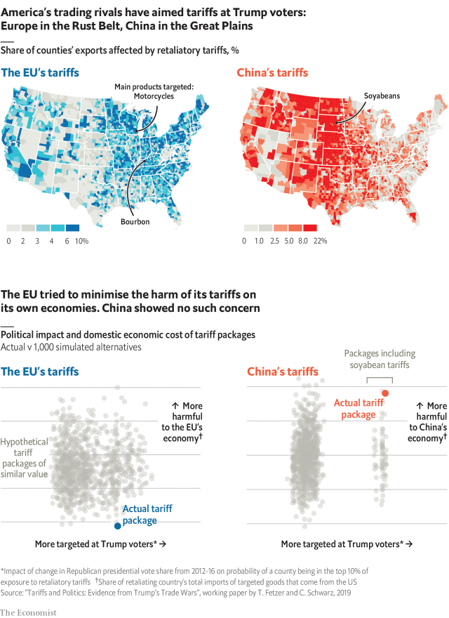

###### Trade wars

# Why you should never start a trade war with an autocracy 

##### Unlike the EU, China seems willing to pay any price to punish Donald Trump’s voters 

 

> Apr 27th 2019 

ECONOMISTS OFTEN argue that trade wars cannot be won. Yet they will be among the few beneficiaries from America’s barrage of tariffs. For decades, rich countries’ sound trade policies denied academics cases of tit-for-tat protectionism to study. But new American taxes on many goods from China and metals from everywhere have produced the data set of their dreams. 

America’s government seems unfazed by the damage its tariffs do to the economy. One study by scholars at the Federal Reserve and Princeton and Columbia Universities found that the new levies have raised costs for consumers by $1.4bn per month. 

However, Donald Trump is devoted to his voters. And his trading rivals have retaliated where it hurts. A paper by Joseph Parilla and Max Bouchet of the Brookings Institution, a think-tank, estimated that 61% of jobs affected by retaliatory tariffs are in counties that voted for Mr Trump. 

Is this a coincidence? If a country’s imports from America already come from mostly Republican areas, those regions will bear the brunt of a trade war. However, a new paper by Thiemo Fetzer and Carlo Schwarz of the University of Warwick finds that America’s rivals probably did consider politics when crafting their policies. 

To test if recent tariffs were politically motivated, the authors needed to compare them with alternatives that were not. They devised this benchmark by creating at random 1,000 hypothetical bundles of targeted goods for each trading partner, all worth the same as the actual trade facing tariffs. 

The authors then compared real-world policies with these alternatives. First, they assessed the political impact of each plan, by measuring how closely its targeted areas matched Republican gains when Mr Trump was elected. Next, they estimated how much each policy would harm a retaliating bloc’s own economy, by counting the share of its imports of the chosen goods that come from America. The more a country relies on one supplier, the more switching to a less efficient source is likely to hurt. 

The study found that the EU prioritised minimising such damage. Its tariffs deftly protected domestic consumers, causing less disruption than 99% of alternatives. The bloc targeted Trump voters as well—its tariffs matched the election of 2016 more closely than in 87% of simulations—but not at the cost of upsetting its own citizens. 

In contrast, China focused on punishing Trump voters. Its tariffs tracked the election better than 99% of alternatives. They also disrupted China’s own economy more than in 99% of simulations. Even among plans including soyabeans—one of China’s main imports, grown mostly in Republican areas—China’s policy was just slightly more politically targeted than similar options, but far worse for its economy. 

China’s choice of tariffs seems designed to deter escalation at any cost. Only regimes with no voters to satisfy can run that risk. The lesson is clear: if you start a trade war, fight a democracy, not an autocracy. 

-- 

 单词注释:

1.autocracy[ɒ:'tɒkrәsi]:n. 独裁统治, 独裁统治的国家 [法] 独裁政治, 专制政治, 独裁政府 

2.EU[]:[化] 富集铀; 浓缩铀 [医] 铕(63号元素) 

3.voter['vәutә]:n. 选民, 投票人 [法] 选民, 选举人, 投票人 

4.APR[]:[计] 替换通路再试器 

5.economist[i:'kɒnәmist]:n. 经济学者, 经济家 [经] 经济学家 

6.cannot['kænɒt]:aux. 无法, 不能 

7.beneficiary[.beni'fiʃәri]:n. 受惠者, 受益人 a. 受封的 

8.barrage['bærɑ:dʒ]:n. 弹幕, 掩护炮火 vt. 以密集炮火进攻 

9.tariff['tærif]:n. 关税, 关税表, 价格表, 收费表 vt. 课以关税 [计] 价目表 

10.protectionism[prә'tekʃәnizm]:n. 贸易保护主义, 贸易保护制 [经] 保护(贸易)主义, 保护(贸易)制 

11.datum['deitәm]:n. 论据, 材料, 资料, 已知数 [医] 材料, 资料, 论据 

12.unfazed[ʌnˈfeɪzd]:a. 不担忧的, 不苦恼的 

13.Princeton['prinstәn]:n. 普林斯顿 

14.Columbia[kә'lʌmbiә]:n. 哥伦比亚 

15.levy['levi]:n. 税款, 所征的人数, 征收 vi. 征税, 课税 vt. 征收, 强求, 召集 

16.retaliate[ri'tælieit]:vt. 报复, 回敬 vi. 报复, 以牙还牙 

17.Joseph['dʒәuzif]:n. 约瑟夫（男子名）；约瑟（圣经中雅各的第十一子） 

18.parilla[]:[网络] 冷冻机；帕里拉 

19.MAX[mæks]:[计] 最大 

20.bouchet[]:[网络] 布谢；品丽珠；布榭 

21.Brooking[]:n. (Brooking)人名；(英、西)布鲁金 忍受（brook的现在分词形式） 容忍 

22.retaliatory[ri'tæliәtәri]:a. 报复的 [经] 报复性的 

23.brunt[brʌnt]:n. 主要冲力, 冲击 

24.fetzer[]: [人名] 费策尔 

25.carlo[]:n. 卡洛（男子名） 

26.Schwarz[ʃwɑ:z]:a. [数]施瓦兹的 

27.warwick['wɔrik]:n. 沃里克（英国英格兰中部沃里克郡城市）；沃里克（美国罗德岛州东部城市, 为纺织业中心）；沃里克（姓氏） 

28.politic['pɒlitik]:a. 精明的, 明智的, 策略的 

29.politically[]:adv. 政治上 

30.benchmark[]:[计] 基准程序; 基准 

31.hypothetical[,haipәu'θetikәl]:a. 假设的, 有待证实的, 假定的, 有前提的 [计] 理想的 

32.supplier[sә'plaiә]:n. 供应者, 供给国, 供应商 [化] 承制厂; 供应厂商 

33.les[lei]:abbr. 发射脱离系统（Launch Escape System） 

34.prioritise[praɪ'ɒrəˌtaɪz]:vt. 给予…优先权; 按优先顺序处理; 出轻重缓急 vi. 把事情按优先顺序排好（等于prioritize） 

35.minimise[]:vt. 使减到最少/最小, 使降到最低限度, 使缩到最小, 极度轻视 

36.deftly[]:adv. 灵巧地；熟练地；敏捷地 

37.disruption[dis'rʌpʃәn]:n. 分裂, 崩溃, 瓦解 

38.bloc[blɒk]:n. 集团 

39.disrupt[dis'rʌpt]:a. 分裂的, 中断的 vt. 使分裂, 使瓦解 

40.simulation[.simju'leiʃәn]:n. 模拟, 假冒物, 模仿 [计] 模拟 

41.deter[di'tә:]:vt. 制止, 吓住, 威慑 

42.escalation[.eskә'leiʃәn]:n. 扩大, 增加 [经] 调查, 价格调整 

43.regime[rei'ʒi:m]:n. 政权, 当权期间, 政体, 社会制度, 体制, 情态 [医] 制度, 生活制度 

