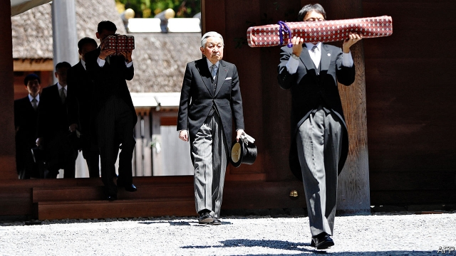
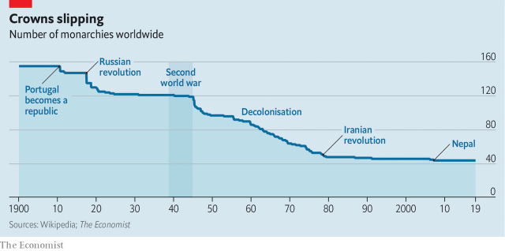
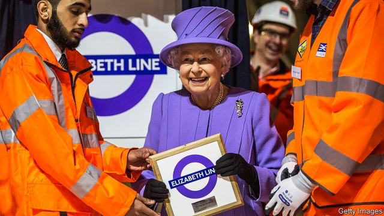

###### Sovereign immunity

# How monarchies survive modernity 

##### As Japan’s emperor hands over to his son and the Thai king is crowned, monarchies are thriving 

 

> Apr 27th 2019 

ON APRIL 18th Akihito, the 125th emperor of Japan and descendant of the sun goddess Amaterasu, returned to a shrine the sword extracted by Amaterasu’s brother Susanowo from a vanquished monster’s tail and a necklace stolen by Susanowo from his sister, thus reuniting them with a mirror used to tempt Amaterasu out of the cave where she had hidden from her brother. This ceremony, pictured above, was one of nine required before the emperor’s abdication on April 30th, which will bring an end to the Heisei (“achieving peace”) era. The next day, his son, Naruhito, will ascend the throne, and a new era, Reiwa (“beautiful harmony”), can begin. 

If monarchy did not exist, nobody would invent it today. Its legitimacy stems from ancient ritual and childish stories, not from a system based on reason and intended to achieve good governance. It transfers power through a mechanism which promotes congenital defects rather than intelligence. It is sexist, classist, racist and designed specifically to prevent diversity, equality and personal merit from creeping into its inbred ranks. 

The 20th century seemed to herald its demise (see chart). Revolutions and a couple of world wars brought monarchies tumbling down across Europe; they clung on only in the southern, northern and western peripheries. Republican movements flourished, including in Britain. And, as democracy swept the developing world late in the century, any sensible observer would have predicted that the institution would soon have gone the way of the Habsburgs and Bourbons. 

But that didn’t happen. Only two monarchies have gone out of business this century—the Samoan one, which slipped away naturally with the death of its last incumbent, and the Nepali one, which needed the combination of a communist rebellion, a popular uprising and a murderous prince, high on drink and drugs, who killed nine family members, to bring it down. Forty-four countries (including Queen Elizabeth’s 16 realms) still have a monarch as head of state. Some of them, arguably, are barely monarchies (Australia keeps the arrangement largely because choosing another would be contentious) and many are tiny (Tonga, Lesotho and Liechtenstein come to mind), but plenty of influential countries (Britain, Denmark, Japan, the Netherlands, Spain, Thailand) are monarchies, and there are plenty of monarchies in an important part of the world (the Middle East). There are even significant movements to revive defunct monarchies, in Iraq and Romania. So why does the system now look more durable than it once did? 

 

One reason is that most of the surviving monarchs are virtually powerless, and the less power a monarchy has, the less anybody bothers to try to get rid of it. Complete impotence was imposed on the (already weak) Japanese emperor after the second world war; in Britain the monarchy was stripped of its powers over centuries. In every developed-country monarchy the head of state’s job is ceremonial. Politicians keep them informed; what they say is closely analysed for political content. But any constitutional monarch worth his or her salt knows that job security depends on keeping shtum about politics. Even in Britain’s baffling constitutional crisis over Brexit, nobody seriously expects the queen, who in theory dissolves Parliament and appoints prime ministers, to have a role in sorting out the mess. 

Another reason is that many of the poor, weak monarchies have already gone, and some of the enduring ones have pots of money. Maintaining absolute power is a great deal easier for the Saudi or Emirati royal families than it was for the Albanians or the Romanians. They can afford lavish welfare handouts to keep the people happy and well-paid goons to keep them quiet. And having a small population, as the Gulf monarchies do, reduces the danger that an angry crowd will storm the palace and stick the monarch’s head on a pike. 

Also helping the monarchs keep their jobs are democracy’s difficulties. When Francis Fukuyama declared the end of history in 1992, the global victory of liberal democracy seemed imminent. But this century, democracy’s progress has stalled. In the Middle East, wars and uprisings to institute democracy failed. In parts of Africa and Asia, democracy has been struggling. Even in the West, populism and polarisation have tarnished it, and anti-democratic politicians are on the rise. Monarchy has benefited from the comparison. 

Unlike most democracies or republics, monarchy has the advantage of historical pedigree. Sometimes it is real, as with the Japanese emperor, whose ancestors are ancient, even if they do not actually share DNA with the sun goddess. The roots of the British monarchy are more than a millennium old, even if the current incumbents’ families were German immigrants little more than a couple of centuries ago. Sometimes it is a more recent invention, as with those Middle Easterners who were planted by the British as the Ottoman empire collapsed, and fashioned in the imperialists’ image. For want of a national anthem, a British band played “God Save the King” and fired a 21-gun salute when Faisal I was crowned the first king of Iraq in 1921. 

But even the more recent implants root their claims to leadership in ancient myths and religious traditions which resonate with their subjects. The Hashemites in Jordan and the Alouites in Morocco both claim descent from the Prophet Muhammad. Morocco’s king bears the title Commander of the Faithful; Saudi Arabia’s that of Custodian of the Two Holy Mosques. British advisers steeped in the niceties of protocol often give advice on how to embellish royal authority with paraphernalia, decoration and ritual. Historical legitimacy helps explain why, besides those rich enough to stuff their people’s mouths with petrodollars, the two countries that best weathered the regional pro-democracy uprisings of the Arab spring in 2011 were monarchies—Morocco and Jordan. 

Monarchies were less ruthless and more dexterous than the brittle republics. Only three people, including two policemen, were killed in 7,000 protests over two years in Jordan. Bahrain was the youngest and most brutal of the kingdoms. Its security forces killed scores as they suppressed its uprising. That was a lot in a population of 1.4m, but still just a day’s work for some of the Arab republics’ killing machines. 

Unlike republics, which mark a rupture with the religious and tribal institutions of the past, monarchies tend to build on them. Their consultative systems are a mishmash of European and tribal traditions. Morocco has an elected parliament. Jordan has an appointed upper and elected lower house. Even Saudi Arabia has an appointed Shura or Consultative Assembly. The king, not parliament, is sovereign and chooses his prime minister. But each representative body—in theory at least—has some power to review legislation. 

With a broader power base than military dictatorships, monarchies have less need for the repression more often seen in Egypt, Iraq, Syria and Algeria to keep power. Their media tend to be freer, and in Morocco and Jordan they allow a degree of opposition. Morocco, for instance, had a system called “alternance”, allowing former republicans in the late 1990s and Islamists after 2011 to form governments. 

Democracy’s difficulties in Thailand are both cause and consequence of the monarchy’s survival. After a bloodless coup in 1932 replaced the absolute monarchy with a constitutional one, a symbiotic relationship developed between the monarchy and the military. The symbolic authority of the former has legitimised the political authority of the latter, providing cover for numerous coups. The most recent, in 2014, saw the military topple the government of the democratically elected Pheu Thai party, linked to Thaksin Shinawatra, a prime minister ousted in a coup back in 2006. 

Even in constitutional monarchies, where democracy’s future is not in question, the appeal of a monarchy is more obvious in these contentious times. When politics is as polarised as it is now, there is a lot to be said for a non-political head of state. Many liberal Britons might have envied the glamour the Obamas brought to America as they toured the world. But few—whatever their political views—would swap the queen for Donald Trump. “Politics is about what divides us,” says one of Queen Elizabeth’s former courtiers. “Monarchy is about what unites us.” 

But, however impressive their pedigrees, and however favourable the conditions, modern monarchies are fragile. Their survival depends on the judgment of the individuals in charge. And in two of the big ones, the incumbents have been remarkably successful at holding fast to the historical roots from which they derive their legitimacy while cautiously modernising the institution. Discretion and subtlety have been central to their success. 

Makoto Inoue, author of books on the imperial family, describes Akihito as a “revolutionary emperor”. Rather than sit in the palace and pray for the people of Japan, the emperor has gone out and become close to them; kneeling with them and talking to them. He has paid particular attention to the disabled, elderly and victims of natural disasters. Unlike the country’s conservative politicians, he has consistently expressed “deep remorse” for Japan’s wartime actions during his speeches. In 1992 Akihito became the first reigning Japanese monarch to visit China, and later travelled to second world war battlefields abroad (Saipan in 2005, Palau in 2015, the Philippines in 2016), to pay tribute to those killed during the war. And he has refused to visit the Yasukuni shrine in Tokyo, where class-A war criminals are honoured. 

Conservative politicians bridle at his attempts to atone for Japan’s wartime behaviour, but his personal conduct makes him hard to criticise. He and Empress Michiko are seen as models of morality and decorum. Their court retains the forms of tradition; the observance of ancient ceremonies is correct in the finest detail. The approach seems to work. According to the latest poll by NHK, Japan’s national broadcaster, almost 80% of the public have a positive view of the emperor. Given his popularity, his abdication, the first in Japan in over 200 years, was a surprise. But it has, if anything, made him more popular. 

Queen Elizabeth has not played as political a role as Akihito has, but she has, subtly, modernised the monarchy, opening Buckingham Palace to the public, paying tax and taking great care over public relations—always, for instance, wearing bright colours so that cameras pick her out in a crowd. Her family retains some archaic habits—dressing in tweed, hunting and shooting, adhering to ancient rules of protocol and precedence—but it will also, when the Duchess of Sussex gives birth, acquire its first mixed-race baby. 

Like Akihito, the queen has abandoned the palace for the street, famously saying, “I have to be seen to be believed.” In the 67 years she has been on the throne, she has kept up a punishing schedule of engagements, with the astonishing result that, according to a YouGov poll, nearly a third of Britons, and half of those over 65, have seen her in the flesh. And, like Akihito, she is the soul of discretion. Indeed, one of her greatest achievements is that she has never said anything of any interest in public. 

This has served her well. Even during her darkest days, when she was widely regarded as having failed to show sufficient grief at the death of her wildly popular former daughter-in-law Diana in 1997, three-quarters of the population supported the monarchy—much the same level as now. On the most recent count, in 2016, 86% thought that she was doing a good job. By contrast, half of the Spanish population would like to be rid of their scandal-ridden monarchy. 

But although the queen is 93, there is no sign of her following Akihito’s example. The A-word is not uttered in her court. Whether that is because she regards it as her sacred duty to die in the job (she swore her coronation oath to God, and is discreetly but intensely religious) or because she does not trust her son, who has spoken out in support of sometimes eccentric and contentious points of view (he hates modern architecture and champions homeopathic quackery), nobody knows. 

 

Succession is a dangerous moment for a monarchy, and many observers wonder whether Thailand’s will survive the current transition. The late King Bhumibol appeared to embody the virtues of a devout Buddhist monarch. He championed thousands of development initiatives, including irrigation projects, farming schemes and medical services. Thais grew up surrounded by photographs of him peering intently through his round spectacles at projects in far-flung fields. 

The contrast between King Bhumibol and his successor, King Maha Vajiralongkorn, whose sumptuous coronation will occur between May 4th and 6th, is sharp. The new monarch, who lives in Germany, barely spends any time in his realm, let alone inspecting rural projects. He has a string of abandoned children and dumped consorts around the world. He made a poodle an Air Chief Marshal. His escapades inspire disdain; his rule, fear. Strict lèse majesté laws promise three to 15 years in prison for those critical of the royals. 

Unlike his father, he is open in his hunger for power. Assets belonging to a royal property portfolio—thought to be worth some $40bn—are now held “in the name of His Majesty”. In recent months he criticised his sister’s plan to run for prime minister with a party opposed to the ruling military regime (in effect barring her from doing so); he told Thais to vote for “good people” to avoid “chaos” ahead of a stage-managed election on March 24th (inspiring the hashtag #OldEnoughToVoteOurselves to trend on Twitter in Thai); and after the contest he stripped Mr Thaksin of his royal decorations. The decision came after a party linked to Mr Thaksin and others in favour of democracy claimed to have won a majority of seats in the lower house. The election’s full results will be announced on May 9th. 

King Bhumibol’s steady presence discouraged efforts to fix a broken political system prone to deadlock between royalist elites and their more democratic opponents. The system now lacks a respected referee, and King Vajiralongkorn’s interventions damage the monarchy’s standing further. The result could be turmoil as the military regime clings to power. 

A similar accretion of power has been taking place in Saudi Arabia, where Muhammad bin Salman, eldest son of King Salman, conducted a purge shortly after being appointed crown prince. He got rid of the head of the Saudi National Guard, the head of the navy and the economy minister, as well as detaining hundreds of business people and princes in the Ritz-Carlton in Riyadh, supposedly for tax offences. 

His supporters argue that he needed to arrogate more power to himself in order to modernise the country’s society and economy—proposing the sale of shares in the national oil company, for instance, to raise money to invest in a post-oil future, and liberalising the position of women. But his pursuit of a bloody, unsuccessful war in Yemen has weakened him at home, and the murder—widely blamed on him—of Jamal Khashoggi, a Saudi journalist who was dismembered in the Saudi consulate in Istanbul, has damaged him abroad. 

And though MbS, as he is generally known, has strengthened himself, he has weakened the institution. He has viewed the traditional pillars of the Saudi monarchy—the clerics, the royal household and the tribes—as challengers rather than props, and cut them down. Though far less brutal, he is compared to Saddam Hussein. Some think that by reducing decision-making to one man’s whim, he has left the Saudi monarchy only a bullet away from collapse—and fear what may come after it. 

One of democracy’s many virtues is that the institution refreshes its personnel constantly, so its survival does not depend on the performance of an individual. A monarchy’s does, for the office may be held by the same person for decades. And the selection process often throws up candidates too stupid, too corrupt or too arrogant to do such a difficult job. The surprising survival of monarchies is in part a tribute to the nous of the old guard, who have understood the need to subsume their interests into those of the institution. If some of the new bloods fail to learn that lesson, the monarchy may resume its decline. 

-- 

 单词注释:

1.sovereign['sɒvrin]:n. 元首, 独立国 a. 具有主权的, 至高无上的, 国王的, 完全的 

2.immunity[i'mju:niti]:n. 免疫, 免疫性, 免除 [化] 免疫性 

3.monarchy['mɒnәki]:n. 君主政体, 君主国, 君主政治 [法] 君主政体, 君主制度, 君主国 

4.modernity[mɒ'dә:nәti]:n. 现代性, 现代状态, 现代东西 

5.Thai[tai]:n. 泰国人, 泰语 

6.APR[]:[计] 替换通路再试器 

7.Akihito[,ɑ:ki'hi:təu; ɑ:'ki:ji:tɔ]:n. （日）天皇明仁 

8.descendant[di'sendәnt]:n. 后裔, 子孙 a. 传下的, 下降的 

9.goddess['gɒdis]:n. 女神, 美女, 受崇拜的女性 

10.amaterasu['ɑ:mɑ:te'rɑ:su]:n. 天照大神；太阳女神（日本神话中高天原的统治者） 

11.shrine[ʃrain]:n. 圣地, 神龛, 庙 vt. 将...置于神龛内 

12.extract[ik'strækt]:n. 榨出物, 精汁, 摘录, 选段 vt. (费力地)取出, 采掘, 榨取, 摘录, 吸取 [计] 提取 

13.Susanowo[]:[网络] 须佐之男；素盏鸣尊；须佐尊 

14.vanquish['væŋkwiʃ]:vt. 打败, 征服, 克服 [法] 征服, 战胜, 击败 

15.reunit[]:[网络] 重逢；使再联合；单元类 

16.abdication[.æbdi'keiʃәn]:n. 逊位, 弃权, 辞职 

17.heisei[]:[网络] 平成；爱与平成之色男；达鑫电子 

18.naruhito[]:[网络] 皇太子德仁；德仁皇太子 

19.ascend[ә'send]:vi. 上升, 追溯, 登高 vt. 攀登 

20.legitimacy[li'dʒitimәsi]:n. 合法, 正统, 正当 [法] 合法性, 正统性, 婚生 

21.ritual['ritʃuәl]:n. 仪式, 典礼, 宗教仪式 a. 仪式的, 依仪式进行的 

22.governance['gʌvәnәns]:n. 统治, 统辖, 管理 [法] 统治, 管理, 支配 

23.mechanism['mekәnizm]:n. 机械, 机构, 结构, 机理, 技巧 [化] 机理; 历程; 机构 

24.congenital[kәn'dʒenitәl]:a. 天生的, 先天的 [医] 先天的 

25.sexist['seksist]:n. 性别歧视者 

26.classist[/'klæsist/]:n. 阶级歧视者 a. 实行阶级歧视的；有阶级偏见的 

27.racist['reisist]:n. 种族主义者 [法] 种族主义的, 种族歧视 

28.specifically[spi'sifikli]:adv. 特定地, 明确地, 按特性 

29.diversity[dai'vә:siti]:n. 差异, 多样性 [化] 多样性 

30.inbred['in'bred]:a. 天生的, 同系繁殖的 

31.herald['herәld]:n. 使者, 传令官, 先驱 vt. 预报, 宣布, 传达, 欢呼 

32.demise[di'maiz]:n. 崩, 薨, 死亡 vt. 让渡, 遗赠, 转让 

33.cling[kliŋ]:vi. 粘紧, 附着, 紧贴, 坚持 

34.periphery[pә'rifәri]:n. 外围, 边缘地区, 圆周 [医] 外周, 周围 

35.Habsburg['hæpsb\\:^]:n. (=Hapsburg)哈普斯堡皇室 

36.Bourbon['buәbәn]:[机] 波旁 

37.samoan[sә'mәuәn]:n. 萨摩亚人 

38.incumbent[in'kʌmbәnt]:a. 现任的, 依靠的, 负有义务的 n. 领圣俸者, 在职者 

39.Nepali[ni'pɒ:li]:n. 尼泊尔人, 尼泊尔语 a. 尼泊尔的 

40.uprise[ʌp'raiz]:n. 升起, 起立, 上山坡, 出现 vi. 上升, 起义, 出现 

41.murderous['mә:dәrәs]:a. 凶狠的, 杀人的, 致命的 [法] 谋杀的, 杀人的, 残酷的 

42.monarch['mɒnәk]:n. 帝王, 统治者, 元首 [医] 单原型(植) 

43.arguably['ɑ:ɡjuәbli]:adv. 可论证地；可争辩地；正如可提出证据加以证明的那样地 

44.contentious[kәn'tenʃәs]:a. 好争吵的, 爱争论的, 有异议的 [法] 诉讼的, 争执的, 引起争论的 

45.tonga['tɔŋ^ә]:[医] 雅司病 

46.Lesotho[li'su:tu:]:n. 莱索托(非洲南部一王国, 首都Maseru) 

47.Liechtenstein['liktәn,stain]:a. (中欧国家)列支敦士登的 

48.Denmark['denmɑ:k]:n. 丹麦 

49.Netherlands['neðәlәndz]:n. 荷兰 

50.Spain[spein]:n. 西班牙 

51.Thailand['tailәnd]:n. 泰国 

52.revive[ri'vaiv]:vt. 使苏醒, 使复兴, 使振奋, 回想起, 重播 vi. 苏醒, 复活, 复兴, 恢复精神 

53.defunct[di'fʌŋkt]:a. 死的, 不能使用的 n. 死者 

54.Iraq[i'rɑ:k]:n. 伊拉克 

55.Romania[rәu'meinjә]:n. 罗马尼亚 

56.powerless['pauәlis]:a. 无力的, 无权的, 无效能的 

57.les[lei]:abbr. 发射脱离系统（Launch Escape System） 

58.bother['bɒðә]:vt. 烦扰, 迷惑 vi. 烦恼, 操心 n. 麻烦, 纠纷, 讨厌的人 

59.impotence['impәtәns]:n. 无力, 虚弱, 无效, 阳萎 [医] 阳萎, 无能力 

60.ceremonial[.seri'mәunjәl]:n. 仪式 a. 正式的 

61.constitutional[.kɒnsti'tju:ʃәnl]:a. 宪法的, 立宪的, 体质的 [医] 全身的; 体质的 

62.shtum[]: 保持沉默 

63.politic['pɒlitik]:a. 精明的, 明智的, 策略的 

64.baffle['bæfl]:vt. 困惑, 为难, 使挫折 vi. 徒作挣扎 n. 迷惑, 挡板 

65.Brexit[]:[网络] 英国退出欧盟 

66.saudi['sajdi]:a. 沙乌地阿拉伯（人或语）的 

67.Emirati[]:n. (Emirati)人名；(意)埃米拉蒂 

68.albanian[æl'beinjәn]:n. 阿尔巴尼亚人 

69.Romanian[ru:'meiniәn]:n. 罗马尼亚人, 罗马尼亚语 a. 罗马尼亚的 

70.lavish['læviʃ]:a. 大方的, 丰富的, 浪费的 vt. 浪费, 滥用, 慷慨给予 

71.handout['hændaut]:n. 施舍物, 救济品, 分发的印刷品资料, 广告物品 

72.goon[gu:n]:n. 受雇暴徒, 愚笨者, 呆子 

73.pike[paik]:n. 长矛, 尖头, (体操)屈体, 流浪者, 狗鱼, 通行费 vi. 用矛刺杀, 刺, 离开, 谨慎办事, 采用屈体姿势 

74.franci[]:[网络] 弗朗西；法赛纳；法奇 

75.Fukuyama[,fuku'jɑ:mә]:福山[日本] 

76.imminent['iminәnt]:a. 即将来临的, 逼近的 

77.stall[stɒ:l]:n. 厩, 停车处, 牧师职位, 货摊, 托辞, 拖延 vt. 关入厩, 停顿, 推托, 支吾, 使陷于泥中 vi. 被关在厩内, 陷于泥中, 停止, 支吾 

78.uprising['ʌpraiziŋ]:n. 起义, 升起 [法] 起义, 暴动 

79.Populism['pɒpjulizm]:n. 平民主义, 民粹主义 

80.polarisation[,pәjlәrai'zeiʃәn; -ri'z-]:n. [物]偏振(现象),极化(作用),两极化,分化 

81.tarnish['tɑ:niʃ]:n. 失泽, 失泽膜, 污点 vt. 使失去光泽, 玷污 vi. 失去光泽, 被玷污 

82.monarchy['mɒnәki]:n. 君主政体, 君主国, 君主政治 [法] 君主政体, 君主制度, 君主国 

83.pedigree['pedigri:]:n. 血统, 家谱, 名门世系 [法] 家系, 出身, 血统 

84.DNA[]:脱氧核糖核酸 [计] 无效数据, 数字网络体系结构, 分布式网络体系结构 

85.millennium[mi'leniәm]:n. 千禧年, 一千年 

86.easterner['i:stәnә(r)]:n. 东方人 

87.ottoman['ɔtәmәn]:a. 土耳其人的；土耳其民族的；土耳其帝国的（等于Turkish） 

88.anthem['ænθәm]:n. 圣歌, 赞美诗 

89.Faisal['feisəl]:n. 费萨尔（沙特阿拉伯国王） 

90.implant[im'plɑ:nt]:vt. 深植, 灌输, 嵌入 n. 植入物, 植入管 

91.myth[miθ]:n. 神话, 虚构的事, 虚构的人 

92.resonate['rezәneit]:v. (使)共鸣, (使)共振 

93.Hashemite['hæʃimait]:n. 哈桑王族的成员(阿拉伯家族) a. 哈桑王族的 

94.jordan['dʒɒ:dәn]:n. 约旦, 约旦河, 尿壶 

95.Morocco[mә'rɒkәu]:n. 摩洛哥, 摩洛哥皮革 [机] 摩洛哥革 

96.descent[di'sent]:n. 降落, 家系, 侵袭, 血统 [医] 下降, 世代, 血统 

97.prophet['prɒfit]:n. 预言者, 先知, 提倡者 

98.muhammad[]:n. 穆罕默德 

99.custodian[kʌ'stәudjәn]:n. 管理人, 保管人, 监护人 [经] 保管人, 管理人 

100.mosque[mɒsk]:n. 清真寺 

101.adviser[әd'vaizә]:n. 顾问, 劝告者, 指导教师 [法] 顾问, 劝告者 

102.nicety['naisәti]:n. 美好, 准确, 精密, 拘泥细节, 纤细 

103.protocol['prәutәkɒl]:n. 草案, 礼仪, 协议 v. 拟定 [计] 协议, 协议列表实用程序 

104.embellish[im'beliʃ]:vt. 修饰, 装饰, 润色 

105.paraphernalia[.pærәfә'neiliә]:n. 随身用具 

106.petrodollar[ˈpetrəʊdɒlə(r)]:n. 石油美元 

107.regional['ri:dʒәnәl]:a. 地方的, 地域性的 [医] 区的, 部位的 

108.ruthless['ru:θlis]:a. 无情的, 残忍的, 毫不留情的, 彻底的 [法] 无情的, 残忍的 

109.dexterous['dekstәrәs]:a. 灵巧的, 惯用右手的 

110.Bahrain[]:n. 巴林岛 

111.brutal['bru:tәl]:a. 残忍的, 野蛮的, 不讲理的 

112.suppress[sә'pres]:vt. 镇压, 使止住, 禁止, 抑制, 查禁 [法] 镇压, 平定, 禁止出版 

113.rupture['rʌptʃә]:n. 破裂, 断裂, 裂开, 决裂, 不和 v. (使)破裂 

114.tribal[traibl]:a. 部落的, 宗族的 

115.consultative[kәn'sʌltәtiv]:a. 商议的, 协议的, 咨询的 [法] 咨询的, 商议的, 协议的 

116.mishmash['miʃmæʃ]:n. 混杂物 

117.Arabia[ә'reibiә]:n. 阿拉伯半岛 

118.shura['ʃu:rɑ:]:n. 舒拉（伊斯兰政治协商制度, 具体指阿富汗人民立法会议） 

119.consultative[kәn'sʌltәtiv]:a. 商议的, 协议的, 咨询的 [法] 咨询的, 商议的, 协议的 

120.sovereign['sɒvrin]:n. 元首, 独立国 a. 具有主权的, 至高无上的, 国王的, 完全的 

121.dictatorship[dik'teitәʃip]:n. 独裁者之职位, 独裁, 独裁政权 [法] 专攻, 独裁权 

122.repression[ri'preʃәn]:n. 抑制, 压抑, 制止 [医] 压抑, 抑制 

123.Egypt['i:dʒipt]:n. 埃及 

124.Syria['siriә]:n. 叙利亚 [经] 叙利亚 

125.Algeria[æl'dʒiәriә]:n. 阿尔及利亚 

126.opposition[.ɒpә'ziʃәn]:n. 反对, 敌对, 相反, 在野党 [医] 对生, 对向, 反抗, 反对症 

127.alternance[]:[网络] 交替；可选择的；交错 

128.Islamist[iz'lɑ:mist]:n. 伊斯兰教主义者；回教教徒 

129.bloodless['blʌdlis]:a. 无血色的, 不流血的, 没精神的 [医] 无血的 

130.coup['ku:]:n. 砰然的一击, 妙计, 出乎意料的行动, 政变 [医] 发作, 中, 击 

131.symbiotic[.simbai'ɒtik]:a. 共栖的, 共生的 [医] 共生的 

132.symbolic[sim'bɒlik]:a. 象征的, 符号的 [电] 符号化 

133.legitimise[li'dʒitimaiz]:vt.<主英> = legitimize 

134.topple['tɒpl]:vt. 推翻, 颠覆 vi. 倒塌, 摇摇欲坠 

135.democratically[.demә'krætikli]:adv. 民主地, 民主主义地 

136.thaksin[]: 塔克辛; 塔辛（人名） 

137.shinawatra[]:[网络] 西那瓦；那越；钦那瓦 

138.oust[aust]:vt. 逐出, 罢黜, 剥夺, 驱逐 [法] 驱逐, 剥夺, 免职 

139.polarise['pәjlәraiz]:vi.vt. (使)极化, (使)偏振, (使)两极分化 

140.Briton['britәn]:n. 大不列颠人, 英国人 

141.glamour['glæmә]:n. 魅力, 迷人的美, 魔法 vt. 迷惑 

142.obamas[]:[网络] 奥巴马 

143.courtier['kɒ:tjә]:n. 侍臣, 奉承者 

144.judgment['dʒʌdʒmәnt]:n. 裁判, 宣告, 判决书 [医] 判断 

145.remarkably[ri'mɑ:kәbli]:adv. 显著地, 引人注目地, 非常地 

146.cautiously['kɒ:ʃәsli]:adv. 慎重地 

147.modernise['mɔdәnaiz]:vt.vi. (使)现代化, (使)适应现代需要 vi. 用现代方法 

148.discretion[dis'kreʃәn]:n. 慎重, 辨别力, 考虑, 处理权 [法] 有决定权的 

149.subtlety['sʌtlti]:n. 微妙, 精明 

150.makoto[]: [人名]真琴 

151.inoue[]:[网络] 井上；井上守；井上制作所 

152.imperial[im'piәriәl]:a. 帝王的, 宗主国的, 至尊的, 壮丽的 n. 特等品 

153.consistently[]:adv. 坚固, 坚实, 一致, 始终如一, 连贯 [计] 相容地 

154.remorse[ri'mɒ:s]:n. 懊悔, 良心不安, 自责, 同情 [法] 悔恨, 自责, 懊悔 

155.wartime['wɒ:taim]:n. 战时 

156.battlefield['bætlfi:ld]:n. 战场, 沙场 

157.saipan[sai'pæn]:n. 塞班岛 

158.Palau[pɑ:'laj]:帕劳群岛[西太平洋](即帛琉群岛) 

159.Philippine['filipi:n]:a. 菲律宾(群岛)的, 菲律宾人的 

160.tribute['tribju:t]:n. 贡物, 礼物, 颂辞 

161.yasukuni[]:[网络] 靖国神社；靖国神社的名字；安藏 

162.bridle['braidl]:n. 马勒, 约束 [医] 系带, 约束 

163.atone[ә'tәun]:vi. 补偿, 弥补 [法] 赔偿, 补偿, 偿还 

164.criticise['kritisaiz]:v. 批评, 吹毛求疵, 非难 

165.empress['empris]:n. 皇后, 女皇 

166.michiko[]:n. (Michiko)人名；(德)米希科 

167.morality[mә'ræliti]:n. 道德, 教训, 品行 [法] 道德, 道义 

168.decorum[di'kɒ:rәm]:n. 端正, 礼貌, 合宜, 礼仪 

169.observance[әb'zә:vәns]:n. 观察, 遵守, 仪式, 风俗习惯 [法] 遵守, 奉行, 惯例 

170.NHK[]:日本广播协会 

171.broadcaster['brɒ:dkæstә]:n. 播送者, 广播装置, 播种机 

172.popularity[.pɒpju'læriti]:n. 名声, 受大众欢迎, 流行 

173.elizabeth[i'lizәbәθ]:n. 伊丽莎白（女子名） 

174.subtly['sʌtli]:adv. 敏锐地, 巧妙地, 精细地 

175.Buckingham['bʌkiŋәm]:白金汉郡[英国英格兰郡名] 

176.archaic[ɑ:'keiik]:a. 古体的, 过时的, 古老的, 古代的 [医] 原始的, 古代的 

177.tweed[twi:d]:n. (粗)花呢, 花呢服装 

178.duchess['dʌtʃis]:n. 公爵夫人 

179.sussex['sʌsiks]:n. 苏塞克斯（英国郡名） 

180.famously['feimәsli]:adv. 极好地, 非常令人满意地 

181.engagement[in'geidʒdmәnt]:n. 诺言, 约会, 婚约, 交战 [医] 衔接 

182.YouGov[]:[网络] 民治调查公司；尤格夫；民治公司 

183.discretion[dis'kreʃәn]:n. 慎重, 辨别力, 考虑, 处理权 [法] 有决定权的 

184.grief[gri:f]:n. 伤心, 忧愁, 悲痛, 不幸, 灾难 

185.wildly[]:adv. 狂暴地, 激动地, 狂热地, 鲁莽地, 轻率地 

186.Diana[dai'ænә]:n. 狄安娜, 独身女子 

187.coronation[.kɔ:rә'neiʃәn]:n. 加冕礼 

188.oath[әuθ]:n. 誓约, 誓言, 咒骂 [法] 誓言, 誓约, 宣誓 

189.discreetly[dɪ'skri:tlɪ]:adv. 谨慎地, 小心地 

190.intensely[ɪn'tenslɪ]:adv. 强烈地; 极度; 剧烈地 

191.eccentric[ik'sentrik]:n. 怪人, 偏心圆 a. 古怪的, 反常的, 不同圆心的 

192.homeopathic['hәumiәu,pæθik]:[医] 顺势医疗的 

193.quackery['kwækәri]:n. 骗人的治疗, 招摇撞骗, 骗子的行为 [医] 江湖医术 

194.transition[træn'ziʃәn]:n. 转变, 转换, 变迁, 过渡时期, 临时转调 [化] 跃迁 

195.bhumibol[]:n. (Bhumibol)人名；(泰)普密蓬 

196.embody[im'bɒdi]:vt. 具体表达, 使具体化 [经] 合并, 具体化, 具体表现 

197.devout[di'vaut]:a. 虔诚的, 虔敬的, 诚恳的 

198.Thai[tai]:n. 泰国人, 泰语 

199.peer[piә]:n. 同等的人, 匹敌, 贵族 vi. 凝视, 窥视, 费力地看, 隐现 vt. 与...同等, 封为贵族 

200.intently[in'tentli]:adv. 一心一意地, 心无旁物地, 专心地 

201.successor[sәk'sesә]:n. 继承者, 接任者 [计] 后继 

202.maha['mɑ:hɑ:]:n. 紫面叶猴 

203.Vajiralongkorn[]:[网络] 王储哇集拉隆功；哇集拉隆功王储；玛哈·哇集拉隆功王储 

204.sumptuous['sʌmptʃuәs]:a. 奢侈的, 华丽的 

205.consort['kɒnsɒ:t]:n. 配偶, 夫妻 vi. 陪伴, 结交, 符合 vt. 使结合 

206.poodle['pu:dl]:n. 鬈毛狗, 追随者 vt. 把(狗)的毛修剪成拳曲状 

207.marshal['mɑ:ʃәl]:n. 元帅, 陆空军高级将官, 典礼官, 执法官 vt. 整理, 引领, 统率 vi. 排列, 各就各位 

208.escapade[.eskә'peid]:n. 越轨行为 

209.disdain[dis'dein]:n. 蔑视 vt. 蔑视, 鄙弃 

210.asset['æset]:n. 资产, 有益的东西 

211.majesty['mædʒәsti]:n. 最高权威, 威严, 王权, 雄伟, 庄严 

212.regime[rei'ʒi:m]:n. 政权, 当权期间, 政体, 社会制度, 体制, 情态 [医] 制度, 生活制度 

213.chao[]:n. 钞（货币） 

214.hashtag['hæʃtæg]:n. 井号(#)标签（微博twitter中用来标注线索主题的标签） 

215.twitter['twitә]:n. 啁啾, 唧唧喳喳声 vi. 啭, 啁啾, 颤抖 vt. 嘁嘁喳喳地讲, 抖动 

216.prone[prәun]:a. 俯伏的, 面向下的, 有...倾向的 [医] 旋前的, 伏的, 俯的 

217.deadlock['dedlɒk]:n. 僵局, 停顿 v. (使)停顿, (使)相持不下 [计] 死锁 

218.royalist['rɒiәlist]:n. 保皇党员, 顽固分子 a. 保皇党的 

219.elite[ei'li:t]:n. 精华, 精锐, 中坚分子 

220.intervention[.intә'venʃәn]:n. 插入, 介入, 调停 [经] 干预 

221.turmoil['tә:mɒil]:n. 骚动, 混乱 

222.accretion[æ'kri:ʃәn]:n. 自然增大, 添加, 添加物, 连生 [化] 停滞堆积 

223.bin[bin]:n. (贮存谷物等的)容器, 箱子 [计] 二进制, 商业信息网 

224.Salman[]:n. 萨尔曼（男子名） 

225.eldest['eldist]:a. 最年长的, 排行中第一的 n. 最年长者, 排行中第一者 

226.purge[pә:dʒ]:n. 净化, 清除, 泻药 v. (使)净化, 清除, (使)通便 [计] 服务器文件删除实用程序 

227.detain[di'tein]:vt. 扣留, 扣押, 耽搁 [法] 拘留, 扣押, 留住 

228.riyadh[ri:'jɑ:d]:n. 利雅得（阿拉伯半岛中部的城市） 

229.supposedly[sә'pәuzidli]:adv. 想象上, 看上去像, 被认为是, 恐怕, 按照推测 

230.supporter[sә'pɒ:tә]:n. 支持者, 后盾, 迫随者, 护身织物 [法] 支持者, 赡养者, 抚养者 

231.arrogate['ærәugeit]:vt. 没来由地把...归属于, 僭取 [法] 冒称具有, 僭取, 侵占 

232.liberalise['lɪbərəlaɪz]:vt. 使自由化 

233.bloody['blʌdi]:a. 血腥的, 嗜杀的, 有血的 

234.yeman[]:[网络] 也门；叶门；园艺业的普及则始于也门 

235.Jamal[]:n. 贾马尔（男子名） 

236.khashoggi[]:卡舒吉 

237.dismember[dis'membә]:vt. 割断手足, 支解, 分割 

238.consulate['kɒnsjulit]:n. 领事, 领事任期, 领事馆 [经] 领事馆 

239.Istanbul[.istæn'bu:l]:n. 伊斯坦布尔 

240.MB[]:兆字节 [计] 兆字节 

241.cleric['klerik]:a. 牧师的, 教士的 

242.challenger['tʃælindʒә]:n. 挑战者 [经] 申请回避的人 

243.prop[prɒp]:n. 支柱, 支持者, 倚靠人, 道具, 螺旋桨 vt. 支撑, 维持 

244.saddam[]:n. 萨达姆（伊拉克前总统） 

245.Hussein[]:n. 侯赛因（姓氏） 

246.whim[hwim]:n. 一时的兴致, 冲动, 怪念头, 绞盘 

247.constantly['kɒnstәntli]:adv. 不变地, 不断地, 时常地 

248.arrogant['ærәɡәnt]:a. 自大的, 傲慢的 

249.nous[naus]:n. 精神, 常识 [医] 智力, 理智 

250.subsume[sʌb'sju:m]:vt. 把...归入, 把...纳入, 把...列入某一类, 把...归类 

